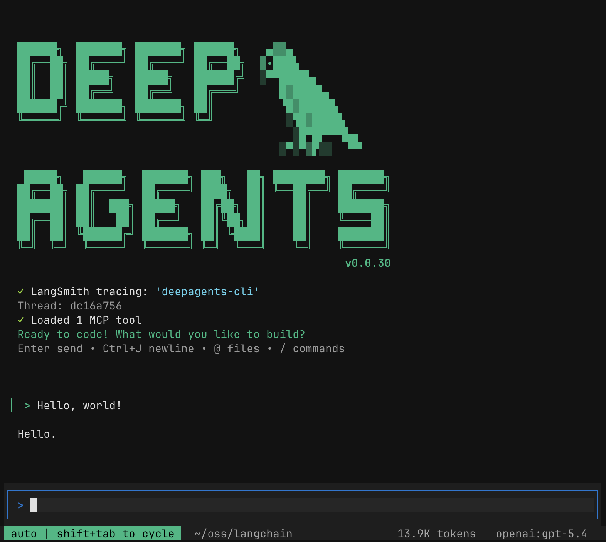

<div align="center">
  <a href="https://docs.langchain.com/oss/python/deepagents/overview#deep-agents-overview">
    <picture>
      <source media="(prefers-color-scheme: dark)" srcset=".github/images/logo-dark.svg">
      <source media="(prefers-color-scheme: light)" srcset=".github/images/logo-light.svg">
      
    </picture>
  </a>
</div>

<div align="center">
  <h3>The batteries-included agent harness.</h3>
</div>

<div align="center">
  <a href="https://opensource.org/licenses/MIT" target="_blank"></a>
  <a href="https://pypistats.org/packages/deepagents" target="_blank"></a>
  <a href="https://pypi.org/project/deepagents/#history" target="_blank"></a>
  <a href="https://x.com/langchain" target="_blank"></a>
</div>

<br>

Deep Agents is an agent harness. An opinionated, ready-to-run agent out of the box. Instead of wiring up prompts, tools, and context management yourself, you get a working agent immediately and customize what you need.

**What's included:**

- **Planning** — `write_todos` for task breakdown and progress tracking
- **Filesystem** — `read_file`, `write_file`, `edit_file`, `ls`, `glob`, `grep` for reading and writing context
- **Shell access** — `execute` for running commands (with sandboxing)
- **Sub-agents** — `task` for delegating work with isolated context windows
- **Smart defaults** — Prompts that teach the model how to use these tools effectively
- **Context management** — Auto-summarization when conversations get long, large outputs saved to files

> [!NOTE]
> Looking for the JS/TS library? Check out [deepagents.js](https://github.com/langchain-ai/deepagentsjs).

## Quickstart

```bash
pip install deepagents
# or
uv add deepagents
```

```python
from deepagents import create_deep_agent

agent = create_deep_agent()
result = agent.invoke({"messages": [{"role": "user", "content": "Research LangGraph and write a summary"}]})
```

The agent can plan, read/write files, and manage its own context. Add tools, customize prompts, or swap models as needed.

> [!TIP]
> For developing, debugging, and deploying AI agents and LLM applications, see [LangSmith](https://docs.langchain.com/langsmith/home).

## Customization

Add your own tools, swap models, customize prompts, configure sub-agents, and more. See the [documentation](https://docs.langchain.com/oss/python/deepagents/overview) for full details.

```python
from langchain.chat_models import init_chat_model

agent = create_deep_agent(
    model=init_chat_model("openai:gpt-4o"),
    tools=[my_custom_tool],
    system_prompt="You are a research assistant.",
)
```

MCP is supported via [`langchain-mcp-adapters`](https://github.com/langchain-ai/langchain-mcp-adapters).

## Deep Agents CLI

A pre-built coding agent in your terminal — similar to Claude Code or Cursor — powered by any LLM. One install command and you're up and running.

<p align="center">
  
</p>

```bash
curl -LsSf https://raw.githubusercontent.com/langchain-ai/deepagents/main/libs/cli/scripts/install.sh | bash
```

**Highlights:**

- **Interactive TUI** — rich terminal interface with streaming responses
- **Web search** — ground responses in live information
- **Headless mode** — run non-interactively for scripting and CI
- Plus all SDK features out of the box — remote sandboxes, persistent memory, custom skills, and human-in-the-loop approval

See the [CLI documentation](https://docs.langchain.com/oss/python/deepagents/cli/overview) for the full feature set.

## LangGraph Native

`create_deep_agent` returns a compiled [LangGraph](https://docs.langchain.com/oss/python/langgraph/overview) graph. Use it with streaming, Studio, checkpointers, or any LangGraph feature.

## FAQ

### Why should I use this?

- **100% open source** — MIT licensed, fully extensible
- **Provider agnostic** — Works with any Large Language Model that supports tool calling, including both frontier and open models
- **Built on LangGraph** — Production-ready runtime with streaming, persistence, and checkpointing
- **Batteries included** — Planning, file access, sub-agents, and context management work out of the box
- **Get started in seconds** — `uv add deepagents` and you have a working agent
- **Customize in minutes** — Add tools, swap models, tune prompts when you need to

---

## Documentation

- [docs.langchain.com](https://docs.langchain.com/oss/python/deepagents/overview) – Comprehensive documentation, including conceptual overviews and guides
- [reference.langchain.com/python](https://reference.langchain.com/python/deepagents/) – API reference docs for Deep Agents packages
- [Chat LangChain](https://chat.langchain.com/) – Chat with the LangChain documentation and get answers to your questions

**Discussions**: Visit the [LangChain Forum](https://forum.langchain.com) to connect with the community and share all of your technical questions, ideas, and feedback.

## Additional resources

- **[Examples](examples/)** — Working agents and patterns
- [Contributing Guide](https://docs.langchain.com/oss/python/contributing/overview) – Learn how to contribute to LangChain projects and find good first issues.
- [Code of Conduct](https://github.com/langchain-ai/langchain/?tab=coc-ov-file) – Our community guidelines and standards for participation.

---

## Acknowledgements

This project was primarily inspired by Claude Code, and initially was largely an attempt to see what made Claude Code general purpose, and make it even more so.

## Security

Deep Agents follows a "trust the LLM" model. The agent can do anything its tools allow. Enforce boundaries at the tool/sandbox level, not by expecting the model to self-police. See the [security policy](https://github.com/langchain-ai/deepagents?tab=security-ov-file) for more information.

You can enforce policy decisions at tool-call boundaries using middleware:

```python
from langchain.chat_models import init_chat_model
from langchain_core.messages import ToolMessage
from langchain_core.tools import tool

from deepagents import create_deep_agent
from deepagents.middleware import AgentMiddleware


@tool
def rm(path: str) -> str:
  """Delete a file path."""
  return f"deleted {path}"


class PolicyMiddleware(AgentMiddleware):
  """Example policy check at tool boundary."""

  def wrap_tool_call(self, request, handler):
    if request.tool_call["name"] == "rm":
      path = str(request.tool_call.get("args", {}).get("path", ""))
      if path.startswith("/etc"):
        return ToolMessage(
          content="Policy denied: destructive operations on /etc are blocked.",
          tool_call_id=request.tool_call["id"],
        )
    return handler(request)


agent = create_deep_agent(
  model=init_chat_model("openai:gpt-4.1"),
  tools=[rm],
  middleware=[PolicyMiddleware()],
)
```

This pattern keeps policy and governance logic outside model prompts and close to executable actions.
