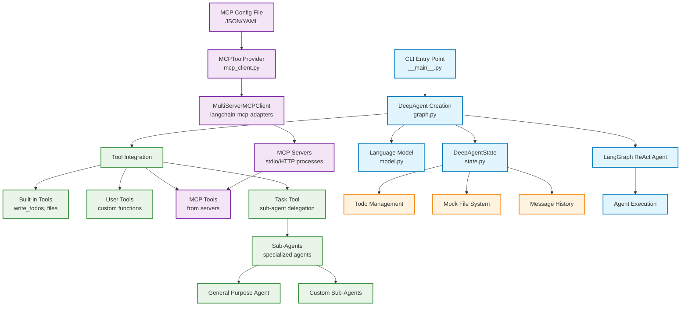
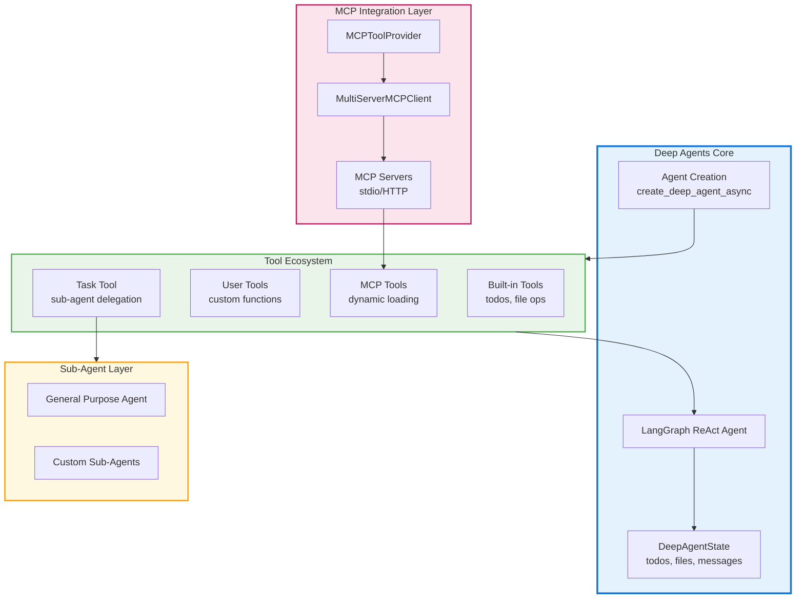

# Deep Agents MCP Architecture Diagram

## Overview
This document contains the mermaid diagram representation of the actual Deep Agents architecture with MCP integration, based on code analysis of the deepagents-mcp implementation.

## Actual Architecture Flow

## Simplified Component View

## Architecture Description

Based on code analysis, the Deep Agents MCP architecture is a sophisticated multi-layered system:

### Core Architecture Layers

#### **1. Deep Agents Core (Blue)**
- **CLI Entry Point** (`__main__.py`) - Command-line interface with `--mcp-config` support
- **Agent Creation** (`graph.py`) - Main orchestration via `create_deep_agent_async()`
- **DeepAgentState** (`state.py`) - Centralized state management for todos, files, and messages
- **LangGraph ReAct Agent** - The actual execution engine

#### **2. MCP Integration Layer (Purple)**
- **MCPToolProvider** (`mcp_client.py`) - Manages MCP server connections
- **MultiServerMCPClient** (langchain-mcp-adapters) - Handles multiple MCP servers
- **MCP Servers** - External processes via stdio/HTTP transport

#### **3. Tool Ecosystem (Green)**
- **Built-in Tools** - Core functionality (todos, file operations)
- **User Tools** - Custom functions provided by developers
- **MCP Tools** - Dynamically loaded from external MCP servers
- **Task Tool** - Enables sub-agent delegation

#### **4. Sub-Agent Layer (Orange)**
- **General Purpose Agent** - Default sub-agent for broad tasks
- **Custom Sub-Agents** - Specialized agents for specific domains

### Key Architectural Features

1. **Modular Design**: MCP integration is completely optional - core functionality works independently
2. **Async-First**: MCP tool loading requires async agent creation for optimal performance
3. **Tool Unification**: MCP tools seamlessly integrate with native and user tools
4. **State Management**: Centralized state handling through `DeepAgentState` with reducers
5. **Hierarchical Delegation**: Sub-agents can be spawned with specialized toolsets
6. **Transport Flexibility**: Supports both stdio and HTTP MCP server connections
7. **Error Resilience**: Graceful fallback when MCP dependencies are unavailable

### Data Flow

1. **Configuration** → MCP servers defined in JSON/YAML
2. **Tool Discovery** → MCP tools loaded asynchronously 
3. **Tool Integration** → All tools combined into unified interface
4. **Agent Creation** → LangGraph ReAct agent with full toolset
5. **Execution** → State management and sub-agent delegation as needed

### Color Coding
- **Blue**: Core Deep Agents components
- **Purple**: MCP integration layer
- **Green**: Tool ecosystem (built-in, user, MCP, task)
- **Orange**: Sub-agent management and delegation