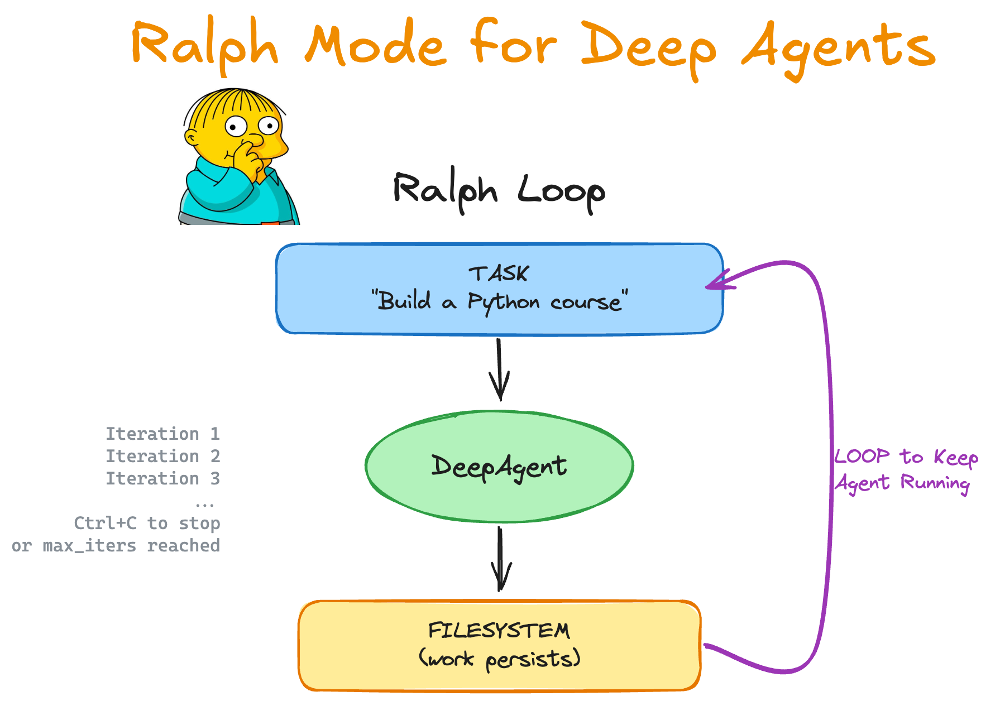

# Ralph Mode for Deep Agents



## What is Ralph?

Ralph is an autonomous looping pattern created by [Geoff Huntley](https://ghuntley.com) that went viral in late 2025. The original implementation is literally one line:

```bash
while :; do cat PROMPT.md | agent ; done
```

Each loop starts with **fresh context**—the simplest pattern for context management. No conversation history to manage, no token limits to worry about. Just start fresh every iteration.

The filesystem and git allow the agent to track progress over time. This serves as its memory and worklog.

## Quick Start

```bash
# Install uv (if you don't have it)
curl -LsSf https://astral.sh/uv/install.sh | sh

# Create a virtual environment
uv venv
source .venv/bin/activate

# Install Deep Agents Code (provides the non-interactive runner)
uv pip install deepagents-code

# Download the script (or copy from examples/ralph_mode/ if you have the repo)
curl -O https://raw.githubusercontent.com/langchain-ai/deepagents/main/examples/ralph_mode/ralph_mode.py

# Run Ralph (needs a provider API key in the environment)
python ralph_mode.py "Build a Python programming course for beginners. Use git."
```

## LangGraph / LangSmith Agent Server

The local `ralph_mode.py` loop is for a laptop. To host the agent on a LangGraph
server, this directory also ships a deployable graph:

| File | Role |
|------|------|
| `langgraph.json` | Points Agent Server at the graph |
| `agent.py` | Exports `agent` via `create_deep_agent` |
| `pyproject.toml` | Dependencies for the image / `langgraph dev` |
| `.env.example` | Copy to `.env` and fill in keys |

```bash
cd examples/ralph_mode
cp .env.example .env   # set OPENAI_API_KEY and LANGSMITH_API_KEY

# Local Agent Server + Studio
uv sync
uv run langgraph dev

# Deploy to LangSmith (Docker required; uses LANGSMITH_API_KEY)
uv run langgraph deploy --name ralph-mode
```

Each server invoke is **one Ralph iteration**. To keep the classic loop, call the
deployment repeatedly with a **new `thread_id`** and the same task (filesystem /
store is the memory across iterations). Example with the Python SDK:

```python
import uuid
from langgraph_sdk import get_client

client = get_client(url="<your-deployment-url>")
task = "Build a Python programming course for beginners. Use git."

for i in range(5):
    thread = await client.threads.create()
    await client.runs.wait(
        thread["thread_id"],
        "ralph",
        input={
            "messages": [
                {
                    "role": "user",
                    "content": (
                        f"## Ralph Iteration {i + 1}/5\n\n"
                        "Your previous work is in the filesystem. "
                        "Check what exists and keep building.\n\n"
                        f"TASK:\n{task}\n\n"
                        "Make progress. You'll be called again."
                    ),
                }
            ]
        },
    )
```

In the LangSmith UI, create a deployment from this repo and set the config path
to `examples/ralph_mode/langgraph.json`.

## Usage

```bash
# Unlimited iterations (Ctrl+C to stop)
python ralph_mode.py "Build a Python course"

# With iteration limit
python ralph_mode.py "Build a REST API" --iterations 5

# With specific model
python ralph_mode.py "Create a CLI tool" --model claude-sonnet-4-6

# With a specific working directory
python ralph_mode.py "Build a web app" --work-dir ./my-project

# Run in a remote sandbox (AgentCore, Modal, Daytona, or Runloop)
python ralph_mode.py "Build an app" --sandbox modal
python ralph_mode.py "Build an app" --sandbox daytona --sandbox-setup ./setup.sh

# Reuse an existing sandbox instance
python ralph_mode.py "Build an app" --sandbox modal --sandbox-id my-sandbox

# Auto-approve specific shell commands (or "recommended" for safe defaults)
python ralph_mode.py "Build an app" --shell-allow-list recommended
python ralph_mode.py "Build an app" --shell-allow-list "ls,cat,grep,pwd"

# Pass model parameters
python ralph_mode.py "Build an app" --model-params '{"temperature": 0.5}'

# Disable streaming output
python ralph_mode.py "Build an app" --no-stream
```

### Remote sandboxes

Ralph supports running agent code in isolated remote environments via the
`--sandbox` flag. The agent runs locally but executes all code operations in the
remote sandbox. See the
[sandbox documentation](https://docs.langchain.com/oss/python/deepagents/cli/overview)
for provider setup (API keys, etc.) and the
[sandboxes concept guide](https://docs.langchain.com/oss/python/deepagents/sandboxes)
for architecture details.

Supported providers: **AgentCore**, **Modal**, **Daytona**, **Runloop**.

## How It Works

1. **You provide a task** — declarative, what you want (not how)
2. **Agent runs** — creates files, makes progress
3. **Loop repeats** — same prompt, but files persist
4. **You stop it** — Ctrl+C when satisfied

## Credits

- Original Ralph concept by [Geoff Huntley](https://ghuntley.com)
- [Brief History of Ralph](https://www.humanlayer.dev/blog/brief-history-of-ralph) by HumanLayer

## Resources

- [LangChain Academy](https://academy.langchain.com/) — Comprehensive, free courses on LangChain libraries and products, made by the LangChain team.
- [Code of Conduct](https://github.com/langchain-ai/langchain/?tab=coc-ov-file) — community guidelines and standards
