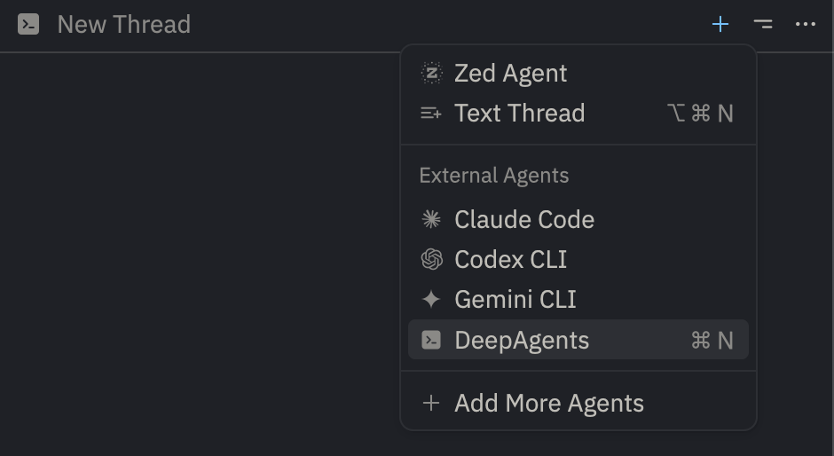

# Deep Agents ACP integration

This directory contains an [Agent Client Protocol (ACP)](https://agentclientprotocol.com/overview/introduction) connector that allows you to run a Python [Deep Agent](https://docs.langchain.com/oss/python/deepagents/overview) within a text editor that supports ACP such as [Zed](https://zed.dev/).


It includes an example coding agent that uses Anthropic's Claude models to write code with its built-in filesystem tools and shell, but you can also connect any Deep Agent with additional tools or different agent architectures!

## Getting started

First, make sure you have [Zed](https://zed.dev/) and [`uv`](https://docs.astral.sh/uv/) installed.

Next, clone this repo:

```sh
git clone git@github.com:langchain-ai/deepagents.git
```

Then, navigate into the newly created folder and run `uv sync`:

```sh
cd deepagents/libs/acp
uv sync --all-groups
```

Rename the `.env.example` file to `.env` and add your [Anthropic](https://claude.com/platform/api) API key. You may also optionally set up tracing for your Deep Agent using [LangSmith](https://smith.langchain.com/) by populating the other env vars in the example file:

```ini
ANTHROPIC_API_KEY=""

# Set up LangSmith tracing for your Deep Agent (optional)

# LANGSMITH_TRACING=true
# LANGSMITH_API_KEY=""
# LANGSMITH_PROJECT="deepagents-acp"
```

Finally, add this to your Zed `settings.json`:

```json
{
  "agent_servers": {
    "DeepAgents": {
      "type": "custom",
      "command": "/your/absolute/path/to/deepagents-acp/run_demo_agent.sh"
    }
  }
}
```

You must also make sure that the `run_demo_agent.sh` entrypoint file is executable - this should be the case by default, but if you see permissions issues, run:

```sh
chmod +x run_demo_agent.sh
```

Now, open Zed's Agents Panel (e.g. with `CMD + Shift + ?`). You should see an option to create a new Deep Agent thread:



And that's it! You can now use the Deep Agent in Zed to interact with your project.

### Session Persistence

The demo agent automatically saves all sessions to a SQLite database located at `libs/acp/data/sessions.db`. This allows you to:

- **Resume conversations** across restarts
- **List previous sessions** to see your chat history
- **Switch between different project contexts** (sessions are filtered by working directory)

Session data is stored in the `data/` directory within the ACP package and is automatically gitignored, so it won't clutter your project directories.

If you need to upgrade your version of Deep Agents, run:

```sh
uv upgrade deepagents-acp
```

## Launch a custom Deep Agent with ACP

```sh
uv add deepagents-acp
```

```python
import asyncio

from acp import run_agent
from deepagents import create_deep_agent
from langgraph.checkpoint.memory import MemorySaver

from deepagents_acp.server import AgentServerACP


async def get_weather(city: str) -> str:
    """Get weather for a given city."""
    return f"It's always sunny in {city}!"


async def main() -> None:
    agent = create_deep_agent(
        tools=[get_weather],
        system_prompt="You are a helpful assistant",
        checkpointer=MemorySaver(),
    )
    server = AgentServerACP(agent)
    await run_agent(server)


if __name__ == "__main__":
    asyncio.run(main())
```

## Session Persistence

By default, sessions are stored in memory and will be lost when the server restarts. To enable persistent sessions that can be loaded across restarts, provide a `checkpointer` when creating the `AgentServerACP`:

```python
import asyncio

from acp import run_agent
from deepagents import create_deep_agent
from langgraph.checkpoint.sqlite.aio import AsyncSqliteSaver

from deepagents_acp.server import AgentServerACP


async def get_weather(city: str) -> str:
    """Get weather for a given city."""
    return f"It's always sunny in {city}!"


async def main() -> None:
    # Create a persistent async checkpointer
    async with AsyncSqliteSaver.from_conn_string("checkpoints.db") as checkpointer:
        agent = create_deep_agent(
            tools=[get_weather],
            system_prompt="You are a helpful assistant",
            checkpointer=checkpointer,
        )

        # Pass the checkpointer to enable session loading
        server = AgentServerACP(agent, checkpointer=checkpointer)
        await run_agent(server)


if __name__ == "__main__":
    asyncio.run(main())
```

When a checkpointer is provided:

- The server advertises the `loadSession` capability during initialization
- The server advertises `sessionCapabilities.list` support
- Clients can list available sessions using the `session/list` method
- Clients can load previous sessions using the `session/load` method  
- The complete conversation history is replayed to the client via `session/update` notifications

**Note:** You need to install `langgraph-checkpoint-sqlite` to use the SQLite checkpointer:

```sh
uv add langgraph-checkpoint-sqlite
```

### Launch with Toad

```sh
uv tool install -U batrachian-toad --python 3.14

toad acp "python path/to/your_server.py" .
# or
toad acp "uv run python path/to/your_server.py" .
```
