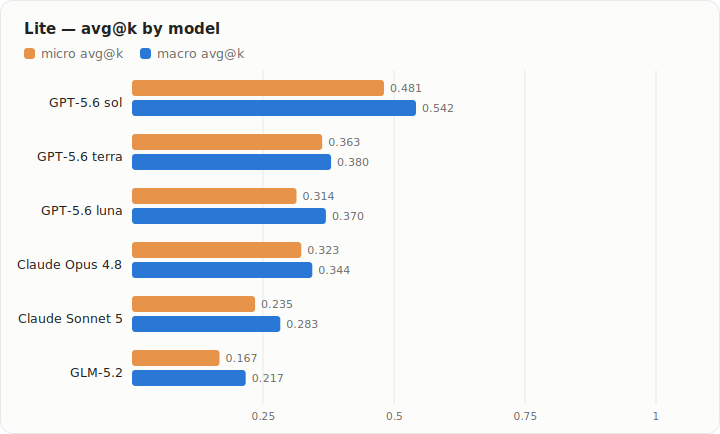
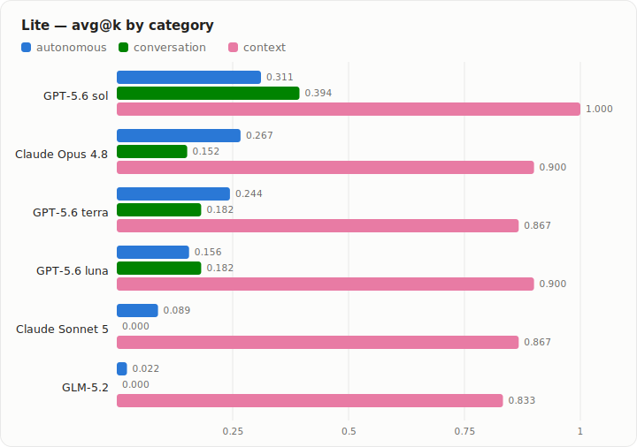

# Model Scorecard — Unified Evals

GH aggregate pass@k / avg@k from `.github/workflows/unified_evals.yml`. pass@k = fraction of tasks solved in ≥1 of k rollouts; avg@k = mean reward across rollouts; rewards are binary (0/1).

## Lite — micro & macro avg@k by model

<picture>
  <source media="(prefers-color-scheme: dark)" srcset="assets/lite-scorecard-dark.svg">
  
</picture>

<picture>
  <source media="(prefers-color-scheme: dark)" srcset="assets/lite-scorecard-categories-dark.svg">
  
</picture>

Lite, by **micro avg@k**: **sol 0.528 > opus 0.407 > terra 0.398 > luna 0.370 > Sonnet 5 0.278 > GLM-5.2 0.241**.

The frozen lite profile uses 15 autonomous, 11 conversation, and 10 context tasks, with three rollouts per task.

## GPT-5.6 terra

### Full (default)

| Category | pass@k | avg@k | tasks |
| --- | --- | --- | --- |
| autonomous (harbor-index) | 0.268 | 0.183 | 82 |
| conversation (tau3-subset) | 0.467 | 0.389 | 30 |
| context (context-retrieval) | 0.967 | 0.811 | 30 |
| **macro** | **0.567** | **0.461** |  |
| **micro** | **0.458** | **0.359** |  |

Autonomous and conversation from run [29430259116](https://github.com/langchain-ai/deepagents/actions/runs/29430259116) · 2026-07-15 · `agent_impl=bare` · `profile=full` · rollouts=3 · `sandbox=docker` · `judge=gpt-5.6-luna` · harbor@`27a6eac` · wall ~4h. Context re-graded on the recalibrated 30-task set via run [29883830538](https://github.com/langchain-ai/deepagents/actions/runs/29883830538) (faithful `model_judge`, judge `gpt-5.6-luna`).

autonomous includes 14 of 246 trials that errored (agent/verifier timeouts and one OOM) and are scored as failures. Aggregated from the run's artifacts (one shard recovered from the retry attempt); no tasks were re-run.

### Lite

Frozen high-signal subset (`lite_tasks.py`, difficulty-frontier tasks).

| Category | pass@k | avg@k | tasks |
| --- | --- | --- | --- |
| autonomous (harbor-index) | 0.400 | 0.244 | 15 |
| conversation (tau3-subset) | 0.273 | 0.182 | 11 |
| context (context-retrieval) | 0.900 | 0.867 | 10 |
| **macro** | **0.524** | **0.431** |  |
| **micro** | **0.500** | **0.398** |  |

All categories from run [29885020820](https://github.com/langchain-ai/deepagents/actions/runs/29885020820) · `agent_impl=bare` · `profile=lite` · rollouts=3 · `sandbox=docker`. Metrics use its 18 per-model category aggregates and are confirmed by the completed cross-model Combine job.

## GPT-5.6 luna

### Full (default)

| Category | pass@k | avg@k | tasks |
| --- | --- | --- | --- |
| autonomous (harbor-index) | 0.159 | 0.114 | 82 |
| conversation (tau3-subset) | 0.367 | 0.322 | 30 |
| context (context-retrieval) | 0.967 | 0.911 | 30 |
| **macro** | **0.497** | **0.449** |  |
| **micro** | **0.373** | **0.326** |  |

Autonomous and conversation from run [29272737912](https://github.com/langchain-ai/deepagents/actions/runs/29272737912) · 2026-07-13 · `agent_impl=bare` · `profile=full` · rollouts=3 · `sandbox=docker` · `judge=gpt-5.6-luna` · harbor@`af2e862`. Context re-graded on the recalibrated 30-task set via run [29883830538](https://github.com/langchain-ai/deepagents/actions/runs/29883830538) (faithful `model_judge`, judged by `gpt-5.6-terra`, independent of luna).

### Lite

Frozen high-signal subset (`lite_tasks.py`, difficulty-frontier tasks).

| Category | pass@k | avg@k | tasks |
| --- | --- | --- | --- |
| autonomous (harbor-index) | 0.400 | 0.156 | 15 |
| conversation (tau3-subset) | 0.273 | 0.182 | 11 |
| context (context-retrieval) | 1.000 | 0.900 | 10 |
| **macro** | **0.588** | **0.412** |  |
| **micro** | **0.556** | **0.370** |  |

All categories from run [29885020820](https://github.com/langchain-ai/deepagents/actions/runs/29885020820) · `agent_impl=bare` · `profile=lite` · rollouts=3 · `sandbox=docker`. Metrics use its 18 per-model category aggregates and are confirmed by the completed cross-model Combine job.

## GPT-5.6 sol

### Lite

Frozen high-signal subset (`lite_tasks.py`, difficulty-frontier tasks).

| Category | pass@k | avg@k | tasks |
| --- | --- | --- | --- |
| autonomous (harbor-index) | 0.400 | 0.311 | 15 |
| conversation (tau3-subset) | 0.545 | 0.394 | 11 |
| context (context-retrieval) | 1.000 | 1.000 | 10 |
| **macro** | **0.648** | **0.568** |  |
| **micro** | **0.611** | **0.528** |  |

All categories from run [29885020820](https://github.com/langchain-ai/deepagents/actions/runs/29885020820) · `agent_impl=bare` · `profile=lite` · rollouts=3 · `sandbox=docker`. Metrics use its 18 per-model category aggregates and are confirmed by the completed cross-model Combine job.

## Claude Opus 4.8

### Lite

Frozen high-signal subset (`lite_tasks.py`, difficulty-frontier tasks).

| Category | pass@k | avg@k | tasks |
| --- | --- | --- | --- |
| autonomous (harbor-index) | 0.467 | 0.267 | 15 |
| conversation (tau3-subset) | 0.273 | 0.152 | 11 |
| context (context-retrieval) | 0.900 | 0.900 | 10 |
| **macro** | **0.546** | **0.439** |  |
| **micro** | **0.528** | **0.407** |  |

All categories from run [29885020820](https://github.com/langchain-ai/deepagents/actions/runs/29885020820) · `agent_impl=bare` · `profile=lite` · rollouts=3 · `sandbox=docker`. Metrics use its 18 per-model category aggregates and are confirmed by the completed cross-model Combine job.

## Claude Sonnet 5

### Lite

Frozen high-signal subset (`lite_tasks.py`, difficulty-frontier tasks).

| Category | pass@k | avg@k | tasks |
| --- | --- | --- | --- |
| autonomous (harbor-index) | 0.133 | 0.089 | 15 |
| conversation (tau3-subset) | 0.000 | 0.000 | 11 |
| context (context-retrieval) | 0.900 | 0.867 | 10 |
| **macro** | **0.344** | **0.319** |  |
| **micro** | **0.306** | **0.278** |  |

All categories from run [29885020820](https://github.com/langchain-ai/deepagents/actions/runs/29885020820) · `agent_impl=bare` · `profile=lite` · rollouts=3 · `sandbox=docker`. Metrics use its 18 per-model category aggregates and are confirmed by the completed cross-model Combine job.

## GLM-5.2

### Lite

Frozen high-signal subset (`lite_tasks.py`, difficulty-frontier tasks).

| Category | pass@k | avg@k | tasks |
| --- | --- | --- | --- |
| autonomous (harbor-index) | 0.067 | 0.022 | 15 |
| conversation (tau3-subset) | 0.000 | 0.000 | 11 |
| context (context-retrieval) | 1.000 | 0.833 | 10 |
| **macro** | **0.356** | **0.285** |  |
| **micro** | **0.306** | **0.241** |  |

All categories from run [29885020820](https://github.com/langchain-ai/deepagents/actions/runs/29885020820) · `agent_impl=bare` · `profile=lite` · rollouts=3 · `sandbox=docker`. Metrics use its 18 per-model category aggregates and are confirmed by the completed cross-model Combine job.
