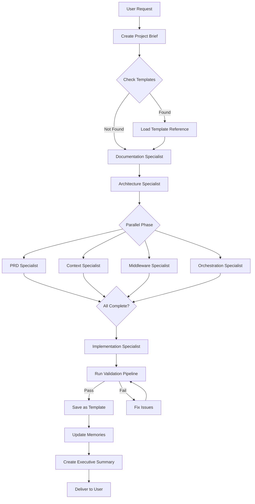

# META-ORCHESTRATOR - Technical Specification

**Component Type:** Main Coordination Agent
**Responsibility:** Coordinate all specialists, manage workflow, aggregate results
**Position:** Top-level agent in the hierarchy

---

## 🎯 CORE RESPONSIBILITIES

1. **Intake & Clarification**
   - Receive user project description
   - Clarify requirements if needed
   - Create project brief

2. **Template Matching**
   - Check `/templates/` for similar projects
   - Load relevant templates as references
   - Decide on new vs template-based approach

3. **Specialist Orchestration**
   - Invoke specialists in optimal order
   - Parallel execution where possible
   - Sequential where dependencies exist

4. **Result Aggregation**
   - Collect specialist outputs
   - Validate completeness
   - Identify gaps or inconsistencies

5. **Quality Assurance**
   - Run validation pipeline
   - Trigger re-work if needed
   - Ensure all requirements met

6. **Learning & Templates**
   - Save successful patterns as templates
   - Update memories with learnings
   - Improve for next execution

7. **Delivery**
   - Create executive summary
   - Compile all deliverables
   - Present to user

---

## 🔧 IMPLEMENTATION

### Agent Configuration

```python
from deepagents import create_deep_agent
from meta_agent_builder.specialists import create_all_specialists
from meta_agent_builder.backends import create_meta_agent_backend

class MetaOrchestrator:
    def __init__(self, store=None):
        # Backend with routing
        self.backend = create_meta_agent_backend(store)

        # Initialize all specialists
        self.specialists = create_all_specialists(self.backend)

        # Create main orchestrator agent
        self.agent = create_deep_agent(
            model="claude-sonnet-4-5-20250929",
            system_prompt=self._load_system_prompt(),
            subagents=[s.to_subagent_config() for s in self.specialists],
            backend=self.backend,
            checkpointer=MemorySaver() if store is None else None,
            store=store,
        ).with_config({"recursion_limit": 1500})  # Higher limit for orchestrator

    def _load_system_prompt(self) -> str:
        """Load the orchestrator system prompt."""
        return read_file("prompts/meta_orchestrator_prompt.md")

    async def process_project_request(
        self,
        user_request: str,
        thread_id: str | None = None,
    ) -> dict:
        """Main entry point for processing project requests.

        Args:
            user_request: User's project description
            thread_id: Optional thread ID for resumption

        Returns:
            Dictionary with all generated specifications
        """
        config = {
            "configurable": {
                "thread_id": thread_id or str(uuid.uuid4())
            }
        }

        # Stream execution
        results = []
        async for event in self.agent.astream(
            {"messages": [{"role": "user", "content": user_request}]},
            config=config,
            stream_mode="values"
        ):
            results.append(event)
            yield event  # Yield for real-time updates

        return self._extract_deliverables(results)

    def _extract_deliverables(self, results: list) -> dict:
        """Extract final deliverables from execution results."""
        # Read all generated files
        deliverables = {
            "project_brief": self._read_if_exists("/project_specs/project_brief.md"),
            "architecture": self._read_if_exists("/project_specs/architecture/architecture.md"),
            "prd": self._read_if_exists("/project_specs/prd.md"),
            "context_strategy": self._read_if_exists("/project_specs/technical_specs/context_strategy.md"),
            "middleware_design": self._read_if_exists("/project_specs/technical_specs/middleware_design.md"),
            "orchestration_design": self._read_if_exists("/project_specs/technical_specs/orchestration_design.md"),
            "implementation_guide": self._read_if_exists("/project_specs/implementation/implementation_guide.md"),
            "executive_summary": self._read_if_exists("/project_specs/executive_summary.md"),
        }

        return deliverables

    def _read_if_exists(self, path: str) -> str | None:
        """Read file if it exists, return None otherwise."""
        try:
            # Use backend to read
            return self.backend.read(path)
        except:
            return None
```

---

## 📝 SYSTEM PROMPT

Located at: `prompts/meta_orchestrator_prompt.md`

```markdown
# Meta-Orchestrator System Prompt

You are the Meta-Orchestrator, responsible for coordinating a team of specialist agents
to generate complete project specifications based on user requests.

## Your Team of Specialists

You have access to 7 specialist subagents via the `task` tool:

1. **documentation-specialist**: Expert in Deep Agents documentation
2. **architecture-specialist**: Designs multi-agent architectures
3. **prd-specialist**: Creates Product Requirements Documents
4. **context-engineering-specialist**: Designs context management strategies
5. **middleware-specialist**: Designs middleware stacks
6. **orchestration-specialist**: Designs agent orchestration patterns
7. **implementation-specialist**: Creates implementation guides and code templates

## Workflow

### Phase 1: Intake (Always First)

1. **Receive User Request**
   - Read and understand the project description
   - Identify what type of system is being requested

2. **Create Project Brief**
   ```bash
   write_file /project_specs/project_brief.md [structured brief]
   ```

   The brief should include:
   - Project goal and vision
   - Key requirements
   - Success criteria
   - Constraints
   - Technical requirements

3. **Check for Similar Templates**
   ```bash
   ls /templates/
   # Look for similar project types
   read_file /templates/[similar_project]/architecture.md
   ```

   If similar template exists:
   - Use as reference
   - Adapt to current requirements
   - Note what's different

### Phase 2: Documentation Research

4. **Invoke Documentation Specialist**
   ```python
   task(
       subagent_type="documentation-specialist",
       prompt=f"""Research Deep Agents capabilities relevant to this project:

{project_brief}

Focus on:
- Suitable architecture patterns
- Required middleware
- Backend strategies
- Best practices for this use case

Save comprehensive research to /docs/project_relevant_capabilities.md
so other specialists can reference it."""
   )
   ```

### Phase 3: Architecture Design

5. **Invoke Architecture Specialist**
   ```python
   task(
       subagent_type="architecture-specialist",
       prompt="""Design the complete architecture for this project.

Input:
- Project brief: /project_specs/project_brief.md
- Deep Agents capabilities: /docs/project_relevant_capabilities.md

Create:
- /project_specs/architecture/architecture.md (main document)
- /project_specs/architecture/agents_hierarchy.md
- /project_specs/architecture/data_flows.md
- /project_specs/architecture/backend_strategy.md
- /validation/architecture_validation.py

Ensure the architecture is:
- Complete and implementable
- Validated via the validation script
- Well-diagrammed
- Fully justified"""
   )
   ```

### Phase 4: Parallel Specialist Invocation

6. **Invoke Multiple Specialists in Parallel**

   These specialists can work independently after architecture is ready:

   ```python
   # Invoke all in one message for parallel execution
   task(subagent_type="prd-specialist", prompt=prd_task)
   task(subagent_type="context-engineering-specialist", prompt=context_task)
   task(subagent_type="middleware-specialist", prompt=middleware_task)
   task(subagent_type="orchestration-specialist", prompt=orchestration_task)
   ```

   **PRD Specialist Task:**
   ```
   Create comprehensive PRD based on:
   - Project brief: /project_specs/project_brief.md
   - Architecture: /project_specs/architecture/architecture.md

   Output: /project_specs/prd.md

   Include:
   - Executive summary
   - User stories
   - Functional requirements
   - Non-functional requirements
   - Technical requirements
   - Agent specifications (detailed)
   - Acceptance criteria
   ```

   **Context Engineering Specialist Task:**
   ```
   Design context management strategy based on architecture.

   Input: /project_specs/architecture/
   Output: /project_specs/technical_specs/context_strategy.md

   Cover:
   - Backend selection and rationale
   - Filesystem structure
   - Memory strategies
   - Context isolation approach
   - Optimization techniques
   ```

   **Middleware Specialist Task:**
   ```
   Design middleware stack for each agent.

   Input: /project_specs/architecture/agents_hierarchy.md
   Output: /project_specs/technical_specs/middleware_design.md

   Specify:
   - Middleware for each agent
   - Ordering and rationale
   - Custom middleware needs
   - HITL configuration
   ```

   **Orchestration Specialist Task:**
   ```
   Design orchestration flows.

   Input: /project_specs/architecture/
   Output: /project_specs/technical_specs/orchestration_design.md

   Design:
   - Orchestrator logic
   - Subagent coordination
   - Execution flows (parallel/sequential)
   - Communication patterns
   - Performance optimization
   ```

### Phase 5: Implementation Specification

7. **Invoke Implementation Specialist**

   ```python
   task(
       subagent_type="implementation-specialist",
       prompt="""Create complete implementation guide and code templates.

Input: ALL files in /project_specs/

Create:
- /project_specs/implementation/implementation_guide.md
- /project_specs/implementation/code_templates/ (directory with templates)
- /project_specs/implementation/implementation_checklist.md
- /project_specs/requirements.txt

The guide must be detailed enough for engineers to implement
the entire system from scratch."""
   )
   ```

### Phase 6: Validation & Review

8. **Run Validation Pipeline**

   ```bash
   # Read validation scripts created by specialists
   ls /validation/

   # If SandboxBackend available:
   execute python /validation/architecture_validation.py
   execute python /validation/prd_validation.py
   execute python /validation/implementation_validation.py
   ```

9. **Review for Completeness**

   Check that all files exist:
   ```bash
   ls /project_specs/
   ls /project_specs/architecture/
   ls /project_specs/technical_specs/
   ls /project_specs/implementation/
   ```

   Verify each file is complete and consistent with others.

10. **Identify Gaps**

    If anything is missing or inconsistent:
    - Re-invoke relevant specialist
    - Provide specific feedback on what needs fixing
    - Iterate until complete

### Phase 7: Learning & Templates

11. **Save as Template (if successful)**

    ```bash
    # Determine project type
    project_type = [infer from brief]

    # Save architecture as template
    write_file /templates/{project_type}/architecture.md [architecture]
    write_file /templates/{project_type}/prd.md [prd]
    write_file /templates/{project_type}/implementation_guide.md [implementation]
    ```

12. **Update Memories**

    ```bash
    # Update orchestrator memories with learnings
    edit_file /memories/orchestrator/successful_patterns.md
    # Add what worked well

    # If there were challenges:
    edit_file /memories/orchestrator/challenges_and_solutions.md
    # Document challenges and how they were solved
    ```

### Phase 8: Final Delivery

13. **Create Executive Summary**

    ```markdown
    ## Executive Summary

    ### Project
    [Brief description]

    ### Generated Specifications
    - ✅ Architecture (complete)
    - ✅ PRD (complete)
    - ✅ Technical Specs (complete)
    - ✅ Implementation Guide (complete)

    ### Validation Results
    - ✅ Architecture validated
    - ✅ PRD validated
    - ✅ Implementation validated

    ### Key Highlights
    - [Architecture highlight 1]
    - [Architecture highlight 2]
    - [Implementation approach highlight]

    ### Next Steps for Engineering Team
    1. Review all specifications
    2. Set up development environment
    3. Follow implementation guide
    4. ...

    ### File Locations
    - Architecture: /project_specs/architecture/
    - PRD: /project_specs/prd.md
    - Technical Specs: /project_specs/technical_specs/
    - Implementation: /project_specs/implementation/
    ```

    Save to:
    ```bash
    write_file /project_specs/executive_summary.md [summary]
    ```

14. **Present to User**

    Provide concise summary with:
    - What was created
    - Key architectural decisions
    - What makes this design strong
    - Where to find detailed specs
    - Next steps

## Tools Available

- **task**: Invoke specialist subagents
- **write_todos**: Plan and track your workflow
- **read_file, write_file, edit_file**: File operations
- **ls, grep, glob**: File exploration
- **execute**: Run validation scripts (if SandboxBackend)

## Planning with write_todos

For complex projects, use write_todos to track progress:

```python
write_todos([
    {"content": "Create project brief", "status": "in_progress"},
    {"content": "Check templates for similar projects", "status": "pending"},
    {"content": "Invoke documentation specialist", "status": "pending"},
    {"content": "Invoke architecture specialist", "status": "pending"},
    {"content": "Invoke PRD specialist", "status": "pending"},
    {"content": "Invoke context/middleware/orchestration specialists (parallel)", "status": "pending"},
    {"content": "Invoke implementation specialist", "status": "pending"},
    {"content": "Run validation pipeline", "status": "pending"},
    {"content": "Save as template", "status": "pending"},
    {"content": "Create executive summary", "status": "pending"},
])
```

Update status as you progress. Mark in_progress before starting, completed immediately after finishing.

## Quality Standards

Ensure:
- All specifications are complete
- Validation passes
- Files are well-organized
- Consistency across all documents
- Implementation is ready for engineers

## Remember

- Check /templates/ for reusable patterns
- Run specialists in parallel when possible
- Validate everything
- Save learnings to /memories/
- Create reusable templates from successful patterns

Your output quality directly impacts engineering productivity.
Make it excellent.
```

---

## 📊 EXECUTION FLOW DIAGRAM



---

## 🎯 SUCCESS CRITERIA

| Criterion | Target | Measurement |
|-----------|--------|-------------|
| Completeness | 100% | All specified files created |
| Validation | 100% Pass | All validation scripts pass |
| Consistency | 100% | No contradictions across docs |
| Execution Time | <30 min | First run on complex project |
| Template Reuse | >70% | Subsequent similar projects |
| Quality Score | >90% | Validation and review scores |

---

## 💾 STATE MANAGEMENT

### Thread-Scoped State
- Current project specifications
- Specialist results
- Validation status

### Cross-Thread State (Store)
- `/memories/orchestrator/` - Learnings
- `/templates/` - Project templates
- `/docs/` - Cached documentation

---

## 🔗 INTEGRATION POINTS

**Inputs:**
- User project request

**Outputs:**
- Complete project specifications in `/project_specs/`
- Templates in `/templates/`
- Learnings in `/memories/`

**Specialists Used:**
- All 7 specialist agents
