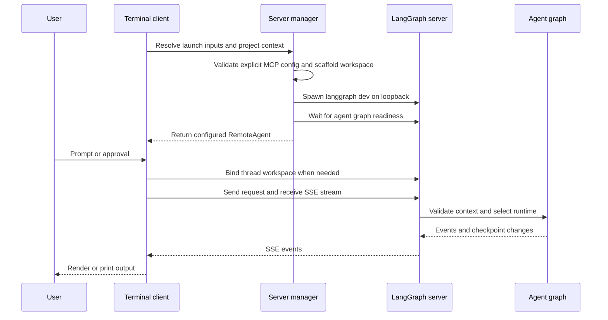

# Deep Agents Code Architecture

`deepagents-code` (`dcode`) is a reference terminal coding-agent product built on the `deepagents` SDK. It packages the SDK harness with terminal UX, durable sessions, tools, skills, and optional sandbox execution.

There are two intentionally separate runtime paths:

- **Normal interactive and headless dcode** run a terminal client and an owned local `langgraph dev` server in separate processes. The client owns presentation, input, and approvals; the server owns the model, graph, tools, memory, skills, backend, and checkpoints.
- **`dcode --acp`** is an in-process ACP server on stdio. It builds local session graphs and neither starts `langgraph dev` nor uses `RemoteAgent`.

This is an ownership boundary rather than an interchangeable transport. A normal-server change must be evaluated against ACP independently.

## Normal client-server run

Interactive mode uses the Textual application for rendering and user interaction. Headless mode reuses the same server runtime and `RemoteAgent` for one user task, replacing the UI with stdout streaming; `--quiet` suppresses tool and file-operation notices so stdout contains only response text.

This diagram is the normal local path only; ACP is described separately below. The workspace bind before execution makes server graph selection authoritative.

### Startup, generated workspace, and configuration handoff

`start_server_and_get_agent` captures project context (or uses an explicit cwd), validates an explicit MCP config before spawn, resolves `ServerConfig`, and scaffolds a temporary LangGraph workspace. The workspace contains `pyproject.toml`, `langgraph.json`, and a generated checkpointer module. That module reads the application session database path from an environment variable and yields `AsyncSqliteSaver`, rather than embedding a path in generated source.

The generated graph reference is `deepagents_code.server_graph:make_graph`. When that built-in reference is used, `langgraph.json` also adds dcode's offload HTTP app with custom-route auth enabled; a custom graph reference has no `/offload` service. Local startup defaults to `127.0.0.1` and port `0`, allowing OS selection of an ephemeral port instead of taking the conventional `langgraph dev` port 2024.

The client exports resolved launch configuration through `DEEPAGENTS_CODE_SERVER_*` variables. `ServerConfig.to_env()` and `ServerConfig.from_env()` are the shared client/server schema, so serialization, defaults, and the variable set are maintained in one place. The resolver uses lower numeric ranks first: managed policy, CLI arguments, retained reload values, environment, user `config.toml`, then typed defaults. See [configuration layering](/openwiki/concepts/config-layering.md).

The child environment is also a security boundary: startup-sensitive inherited variables, including `PYTHONPATH`, are stripped before the server interpreter launches. The original `PYTHONPATH` is relayed separately only for approval-gated shell execution, and the child profile is pinned to the client launch profile.

### Remote boundary and durable workspace identity

`RemoteAgent` is a thin dcode adapter around LangGraph's `RemoteGraph`. The underlying client handles HTTP/SSE parsing, `messages-tuple` stream negotiation, namespace extraction, and interrupts. dcode normalizes thread IDs and converts streamed message dictionaries to message objects for the Textual adapter, while state snapshots retain the server's serialized form.

Before first use of a thread, `RemoteAgent` posts its cwd, workspace policy, and configuration fingerprint to `/dcode/threads/{thread_id}/workspace` and caches the returned descriptor. It separately ensures the remote HTTP thread record exists because persisted checkpoint data may survive a server restart without a live thread row.

The server canonicalizes the cwd and project root and atomically persists the thread's workspace binding in session SQLite. The binding is immutable: a later bind or execution context must match its workspace and configuration fingerprint, or the server raises a conflict. For a context-bearing invocation, `make_graph` requires a nonempty thread ID and a matching workspace payload, reads the durable binding, and selects that binding's runtime rather than trusting a caller-selected cwd. See [state persistence](/openwiki/concepts/state-persistence.md).

## Graph assembly and runtime scope

`create_cli_agent` is the composition entry point. It combines the resolved model; built-in and MCP tools; optional sandbox; filesystem and approval policy; memory, skills, interpreter configuration, and subagents; grading context; and credentials/environment. It returns the compiled graph and composite backend. The server derives its offload operation from the same backend, so graph and offload share resource ownership.

Criteria creation and rubric grading get built-in external-context tools and only MCP tools whose annotations are explicitly and coherently read-only. Absent, malformed, contradictory, or mutating annotations fail closed.

`make_graph` has distinct selection rules:

- With execution context, it validates the durable thread binding and obtains a runtime keyed by that binding's persisted resource key.
- Without execution context, it uses the configured launch workspace when present, or the lock-protected process-wide runtime when no launch workspace exists.

The process runtime cache is load-bearing: it prevents duplicate MCP discovery, sandbox creation, and `atexit` cleanup registration. Workspace runtimes are held in a shared-lock LRU cache, capped at 32 entries. Before a workspace runtime is built, the server reconstructs configuration for its bound cwd and requires its policy and fingerprint to equal the persisted binding. A configured sandbox is process-wide and may be claimed by one workspace only; a second workspace is rejected rather than sharing it.

## Failure handling and teardown

Runtime construction is a startup barrier. A construction failure emits a `DEEPAGENTS_STARTUP_ERROR:` marker and exits with code 1; the parent scrapes that marker from child output instead of reducing the failure to a readiness timeout. The manager stops an owned server if startup, graph readiness, remote-client creation, or workspace setup fails. Its `finally` cleanup is cancellation-safe.

At normal session teardown, `server_session` stops the owned server and emits queued notices for debug-preserved logs. On POSIX, the subprocess has a dedicated process group: graceful signaling, waiting, and hard-kill escalation include descendants. Windows escalation can hard-kill only the root process handle, so a surviving descendant may be orphaned.

The ACP integration smoke test launches `deepagents --acp --no-mcp`, performs protocol initialization and `new_session`, and asserts that the returned session has an ID. This protects ACP startup and session creation without exercising the normal loopback path.

## ACP stdio lifecycle

`--acp` invokes `_run_acp_cli_async` in the launching process. It resolves the initial model, loads tools and MCP configuration, and holds the dcode checkpointer open for the serving lifetime. Its `build_agent(context)` callback uses the ACP session's selected model (or the resolved default) and cwd to construct `ProjectContext`, then calls `create_cli_agent` with the shared checkpointer. ACP graphs are session-local rather than entries in the normal workspace-runtime cache.

In Auto mode, dcode uses `AgentServerACP`, which wraps local graph streaming to write trusted Auto approval state, attach prompt metadata, and supply CLI context. YOLO needs prior acknowledgement; `--auto-classifier-model` is accepted in ACP only when the resolved approval mode is Auto. ACP failures are written to stderr and return a nonzero status; they do not use the normal subprocess startup marker. A `finally` block cleans up the MCP session manager after serving.

## Extension and operations guidance

Skills and subagents, built-in and MCP tools, sandbox providers, hooks and commands, and authorized Python extensions are composition points. In normal-server mode, resource-affecting settings are part of the workspace policy/fingerprint: an already-bound thread cannot be live-reconfigured to a different resource policy.

For user-facing lifecycle guidance, see [run a dcode session](/openwiki/workflows/run-dcode-session.md), [runtime behavior](/openwiki/architecture/runtime-behavior.md), [configuration layering](/openwiki/concepts/config-layering.md), and [ACP](/openwiki/integrations/acp.md).
