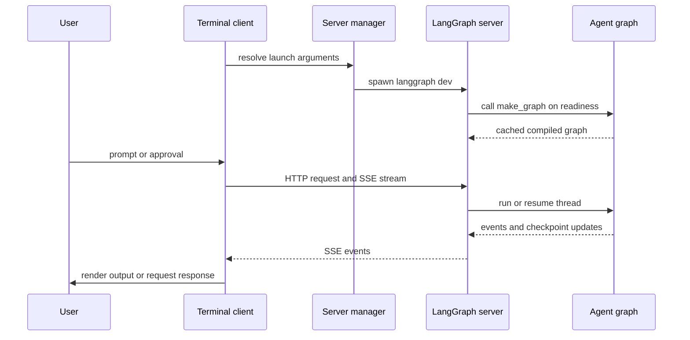
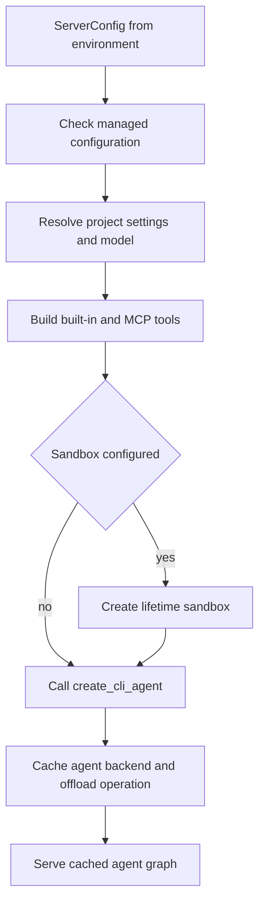

# Deep Agents Code (dcode) Architecture

`deepagents-code` (`dcode`) is a prebuilt terminal coding agent built on the
`deepagents` SDK. It packages the SDK harness with a terminal experience,
persistence, tools, skills, and optional sandboxed execution as a reference
implementation. See the [architecture overview](/openwiki/architecture/overview.md)
and [source map](/openwiki/architecture/source-map.md) for broader context.

This page distinguishes two launch designs that must not be conflated:

- Normal interactive and headless dcode launch a loopback `langgraph dev`
  **server subprocess** and connect a `RemoteAgent` client.
- `dcode --acp` is an **ACP server over stdio** in the launching process. It
  constructs local graphs through an ACP callback; it does not start
  `langgraph dev` or use `RemoteAgent`.

## Normal local runtime: ownership and request path

The normal runtime has two processes. The terminal client owns presentation,
input, and approval interaction. The agent server owns the compiled graph,
model execution, tools, MCP sessions, memory and skills middleware, backend,
and checkpointed session state. Interactive mode uses the Textual client;
headless mode reuses the same local server and `RemoteAgent` for one task,
streaming machine-friendly output to stdout. Quiet headless mode suppresses
stream-time diagnostics, leaving response text.

This shows the normal local request path and server-side checkpoint updates.

`RemoteAgent` is deliberately thin. It wraps LangGraph's `RemoteGraph`, which
handles HTTP/SSE, `messages-tuple` stream negotiation, namespace extraction,
and interrupt detection. dcode converts streamed message dictionaries for the
Textual adapter and normalizes thread IDs, but leaves state snapshots in the
server's serialized form. Consequently, presentation and input failures usually
belong to the client; model, tool, memory, graph-build, and server-startup
failures usually belong to the server.

### Startup, persistence, and cleanup

The server manager captures project context and validates an explicit MCP
configuration before spawning. It translates arguments into `ServerConfig`,
exports the `DEEPAGENTS_CODE_SERVER_*` representation, and creates a temporary
workspace containing `langgraph.json`, a minimal runtime project, and a
generated SQLite checkpointer module. That module gets the application session
database path from the environment, so the server uses persistent SQLite
checkpoints rather than a path baked into generated source.

The generated graph reference is `deepagents_code.server_graph:make_graph`.
The owned process binds loopback by default with port `0`, letting the OS select
an ephemeral port instead of occupying LangGraph's customary port 2024. The
manager waits for the `agent` graph and returns a `RemoteAgent` only after it is
ready. If startup, readiness, construction of the client, or cancellation fails
before handoff, its `finally` path stops the owned process; `server_session`
extends that ownership with guaranteed teardown for successful sessions.

## Server graph construction and lifecycle

`ServerConfig.to_env()` and `ServerConfig.from_env()` are the shared wire schema
between the normal app process and its subprocess. They keep the environment
variable set, serialization, and defaults in one place. The server reconstructs
resolved model, execution, sandbox, MCP, project-context, filesystem, and
extension controls from that environment rather than re-parsing terminal
arguments.

The filesystem allowlist is a security boundary. An absent `ALLOW_FS_TOOLS`
means unrestricted filesystem tools, but a present value must be valid JSON for
a non-empty list of known tools and must include `read_file`; malformed,
unknown, empty, or insufficient values fail closed.

`make_graph()` delegates to one process-wide cached `ServerRuntime` containing
the compiled agent, its `CompositeBackend`, and a server-owned offload
operation. An async lock serializes first construction. This cache is required
for correctness: MCP discovery, sandbox creation, and sandbox `atexit`
registration happen once, and both the graph and offload route use the same
backend resources.

Construction checks managed configuration, resolves project settings and the
model, then loads built-in tools and, unless disabled, MCP tools. MCP discovery
uses temporary stateless sessions; the shared session manager lazily binds real
sessions on the server loop when a tool is invoked. If configured, the sandbox
context is retained for the server process lifetime and closed at process exit.
Finally, `create_cli_agent` assembles the coding graph and composite backend
from the model, tools and MCP metadata, sandbox, project context, subagents,
approvals, filesystem restrictions, memory, skills, shell/interpreter options,
retry settings, and grading context tools.

This is the once-per-process construction path for the normal server.

Only built-in external context tools and MCP tools explicitly and coherently
annotated read-only are passed to criteria generation and rubric grading.
Missing, malformed, or contradictory MCP annotations do not grant this access.

### Startup versus request failures

The graph factory is a startup barrier. A runtime-construction exception is
emitted to stderr with a `DEEPAGENTS_STARTUP_ERROR:` marker and exits with code
1. The parent captures server output and extracts the marker, allowing the
terminal to report the construction cause instead of only a readiness timeout.

The same cached runtime also serves dcode's offload route. This makes the
startup-exit behavior unsuitable for request scope: a request handler must
catch `SystemExit` and turn it into temporary unavailability rather than
terminate an already-serving process. Focused server-graph tests cover cache
reuse, concurrent first construction, the off-event-loop managed-policy gate,
startup marker behavior, and read-only MCP context-tool admission. Server
manager tests cover cleanup after failed or cancelled readiness; see the
[testing guide](/openwiki/testing/testing-guide.md).

## ACP stdio mode is a separate construction path

With `--acp`, `main` invokes `_run_acp_cli_async` in the launching process.
It resolves an initial model and project context, loads built-in and MCP tools,
and opens dcode's checkpointer. It gives `deepagents_acp` an ACP server whose
`build_agent(context)` callback constructs a local `create_cli_agent` graph.
The callback uses the ACP session's selected model when supplied, passes the
session cwd, derives its `ProjectContext`, and shares the open checkpointer.
ACP graph construction is therefore session-local rather than the normal
server process's cached, environment-configured graph construction.

ACP keeps the checkpointer open while serving and requests session loading. It
cleans up its MCP session manager in `finally`. Model and MCP-loading errors are
reported to stderr, and serving exceptions become `Error: ACP server failed:
...`; ACP does not use the normal subprocess startup marker and parent-side
scraper path.

When ACP Auto mode is selected, dcode uses `AgentServerACP` with an in-memory
store. Its graph wrapper records trusted Auto approval state and injects prompt
metadata before streaming the local graph through `deepagents_acp`. YOLO
requires prior acknowledgement, and a classifier model is accepted only when
the resolved approval mode is Auto. See [ACP](/openwiki/integrations/acp.md)
for protocol setup and host integration.

## Configuration and extension boundaries

Configuration spans user, project, session, and runtime scopes, allowing teams
to share defaults while users retain credentials, preferences, skills, and
local settings. The ranked resolver selects lower numeric ranks first:
managed policy, command-line arguments, retained runtime reload values,
process environment, user `config.toml`, and typed manifest defaults.

Shared-resolver readers see one process-wide configuration-file generation.
Hand edits do not affect that generation until an in-app default-path write or
`/reload` advances it; each source retains its last usable snapshot, so a parse
failure leaves that tier unchanged. dcode deliberately does not watch files:
a partly applied configuration is worse than a stale one. Environment reads
remain live because dcode mutates `os.environ` during dotenv bootstrap and cwd
switches. See [config layering](/openwiki/concepts/config-layering.md).

The practical extension boundaries are skills and subagents, built-in and MCP
tools, sandboxes, hooks and commands, and Python extensions for middleware,
tools, and virtual storage routes. Project configuration supplies shared
integrations, while user configuration layers personal choices on top. Changes
to normal server construction should be evaluated separately for ACP, which
uses a distinct local graph lifecycle. For operational session concerns, see
[cost and sessions](/openwiki/operations/cost-and-sessions.md) and [run a dcode
session](/openwiki/workflows/run-dcode-session.md).
