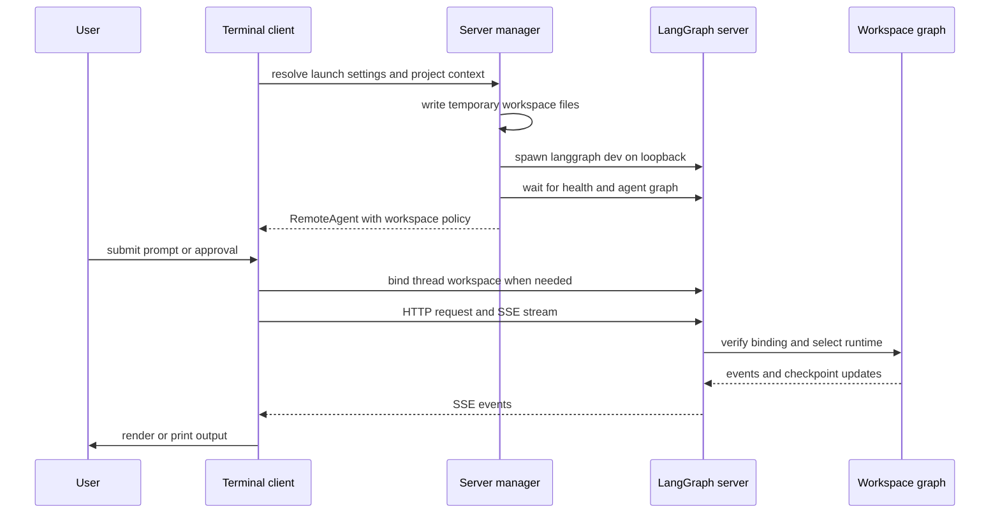
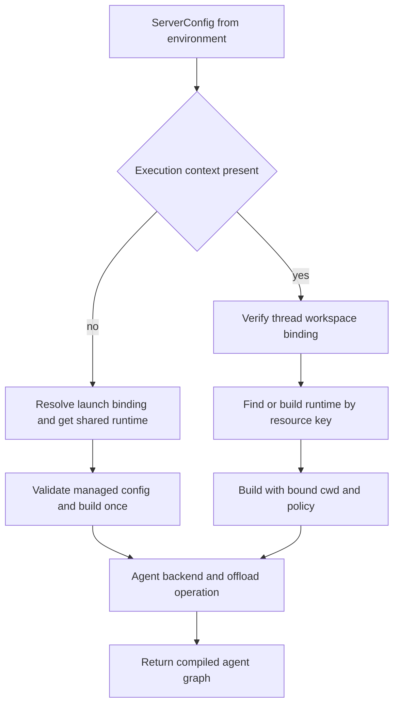

# Deep Agents Code (dcode) Architecture

`deepagents-code` (`dcode`) is a reference terminal coding agent built on the `deepagents` SDK. It combines the SDK harness with a terminal experience, persistence, tools, skills, and optional sandboxed execution.

Two deliberately separate launch designs exist:

- Normal interactive and headless dcode start a loopback `langgraph dev` **server subprocess** and communicate with it through `RemoteAgent`.
- `dcode --acp` serves ACP over **stdio in the launching process**. It constructs local graphs through an ACP callback; it does not start `langgraph dev` or use `RemoteAgent`.

## Normal local runtime

The terminal client and agent server are separate processes. The client owns presentation, input, and approval interaction; the server owns graph execution, model and tool integration, memory and skills middleware, backends, and checkpointed state. Interactive mode uses the terminal UI. Headless mode uses the same server and `RemoteAgent` for one task, replacing the UI with machine-oriented stdout streaming; quiet mode leaves only agent response text.

This shows the normal local request path. A durable thread workspace binding selects the graph runtime before execution.

`RemoteAgent` is a thin adapter over LangGraph's `RemoteGraph`: the underlying client handles HTTP/SSE, `messages-tuple` stream-mode negotiation, namespace extraction, and interrupt detection. dcode converts streamed message dictionaries to message objects for the terminal adapter and normalizes thread IDs, while state snapshots remain in server serialization. This boundary helps diagnose failures: presentation and input generally belong to the client; graph construction, model, tools, memory, and server failures belong to the server.

### Launch, persistence, and cleanup

`start_server_and_get_agent` captures project context (or uses an explicit cwd), preflights an explicit MCP configuration before spawning, converts launch arguments into `ServerConfig`, and exports its `DEEPAGENTS_CODE_SERVER_*` representation. It creates a temporary LangGraph workspace containing `langgraph.json`, `pyproject.toml`, and a generated checkpointer module. The module reads the application session database path from the environment and yields `AsyncSqliteSaver`, so generated source does not contain the path.

The generated configuration registers `agent` as `deepagents_code.server_graph:make_graph`. Only that built-in graph reference receives dcode's offload HTTP application. The local server defaults to `127.0.0.1` and port `0`, selecting an ephemeral port instead of occupying `langgraph dev`'s usual port 2024. After health and graph readiness, the manager creates `RemoteAgent` and supplies its cwd, non-secret workspace policy, and effective-configuration fingerprint.

On first use of a thread, `RemoteAgent` calls the workspace endpoint. The server accepts only a canonical existing absolute directory, derives its project root, and atomically stores a thread-to-workspace binding in the session SQLite database. The endpoint compares any client policy and fingerprint to server-derived policy before it binds; later claims for the thread must agree with the existing workspace and configuration fingerprint. It separately mirrors binding metadata into a LangGraph thread, because persistent checkpoints can outlive that live thread record.

If startup, readiness, `RemoteAgent` construction, or workspace setup fails before handoff, the manager stops the owned subprocess even when cancellation caused the failure. `server_session` extends ownership over a successful session and stops the server in `finally`, then emits queued debug-log notices. The process launcher uses a dedicated process group where supported, allowing shutdown to reach server descendants rather than only the root process.

## Server graph construction and resource ownership

`ServerConfig.to_env()` and `ServerConfig.from_env()` form the normal subprocess wire schema: the client exports resolved intent and the server reconstructs it rather than parsing terminal arguments again. A supplied `ALLOW_FS_TOOLS` value is a security control: malformed JSON, empty or unknown tool lists, and lists without `read_file` fail closed; an absent value means the SDK's unrestricted filesystem-tool default.

This is the current factory split. A no-context graph-load call builds the launch runtime through the process-wide startup cache. An execution with runtime context verifies its durable binding and uses the workspace runtime cache.

`make_graph` rejects an execution context without both a nonempty thread ID and valid workspace context. It then calls `require_thread_workspace` and obtains a runtime keyed by the immutable binding's resource key. Before a new workspace runtime is built, the server compares the current full environment-derived configuration and non-secret payload with that binding; drift is a conflict, not an opportunity for caller-controlled reconfiguration.

The process-wide startup cache is protected by an async lock and builds the launch runtime once. Workspace runtimes are LRU-cached to 32 resource keys behind a workspace lock. This cache is a resource-ownership invariant rather than merely a performance feature: construction performs MCP discovery and may create a sandbox and register its `atexit` cleanup. A configured sandbox is process-wide, so the first workspace claims it and a different workspace is refused even if the first build fails; without a sandbox, multiple workspace runtimes may be built.

Construction snapshots the selected workspace environment and credentials, resolves the project context and model, builds built-in tools, and optionally discovers MCP and plugin MCP tools. MCP discovery uses stateless throwaway sessions; the process-wide `MCPSessionManager` binds real sessions lazily on the server event loop when a tool runs. `create_cli_agent` is the composition point for the model, built-in and MCP tools, optional sandbox, filesystem policy, approvals, memory, skills, shell and interpreter configuration, subagents, grading context, retries, and extensions. It returns both compiled graph and composite backend; `offload_operation_from` derives the server-owned offload operation from that same backend, so graph execution and `/offload` share resources and archive policy.

Only built-in external-context tools and MCP tools with explicit, coherent read-only annotations are passed to criteria generation and rubric grading. Missing, malformed, or contradictory MCP annotations grant no such access.

### Startup and request failures

The startup cache is a startup barrier. Managed-policy validation or runtime construction failure emits a human-readable error and `DEEPAGENTS_STARTUP_ERROR:` to stderr, then exits with code 1. The parent polls health and graph readiness, scrapes this marker from captured logs on an early exit, and reports the underlying construction cause.

The exit boundary is not appropriate after the server is serving. The workspace endpoint and the server-owned offload route catch `SystemExit` from request-scoped runtime construction and return a 503 response instead of terminating the server. Workspace conflicts are returned as 409; invalid workspace input is 422.

The offload application is also the workspace-binding API and participates in server lifespan cleanup: it shuts down server extensions and attempts a bounded LangSmith trace flush. Custom operation routes opt into LangGraph route authorization when an auth backend is configured; normal local launch uses loopback plus `LANGGRAPH_AUTH_TYPE=noop`.

## Subprocess environment boundary

The normal-server child starts from a filtered environment. It removes startup-sensitive variables, including loader injection paths, `PYTHONHOME`, `PYTHONPATH`, `PYTHONSTARTUP`, askpass variables, and cloud/auth variables that should not influence local server startup. It sets `PYTHONDONTWRITEBYTECODE`, forces `LANGGRAPH_AUTH_TYPE=noop`, and re-pins the child profile to the profile selected by the client even if a restart override tries to change it.

A launch-time `PYTHONPATH` is preserved only in a separate internal carrier. It is deliberately absent from the server interpreter's `sys.path`, preventing an untrusted project path from shadowing imports before approval. The shell backend can reapply the carrier only for approval-gated `execute` commands. User tracing values are similarly relayed so shell commands do not inherit the agent's tracing identity.

## ACP stdio is a separate lifecycle

With `--acp`, `_run_acp_cli_async` runs in the launching process. It resolves an initial model and project context, loads built-in and MCP tools, then opens the dcode checkpointer for the serving lifetime. It supplies `deepagents_acp` with an ACP server whose `build_agent(context)` callback invokes local `create_cli_agent`.

The callback uses the ACP session's selected model when supplied, creates a replacement model result when it differs from the initial one, and derives `ProjectContext` from the session cwd. It shares the open checkpointer, tool list, MCP server information, and loaded subagents, but returns a session-local graph. It does not use environment-configured `make_graph`, normal-server workspace caches, `RemoteAgent`, or the normal `/offload` application.

ACP sets `load_sessions=True`, keeps the checkpointer open while serving, and cleans its MCP session manager in a `finally` block. Model/MCP load errors and serving failures are written to stderr and return a nonzero result; ACP does not emit the normal subprocess startup marker for a parent process to scrape.

In ACP Auto mode, dcode substitutes `AgentServerACP` and an `InMemoryStore`. Its `_AutoGraph` wrapper stores trusted Auto approval state and adds prompt metadata before it streams the local graph. YOLO still maps to `auto_approve`, requires prior acknowledgement at CLI dispatch, and an Auto classifier model is used only when the resolved approval mode is Auto. See [ACP](/openwiki/integrations/acp.md) for host-protocol integration.

## Configuration, extension, and change guidance

The normal server receives a resolved launch snapshot, while general setting resolution follows ranked precedence: lower numeric ranks win—managed policy, command-line arguments, retained runtime reload values, process environment, user `config.toml`, then typed manifest defaults. See [configuration layering](/openwiki/concepts/config-layering.md).

Important extension boundaries are skills and subagents, built-in and MCP tools, sandbox providers, hooks and commands, and Python extensions for middleware, tools, and virtual storage routes. Changes to normal server construction require a separate ACP review: ACP intentionally has a distinct local graph factory and lifecycle. For related operational guidance, see [MCP](/openwiki/integrations/mcp.md), [security](/openwiki/operations/security.md), [state persistence](/openwiki/concepts/state-persistence.md), and [run a dcode session](/openwiki/workflows/run-dcode-session.md).

Focused tests cover startup-marker extraction, health/graph readiness and cancellation cleanup, filtered child environment and profile pinning, runtime cache concurrency, workspace-policy reconstruction and configuration drift, sandbox workspace exclusivity, and fail-closed read-only MCP-tool admission. Revisit these tests when changing lifecycle ownership or an HTTP/server security boundary.
