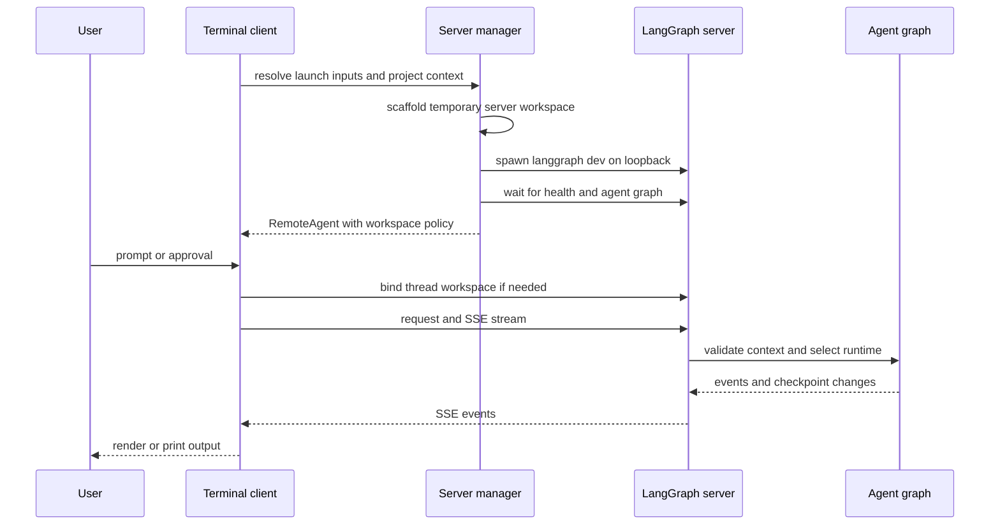
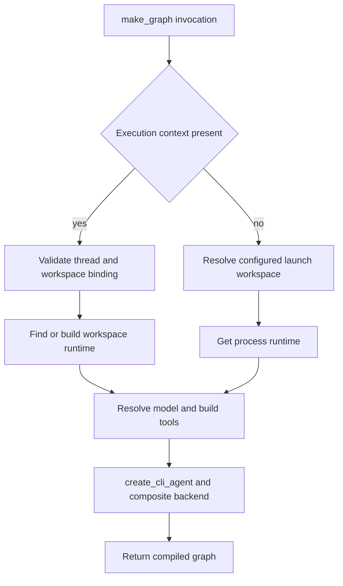
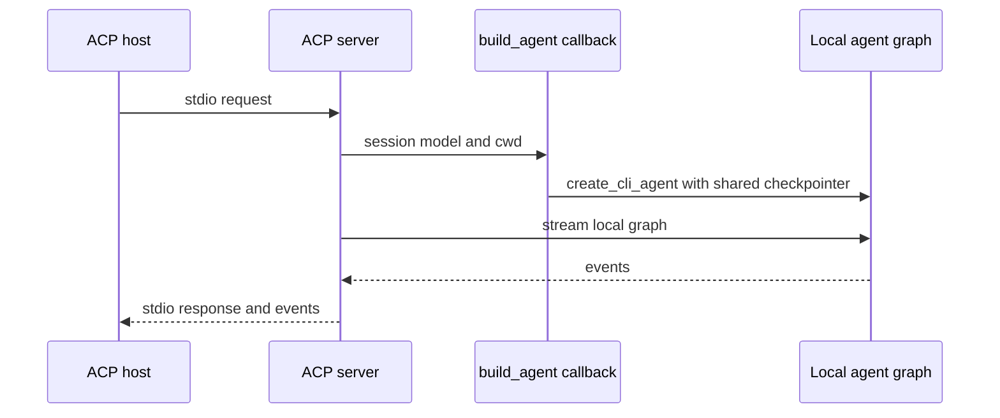

# Deep Agents Code Architecture

`deepagents-code` (`dcode`) is a reference terminal coding-agent product built on the `deepagents` SDK. It combines the SDK harness with terminal UX, durable sessions, tools, skills, and optional sandbox execution.

Two deliberately different launch paths exist:

- **Normal interactive and headless dcode** start an owned, local `langgraph dev` subprocess and use `RemoteAgent` to reach its graph over HTTP and server-sent events (SSE).
- **`dcode --acp`** is an in-process ACP server on stdio. It builds local session graphs and does not start `langgraph dev` or use `RemoteAgent`.

This split is an ownership boundary, not just a transport choice. Changes to normal server construction should be reviewed against ACP separately.

## Normal loopback runtime

The terminal client owns presentation, user input, and approval interaction. The server owns model resolution, graph execution, tools, memory and skills middleware, agent backends, and checkpoints. Interactive mode supplies the Textual UI; non-interactive mode uses the same server and remote client for one task but writes machine-oriented output to stdout. Quiet mode suppresses tool-call and file-operation notices, leaving agent response text.

This is the normal local request path. The workspace binding precedes execution and makes graph selection server-authoritative.

### Launch and configuration handoff

`start_server_and_get_agent` captures the project context (or accepts an explicit cwd), validates an explicit MCP configuration before spawn, resolves a `ServerConfig`, and exports its `DEEPAGENTS_CODE_SERVER_*` representation. It scaffolds a temporary directory containing `langgraph.json`, `pyproject.toml`, and a generated checkpointer module. The generated module reads the application session-database path from an environment variable and yields an `AsyncSqliteSaver`; no database path is embedded in its source.

`langgraph.json` registers `agent` as `deepagents_code.server_graph:make_graph`. For that built-in graph reference it also registers dcode's offload HTTP app; a custom graph reference does not get the offload route. Normal local launch binds `127.0.0.1` and defaults to port `0`, letting the OS select a port instead of taking `langgraph dev`'s conventional port 2024.

`ServerConfig.to_env()` and `ServerConfig.from_env()` form the client/server wire schema: the app serializes resolved launch intent and the server reconstructs it without parsing terminal arguments again. Configuration resolution still has its defined ranked precedence—managed policy first, then command-line values, retained runtime reload values, process environment, user `config.toml`, and manifest defaults. See [configuration layering](/openwiki/concepts/config-layering.md).

The child environment is also a security boundary. Startup-sensitive inherited variables—including `PYTHONPATH`—are removed before the server interpreter launches. The original `PYTHONPATH` is carried separately only for the approval-gated shell backend. The manager re-pins the server profile to the client launch profile even if restart overrides try to change it.

### Remote client, streams, and persistence

`RemoteAgent` wraps LangGraph's `RemoteGraph`. The underlying graph client performs HTTP/SSE parsing, `messages-tuple` stream-mode negotiation, namespace extraction, and interrupt detection. dcode adds thread-ID normalization and converts streamed message dictionaries into message objects for the Textual adapter; state snapshots remain in server serialization. This is a practical diagnostic division: presentation/input issues are generally client-side, while graph/model/tool construction and execution failures are server-side.

Before a thread runs, `RemoteAgent` lazily posts its configured cwd, workspace policy, and configuration fingerprint to `/dcode/threads/{thread_id}/workspace`. It caches the returned descriptor per thread. It separately ensures the HTTP thread record exists: checkpoint data can survive a server restart while the LangGraph server has not rematerialized its live thread record.

The server canonicalizes the supplied absolute directory, verifies it exists, finds its project root, serializes the policy deterministically, and persists an immutable binding in the session SQLite database. A later bind for the same thread must have the same workspace and nonempty configuration fingerprint. During a context-bearing graph invocation, `make_graph` requires a nonempty thread ID and matching workspace payload, then reads that durable binding; missing, malformed, changed, or unsupported bindings raise rather than allowing a caller-selected cwd.

See [state persistence](/openwiki/concepts/state-persistence.md) and [context management](/openwiki/concepts/context-management.md) for the broader session model.

## Server graph construction and caching

This shows the current factory distinction: execution-context calls select a bound workspace runtime; calls without one use the configured launch workspace or the process-wide fallback.

`_make_graphs` resolves a workspace environment and credential snapshot, then resolves project settings and model construction outside the server event loop where blocking filesystem/provider work would be unsafe. It builds built-in tools and, unless `no_mcp` is set, discovers project/plugin MCP tools using throwaway discovery sessions. A process-wide MCP session manager binds actual sessions lazily when a tool is invoked on the server event loop.

`create_cli_agent` is the composition point: it receives the resolved model, built-in and MCP tools, optional sandbox, filesystem and approval policy, memory, skills, shell/interpreter settings, subagents, grading context, retry behavior, environment, and credentials. It returns the compiled graph and composite backend. The server derives its offload operation from that same backend, ensuring graph execution and offload share their resource ownership.

Criteria generation and rubric grading receive built-in external-context tools plus only MCP tools that are explicitly and coherently read-only. Missing, malformed, mutating, or contradictory annotations fail closed.

### Lifetime rules and constraints

The no-context factory has a lock-protected, process-lifetime runtime cache. It is load-bearing: construction performs MCP discovery, may create a process-lifetime sandbox, and registers sandbox cleanup, all of which must not occur per request. The graph and offload route use the same runtime resources.

Workspace executions have a separate LRU cache keyed by the persisted resource key, capped at 32 entries and protected by a shared async lock during first construction. Before building, the server reconstructs the current configuration with the bound cwd/project root and requires its fingerprint and workspace policy to equal the durable binding. A configured sandbox is process-wide and is claimed by the first workspace; another workspace is refused rather than sharing that sandbox ambiguously. Sandbox cleanup is registered for process exit.

## Failure and cleanup boundaries

Initial factory construction is a startup barrier. Managed-policy validation or runtime construction errors emit a human-readable error and a `DEEPAGENTS_STARTUP_ERROR:` marker to stderr, then exit with code 1. The parent watches child output while polling health and extracts that marker, avoiding a generic readiness timeout. Request-scope consumers of the shared runtime must contain `SystemExit`; the offload path maps it to temporary unavailability rather than killing an already-serving process.

The manager stops an owned server if start, graph readiness, `RemoteAgent` creation, or workspace setup fails. Its `finally` block also covers cancellation, not only ordinary exceptions. `server_session` owns successful-session teardown, stops the server, and emits any queued preserved-log notices. On POSIX the child has its own process group, so graceful termination and escalation target descendants as well as the server root; Windows has a more limited root-handle escalation path.

Focused server-graph tests cover process-runtime reuse and concurrent first construction, startup marker/exit behavior, disabled MCP loading, workspace-specific credentials, interpreter propagation, and fail-closed read-only MCP admission. These are the key regression points for cache ownership, construction security, and tool exposure.

## ACP stdio lifecycle

`--acp` calls `_run_acp_cli_async` in the launching process. It resolves an initial model, obtains project context, loads built-in and MCP tools, and opens the dcode checkpointer for the whole serving lifetime. It creates an ACP server with `load_sessions=True`; its `build_agent(context)` callback chooses the model requested by that ACP session (or the resolved default), uses the session cwd to make `ProjectContext`, and calls `create_cli_agent` with the shared checkpointer. ACP graphs are therefore session-local rather than normal-server workspace-cache entries.

This is ACP's in-process stdio flow; it has no normal local subprocess or remote graph hop.

In ACP Auto mode, dcode substitutes `AgentServerACP`. The adapter wraps each local graph stream to write trusted Auto approval state to an in-memory store, attach prompt metadata to the final user message, and supply matching CLI context. YOLO is enabled only after its acknowledgement gate, and the resolved Auto classifier is used only when Auto mode is active. See [ACP](/openwiki/integrations/acp.md).

ACP catches model/MCP-load and serving errors, writes them to stderr, and returns a nonzero exit code. It does not use the normal subprocess startup marker. Its `finally` cleanup closes the MCP session manager; the checkpointer remains open through serving because its context manager encloses server creation and execution.

## Safe extension and operations guidance

Skills/subagents, built-in and MCP tools, sandbox providers, hooks/commands, and authorized Python extensions are composition points. Extensions in normal server mode are loaded while constructing a runtime, bound to that server runtime when active, and shut down if subsequent graph construction fails. Treat workspace policy and its fingerprint as compatibility inputs: changing resource-affecting configuration for an already-bound thread is a conflict, not a live reconfiguration.

For practical startup and session behavior, see [run a dcode session](/openwiki/workflows/run-dcode-session.md), [runtime behavior](/openwiki/architecture/runtime-behavior.md), and [source map](/openwiki/architecture/source-map.md).
