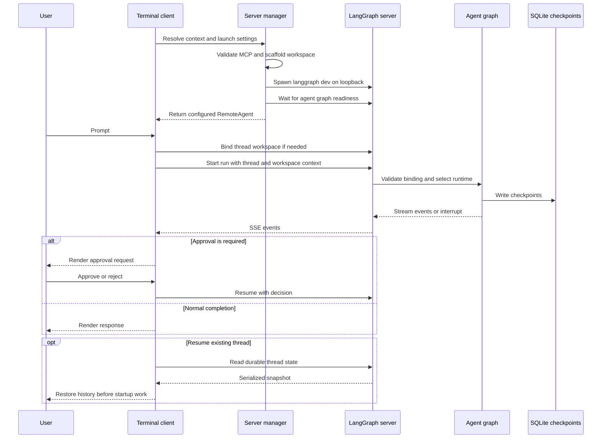
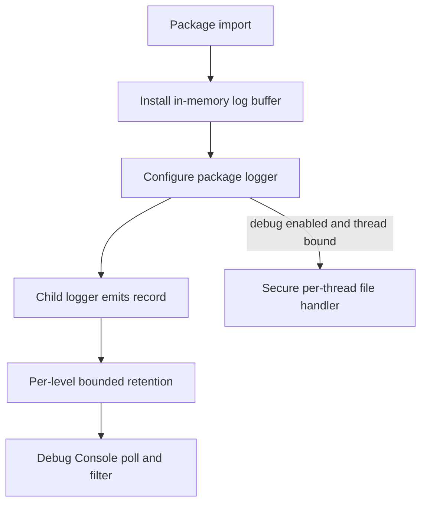

# Deep Agents Code Architecture

`deepagents-code` (`dcode`) is a reference terminal coding-agent product built on the `deepagents` SDK. It combines the SDK harness with terminal UX, persistence, tools, skills, and optional sandboxed execution.

`python -m deepagents_code` enters the same lazy `cli_main` entry point as the package command. The lazy import avoids loading the CLI's argument and startup machinery when other package modules are imported.

There are two deliberately distinct execution paths:

- **Normal interactive and headless dcode** run a terminal client and an owned local `langgraph dev` server in separate processes. The client owns presentation, input, and approval interaction; the server owns the model, graph, tools, memory, skills, backend, and checkpoints.
- **`dcode --acp`** runs an ACP server in the launching process over stdio. It builds local session graphs and does not start `langgraph dev` or use `RemoteAgent`.

This is an ownership boundary, not merely a transport choice: changes to the normal-server path must be evaluated against ACP separately.

## Normal client-server run

Interactive mode renders and collects input in the Textual app. Its startup worker installs the managed `rg` before spawning the server, starts the server asynchronously, retains the returned process immediately, and posts `ServerReady` for UI-side initialization. Headless mode runs one task against the same `RemoteAgent`/server arrangement but streams machine-oriented output to stdout; `--quiet` moves diagnostics to stderr so stdout contains response text only.

*This sequence shows the normal local request, approval, and resume path; ACP is separate.*

This sequence shows the normal local path, including the client-owned approval/resume interaction. Workspace binding and execution context make runtime selection server-authoritative; ACP has its own boundary below.

### Startup and configuration handoff

`start_server_and_get_agent` captures project context (or uses an explicit cwd), validates an explicit MCP file before spawning, resolves `ServerConfig`, and scaffolds a temporary LangGraph workspace. That workspace contains `pyproject.toml`, `langgraph.json`, and a generated checkpointer module. The module reads the application session database path from an environment variable and yields `AsyncSqliteSaver`, rather than baking the path into generated code.

The generated graph reference is `deepagents_code.server_graph:make_graph`. For that built-in reference, `langgraph.json` also registers dcode's offload HTTP app with custom-route auth enabled; a custom graph reference does not get `/offload`. The normal local server binds `127.0.0.1` and defaults to port `0`, deliberately obtaining an ephemeral port instead of occupying `langgraph dev`'s conventional port 2024.

The client writes resolved launch settings as `DEEPAGENTS_CODE_SERVER_*` variables. `ServerConfig.to_env()` and `ServerConfig.from_env()` are the shared schema, keeping variable names, serialization, and defaults in one place. Configuration precedence uses lower numeric ranks first: managed policy, CLI arguments, retained reload values, environment, user `config.toml`, then typed defaults. See [configuration layering](/openwiki/concepts/config-layering.md).

The child environment is also a security boundary. Startup-sensitive inherited variables, including `PYTHONPATH`, are stripped before the server interpreter starts. The original `PYTHONPATH` is carried separately solely for approval-gated shell execution, and immutable child environment handling pins profile selection to the client launch profile.

## Workspace binding, durable threads, and runtime selection

`RemoteAgent` wraps LangGraph's `RemoteGraph`: the underlying client performs HTTP/SSE parsing, `messages-tuple` negotiation, namespace extraction, and interrupt detection. dcode normalizes thread IDs and converts streamed message dictionaries and update interrupts to objects suitable for the Textual adapter, while state snapshots remain in the server's serialized form.

Before a thread is used, `RemoteAgent` posts the configured cwd, workspace policy, and fingerprint to `/dcode/threads/{thread_id}/workspace`, then caches the server-returned descriptor. It separately registers the HTTP thread record because SQLite checkpoint data can survive a server restart even when the dev server has no live thread row. Thus a durable checkpoint alone is not sufficient for a later HTTP state mutation or offload request.

The server canonicalizes absolute cwd and project-root identity and stores a binding atomically in the session SQLite database. A thread cannot silently move to another workspace or configuration fingerprint: later binds and execution contexts must match the durable payload or raise `WorkspaceConflictError`. The durable policy excludes credentials and prompt material.

With an execution runtime context, `make_graph` requires a nonempty thread ID and workspace context, verifies the durable binding, and selects the runtime keyed by its persisted resource key. Without execution context, it uses the configured launch workspace if present; otherwise it uses the lock-protected process runtime. Every workspace-runtime lookup re-resolves configuration and rejects project-policy or server-configuration drift before returning even a cached runtime. A revoked project-extension trust therefore invalidates use, while a new grant is pinned out of an already-bound thread. See [state persistence](/openwiki/concepts/state-persistence.md).

### Client failure semantics

The remote boundary is intentionally not a best-effort façade. `aget_state` returns `None` only for a missing HTTP thread or a live thread with no checkpoint; network, authentication, server, and unexpected-state failures are logged and re-raised. Store-write failures are likewise re-raised so higher-level approval code can fail closed rather than retain auto-approval state after persistence failed.

`aupdate_state` has one narrow recovery path: on HTTP 409, it lists pending and running runs, requests their cancellation concurrently with bounded waits, and retries once. Individual cancellation failures are best-effort; failure of the retry still propagates to the caller. This addresses the common race where a client stopped consuming an SSE stream before the server finished its run; it is not a general suppression of remote failures.

## Graph assembly and shared server resources

`create_cli_agent` is the composition entry point for the resolved model, built-in and MCP tools, optional sandbox, filesystem and approval policy, memory, skills, interpreter configuration, subagents, grading context, and workspace credentials/environment. It returns the compiled graph and composite backend; the server derives its offload operation from that backend, so normal graph execution and `/offload` share backend ownership.

Criteria creation and rubric grading receive built-in external-context tools and only MCP tools explicitly and coherently annotated read-only. Missing, malformed, contradictory, or mutating MCP annotations fail closed.

The process runtime is constructed once under a lock. That cache is correctness-critical: it prevents repeated MCP discovery, sandbox creation, and duplicate `atexit` registration, and ensures the graph and offload route share compatible resources. Workspace runtimes live in a shared-lock LRU keyed by the durable resource key and capped at 32 entries. Runtime construction uses the workspace's immutable environment snapshot, including its dotenv-derived credentials, without mutating the server process environment.

Some resources constrain what one server process may host. A configured sandbox is process-wide and the first workspace claims it; another workspace is rejected even if the first build failed. LangSmith tracing settings are also process-lifetime: a workspace with different tracing/redaction settings is rejected rather than rerouting cached or concurrent runtime traces. Run a separate normal server when either constraint prevents co-hosting.

## Diagnostics: live console and secure file traces

Diagnostics have two intentionally separate retention paths. Importing `deepagents_code` installs an always-on `InMemoryLogBuffer` on the package logger *before* normal debug logging is configured. Child loggers propagate into this handler, giving the Textual `Ctrl+\\` Debug Console a live tail even when opt-in file logging is disabled. The handler retains structured records in bounded deques per recognized level (with one shared bucket for custom levels), tags emissions with a monotonic sequence, and merges snapshots back into chronological order. Consequently, a flood of `DEBUG` messages cannot evict the rarer `INFO`, `WARNING`, or `ERROR` records needed by the console filter.

*The in-memory console tail is always available after package import, while file tracing is opt-in and bound to the active thread.*

The console polls by absolute emission index, appends only retained records it has not rendered, and bounds its own display with the same per-level policy. Clearing the console advances only its render cursor: it does not erase the process buffer, so later records continue to accrue. Console polling is diagnostic-only—widget-race and unexpected polling failures are converted to a notice/log record rather than crashing the app.

File logging is enabled only when `DEEPAGENTS_CODE_DEBUG` is truthy. Its level is `DEEPAGENTS_CODE_LOG_LEVEL` when valid, otherwise `DEBUG` with file debugging enabled or `INFO` without it; an invalid level warns and falls back. Binding a TUI or headless thread selects a filename in the configured debug directory, swaps stale tagged handlers rather than stacking them, and leaves unrelated handlers alone. `installed_debug_log_path()` reports an actually attached tagged handler rather than inferring a path from the environment, which prevents a misleading error hint when `.env` made the variable truthy after import.

The debug directory is selected from `DEEPAGENTS_CODE_DEBUG_DIRECTORY`, then the legacy `DEEPAGENTS_CODE_DEBUG_FILE` parent, then config, then the default. It is a security boundary because trace output can include remote/MCP diagnostics: POSIX requires a current-user-owned real directory tightened to `0o700`, refuses symlinks where supported, and opens files with `O_NOFOLLOW` and mode `0o600`; Windows replaces the DACL with read/write access for the current user. Unsafe or overlong thread IDs become a SHA-256-derived filename, preventing traversal. If directory or file hardening fails, dcode removes its stale tagged handlers, warns to stderr and the memory buffer, and does not write the file.

## Media input and transcript boundaries

The interactive composer owns attachment capture; it renders attached media as `[image N]` or `[video N]` placeholders while `MediaTracker` owns the corresponding encoded objects. Dragged/pasted paths are loaded as images first and then as videos. Images are decoded by Pillow, while videos must have an allowed extension *and* a recognized magic-byte signature; both reject empty or greater-than-20-MB files. macOS clipboard image support uses `pngpaste` when available and otherwise `osascript`; other platforms warn rather than pretending an attachment was added.

Placeholders are display metadata, not prompt text. The tracker allocates IDs that do not collide with existing literal tokens, maintains exact placeholder spans across edits and submit-time text transformations, and synchronizes/removes attachments when their bound tokens disappear. The composer treats only placeholders backed by a current attachment as atomic deletions, leaving user-typed lookalikes as ordinary text. At submission it preserves a snapshot for the transcript, clears the draft only after the receiving layer can consume the attachments, and resets tracking for the next message.

`create_multimodal_content` removes only the display placeholders bound to the supplied media before creating the canonical content blocks: a non-empty text block comes first, followed by `image_url` blocks and then video blocks. Span tracking preserves a user-authored duplicate placeholder; if a span is unavailable, token-count fallback removes one occurrence per attachment. This keeps placeholders out of model-facing messages and traces while still preserving the media payload. The `UserMessage` widget retains the submission snapshot so the UI can render the original turn independently of the now-reset composer.

## Failure handling and teardown

Runtime construction is a startup barrier. A build failure emits a `DEEPAGENTS_STARTUP_ERROR:` marker and exits with code 1, allowing the parent to extract a specific cause from child logs rather than report only a readiness timeout. In request-scoped offload handling, that `SystemExit` is contained and translated to a service-unavailable response rather than killing the server mid-request.

The manager stops its owned process when spawning, graph readiness, remote-client setup, or workspace setup fails. Its `finally` cleanup handles cancellation as well as ordinary exceptions. `server_session` stops the process on normal exit and drains queued notices for debug-preserved logs. The Textual runner duplicates the final ownership guarantee for servers started by its background worker, including deferred startup.

On POSIX, the server is started in a dedicated process group. Teardown signals the group, waits for descendants as well as the root, then escalates to `SIGKILL` if necessary. Windows uses a graceful console signal where possible, but hard-kill escalation reaches only the root process handle; a surviving descendant can be orphaned.

Focused tests cover server graph caching and concurrent construction, nonblocking server bootstrap and sandbox setup, workspace environment isolation, policy drift and sandbox ownership, remote 409 recovery, durable binding secrecy, and Textual resume/startup ordering. These tests are useful guardrails when changing the boundaries described here.

## ACP stdio lifecycle

`--acp` calls `_run_acp_cli_async` in the launching process. It resolves the initial model and MCP tools, keeps dcode's checkpointer open while serving, and passes a `build_agent(context)` callback to the ACP server. That callback uses the ACP session's selected model (or the resolved default) and cwd to make `ProjectContext` and call `create_cli_agent` with the shared checkpointer. These session-local graphs are not normal workspace-runtime-cache entries.

In Auto mode, dcode uses its `AgentServerACP` adapter. The adapter wraps local graph streaming to store trusted Auto approval state, attach prompt metadata, and supply CLI context. YOLO requires prior acknowledgement, and `--auto-classifier-model` is accepted in ACP only when the resolved mode is Auto. ACP failures go to stderr and return a nonzero status; they do not follow the normal subprocess startup-marker path. A `finally` block cleans up the ACP MCP session manager.

The ACP smoke test starts `deepagents --acp --no-mcp`, initializes the protocol, opens a session using the current cwd, and asserts that it has an ID. It protects the stdio lifecycle without conflating it with the loopback normal-server path.

## Extension and operations guidance

Tools, MCP servers, skills, subagents, sandbox providers, hooks/commands, and authorized Python extensions are composition points. In normal-server mode, resource-affecting settings become part of the durable workspace policy/fingerprint; do not expect a bound thread to live-reconfigure into a different resource policy. Custom graph references also need an independent offload strategy because dcode does not register `/offload` for them.

For operational usage, see [run a dcode session](/openwiki/workflows/run-dcode-session.md), [runtime behavior](/openwiki/architecture/runtime-behavior.md), [state persistence](/openwiki/concepts/state-persistence.md), [MCP](/openwiki/integrations/mcp.md), and [configuration layering](/openwiki/concepts/config-layering.md).
