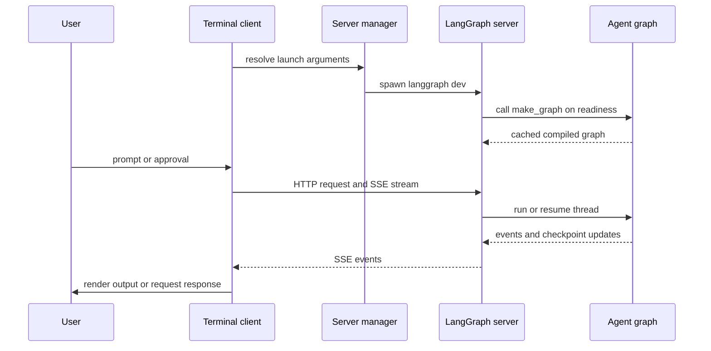
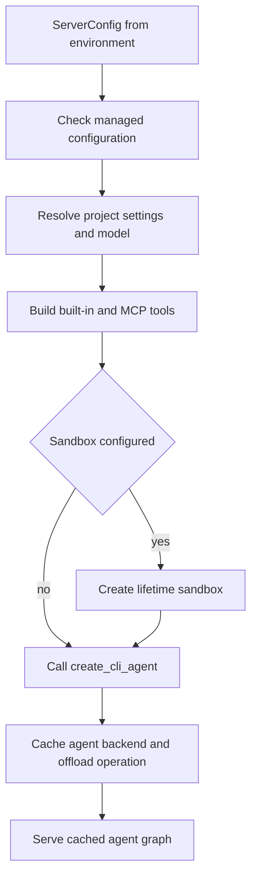

# Deep Agents Code (dcode) Architecture

`deepagents-code` (`dcode`) is a prebuilt terminal coding agent built on the
`deepagents` SDK. It packages the SDK harness with a terminal experience,
persistence, tools, skills, and optional sandboxed execution as a reference
implementation. See the [architecture overview](/openwiki/architecture/overview.md)
and [source map](/openwiki/architecture/source-map.md) for broader context.

This page distinguishes two launch designs that should not be conflated:

- The normal local interactive and headless launches create a loopback
  `langgraph dev` **server subprocess** and a `RemoteAgent` client.
- `dcode --acp` is an **ACP server over stdio** in the launching process. It
  builds local graphs for ACP sessions; it does not launch `langgraph dev`, use
  `ServerConfig`, or use `RemoteAgent`.

## Normal local runtime: ownership and request path

The normal runtime has two processes. The terminal client owns presentation,
input, and approval interaction. The agent server owns the compiled graph,
model execution, tools, MCP sessions, memory/skills middleware, backend, and
checkpointed session state. Interactive mode uses the Textual client; headless
mode reuses the same local server and `RemoteAgent` but writes a single task's
stream to stdout, optionally leaving only response text in quiet mode.

This shows the normal local path, including lazy graph construction before the
client is handed a ready endpoint. A request in either terminal mode follows
that same client-to-server-to-graph-to-stream path; server-side checkpoints
allow a conversation to continue later.

The server manager captures project context, validates an explicit MCP config
before spawning, translates launch arguments into `ServerConfig`, and exports
its `DEEPAGENTS_CODE_SERVER_*` representation. It scaffolds a temporary
workspace containing `langgraph.json`, a persistent SQLite checkpointer module,
and a minimal runtime project. The generated graph reference is
`deepagents_code.server_graph:make_graph`. The subprocess listens on loopback
and defaults to port `0`, so the OS chooses a free port instead of consuming
LangGraph's conventional port 2024. Startup waits for the `agent` graph to be
ready; if startup or readiness fails after process creation, cleanup stops the
owned process.

`RemoteAgent` is deliberately thin: it lazily creates LangGraph's
`RemoteGraph`, which handles HTTP/SSE, `messages-tuple` stream negotiation,
namespace extraction, and interrupts. dcode converts streamed message dicts
for the Textual adapter and normalizes thread IDs, but keeps state snapshots in
the server's serialized form. Thus UI rendering bugs normally belong in the
client, while model, tool, memory, graph-build, and server-startup failures
normally belong in the server.

## Server graph construction and lifecycle

`ServerConfig.to_env()` and `ServerConfig.from_env()` are the shared wire schema
between the normal app process and its subprocess. In particular, the server
reconstructs resolved model, execution, sandbox, MCP, project-context, and
filesystem controls from that environment rather than re-parsing terminal
arguments. A present `ALLOW_FS_TOOLS` value is treated as a security control:
invalid JSON, an empty/non-string list, unknown tools, or a list missing the
required read tool is rejected rather than widened to unrestricted filesystem
access.

`make_graph()` delegates to one process-wide cached `ServerRuntime` containing
the compiled agent, its `CompositeBackend`, and its server-owned offload
operation. Its lock serializes first construction. This is required for
correctness, not just speed: MCP discovery, sandbox creation, and sandbox
`atexit` registration must occur once; both the graph and the offload HTTP
route must use the same backend resources.

Construction first refresh-checks managed configuration, resolves project
settings and the model, then assembles built-in tools and (unless disabled) MCP
tools. It creates a configured sandbox for the server process lifetime when
requested. Finally it calls `create_cli_agent`, the common assembly entry point
for the compiled coding graph and composite filesystem/backend layer. The
factory supplies model, tools and MCP metadata, sandbox, project context,
subagents, approvals, filesystem restrictions, memory, skills, shell and
interpreter options, retry budget, and criteria/grading context tools. Only
explicitly read-only MCP tools are admitted to those criteria/grading context
tool lists.

This is the once-per-process construction path for the normal server. Blocking
settings/model and agent assembly work is offloaded from the server event loop
where necessary; LangSmith secret-redaction configuration remains on the server
task so its context-local disable path is effective.

### Startup versus request failures

The graph factory is a startup barrier. A construction exception is emitted as
a human-readable stderr error plus a `DEEPAGENTS_STARTUP_ERROR:` marker, then
exits with code 1. The parent-side server process captures output and extracts
the marker so the terminal can present the construction cause rather than only
a generic readiness timeout. Unit tests cover cache reuse and concurrent first
access, the off-event-loop managed-policy gate, startup-marker exit behavior,
and server-manager cleanup around failed or cancelled readiness.

The same runtime cache is also used by dcode's server offload route. This makes
the startup exit semantic unsuitable for an already-serving request: request
handlers that need the runtime must contain `SystemExit` and report temporary
unavailability rather than terminate the server mid-request.

## ACP stdio mode is a separate construction path

With `--acp`, `main` resolves the approval mode and invokes `asyncio.run` on
`_run_acp_cli_async`. That function resolves the initial model and project
context, loads built-in and MCP tools in-process, opens dcode's checkpointer,
and gives `deepagents_acp` an ACP server whose `build_agent(context)` callback
constructs a local `create_cli_agent` graph for the ACP session. The callback
uses the session-selected model when supplied and passes the ACP session cwd
and derived `ProjectContext`; ACP therefore has local graph construction per
session/model selection rather than the normal server process's cached,
environment-configured graph.

ACP keeps its checkpointer open while serving and requests session loading;
it cleans up its MCP session manager in `finally`. It reports construction or
serving failures to stderr as `Error: ACP server failed: ...`, rather than using
the normal local subprocess startup marker/parent scraper path.

Auto approval in ACP selects dcode's `AgentServerACP` adapter and an in-memory
store. The adapter wraps each local graph to record trusted Auto approval state
and attach prompt metadata before delegating streaming to `deepagents_acp`.
YOLO requires prior acknowledgement; a classifier model is accepted only in
Auto mode. These rules, and the fact that ACP is stdio rather than HTTP/SSE to
`RemoteAgent`, are why changes to normal server construction must be evaluated
separately for ACP.

For ACP protocol setup and host integration, see [ACP](/openwiki/integrations/acp.md).

## Configuration and extension boundaries

Configuration is layered across user, project, session, and runtime scopes so
teams can share defaults while users retain credentials, preferences, skills,
and local settings. The ranked resolver uses lower numeric ranks first:
managed policy, CLI arguments, process environment, user `config.toml`, then
typed manifest defaults. Shared-resolver readers see one process-wide config
file generation. Hand edits do not affect it until an in-app default-path write
or `/reload` advances the generation; a parse failure retains the last usable
snapshot. Environment reads stay live because dcode changes `os.environ` during
dotenv bootstrap and cwd changes. Details are in
[config layering](/openwiki/concepts/config-layering.md).

The practical extension boundaries are skills/subagents, built-in and MCP
tools, sandboxes, and hooks/commands. Project configuration supplies shared
integrations while user configuration layers personal choices on top. For local
setup and debugging, see [development](/openwiki/operations/development.md); for
a practical launch sequence, see [run a dcode session](/openwiki/workflows/run-dcode-session.md).
