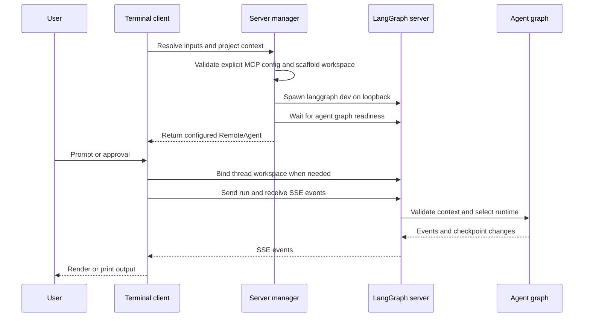
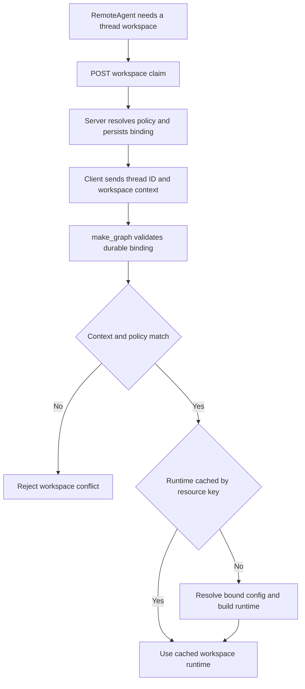

# dcode Product Architecture

`deepagents-code` (`dcode`) is a reference terminal coding-agent product built on the `deepagents` SDK. It packages the SDK harness with terminal UX, durable sessions, tools, skills, and optional sandboxed execution. The product UI is a client of the runtime, not its authority.

There are two deliberately different execution paths:

- **Normal interactive and headless dcode** run a terminal client and an owned local `langgraph dev` server in separate processes. The client owns presentation, input, and approval interaction; the server owns the model, graph, tools, memory, skills, backend, and checkpoints.
- **`dcode --acp`** runs an ACP server over stdio in the launching process. It builds local session graphs and does not start `langgraph dev` or use `RemoteAgent`.

This distinction is architectural rather than cosmetic: a change to normal-server behavior must be assessed independently for ACP.

## Normal client-server assembly

Interactive mode uses the Textual app to render events and collect input. Headless mode runs one task against the same server and `RemoteAgent`, replacing the TUI with stdout streaming. With `--quiet`, diagnostics go to stderr so stdout contains only agent response text. In non-interactive mode, shell access is disabled when no allow-list is provided; a restrictive list gates shell commands while non-shell tools are approved, and `all` permits all tools.

This is the normal local handoff. The server validates workspace context and chooses the runtime; the UI neither constructs nor selects the runtime.

### Startup and configuration handoff

`start_server_and_get_agent` captures project context (or accepts an explicit cwd), validates an explicit MCP file before spawning, resolves `ServerConfig`, and creates a temporary LangGraph workspace. That workspace contains `pyproject.toml`, `langgraph.json`, and a generated checkpointer module. The module reads the application session database path from an environment variable and yields `AsyncSqliteSaver`, rather than embedding that path in generated code.

The generated graph reference is `deepagents_code.server_graph:make_graph`. For this built-in reference, `langgraph.json` also registers dcode's offload HTTP app with custom-route auth enabled. A custom graph reference has no `/offload` route. The ordinary local server binds `127.0.0.1` and uses port `0` by default, rather than taking `langgraph dev`'s conventional port 2024.

The client exports resolved launch settings as `DEEPAGENTS_CODE_SERVER_*` variables. `ServerConfig.to_env()` and `ServerConfig.from_env()` are the shared client/server schema. Configuration precedence takes lower ranks first: managed policy, command-line arguments, retained reload values, process environment, user `config.toml`, then typed defaults. See [configuration layering](/openwiki/concepts/config-layering.md).

The child environment is also a security boundary: startup-sensitive inherited variables, including `PYTHONPATH`, are stripped before the server interpreter starts. The original `PYTHONPATH` is carried separately only for approval-gated shell execution, and the child profile is pinned to the client launch profile.

## Durable workspace selection

`RemoteAgent` is the normal client's narrow transport adapter around LangGraph `RemoteGraph`. The underlying client handles HTTP/SSE parsing, `messages-tuple` negotiation, namespace extraction, and interrupt detection. dcode normalizes thread IDs and converts streamed message dictionaries for the Textual adapter, but leaves state snapshots serialized as supplied by the server.

Before streaming or offloading a thread, `RemoteAgent` obtains a workspace descriptor through `/dcode/threads/{thread_id}/workspace`. The request includes the configured cwd and, when configured together, the workspace policy and its fingerprint. The client caches the server-returned descriptor per thread; `set_workspace` clears that cache when the configured workspace changes. A missing configured workspace is an explicit client error, and invalid workspace or MCP metadata responses are rejected rather than used.

This flow makes durable server validation, rather than UI state, the source of runtime selection.

The server canonicalizes cwd and project-root identity and writes a thread binding atomically to the session SQLite database. A later binding or execution context must match its immutable workspace and configuration fingerprint or the server raises a conflict. The stored resource policy excludes model credentials and system-prompt material.

For an execution context, `make_graph` requires both a nonempty thread ID and workspace context, validates the durable binding, then selects the workspace runtime keyed by its persisted resource key. Without execution context, it uses the launch workspace when configured or a lock-protected process runtime otherwise. Workspace lookup re-resolves configuration and rejects project-policy or server-configuration drift even when a matching runtime is cached.

HTTP thread registration is separate from persisted checkpoints. Therefore `RemoteAgent.aensure_thread` idempotently materializes the live HTTP thread row before state-mutating or offload operations, allowing a thread with SQLite state to continue after a dev-server restart.

### Stream, state, and offload failures

`RemoteAgent.aget_state` returns `None` for a missing thread or for an empty registered thread, but logs and propagates other transport or server failures. `aupdate_state` treats HTTP 409 as a busy-thread race: it cancels pending and running runs, waits with bounded concurrent per-run cancellation, and retries once; a second failure propagates.

Offload is an HTTP operation owned by the same server runtime as the graph. The client validates response shapes and typed results, follows hook interrupts with a stable operation ID, and limits one operation to 32 hook fulfillments. Cancellation waits for a server acknowledgement of `cancelled` or `finished` before propagating cancellation. A missing route is reported as an unsupported dcode `/offload` operation, which is the expected limitation of custom graph references.

## Graph composition and shared resources

`create_cli_agent` is the composition entry point for the resolved model, built-in and MCP tools, optional sandbox, filesystem and approval policy, memory, skills, interpreter settings, subagents, grading context, checkpointing, and workspace credentials/environment. It returns the compiled graph and composite backend; the server derives its offload operation from that backend, so execution and offload share backend ownership.

Criteria and rubric grading receive built-in external-context tools plus only MCP tools whose annotations are explicitly and coherently read-only. Missing, malformed, contradictory, or mutating annotations do not grant that access.

The no-context process runtime is built once behind a lock. This is a correctness property, not only an optimization: it prevents repeated MCP discovery, sandbox construction, and duplicate `atexit` handlers. Workspace runtimes use a shared-lock LRU keyed by the persisted resource key and capped at 32. Construction uses a workspace-specific environment and credential snapshot without mutating server-process environment.

Some resources cannot safely be shared across workspaces. A configured sandbox is process-wide and can be claimed by only one workspace; another is rejected. LangSmith tracing settings are also process-lifetime and must agree across hosted workspaces. Run separate normal server processes when either constraint prevents co-hosting.

## Failure handling and teardown

Runtime construction is a startup barrier. A construction failure is emitted as a `DEEPAGENTS_STARTUP_ERROR:` marker and exits with code 1, so the parent can scrape a useful reason from child logs instead of reporting only a readiness timeout. Request-scoped offload handling contains that `SystemExit` and maps it to a service-unavailable response rather than killing the server mid-request.

The manager stops its owned server if spawn, graph readiness, remote-client setup, or workspace setup fails. The startup cleanup is in `finally`, so cancellation cleans up too. `server_session` also stops its process and emits queued debug-preserved log notices during teardown.

On POSIX, normal-server teardown signals a dedicated process group, waits for descendants, and escalates if needed. On Windows, hard-kill escalation reaches only the root process handle, so a descendant can survive.

Focused tests cover remote message and interrupt conversion, state-conflict recovery, workspace binding and persistence constraints, runtime cache and policy drift, sandbox ownership, and ACP startup. They are guardrails for the boundary behavior above, rather than tests that make the TUI runtime-authoritative.

## ACP stdio lifecycle

`--acp` calls `_run_acp_cli_async` in the launching process. It resolves the initial model and MCP tools, keeps its checkpointer open while serving, and supplies an ACP callback that uses the ACP session model and cwd to build `ProjectContext` and call `create_cli_agent`. These session-local graphs are not normal workspace-runtime-cache entries.

In Auto mode, dcode uses `AgentServerACP`, which wraps local graph streaming to set trusted Auto approval state and prompt metadata. YOLO requires previous acknowledgement. `--auto-classifier-model` is accepted in ACP only when the resolved approval mode is Auto. ACP failures are written to stderr and use a nonzero exit status; they do not use the normal subprocess startup marker. A `finally` block cleans up the ACP MCP session manager.

The ACP smoke test launches `deepagents --acp --no-mcp`, initializes ACP, creates a session for the current cwd, and checks that it received an ID. See [MCP](/openwiki/integrations/mcp.md) and [run a dcode session](/openwiki/workflows/run-dcode-session.md).

## Safe extension and operational changes

Tools, MCP servers, skills, subagents, sandbox providers, hooks and commands, and authorized Python extensions are composition points. In normal-server mode, resource-affecting settings are part of durable workspace policy and fingerprint: a bound thread must not be expected to switch live into a different resource policy. Custom graph references likewise need their own offload strategy.

For lifecycle and operational context, see [runtime behavior](/openwiki/architecture/runtime-behavior.md), [context management](/openwiki/concepts/context-management.md), and [cost and sessions](/openwiki/operations/cost-and-sessions.md).
