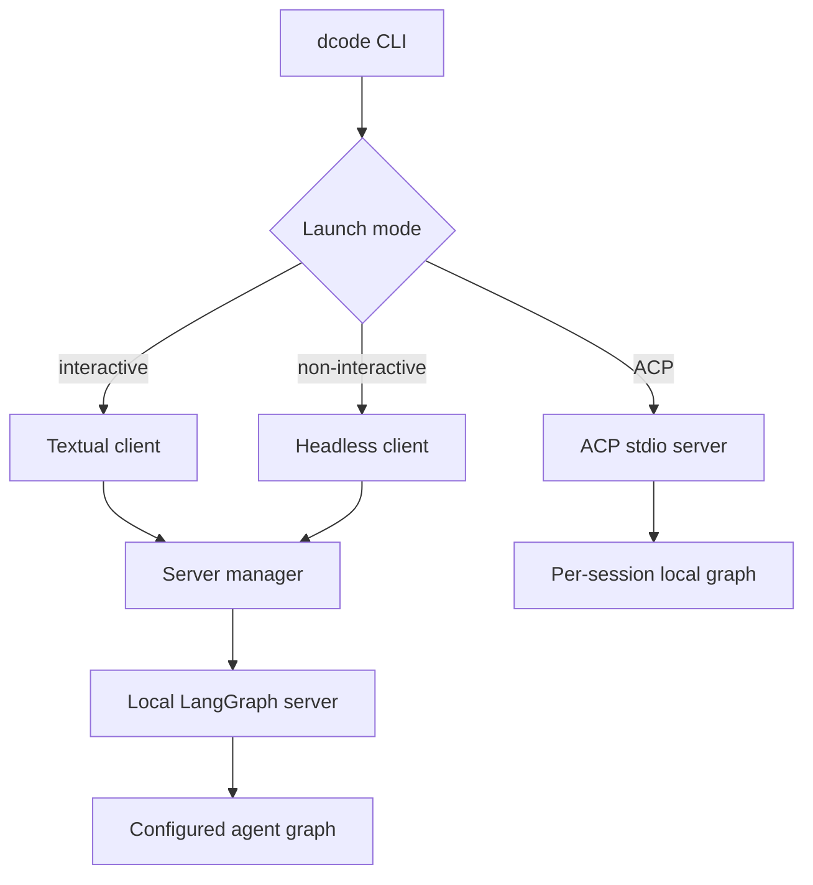

# Deep Agents Code Architecture

`deepagents-code` (`dcode`) is a reference terminal coding-agent product built on the `deepagents` SDK. It packages the SDK harness with terminal presentation, persistence, tools, skills, and optional sandboxed execution.

The primary runtime design is deliberately split: the terminal client owns input, display, local interaction, and lifecycle control, while a local agent server owns graph execution, model/tool assembly, memory, skills, backend resources, and checkpoints. The exception is ACP: `dcode --acp` runs an stdio ACP server in the launching process and constructs local session graphs rather than starting the normal local `langgraph dev` server.

*Normal terminal modes use a local client/server boundary; ACP is an in-process stdio integration path.*

## Entrypoints and mode selection

The package console entrypoint is deliberately lazy: `python -m deepagents_code` reaches `cli_main`, but importing `deepagents_code` does not import the full CLI startup module. Package import does, however, install the in-memory logging tail and configure package logging before child modules produce logs.

`main.cli_main` handles inexpensive version/help and command dispatch first, then parses shared session options and selects one of three session frontends:

- **Interactive (the default):** launches `run_textual_app`. The app can paint immediately while it starts its owned server in a background worker; it also resolves thread resume asynchronously rather than blocking CLI startup.
- **Headless (`-n` / `--non-interactive`):** invokes `run_non_interactive` once and exits. It uses the normal server path but presents stream events and approvals through a console loop. `--quiet` directs operational output to stderr while response text remains on stdout, which makes piping practical.
- **ACP (`--acp`):** bypasses Textual dependency checks and runs `_run_acp_cli_async`. It exposes ACP over stdio, keeps its checkpointer open for the ACP server lifetime, and cleans up the MCP session manager in `finally`.

Administrative subcommands such as configuration, authentication, tools, threads, skills, and doctor are separate command paths rather than alternate agent runtimes. A managed-configuration health gate protects remaining policy-aware commands; diagnostic paths that help repair policy are intentionally available before that gate.

## Normal local server lifecycle

`start_server_and_get_agent` is the normal-mode boundary constructor. It captures or accepts a project context, validates an explicit MCP file before spawning, resolves a `ServerConfig`, exports its serialized `DEEPAGENTS_CODE_SERVER_*` values, and scaffolds a temporary LangGraph project. The scaffold supplies `langgraph.json`, a minimal `pyproject.toml`, and a generated checkpointer module. The latter reads the session database path from an environment variable and yields `AsyncSqliteSaver`, so the generated source does not embed the database location.

The scaffold registers `deepagents_code.server_graph:make_graph`, then `ServerProcess` starts `langgraph dev` on loopback with an ephemeral port. Once the graph named `agent` is ready, the manager returns a `RemoteAgent` configured with the server URL and binds it to the selected workspace and session-workspace fingerprint. If any post-spawn step fails or is cancelled before ownership transfers, the manager stops the server in `finally`; `server_session` provides the corresponding normal-exit cleanup for headless callers.

This division means the client should not recreate server-owned graph resources to render a turn. It sends a thread/config/context to the remote graph, consumes streamed events, and resumes an interrupt with a decision. The server remains authoritative for the executing graph and durable state.

## Client responsibilities

### Textual application

`DeepAgentsApp` is a stateful terminal application, not the agent implementation. It queues and serializes user actions around server connection, active work, thread changes, modal approval, and shutdown. It owns transcript presentation, commands, thread-history hydration, progress/spinner state, model/UI selections, and the interactive approval surface. The startup ordering is significant: resumed history and any model adoption happen before startup commands and automatic initial submission, avoiding a new turn racing ahead of the restored conversation.

The app receives launch parameters such as the initial approval mode, thread intent, server construction kwargs, and hook trust. If it owns deferred server startup, it is also responsible for retaining the successful process and for teardown after the Textual session exits.

### Headless client

`run_non_interactive` creates a new thread, builds a stream configuration, starts the same managed server through `server_session`, and drives `_run_agent_loop` until completion or a bounded failure. It sends `messages`, optional rubric state, and continuation `Command` values for interrupts; it consumes `messages`, `updates`, and `custom` stream modes. It finalizes usage accounting at each round and drains fire-and-forget hooks during teardown so terminal tool lifecycle events are not lost when `asyncio.run` closes.

Headless is autonomous by design, but not equivalent to unrestricted execution. Without a shell allow-list, shell is disabled and non-shell actions are auto-approved. A restrictive list enables shell but validates shell commands while non-shell actions continue automatically; `all` allows unrestricted shell. A turn-budget exhaustion returns 124, Ctrl-C returns 130, and operational errors return 1.

## Agent assembly and product boundaries

`create_cli_agent` is the central graph-composition API and returns both a compiled `Pregel` graph and the `CompositeBackend` it uses. It accepts the resolved model plus tools and MCP tools, sandbox/backend inputs, system-prompt override, persistence objects, project context, model policy, extensions, credentials/environment snapshots, subagents, filesystem limits, rubric and compaction settings, and approval controls. Programmatic callers can use it, but runnable paths should retain model-policy enforcement.

The generated system prompt comes from `system_prompt.md` and is parameterized with model identity, working directory, skills directory, available filesystem guidance, optional web-search guidance, and mode-specific behavior. In particular, a headless-generated prompt tells the model not to wait for clarification and to prefer non-interactive commands. Passing `system_prompt` replaces that generated prompt entirely, so the caller then owns all such guidance.

Assembly establishes several important boundaries:

- The local backend combines working-directory filesystem/shell capability with persistent conversation-history and large-result routes; registered extensions may add routes but are checked against protected routes and runtime host policy.
- User and project declarative subagents, plus a default general-purpose subagent when needed, receive dcode middleware. Filesystem allow-lists are injected into synchronous subagents as well as the main graph so delegation cannot bypass a restriction; async subagents run on their own remote backend.
- The graph has compaction, retry, task-error, hooks, optional memory/skills/interpreter, goal/rubric, and approval middleware. The offload operation is attached to the same composite backend, keeping offload and normal execution coupled to compatible resources.
- Sandbox and interpreter are mutually exclusive at this layer. Classifier-backed Auto is disabled for sandbox graphs rather than becoming an unexamined approval bypass.

## Approval ownership and Auto mode

The graph gates side-effecting or externally accessing tools—such as shell execution, filesystem mutation, web search/fetch, task delegation, and applicable MCP tools—through an interrupt map. `AsyncApprovalHITLMiddleware` reads the current mode from the LangGraph store after the model response and invokes stock HITL routing. It passes the resulting mode through a private, process-local routing marker rather than checkpointed graph state, preventing state supplied by a user or checkpoint from forging an autonomous decision.

Approval mode is per thread. Its store key is a SHA-256 digest of the thread identifier; the context key is validated against that thread before lookup. Missing, malformed, unavailable, or mismatched live state resolves to Manual, so the safety default is to interrupt. Manual, Auto, and YOLO are distinct: YOLO bypasses gated approvals; Auto is eligible only where the classifier middleware was installed.

`AutoModeHITLMiddleware` replaces stock HITL in eligible local TUI and ACP graphs. It first applies deterministic allow rules: read-only MCP tools, routine in-worktree writes, narrowly allowed shell commands, and the trusted compaction tool may be allowed without model review. Other gated calls receive structured classifier review and fall back to ordinary human-in-the-loop handling when a decision cannot safely be made. It also protects its managed temporary-artifact tools from name collisions and from deleting paths not owned by the active request.

Headless mode does not install classifier-backed Auto. Instead its shell policy is selected before server construction, as described above. This distinction matters when changing approval code: an interactive remote graph, headless remote graph, and ACP local graph do not share exactly the same approval driver.

## ACP integration boundary

ACP creates models and MCP tools in-process, loads a shared checkpointer, and passes a `build_agent(context)` callback to the ACP server. The callback selects the ACP session model or the resolved default, takes the session cwd, creates `ProjectContext`, and calls `create_cli_agent`. Therefore ACP session graphs are local graphs created per session, not entries in the normal server's workspace-runtime cache.

In ACP Auto mode, dcode substitutes its `AgentServerACP` adapter. Its `_AutoGraph` writes an Auto approval record for the ACP session, enriches the latest user message with trusted prompt metadata, and supplies a `CLIContextSchema` carrying the key, thread, and turn identity. YOLO requires prior acknowledgement before ACP starts, and `--auto-classifier-model` is rejected unless the resolved ACP mode is Auto.

## Configuration, policy, and operations

Normal server construction resolves configuration in the client process and sends the server-facing subset through `ServerConfig.to_env()` / `from_env()`. This shared schema keeps serialization and variable naming centralized. Project-sensitive inputs—including MCP/extension trust and workspace claims—are captured at startup and supplied to the server rather than inferred from presentation state. See [configuration layering](/openwiki/concepts/config-layering.md) for precedence and reload semantics.

Trust controls are intentionally explicit. Interactive startup can prompt for untrusted project MCP servers, including remote definitions, because both command execution and interpolated remote headers are sensitive. Headless skips untrusted project MCP by default; project hooks and Python extensions require their own explicit trust paths. Filesystem, interpreter host-bridge, model allow-list, sandbox, and shell settings are separate controls—do not treat approval mode as a substitute for any of them.

For operation and behavior detail, see [run a dcode session](/openwiki/workflows/run-dcode-session.md), [runtime behavior](/openwiki/architecture/runtime-behavior.md), and [permissions and human-in-the-loop](/openwiki/concepts/permissions-hitl.md).

## Focused test seams

The highest-value tests exercise ownership and failure boundaries rather than only widget output:

- `test_app.py` covers deferred connection and initial-prompt ordering, resume-before-startup behavior, queue/restart recovery, per-thread state updates, approval interaction, and shutdown ordering.
- `test_auto_mode.py` supplies controlled stores and classifier models to verify deterministic routing, classifier results, malformed/missing live control data, store failures, and temporary-artifact ownership.
- `test_agent.py` verifies the graph-level counterpart: live approval mode fails closed, async routing cannot be forged, tool gating covers subagents, filesystem restrictions propagate, and sandbox/Auto constraints hold.

When modifying this architecture, test the frontend path being changed *and* its graph/approval boundary. In particular, do not infer ACP behavior from a normal `RemoteAgent` test or infer headless shell behavior from the TUI.
