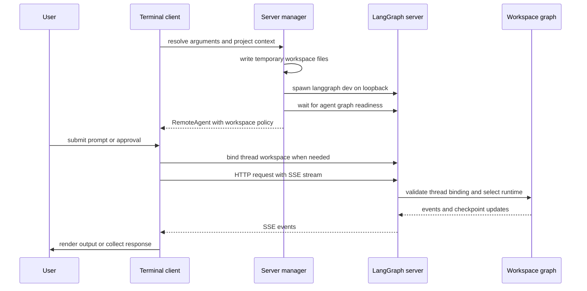
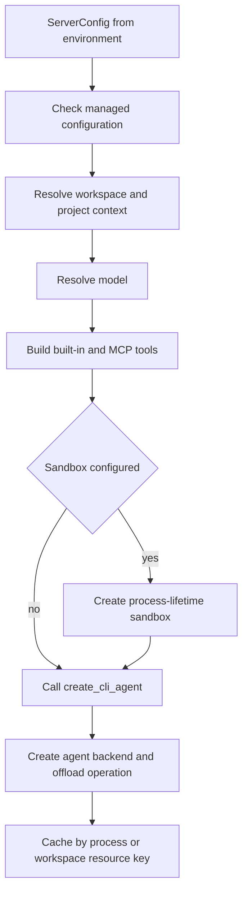

# Deep Agents Code (dcode) Architecture

`deepagents-code` (`dcode`) is a prebuilt terminal coding agent built on the `deepagents` SDK. It packages the SDK harness with a terminal experience, persistence, tools, skills, and optional sandboxed execution as a reference implementation.

Two launch designs are intentionally separate:

- Normal interactive and headless dcode run a loopback `langgraph dev` **server subprocess** and communicate through `RemoteAgent`.
- `dcode --acp` serves ACP over **stdio in the launching process**. It builds local graphs through an ACP callback; it neither starts `langgraph dev` nor uses `RemoteAgent`.

## Normal local runtime

The terminal client and agent server are separate processes. The client owns presentation, input, and approval interaction; the server owns graph execution, model and tool integration, memory and skills middleware, backends, and checkpointed state. Interactive mode uses the Textual client. Headless mode uses the same server and `RemoteAgent` for one task, but streams machine-oriented output to stdout; quiet mode suppresses stream-time tool and file-operation notices.

This shows the normal local client-server request path. A thread is bound before execution, and the server uses that durable binding to select its workspace runtime.

`RemoteAgent` is a thin adapter over LangGraph's `RemoteGraph`: the underlying client handles HTTP/SSE, `messages-tuple` stream-mode negotiation, namespace extraction, and interrupt detection. dcode converts streamed message dictionaries to message objects for the Textual adapter and normalizes thread IDs, while state snapshots remain in server serialization. This provides a useful diagnostic boundary: UI/input failures generally belong to the client, whereas graph construction, model, tool, memory, and server failures belong to the server.

### Launch, workspace, persistence, and teardown

`start_server_and_get_agent` captures the project context (or uses an explicit cwd), preflights an explicit MCP configuration, converts launch arguments to `ServerConfig`, and exports the `DEEPAGENTS_CODE_SERVER_*` environment representation. It creates a temporary server workspace containing `langgraph.json`, `pyproject.toml`, and a generated checkpointer module. The module reads the application session database path from the environment and yields `AsyncSqliteSaver`, avoiding a database path baked into generated source.

The generated configuration registers `agent` as `deepagents_code.server_graph:make_graph`, and registers dcode's offload HTTP application only for that built-in graph reference. The local server defaults to `127.0.0.1` and port `0`, so the OS chooses an ephemeral port rather than occupying the usual `langgraph dev` port 2024. The manager waits for server health and graph readiness, creates `RemoteAgent`, then configures its cwd, non-secret workspace policy, and a fingerprint of the effective server configuration.

A workspace is not merely client metadata. On first use for a thread, `RemoteAgent` posts the cwd and policy to the workspace endpoint. The server canonicalizes an existing absolute directory, derives project root, and atomically persists an immutable thread-to-workspace binding in the sessions SQLite database. A later claim for that thread must match the stored workspace and configuration fingerprint. During execution, `make_graph` requires both a nonempty thread ID and matching runtime workspace context; it rejects missing, malformed, or conflicting bindings rather than selecting a graph from caller-controlled paths.

For a bound execution, the server uses the binding's resource key to build or reuse a runtime configured for its cwd, project root, and persisted resource policy. It checks that the current authoritative environment configuration still matches the bound policy and fingerprint. These workspace runtimes are cached in LRU order up to 32 resource keys, with a per-key lock to prevent duplicate concurrent construction; this is distinct from the fallback process-wide runtime used when LangGraph invokes the factory without execution context.

If startup, readiness, `RemoteAgent` construction, or workspace setup fails before handoff, the manager stops the owned subprocess even on cancellation. `server_session` extends that ownership over a successful session and stops the server in its `finally` block. Process teardown targets the server's dedicated process group where supported, so descendants do not survive a root-only shutdown.

## Graph construction and runtime resources

`ServerConfig.to_env()` and `ServerConfig.from_env()` are the shared subprocess wire schema. The app writes resolved intent once and the server reconstructs it rather than re-parsing terminal arguments. `ServerConfig` validates security-sensitive filesystem policy: an absent `ALLOW_FS_TOOLS` means unrestricted filesystem tools, but a supplied value must be valid JSON for a nonempty set of known tools and include `read_file`; malformed, unknown, empty, and insufficient values fail closed.

This is the inspected server construction flow. Bound requests take the workspace-keyed branch; factory calls without runtime execution context use the process-wide fallback.

Construction checks managed configuration, resolves project settings and model, builds built-in tools, and—unless disabled—discovers MCP and plugin MCP tools. Discovery uses throwaway stateless sessions; the process-wide MCP session manager lazily binds actual sessions on the server event loop when tools run. When configured, a sandbox context remains open for the server process lifetime and receives an `atexit` cleanup handler. `create_cli_agent` is the composition point for the resolved model, tools and MCP metadata, optional sandbox, filesystem policy, approvals, memory, skills, shell/interpreter options, subagents, grading context, and retry settings. It returns both the compiled graph and the composite backend; the server derives the offload operation from that backend so graph execution and offload share the same resources.

Only built-in external context tools and MCP tools with explicit, coherent read-only annotations are admitted to criteria generation and rubric grading. Missing, malformed, or contradictory MCP metadata does not grant that capability.

### Construction failures versus request failures

The unbound process-wide factory is a startup barrier. If managed-policy validation or construction fails, it emits a human-readable error plus `DEEPAGENTS_STARTUP_ERROR:` to stderr, then exits with code 1. The parent monitors output while polling and extracts that marker so the user sees the construction cause rather than only a readiness timeout.

The same process-wide runtime also backs dcode's custom offload route. Because `SystemExit` is appropriate at the startup boundary but not during an already-serving request, request-scope offload handling must catch it and map it to temporary unavailability instead of terminating the server.

Focused tests cover reuse and concurrent first construction of the cached runtime, startup marker/exit behavior, disabled MCP loading, interpreter settings propagation, workspace policy reconstruction, and the fail-closed read-only admission rule. These are the tests to revisit when changing factory cache ownership, security policy, or the graph/offload resource relationship.

## ACP stdio is a separate lifecycle

With `--acp`, `_run_acp_cli_async` runs in the launching process. It resolves an initial model and project context, loads built-in and MCP tools, then opens the dcode checkpointer for the serving lifetime. It supplies `deepagents_acp` an ACP server whose `build_agent(context)` callback creates a local `create_cli_agent` graph. The callback uses the ACP session-selected model when one is supplied, uses the session cwd to derive `ProjectContext`, and shares the open checkpointer. ACP graph construction is thus session-local, not an environment-configured remote graph or a normal-server workspace-runtime cache.

ACP requests session loading and keeps its checkpointer open while serving. Its MCP session manager is cleaned up in a `finally` block. Model/MCP load errors and serving failures go to stderr; ACP does not emit the normal subprocess startup marker for a parent process to scrape.

In ACP Auto mode, dcode uses `AgentServerACP` with an in-memory store. Its wrapper records trusted Auto approval state and inserts prompt metadata before streaming the local graph through `deepagents_acp`. YOLO requires prior acknowledgement, and an Auto classifier model is accepted only when the resolved approval mode is Auto. See [ACP](/openwiki/integrations/acp.md) for host protocol integration.

## Configuration and extension boundaries

The normal server receives a resolved launch snapshot, but configuration precedence still follows the ranked resolver: lower ranks win—managed policy, command-line arguments, retained runtime reload values, process environment, user `config.toml`, then typed manifest defaults. See [configuration layering](/openwiki/concepts/config-layering.md) for scope and reload behavior.

Practical extension boundaries include skills and subagents, built-in and MCP tools, sandbox providers, hooks and commands, and Python extensions for middleware, tools, and virtual storage routes. Changes to normal server construction require a separate ACP review because ACP deliberately owns a different graph lifecycle. For session operations, see [state persistence](/openwiki/concepts/state-persistence.md), [cost and sessions](/openwiki/operations/cost-and-sessions.md), and [run a dcode session](/openwiki/workflows/run-dcode-session.md).
