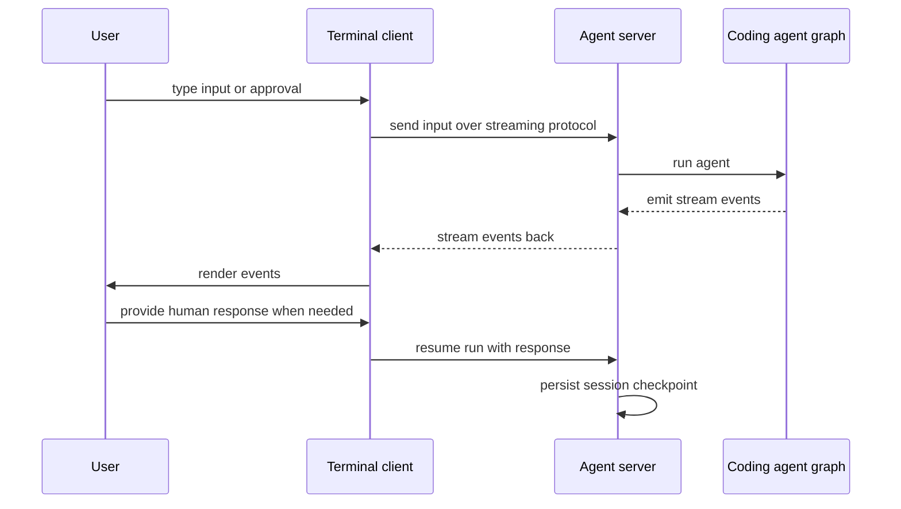

# Deep Agents Code (dcode) Architecture

`deepagents-code` (`dcode`) is a prebuilt terminal coding agent built on top of
the `deepagents` SDK. The SDK supplies the agent harness; this package packages
that harness into a product by combining it with a terminal experience,
persistence, tools, skills, and optional sandboxed execution. It is a reference
implementation rather than the only way to assemble those pieces.

For where these components live in the tree, see
[the source map](/openwiki/architecture/source-map.md). For the full
configuration model, see [config layering](/openwiki/concepts/config-layering.md);
for the tool/filesystem surface see
[tools and filesystem](/openwiki/concepts/tools-filesystem.md); for cost and
session behavior see [cost and sessions](/openwiki/operations/cost-and-sessions.md);
and for an end-to-end walkthrough see
[run a dcode session](/openwiki/workflows/run-dcode-session.md).

## Two runtime halves

Deep Agents Code has two runtime halves that run in separate processes:

- **Terminal client** — owns presentation and input. It renders interactive or
  headless output, collects user input, and collects approvals. In interactive
  mode this is the Textual TUI; in headless mode it is machine-friendly IO.
- **Agent server** — owns the agent runtime. It runs the coding-agent graph and
  connects the model, tools, memory, skills, and backend.

The client spawns a `langgraph dev` server as a subprocess and reaches it over
HTTP with server-sent events; it never binds a typed-in address, and the server
deliberately avoids the well-known `langgraph dev` default port (2024) by picking
a free ephemeral port so users can run their own LangGraph projects alongside
`dcode`. Keeping the boundary narrow keeps the UI responsive while the agent
uses LangGraph's streaming, checkpointing, and resume behavior.

Client and server run as separate processes and communicate over an HTTP plus SSE streaming protocol.

## Request flow

A request follows the same shape in interactive and headless mode:

1. The client receives user input.
2. The client sends that input to the agent server.
3. The server runs the agent graph and streams events back.
4. The client renders those events and collects any needed human response
   (for example, a tool approval or a clarifying answer).
5. Session state is preserved via server-side checkpoints so the conversation
   can be resumed later.

Headless (non-interactive) mode reuses the same agent runtime as the interactive
UI. `run_non_interactive` runs a single user task against the agent graph inside
the same `langgraph dev` server subprocess, connected through the same
`RemoteAgent` client, and swaps the terminal interface for machine-friendly
input and output (streaming to stdout, with an optional quiet mode that leaves
only the agent's response text).

## Client/server contract

The two halves stay in sync through a single shared schema. The client builds a
`ServerConfig`, serializes it to `DEEPAGENTS_CODE_SERVER_*` environment variables
with `ServerConfig.to_env()`, and the server subprocess reconstructs it with the
inverse `ServerConfig.from_env()`. Defining the variable set, serialization
format, and defaults in one dataclass keeps the writer and reader from drifting.

On the server side, the graph is exposed to `langgraph dev` through a generated
`langgraph.json` that references `deepagents_code.server_graph:make_graph`.
`make_graph` delegates to a cached runtime factory that builds the compiled
agent, its composite backend, and the server-owned offload operation exactly
once per process. That cache is load-bearing, not an optimization: MCP
discovery, sandbox creation, and `atexit` cleanup registration must each happen
exactly once, so building per request would re-discover MCP servers, leak
sandbox sessions, and stack duplicate `atexit` handlers.

`create_cli_agent` is the single entry point that assembles the agent from the
resolved model, tools, MCP tools, optional sandbox backend, and the middleware
that provides filesystem, memory, skills, approvals, and other behavior. A
construction failure at startup is converted into a machine-readable
startup-error marker (scraped by the parent app process) before the server
exits, so the client can report why the runtime never came up.

The `RemoteAgent` client is a thin wrapper around LangGraph's `RemoteGraph`. It
delegates SSE parsing, stream-mode negotiation (`messages-tuple`), namespace
extraction, and interrupt detection to `RemoteGraph`, and adds streamed
message-object conversion for the Textual adapter plus thread-ID normalization,
while leaving state snapshots in the server's serialized form.

## Debugging heuristic

The main cost of this design is the client/server boundary. When debugging,
first decide which side owns the failure: presentation and input usually belong
to the **client**; model execution, tools, memory, and graph startup usually
belong to the **server**.

## Layered configuration

Configuration is layered across user, project, session, and runtime scopes, so
teams can share project defaults while individual users keep their own
credentials, preferences, skills, and local settings. The ranked resolver
selects a value by precedence, where lower numeric ranks win: managed policy,
parsed command-line arguments, the process environment, the user `config.toml`,
and finally the typed manifest defaults.

Configuration files are read into a single process-wide generation, built on the
first read and reused after that. Every reader that resolves through the shared
resolver observes that one generation, so they cannot disagree about a setting.
An edit to `config.toml` while the app runs has no effect on those readers until
the generation advances, which happens on an in-app write to the default config
path or on `/reload`; each source keeps its last usable snapshot, so a file that
fails to parse leaves that tier unchanged instead of erasing it. The app does
not watch files, because a partly applied configuration is a worse failure than
a stale one. A few readers deliberately sit outside the shared generation and
take their own file snapshot (for example, the config and doctor diagnostics),
and the environment tier is always live because the process mutates `os.environ`
during dotenv bootstrap and on each cwd switch. Full detail lives in the
[config layering](/openwiki/concepts/config-layering.md) concept page.

## Extension points

The main extension points compose so a project can supply shared defaults and
integrations while each user layers personal configuration on top:

- **Skills and subagents** for reusable agent workflows.
- **Tools and MCP servers** for external capabilities.
- **Sandboxes** for changing where tool execution happens.
- **Hooks and commands** for integrating with local workflows.
