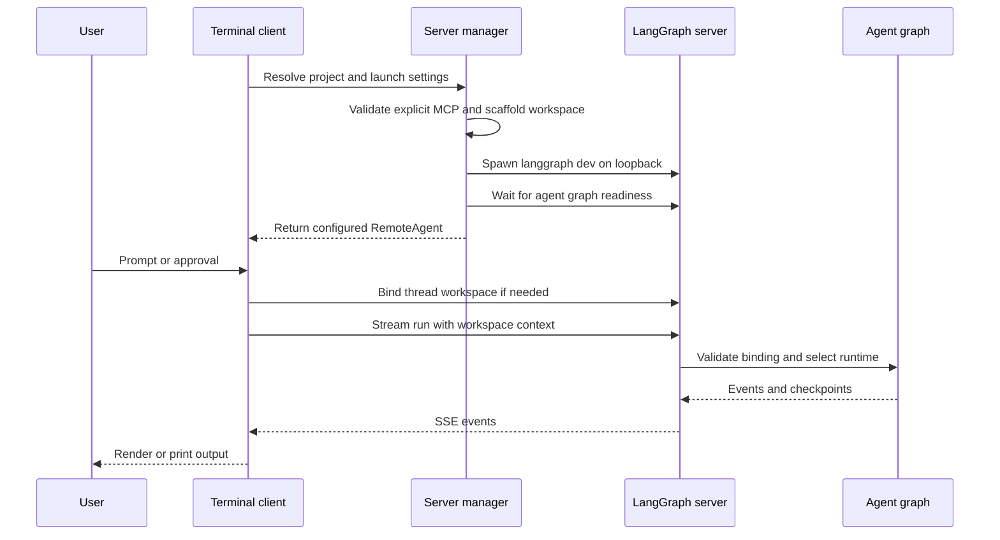
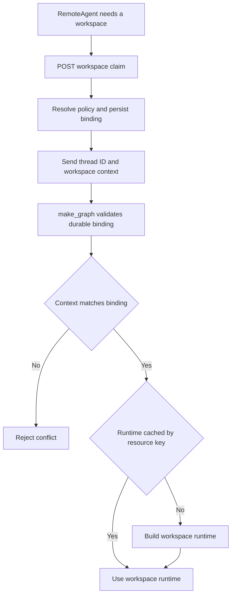

# Deep Agents Code Architecture

`deepagents-code` (`dcode`) is a reference terminal coding-agent product built on the `deepagents` SDK. It packages the SDK harness with a terminal experience, persistence, tools, skills, and optional sandboxed execution.

There are two intentionally separate execution models:

- **Normal interactive and headless dcode** use a terminal client and an owned local `langgraph dev` server in different processes. The client owns presentation, input, and approvals; the server owns the graph, model, tools, memory, skills, backend, and checkpoints.
- **`dcode --acp`** is an in-process ACP server over stdio. It builds local graphs per ACP session; it neither starts `langgraph dev` nor uses `RemoteAgent`.

This is an ownership boundary, not merely a transport substitution. Changes to the normal server lifecycle or workspace protocol do not automatically apply to ACP.

## Normal local client/server path

Interactive mode renders and accepts input in the terminal application. Headless mode uses the same server runtime and `RemoteAgent`, but runs one task with machine-oriented stdout streaming; quiet output leaves the agent response text. The normal local server listens on loopback and uses an OS-selected ephemeral port rather than `langgraph dev`'s default port 2024.

This sequence covers the normal local path only. ACP is deliberately outside this client/server sequence.

### Launch handoff and server setup

`start_server_and_get_agent` captures the project context, validates an explicit MCP configuration before spawning, resolves launch configuration, scaffolds a temporary LangGraph workspace, waits for the `agent` graph, and configures the returned `RemoteAgent` with a workspace policy. If startup or readiness fails, it stops the owned server.

The scaffolded `langgraph.json` points `agent` at `deepagents_code.server_graph:make_graph`. A generated checkpointer module obtains the application session-database path from a `DEEPAGENTS_CODE_SERVER_*` environment variable and yields `AsyncSqliteSaver`; the generated source does not contain the database path. The built-in graph reference additionally registers dcode's offload HTTP app with custom-route authentication enabled. A custom graph reference has no `/offload` route.

The app passes resolved configuration to the child in `DEEPAGENTS_CODE_SERVER_*` variables. `ServerConfig.to_env()` writes this schema and `ServerConfig.from_env()` reconstructs it in the server, keeping serialization and defaults centralized. In the resolver, lower ranks win: managed policy, CLI arguments, retained reload values, process environment, user `config.toml`, then typed defaults. See [configuration layering](/openwiki/concepts/config-layering.md).

The child environment is also a startup-security boundary. The launcher removes inherited startup-sensitive variables, including `PYTHONPATH`. It carries the original `PYTHONPATH` separately only for approval-gated shell execution and pins the child to the client launch profile.

## Remote boundary, session binding, and persistence

`RemoteAgent` is a thin dcode wrapper around LangGraph `RemoteGraph`. `RemoteGraph` performs HTTP and SSE handling, `messages-tuple` stream-mode negotiation, namespace extraction, and interrupt detection. dcode converts streamed message dictionaries for the Textual adapter and normalizes thread IDs, while state snapshots retain the server serialization. On an HTTP 409 during a state update, it cancels pending and running runs and retries the update once.

Before using a thread, the client configures a cwd, non-secret workspace policy, and policy fingerprint. On first use it posts a workspace claim to the server and caches the validated descriptor. It also registers the HTTP thread record separately: persisted SQLite checkpoints can outlive the dev server's live thread row.

This flow shows that the server, not the client cache, authoritatively chooses the workspace runtime.

The server canonicalizes cwd and project-root identity and atomically stores a thread binding in the session SQLite database. Subsequent binds and execution contexts must match its immutable workspace and configuration fingerprint or receive a conflict. The persisted policy excludes model credentials and system-prompt material. With execution context, `make_graph` requires a nonempty thread ID and workspace context, validates that durable binding, and chooses the corresponding workspace runtime. Without execution context it returns the configured launch-workspace runtime or the cached process runtime.

See [state persistence](/openwiki/concepts/state-persistence.md) for the durable-session model.

## Graph composition and resource ownership

`create_cli_agent` composes the resolved model, built-in and MCP tools, sandbox, filesystem and approval policy, memory, skills, interpreter configuration, subagents, and grading context. It returns the compiled graph and composite backend; the server derives the offload operation from that backend. Criteria and rubric grading get built-in external-context tools plus only MCP tools that are explicitly and coherently annotated read-only, failing closed for missing, malformed, contradictory, or mutating annotations.

The normal server caches process-owned resources under a lock. This prevents duplicate MCP discovery, sandbox creation, and `atexit` registration. Context-free construction yields one process runtime. Workspace executions use a shared-lock LRU keyed by the persisted resource key and limited to 32 entries. Construction uses a workspace-specific environment and credential snapshot rather than mutating the server process environment.

Two process-lifetime constraints matter operationally:

- A configured sandbox can be claimed by only one workspace. A second workspace is rejected instead of sharing that sandbox.
- LangSmith tracing settings must agree across hosted workspaces; differing settings are rejected. Start a separate normal server when either constraint prevents co-hosting.

Tools, MCP servers, skills, subagents, sandbox providers, and authorized extensions are the principal composition points. Resource-affecting normal-server configuration belongs to the bound workspace policy and cannot be silently changed for an existing thread. See [MCP](/openwiki/integrations/mcp.md).

## Failure handling and cleanup

Server runtime construction is a startup barrier: a failure produces a machine-readable `DEEPAGENTS_STARTUP_ERROR:` marker before exit code 1, which the parent extracts from child output. Startup cleanup is cancellation-safe and stops an owned server if it was not successfully handed to the caller. `server_session` stops the server at teardown and emits queued notices for debug-preserved logs.

On POSIX the launcher creates a dedicated process group. Teardown signals and waits for the group, including descendants, before escalating to `SIGKILL`. On Windows, hard-kill escalation can reach only the root process handle, so a surviving descendant can be orphaned.

Focused tests cover remote state-update conflict recovery and ACP protocol startup. These are useful boundary checks when modifying streaming, cancellation, or the independent ACP path.

## ACP stdio mode

`--acp` enters `_run_acp_cli_async` in the launching process. It resolves models and MCP tools, opens the checkpointer for the serving lifetime, and supplies an ACP `build_agent(context)` callback. The callback selects the ACP session model or default model, uses the ACP session cwd to create `ProjectContext`, and calls `create_cli_agent` with the shared checkpointer. These session-local graphs are separate from normal workspace-runtime caching.

In ACP Auto mode, dcode substitutes its `AgentServerACP` adapter. The adapter wraps local graph streaming to set trusted Auto approval state and add prompt metadata. YOLO requires an earlier acknowledgement, and `--auto-classifier-model` is valid in ACP only when the resolved approval mode is Auto. ACP failures are reported on stderr rather than through the normal subprocess startup marker, and its MCP session manager is cleaned up in a `finally` block.

The ACP smoke test launches `deepagents --acp --no-mcp`, initializes ACP, creates a session using the current cwd, and verifies the session ID. See [ACP](/openwiki/integrations/acp.md) and [run a dcode session](/openwiki/workflows/run-dcode-session.md).
