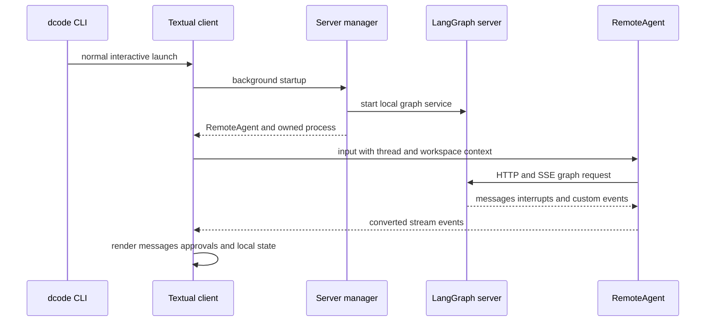
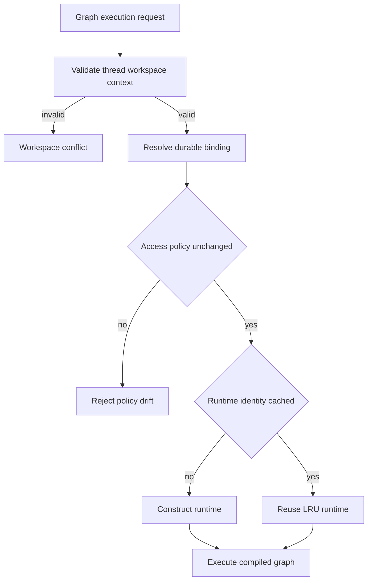
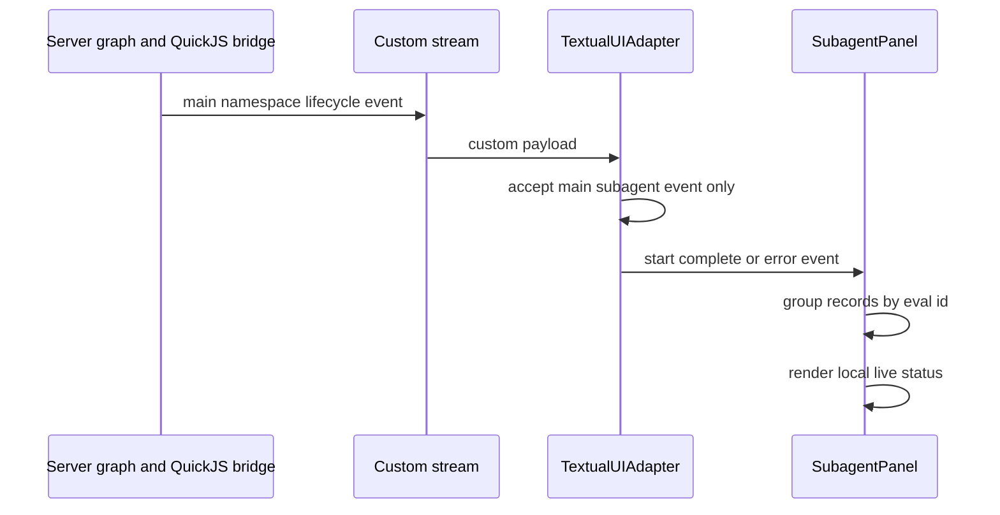
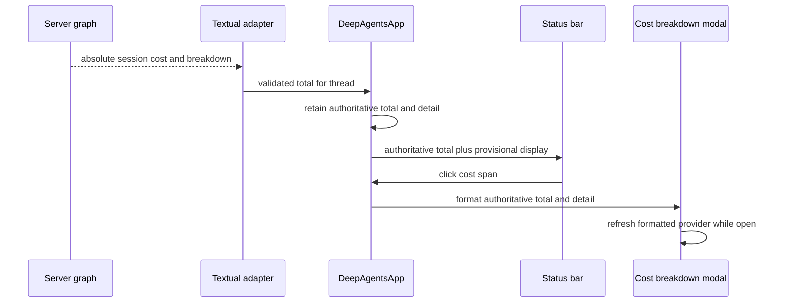

# dcode Client and Agent Server

`deepagents-code` (`dcode`) is a reference terminal coding-agent product: it packages the `deepagents` SDK harness with a terminal experience, persistence, tools, skills, and optional sandboxed execution. In ordinary operation it has two processes. The **Textual client** owns input, approvals, presentation, and ephemeral display state; the **managed local server** owns graph execution, models, tools, memory, skills, backend, checkpoints, workspace policy, and durable thread accounting. ACP is intentionally different: it constructs a graph in-process per ACP session rather than becoming another managed-server client.

```mermaid
sequenceDiagram
    participant CLI as dcode CLI
    participant TUI as Textual client
    participant Launch as Server manager
    participant Server as LangGraph server
    participant Remote as RemoteAgent
    CLI->>TUI: normal interactive launch
    TUI->>Launch: background startup
    Launch->>Server: start local graph service
    Launch-->>TUI: RemoteAgent and owned process
    TUI->>Remote: input with thread and workspace context
    Remote->>Server: HTTP and SSE graph request
    Server-->>Remote: messages interrupts and custom events
    Remote-->>TUI: converted stream events
    TUI->>TUI: render messages approvals and local state
```

*The server executes and persists the graph; the client consumes observations and renders them.*

## Entrypoints and process boundary

`python -m deepagents_code` obtains the package's lazy `cli_main` attribute, deferring import of `main.py` and CLI startup machinery until it is actually needed. Normal interactive and headless launches call `start_server_and_get_agent`: it resolves and exports `ServerConfig`, scaffolds a temporary LangGraph project with a SQLite checkpointer module, starts `langgraph dev`, waits for the `agent` graph, and returns a workspace-bound `RemoteAgent`. Failed or cancelled startup stops the owned server before handoff.

The Textual runner can instead receive raw server construction parameters and begin startup in a background worker. It remains responsive while connection and resume work completes; resume resolution is asynchronous. `RemoteAgent` wraps LangGraph `RemoteGraph` for HTTP and SSE, attaches its cached per-thread workspace descriptor to each stream context, translates serialized messages and interrupts, and deliberately keeps graph-state reads separate from session-cost reconciliation.

ACP bypasses this boundary by design. It creates a graph per session from that session's model and cwd with `create_cli_agent`, not the remote server's workspace cache. Its Auto adapter writes trusted approval state and prompt metadata to its store before graph streaming.

## Server ownership: workspace identity and graph composition

The server is authoritative for execution identity. Each request is validated against a durable per-thread workspace binding. If the complete runtime identity changes, the server selects or builds the appropriate runtime; if access policy drifts, it rejects the request instead of silently gaining or losing privileges. The runtime cache is LRU-bounded, and a configured sandbox is reserved for one workspace per server process.

```mermaid
flowchart TD
    Request["Graph execution request"] --> Check["Validate thread workspace context"]
    Check -->|"invalid"| Reject["Workspace conflict"]
    Check -->|"valid"| Bound["Resolve durable binding"]
    Bound --> Policy{"Access policy unchanged"}
    Policy -->|"no"| Conflict["Reject policy drift"]
    Policy -->|"yes"| Cached{"Runtime identity cached"}
    Cached -->|"yes"| Reuse["Reuse LRU runtime"]
    Cached -->|"no"| Build["Construct runtime"]
    Build --> Run["Execute compiled graph"]
    Reuse --> Run
```

*Workspace validation and runtime selection occur on the server; a client event cannot alter either.*

For a workspace outside the launch project, `ServerConfig.resolve_workspace` removes the launch project's MCP configuration, sandbox setup, and extension paths, then resolves extension trust for the target project. Workspace diagnostics intentionally persist and compare only a bounded allowlist of policy fields; they exclude paths, model specifications and parameters, prompts, environment values, and credentials.

`create_cli_agent` is the common server/ACP graph-construction seam. It returns a compiled graph and `CompositeBackend`, composing model, persistence, tools, memory, skills, backend, approvals, hooks, compaction, subagents, and extensions. Its explicit filesystem-tool allowlist is propagated to synchronous subagents, preventing delegation from bypassing that policy. Construction enforces the model allow policy for executable main, Auto-classifier, rubric, and subagent models; recognized providers have SDK retries disabled so dcode owns retry behavior, and a subagent lacking credentials is deferred rather than aborting startup.

The server creates built-in tools, optionally adds web search, and loads MCP tools with project context and trust. Discovery uses throwaway MCP sessions; the process-wide manager opens real sessions lazily when tools are invoked. Only explicitly read-only MCP tools enter criteria/grading context. `mcp.tool_timeout` resolves managed configuration, environment, user TOML, then its 120-second default. It accepts finite values from 1 through 900 seconds, falling through an invalid higher-precedence value. With MCP tools present, deadline middleware runs inside the server-hooks wrapper: it normalizes optional empty-string arguments, returns a named timeout tool message warning that remote work may continue and retry can duplicate it, preserves tool exceptions and cancellation, and translates recognized re-authentication failures.

Hooks are another server integration boundary, not a Textual rendering protocol. Their invocations are strict typed domain events; projection validates each event-specific wire payload, JSON-projects post-tool results, maps approval and optional effort/agent identity, requires an agent transcript for `SubagentStop`, and rejects unsupported events or notification types.

## Server readiness refreshes client presentation

The status bar is mounted and initially populated from `runtime_state` at client mount time, before deferred server startup can finish. A successful `ServerReady` installs the new agent and process, clears connection failure state, refreshes MCP client state, and then calls `_sync_status_model`. This second model sync matters after a failed startup followed by a provider/model retry: applying the new runtime configuration alone would leave the once-mounted status widget stale.

If the status bar is unexpectedly absent, the handler logs a warning. If provider or model identity is missing, model sync logs a warning and writes empty provider, model, and effort fields, clearing stale identity rather than pairing a blank model with an old effort suffix. The `StatusBar` itself remains a display component: it renders a width-aware, clickable model/effort label, context and cache metrics, connection/busy indications, and a clickable cost span; it does not resolve the model or perform server work.

## Configuration and prompt construction

dcode normally resolves configuration through one process-wide generation so readers share a coherent managed/user-file snapshot, while environment resolution remains live. A user-file edit takes effect through an in-app default-config write or `/reload`, rather than file watching. A failed user TOML parse preserves the prior usable generation. Diagnostic and explicitly supplied-table callers may intentionally use an ad-hoc resolver or fresh parse; they must report the generation they actually inspected.

`system_prompt.md` supplies base guidance rather than the complete first message. Without an override, `create_cli_agent` generates a prompt using model identity, working directory and execution mode, skills, and interactive/headless guidance. An explicit `system_prompt` replaces that generated prompt and its dynamic context rather than appending to it. Smoke coverage composes a real CLI agent with a fake model, fixes and redacts machine-specific inputs, snapshots the first `SystemMessage` for interactive and headless modes, and separately protects memory and safety guidance while ensuring headless mode excludes unreachable interactive-question guidance.

## Stream observations and local UI state

QuickJS `js_eval` fan-out is visible through a custom stream because its `task()` calls occur within one tool call rather than the ordinary message stream. `TextualUIAdapter` forwards only dictionary payloads with `type == "subagent"` from the main-agent namespace; nested namespaces, unrelated events, and malformed data do not reach `SubagentPanel`.

```mermaid
sequenceDiagram
    participant Server as Server graph and QuickJS bridge
    participant Stream as Custom stream
    participant Adapter as TextualUIAdapter
    participant Panel as SubagentPanel
    Server->>Stream: main namespace lifecycle event
    Stream->>Adapter: custom payload
    Adapter->>Adapter: accept main subagent event only
    Adapter->>Panel: start complete or error event
    Panel->>Panel: group records by eval id
    Panel->>Panel: render local live status
```

*The panel displays server execution already under way. It owns neither graph dispatch nor checkpoints or persistence.*

`SubagentPanel` keeps local phase, row, and timing state grouped by eval id. It supports user phase selection and collapse and clears or cancels local rows on a new or interrupted turn. LLM/JavaScript-authored labels and errors are untrusted display data: the widget strips control, escape, and bidi characters, bounds/flattens labels, and renders plain or styled Textual content rather than markup.

## Cost: authoritative accounting, provisional display, and breakdown detail

There are three related but distinct client concepts:

1. **Checkpointed/streamed accounting** is server-owned. The graph persists the cumulative thread total and its versioned `CostBreakdown` in private graph state, and streams the new absolute total after charged steps because that channel is not delivered through the state stream.
2. **Live footer state** is client presentation. The client accepts server totals only for the active thread, records the authoritative `_session_cost_usd` and optional structured breakdown, and may add request-keyed provisional stream estimates until an authoritative graph total settles them. The status bar displays this combined live amount.
3. **Entire-thread breakdown detail** is a client formatting and modal path over the last authoritative structured breakdown. It deliberately uses `_session_cost_usd`, not the footer's provisional combined amount, so a still-unsettled live estimate cannot be represented as durable historical allocation.

The checkpoint structure is versioned and additive. It contains request and priced-request counts, input/output/cache/reasoning tokens and costs, completeness flags, and `historical_complete`. Side-question cost is persisted separately; session reconciliation retains graph and side subtotals independently, merges their breakdowns for presentation when available, and marks a snapshot cached when graph state has not settled. This preserves provisional main-task spend without allowing delayed inputs to erase prior spend.

```mermaid
sequenceDiagram
    participant Graph as Server graph
    participant Adapter as Textual adapter
    participant App as DeepAgentsApp
    participant Footer as Status bar
    participant Modal as Cost breakdown modal
    Graph-->>Adapter: absolute session cost and breakdown
    Adapter->>App: validated total for thread
    App->>App: retain authoritative total and detail
    App->>Footer: authoritative total plus provisional display
    Footer->>App: click cost span
    App->>Modal: format authoritative total and detail
    Modal->>Modal: refresh formatted provider while open
```

*The footer may lead with provisional display cost; the detailed table intentionally remains tied to authoritative entire-thread data.*

`format_cost_breakdown_table` returns no table unless it receives a mapping with version `1` and `historical_complete is True`. It produces a copyable plain-text table for inclusive Input and Output parent rows and their cache-creation, cache-read, and reasoning subsets. It renders unavailable or partial fields explicitly, uses `n/a` when total cost is zero, warns when some requests were unpriceable, and identifies any directionless/unattributed remainder instead of forcing it into a category.

The footer's `MetricsLine` makes only the rendered cost span clickable; a left single-click dispatches `app.open_cost_breakdown`. `open_cost_breakdown` refuses to stack duplicate breakdown modals and notifies when no complete detail exists. `CostBreakdownScreen` renders sanitized plain text, refreshes its provider every 0.5 seconds while open, supports `c` to copy the latest rendered text, and closes on Escape. The same provider is supplied to the read-only Debug Console, so the modal is a reusable UI view rather than an accounting owner.

An authoritative server total supersedes provisional display contribution unless the refresh is only separately settled side-question spend. Totals naming an inactive thread are discarded. A positive session-cost threshold is evaluated only on an authoritative total strictly above the threshold and opens its warning once per thread; the acknowledgement modal is UI-only and neither changes session state nor cancels active work.

## Focused tests and safe changes

Boundary tests are intentionally layered:

- `test_app.py` covers deferred startup, resume ordering, recovery, approvals, teardown, server-ready status-bar/model refresh behavior, cost-thread filtering, provisional-versus-authoritative replacement, and footer opening/updating of the breakdown modal.
- `tui/widgets/test_status.py` covers status-bar rendering, connection/busy states, model/effort and cost click targeting, and narrow-display behavior. `test_debug_console.py` verifies the reusable breakdown view refreshes and copies current text, while incomplete history hides detail but retains the total.
- `test_remote_client.py`, `test_server_graph.py`, and agent/configuration/MCP/hook tests protect server construction, workspace boundaries, payload conversion, trace forwarding, and independent state/cost behavior.
- `test_subagent_stream.py` and `test_subagent_panel.py` protect custom-stream filtering, lifecycle rendering, and sanitization. System-prompt smoke tests protect composed interactive/headless prompts.

When changing this area, retain the ownership split. Server construction, workspace policy, task lifecycle, checkpoints, and durable accounting remain server-side. The adapter, app, and widgets filter, reconcile for display, sanitize, and render observations. In particular, do not make a footer value authoritative, do not use provisional cost as historical breakdown detail, and do not assume a UI refresh mutates the server's configured model or workspace binding. See [Source map](/openwiki/architecture/source-map.md), [Cost and sessions](/openwiki/operations/cost-and-sessions.md), [Testing guide](/openwiki/testing/testing-guide.md), and [Run a dcode session](/openwiki/workflows/run-dcode-session.md).
