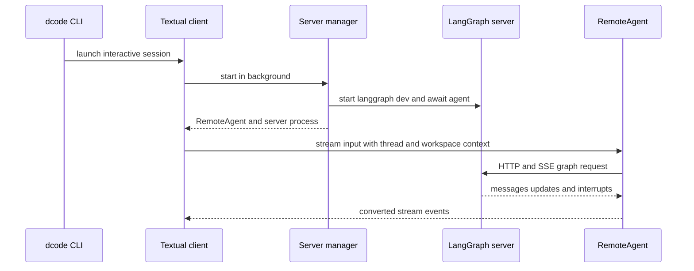
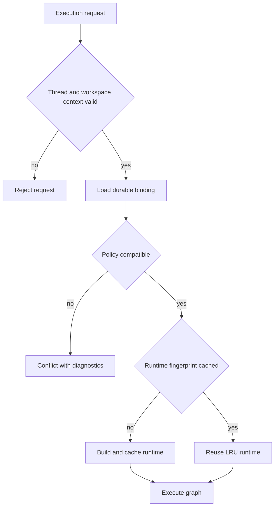

# dcode Client and Agent Server

`deepagents-code` (`dcode`) is a reference terminal coding-agent product built on the `deepagents` SDK. It combines the SDK harness with a terminal experience, persistence, tools, skills, and optional sandboxed execution.

The usual runtime deliberately has two processes. The terminal client owns presentation, input, approvals, and the lifetime of the local server process. The LangGraph server owns graph execution and the resources behind it: model, tools, memory, skills, backend, checkpointing, and workspace-specific policy. ACP is a separate, in-process stdio mode rather than a client of this local server.

```mermaid
sequenceDiagram
    participant CLI as dcode CLI
    participant TUI as Textual client
    participant Launch as Server manager
    participant Server as LangGraph server
    participant Remote as RemoteAgent
    CLI->>TUI: launch interactive session
    TUI->>Launch: start in background
    Launch->>Server: start langgraph dev and await agent
    Launch-->>TUI: RemoteAgent and server process
    TUI->>Remote: stream input with thread and workspace context
    Remote->>Server: HTTP and SSE graph request
    Server-->>Remote: messages updates and interrupts
    Remote-->>TUI: converted stream events
```

*Normal interactive sessions start a local server, then exchange graph input and streamed results through `RemoteAgent`.*

## Entrypoints and frontend modes

`python -m deepagents_code` obtains the package's lazy `cli_main` attribute. This postpones importing `main.py` and its argument parsing and startup machinery until the command actually runs.

The normal interactive path enters `run_textual_cli_async`. It derives a displayable model specification without eagerly constructing the model, packages launch settings into `server_kwargs`, and gives them to `run_textual_app`. `run_textual_app` can paint and show connection status before it owns an agent: when it receives `server_kwargs` with no agent, its background worker calls `start_server_and_get_agent`. It also accepts raw resume intent, resolving a requested or most-recent thread asynchronously. If the app fails after a resume or thread switch, `TextualAppError` carries the app's final thread ID so outer teardown can describe the actual session.

Headless operation uses the same managed-server architecture, but it is not simply the TUI without rendering. Its shell policy is specific to automation: no shell allow-list disables shell, a restrictive list gates shell commands, and `all` permits unrestricted shell while other tools are auto-approved. See [Run a dcode session](/openwiki/workflows/run-dcode-session.md) for user-facing invocation flow.

ACP is the intentional exception. The CLI runs an ACP stdio server in its own process; its session builder receives the ACP session's model and cwd, creates a `ProjectContext`, and builds a graph directly with `create_cli_agent`. It therefore does not use the normal server's workspace-runtime cache. In Auto mode, the ACP wrapper writes trusted Auto state and prompt metadata into its store before streaming the graph.

## Launch, handoff, and transport

`start_server_and_get_agent` is the normal ownership boundary for a local session:

1. It captures or accepts a project context, preflights explicit MCP configuration, and derives `ServerConfig` from CLI inputs.
2. It exports that configuration for the child, scaffolds a temporary LangGraph project (including a SQLite checkpointer module), and starts `langgraph dev` on loopback with an ephemeral port.
3. It waits for the `agent` graph to become ready, creates a `RemoteAgent`, and assigns the launch cwd plus the client-claimable workspace policy and fingerprint.
4. If startup fails or is cancelled before handoff, it stops the server. Long-lived headless callers use `server_session`, whose `finally` block also stops an acquired process.

`RemoteAgent` wraps LangGraph's `RemoteGraph`. The underlying client handles HTTP, SSE, stream-mode negotiation, namespaces, and interrupts; dcode adds its application contract. Each streamed request requires `config.configurable.thread_id`, adds the per-thread workspace claim to the server context, converts serialized message dictionaries into LangChain message objects, converts interrupt dictionaries on updates, and forwards other events. Graph state is retrieved separately, and session-cost display merges graph-owned checkpoints with separately fetched side-operation accounting. A missing thread or an empty thread checkpoint is represented as no state, whereas other state-fetch failures are re-raised.

This division prevents a presentation client from deciding server resource identity. The client can claim the workspace that was established for its thread, but the server is authoritative for binding validation and for construction of the graph that will execute.

## Durable workspace bindings and runtime cache

A workspace binding is durable per thread. Binding stores canonical workspace identity and resource-policy fingerprints; request validation checks that a workspace context exists, matches the stored binding exactly, uses the expected configuration fingerprint when supplied, and still resolves to the same workspace identity. An unbound thread, malformed context, fingerprint mismatch, unsupported binding schema, or changed identity is a `WorkspaceConflictError`, not an opportunity to silently attach the thread elsewhere.

When the LangGraph execution runtime calls `make_graph`, it requires both the thread ID and workspace context, resolves the durable binding, and then selects that workspace's server runtime. This is distinct from the process-wide fallback graph used when there is no execution runtime.

```mermaid
flowchart TD
    Request["Execution request"] --> Context{"Thread and workspace context valid"}
    Context -->|"no"| Reject["Reject request"]
    Context -->|"yes"| Binding["Load durable binding"]
    Binding --> Policy{"Policy compatible"}
    Policy -->|"no"| Conflict["Conflict with diagnostics"]
    Policy -->|"yes"| Runtime{"Runtime fingerprint cached"}
    Runtime -->|"yes"| Reuse["Reuse LRU runtime"]
    Runtime -->|"no"| Build["Build and cache runtime"]
    Build --> Graph["Execute graph"]
    Reuse --> Graph
```

*Workspace validation protects durable thread identity before cache lookup; a compatible runtime is reused or rebuilt from current runtime identity.*

### Runtime-only changes versus policy drift

The runtime cache key includes both workspace identity and the full current runtime fingerprint. It is LRU-bounded to 32 entries. Consequently, a change to model, model parameters, prompt, or another runtime-only field can build a new runtime while retaining the durable binding and its graph checkpoints/history. Concurrent cache misses are serialized before construction.

Access policy is deliberately different. On every request, the server re-resolves configuration for the bound workspace and rejects changes to project or durable access policy rather than rebuilding under altered privileges. This includes trust, tools, sandbox, and approval-related policy. A previously trusted project extension that disappears also fails closed: the server will not quietly rebuild a thread without the extension trust it was bound with. A configured sandbox is a process-wide resource; once one workspace claims it, another workspace cannot use that server process's sandbox.

This distinction is the safe-change rule: change a model or prompt to obtain a fresh runtime; re-bind or start an appropriate session when resource-access policy changes. For configuration precedence, see [Configuration layering](/openwiki/concepts/config-layering.md); for approval semantics, see [Permissions and HITL](/openwiki/concepts/permissions-hitl.md).

For a workspace outside the launch project, `ServerConfig.resolve_workspace` does not carry forward launch-project privileges. It drops MCP configuration, sandbox setup, and extension paths, and re-resolves extension trust for the target project. This prevents one checkout's launch-time integrations from becoming another checkout's effective policy.

### Conflict diagnostics without secret disclosure

The server attaches structured workspace diagnostics to conflicts, and `RemoteAgent` can parse the additive diagnostics payload from an HTTP 409 for the TUI. Diagnostics are intentionally not a dump of the effective configuration. The durable comparison snapshot has a bounded allowlist of simple policy values; paths, model specifications and parameters, prompts, environment values, and credentials are not persisted, logged, or hashed for reporting. Thus the interface can identify policy drift without creating a configuration or secret-exfiltration channel.

## Graph construction and operational boundaries

On a cache miss, the server resolves configuration for the authoritative workspace and builds the graph. It constructs built-in tools, adds a workspace-bound web-search tool when a Tavily key exists, discovers permitted MCP configuration, and calls `create_cli_agent`. MCP discovery uses throwaway sessions; real MCP sessions are managed lazily for invocation. Only clearly read-only MCP tools can enter criteria/grading context.

The composition function `create_cli_agent` returns the compiled graph and its `CompositeBackend`, assembling the agent's prompt, tool stack, filesystem policy, persistence, subagents, extensions, compaction, retries, hooks, and applicable approval middleware. This page focuses on the boundary that chooses and caches that composition; see [State persistence](/openwiki/concepts/state-persistence.md) for checkpoint behavior and [Security](/openwiki/operations/security.md) for trust and execution controls.

## Focused tests and safe change points

The most valuable tests exercise contracts at the boundary rather than terminal rendering alone:

- `test_remote_client.py` checks forwarding of trace metadata, conversion of streamed messages and interrupts, the distinction between state and cost accounting, and graceful handling of unavailable side accounting.
- `test_server_graph.py` checks one-time graph construction, concurrent runtime construction, startup-error signaling, workspace-bound web search, and the fail-closed criteria-tool allowlist for MCP annotations.
- Workspace tests cover the durable binding mismatch and identity failures; server-graph tests cover runtime caching, runtime-only rebuilds, policy drift, sandbox ownership, and diagnostics.
- Textual tests cover deferred startup, asynchronous resume ordering, recovery, approval interaction, and teardown.

When modifying launch behavior, preserve process ownership: a failed startup must reap the process before handoff, while a successful handoff has exactly one outer cleanup owner. When changing configuration, classify every field first: if it changes execution resources or privileges it belongs in policy-drift validation; if it only changes graph construction it must participate in runtime identity so a new graph is selected without breaking thread continuity.
