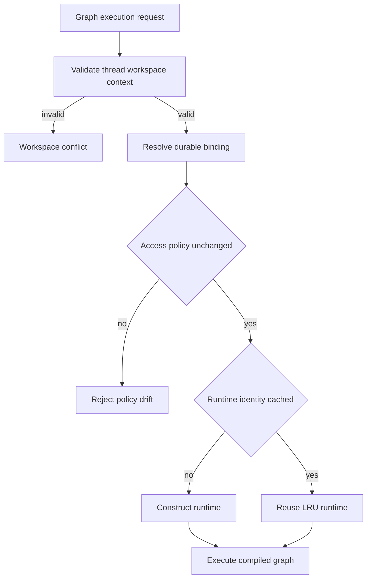
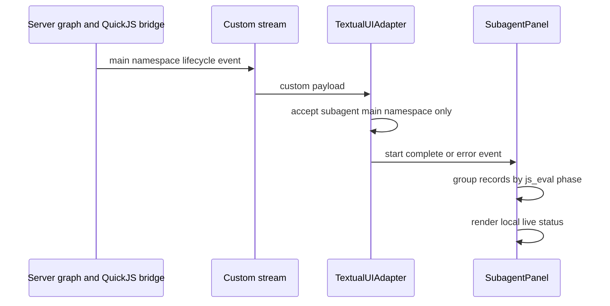

# dcode Client and Agent Server

`deepagents-code` (`dcode`) is a reference terminal coding-agent product: it packages the `deepagents` SDK harness with a terminal experience, persistence, tools, skills, and optional sandboxed execution. In ordinary operation it has two separate processes: the **Textual client** owns presentation, input, approvals, and local display state; the **managed local server** owns graph execution, models, tools, memory, skills, backend, checkpoints, and durable cost. ACP is a separate direct, in-process graph path, not a third client of the managed server.

```mermaid
sequenceDiagram
    participant CLI as dcode CLI
    participant TUI as Textual client
    participant Launch as Server manager
    participant Server as LangGraph server
    participant Remote as RemoteAgent
    CLI->>TUI: normal interactive launch
    TUI->>Launch: background startup
    Launch->>Server: start local graph service
    Launch-->>TUI: RemoteAgent and owned process
    TUI->>Remote: input with thread and workspace context
    Remote->>Server: HTTP and SSE graph request
    Server-->>Remote: messages interrupts and custom events
    Remote-->>TUI: converted stream events
    TUI->>TUI: render messages approvals and fan-out
```

*The server executes and persists the graph; the TUI consumes the stream and owns only its presentation state.*

## Entrypoints and ownership

`python -m deepagents_code` obtains the package's lazy `cli_main` attribute, avoiding import of `main.py` and its startup machinery until the command actually runs. Normal interactive and headless runs use `start_server_and_get_agent`: it resolves and exports `ServerConfig`, scaffolds a temporary LangGraph project with a SQLite checkpointer module, starts `langgraph dev`, waits until the `agent` graph is ready, and returns a workspace-bound `RemoteAgent`. A failed or cancelled startup before handoff stops the process; the caller that receives a completed handoff owns eventual cleanup.

`run_textual_app` keeps startup at the UI boundary. Given `server_kwargs` but no agent, it renders connection state and starts server work in a background worker. Resume resolution is asynchronous; focused app tests cover deferred startup, resume ordering, recovery, approvals, and teardown.

`RemoteAgent` wraps LangGraph `RemoteGraph` for HTTP and SSE, adds its cached per-thread workspace descriptor to stream context, converts serialized messages and interrupts for the client, and keeps graph state retrieval distinct from session-cost reconciliation. ACP deliberately differs: it builds a graph per ACP session from that session's model and cwd with `create_cli_agent`, bypassing the normal remote-server workspace cache; its Auto adapter persists trusted approval state and prompt metadata before streaming.

## Server-owned workspace and graph lifecycle

The server, not the client, is authoritative for execution identity. Every request is checked against a durable per-thread workspace binding. A full runtime-identity change selects a rebuilt runtime, while access-policy drift is rejected rather than silently acquiring changed privileges. Runtime caching is LRU-bounded; a configured sandbox is reserved for one workspace per server process.

```mermaid
flowchart TD
    Request["Graph execution request"] --> Check["Validate thread workspace context"]
    Check -->|"invalid"| Reject["Workspace conflict"]
    Check -->|"valid"| Bound["Resolve durable binding"]
    Bound --> Policy{"Access policy unchanged"}
    Policy -->|"no"| Conflict["Reject policy drift"]
    Policy -->|"yes"| Cached{"Runtime identity cached"}
    Cached -->|"yes"| Reuse["Reuse LRU runtime"]
    Cached -->|"no"| Build["Construct runtime"]
    Build --> Run["Execute compiled graph"]
    Reuse --> Run
```

*Validation and runtime selection are server responsibilities; no UI display event can alter a binding or cached graph.*

For a workspace outside the launch project, `ServerConfig.resolve_workspace` drops launch-project MCP configuration, sandbox setup, and extension paths, then resolves extension trust for the target project. Workspace diagnostics compare and report only a bounded policy allowlist: paths, model specifications and parameters, prompts, environment values, and credentials are excluded.

`create_cli_agent` is the common server/ACP composition seam. It returns a compiled graph and `CompositeBackend`, composing model, persistence, tools, memory, skills, backend, approval, hooks, compaction, subagents, and extensions. An explicit filesystem-tool allowlist is propagated to synchronous subagents, so delegation cannot bypass it. Graph construction enforces the model allow policy for main, Auto-classifier, rubric, and subagent model strings; recognized provider models have SDK retries disabled so dcode owns retries, while a missing subagent credential defers that subagent instead of aborting startup.

The server creates built-in tools, optionally adds web search, and loads MCP tools with project context and trust. MCP discovery uses throwaway sessions, while the process-wide manager opens real sessions lazily for invocation. Only explicitly read-only MCP tools are exposed to criteria/grading context. `mcp.tool_timeout` resolves managed configuration, environment, user TOML, then a 120-second default; it accepts finite values from 1 through 900 seconds and falls through invalid higher-precedence values. When MCP tools exist, deadline middleware sits inside server hooks: timeouts return a named error warning that remote work may continue and a retry may duplicate work, while tool exceptions and cancellation are preserved and recognized re-authentication failures are translated.

Hooks cross a strict typed projection boundary. Event-specific wire payloads are validated, post-tool results are JSON-projected, and `SubagentStop` requires an agent transcript; unsupported events or notification types are rejected. This is an execution integration boundary, not a Textual rendering protocol.

## QuickJS subagent fan-out is a client display feature

A top-level `task()` called by JavaScript inside `js_eval` dispatches a subagent within one `js_eval` tool call, so that fan-out is not visible in the ordinary message stream. The QuickJS bridge emits lifecycle payloads on the custom stream. `TextualUIAdapter` admits only dictionary payloads whose type is `subagent` from the main-agent namespace; it ignores nested subagent namespaces and unrelated or malformed custom events. The app forwards accepted events on its Textual event loop to `SubagentPanel`.

```mermaid
sequenceDiagram
    participant Server as Server graph and QuickJS bridge
    participant Stream as Custom stream
    participant Adapter as TextualUIAdapter
    participant Panel as SubagentPanel
    Server->>Stream: main namespace lifecycle event
    Stream->>Adapter: custom payload
    Adapter->>Adapter: accept subagent main namespace only
    Adapter->>Panel: start complete or error event
    Panel->>Panel: group records by js_eval phase
    Panel->>Panel: render local live status
```

*This path reports execution already occurring on the server. The panel owns no graph, task dispatch, checkpoint, or subagent persistence.*

The panel is hidden until the first start event and groups records by `eval_id`, one phase per `js_eval` fan-out. It preserves arrival order, follows the active phase until the user navigates, and supports mouse or `Ctrl+T` collapse plus keyboard phase navigation. It ticks while work is running, displays frozen durations once terminal, and retains the user’s expand/collapse choice across a turn reset. A duplicate start marks a record replayed so final duration is measured locally across attempts; duplicate terminal events do not overwrite a finished record. A terminal error without its start is surfaced as a synthetic row, but a completion without its start is ignored because it has no reliable row label.

The custom stream is not trusted display text. Descriptions, types, labels, and errors can originate in LLM-authored JavaScript executed in the sandbox. The panel defensively validates fields, strips control, escape, and bidi characters, flattens labels to one line, bounds their length, and renders through `Content.styled` or `Static` with `markup=False`. Thus embedded Textual markup, terminal escapes, and extra display rows cannot control rendering or panel state. If a turn is interrupted before the bridge emits a terminal event, the app marks remaining rows cancelled and freezes their elapsed time; the next turn clears all prior fan-out state.

## Cost display and acknowledgement

The graph/checkpoint remains authoritative for cumulative thread cost. The Textual client may display request-keyed provisional stream cost while a checkpoint lags, especially for nested subagent work, but an authoritative streamed or restored total replaces that display contribution. Totals naming an inactive thread are discarded. State retrieval and cost reconciliation remain separate because cost also combines graph-checkpoint accounting with best-effort separately persisted side-question cost; an unsettled graph result is marked cached so provisional main-task spend can remain visible.

On an authoritative crossing of a positive configured threshold, the app shows a `SessionCostWarningScreen` once per thread. The modal is deliberately persistent against mouse clicks, uses plain-text `Static` widgets, and can be acknowledged with Enter or Escape. Its acknowledgement only dismisses the warning: it neither changes session state nor cancels a running agent. At exactly the threshold there is no warning; a zero threshold disables the feature. A new thread usage reset makes a later crossing eligible again.

## System prompt composition regression coverage

`system_prompt.md` supplies templated base guidance rather than the entire first model message. The smoke test invokes a real `create_cli_agent` composition with a fake model and captures the first `SystemMessage`, so the snapshot includes middleware-injected local context, memory, and skills as well as the base template. It fixes cwd, model identity, local-context output, generated roots, and redacts machine-specific paths before comparing interactive and headless golden files.

A second parameterized test verifies behavior rather than only byte-for-byte snapshots: memory content and credential-safety guidance remain available in all combinations of interactive and memory-auto-save modes; headless prompts omit unreachable user-question guidance and instead require reporting blockers without inventing identifiers or permissions. Update the snapshots intentionally only after reviewing changes to base instructions and middleware composition.

## Focused tests and safe changes

The important boundary tests are deliberately layered:

- `test_subagent_stream.py` protects the main-namespace custom-stream filter; `test_subagent_panel.py` exercises phase selection, reset and cancellation behavior, replay timing, narrow rendering, and escape/newline sanitization using Textual’s pilot.
- `test_session_cost.py` verifies the warning copy remains visible after a click; app tests cover strict threshold crossing, once-per-thread behavior, reset eligibility, and dismissal without cancelling active work.
- `smoke_tests/test_system_prompt.py` snapshots composed interactive/headless system messages and tests interaction and memory-mode invariants.
- Server, remote-client, agent, configuration, MCP middleware, and hook tests protect the execution/persistence boundaries described above.

When changing this area, keep the ownership split explicit: server graph construction, workspace policy, task lifecycle, checkpoints, and durable accounting remain server-side; the Textual adapter and widgets filter, sanitize, and render stream observations. Do not infer graph ownership or persistence from the fan-out panel, and do not make a UI display state authoritative over server totals or bindings. See [Cost and sessions](/openwiki/operations/cost-and-sessions.md), [Testing guide](/openwiki/testing/testing-guide.md), and [Run a dcode session](/openwiki/workflows/run-dcode-session.md) for related operational guidance.
