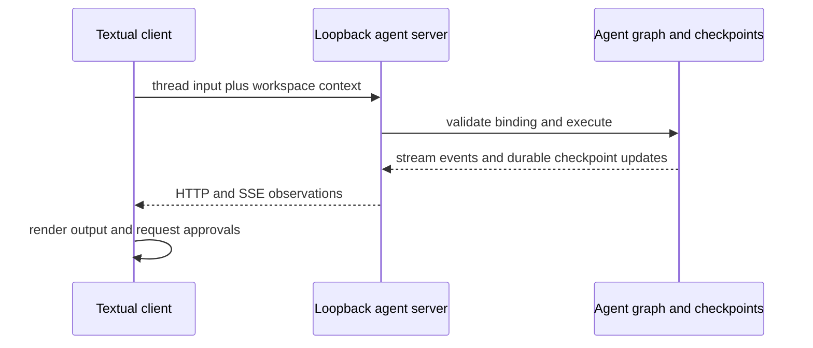

# dcode Client and Agent Server

`deepagents-code` (`dcode`) is a prebuilt terminal coding agent and reference implementation built on the `deepagents` SDK. It packages the agent harness with terminal interaction, persistence, tools, skills, and optional sandboxed execution. Its normal architecture has two processes: the **Textual client** owns terminal input, approvals, and presentation, while the **agent server** owns graph execution, model and tool integration, memory, skills, backend, and checkpoint state.

## Boundary and normal flow

The normal launcher scaffolds a temporary LangGraph project with a persistent SQLite checkpointer, starts `langgraph dev` on loopback (an ephemeral port by default), waits for the `agent` graph, and returns a workspace-configured `RemoteAgent`. It cleans up the child process when startup or cancellation prevents handoff. `RemoteAgent` provides remote graph streaming and state access; it does not make Textual the owner of graph state.

```mermaid
sequenceDiagram
    participant Client as Textual client
    participant Server as Loopback agent server
    participant Graph as Agent graph and checkpoints
    Client->>Server: thread input plus workspace context
    Server->>Graph: validate binding and execute
    Graph-->>Server: stream events and durable checkpoint updates
    Server-->>Client: HTTP and SSE observations
    Client->>Client: render output and request approvals
```

*The server executes and persists the graph; the client projects observations into terminal interaction and display state.*

The server requires a thread ID and workspace context for execution, validates the durable binding before selecting a workspace runtime, and rechecks access-policy and project-trust drift. Its runtime cache is an LRU of at most 32 entries keyed by workspace and runtime fingerprint: a changed runtime identity rebuilds, while incompatible policy does not silently change a thread's privileges. A process-wide sandbox reservation and incompatible LangSmith tracing/redaction settings likewise prevent unsafe workspace sharing. These are server execution and workspace-policy rules, not client session-selection rules.

## Client-owned Textual compatibility

`app.py` imports `_textual_patches` for side effect **before any `App()` is created**. The patch module is a collection of independent, best-effort adaptations to Textual private APIs. Each import and assignment is guarded: if an upstream internal moves, that individual patch logs a warning and dcode retains stock Textual behavior rather than preventing startup.

The patches are client compatibility code only. They preserve Alt on legacy escape sequences; normalize kitty lock-key and unsupported key subfields; implement word/block and Shift-click selection behavior; filter detached widgets from hit testing; exclude diff gutters from selections; and apply the process-wide ASCII border preference. They should be audited individually when changing the pinned Textual version; a broken patch affects terminal input or rendering, not server graph, workspace, or checkpoint authority.

The thread selector also contains narrowly scoped Textual private-API overrides for its contained `Select` overlay. Those overrides keep option-navigation focus within the modal and are explicitly version-sensitive. Treat them as presentation integration, with the same re-verification requirement on a Textual upgrade.

## One command catalog drives completion and queue behavior

`command_registry.COMMANDS` is the single declaration site for static slash-command metadata: canonical name, description, hidden fuzzy-match keywords, argument hint, aliases, experimental visibility, and queue-bypass tier. Derived sets include aliases automatically, so command dispatch policy and discovery do not require duplicated hard-coded metadata. The experimental flag filters only autocomplete entries when experimental mode is disabled.

`SlashCommandController` consumes the registry projection. It shows at most ten candidates, prioritizes name prefix and substring matches over keyword/description and fuzzy matches, and inserts the canonical machine name rather than a potentially shortened display label. Dynamically discovered skills are then added as `/skill:<name>` entries; plugin skills can display a shortened label but still insert their fully namespaced command. A static convenience alias suppresses only its redundant skill completion, avoiding accidental suppression of unrelated user skills with the same name.

The queue tier is operational behavior, not merely a label: commands can be always immediate, connection-only, immediate UI, side-effect-free, or queue-bound. For example, `/threads` opens its picker through the immediate-UI path, and `/rename` uses the side-effect-free path, allowing name changes while normal agent or shell work is busy. Selector-only argument forms and startup-recovery exceptions are deliberately separate from the normal tier classification.

## Thread discovery, references, and resume

Local session metadata is used for client discovery and presentation. `ThreadInfo` includes checkpoint-derived identity and activity fields plus optional initial prompt, location, agent, message count, and `thread_name`. The sessions database has a covering thread-list index so the initial list can avoid scanning large checkpoint blobs; failures to create the index only degrade query speed, not correctness.

The `/threads` modal is a client picker: it loads a bounded recent list, provides fuzzy filtering, sorting, scope/agent controls, configurable columns, and delete support, then returns a selected `thread_id` or cancellation. Checkpoint-derived message counts and initial prompts can be populated after the rows appear so the terminal remains responsive. A selection is validated against local thread ownership before it is used: conflict leaves the picker, filter, current thread, and transcript unchanged and surfaces an error.

When the picker closes, the app defers an actual thread switch until agent, shell, and connection work is idle; otherwise it resumes immediately and restores composer focus. `/threads -r [ID]` resolves a specific thread or, with no ID, prefers the previous thread before the most recent one. Missing IDs can offer prefix matches. Cross-agent resume is a distinct flow: local launch sessions can restart for the owning agent after confirmation, while remote sessions receive a relaunch instruction because the client cannot switch their remote server.

`@@` completion is a separate client convenience for inserting a durable reference token, `@@(thread:<id>)`, into the composer. It searches locally cached recent threads by ID, name, prompt, agent, branch, and working directory; labels prefer a thread name, then initial prompt, then an ID prefix. The label is sanitized and bounded for display, while the inserted token contains only the ID. Selecting a reference does not resume it, execute graph work, or mutate checkpoint state.

## Durable names are data; their display is client state

`/rename <name>` validates a nonempty printable single-line name of at most 50 characters, then saves it only for an existing thread. `rename_thread` uses a SQLite immediate transaction, upserts the independent `dcode_thread_names` table, mirrors the value into the newest checkpoint metadata for compatibility, and updates cached rows. This preserves a name across later checkpoint revisions without modifying conversation messages.

The app maintains the active name as presentation state. It protects asynchronous name loading with a thread ID and revision check, so an old read cannot overwrite the name of a newly selected or manually renamed thread. On successful save it refreshes open selectors and the chat input's thread-completion cache. Consequently, the picker and `@@` completion promptly show the durable title, but their rendered cells and caches are not graph authority.

## Stream projection, costs, and server APIs

The server remains authoritative for graph checkpoints and session totals. The Textual adapter projects stream events into messages and approvals. The footer accepts authoritative totals only for the active thread; it may temporarily show a request-keyed provisional stream estimate until the server total settles it, and warns once per thread when an authoritative total crosses the configured threshold. This display state is not historical accounting or a checkpoint.

Model catalog and resolution APIs run on the server in the workspace environment and fence thread-scoped calls with the binding. They validate request shapes and map conflict, validation, and unavailable-resource cases to 409, 422, and 503 without committing a model switch or running inference. The built-in server also owns `/offload`: it controls operation IDs, conflict checks, permitted state-channel writes, hook-response rounds, and cancellation to a terminal outcome. The client may initiate or render these workflows, but cannot use them to author arbitrary checkpoint state.

## Change and test guide

| Concern | Owner |
| --- | --- |
| Textual patches, widgets, input, approvals, completion popups, local picker state, deferred switching, rendered names and provisional cost display | Client |
| Graph execution, models, tools, hooks, offload, backend, workspace policy, runtime selection | Agent server |
| Durable graph checkpoint and thread/workspace binding | Server-side LangGraph persistence |
| Durable thread title record and checkpoint compatibility metadata | Local session persistence accessed by the client |

When changing the client boundary, test behavior at its seams:

- `test_textual_patches.py` covers compatibility patches independently so one moved Textual private API does not obscure another.
- `test_command_registry.py` guards registry-derived classification and autocomplete visibility.
- `test_thread_naming_app.py` verifies immediate rename behavior, stale-read protection, and refresh of the selector and `@@` completion cache.
- `test_threads_resume.py` covers `/threads -r`, lookup failures, prior-thread preference, and cross-agent/remote constraints.
- `test_app_thread_ownership.py` proves an occupied target is skipped or rejected without loading its history and that picker conflicts retain the existing UI state.

For related operational behavior, see [State persistence](/openwiki/concepts/state-persistence.md), [Cost and sessions](/openwiki/operations/cost-and-sessions.md), [Quickstart](/openwiki/quickstart.md), [Testing guide](/openwiki/testing/testing-guide.md), and [Run a dcode session](/openwiki/workflows/run-dcode-session.md).
