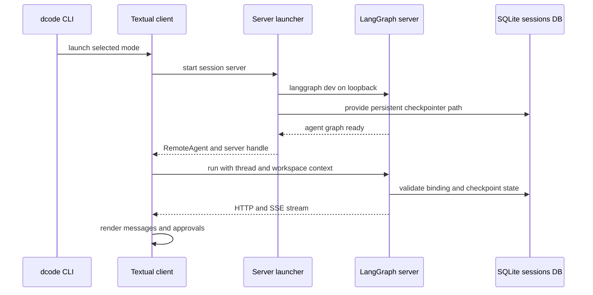

# Deep Agents Code Architecture

`deepagents-code` (`dcode`) is a prebuilt terminal coding agent and reference implementation for the `deepagents` SDK. It combines a terminal experience, persistence, tools, skills, approval controls, and optional sandbox execution. Its core architectural boundary is deliberate: the client owns interaction and presentation, while the LangGraph server owns the agent runtime and durable graph work.

## Entrypoints and modes

The package exports `cli_main` lazily, so importing a submodule does not load the CLI's argument parsing and signal machinery. Both `dcode` and `deepagents-code` console scripts target that entrypoint. `cli_main` installs POSIX termination handlers so normal unwind paths can clean up an owned server; it fast-paths `--version`, skips Textual dependency checks for `--acp`, parses arguments, gates policy-dependent work on healthy managed configuration, then dispatches the requested mode.

The CLI is more than the interactive launcher:

- Administrative subcommands manage agents, skills, plugins, MCP, configuration, credentials, threads, optional extras, diagnostics, and managed tools. Lightweight `config`, `doctor`, and `auth path` diagnostics run before the managed-policy health gate so an administrator can diagnose a broken policy source.
- Root invocation selects an agent and model, can resume a thread, submit an initial message or skill, attach MCP configuration, constrain filesystem or shell tools, and select a sandbox. `-n/--non-interactive` runs one task and exits; `--max-turns` and `--timeout` provide separate runaway-work bounds. Headless mode has no human tool approvals, so it should be treated as an automation interface rather than a safe read-only mode.
- `--acp` runs an ACP server over stdio instead of Textual. Interactive and ACP paths can use approval modes; the main terminal path starts a client/server session.

Configuration resolves each manifest option through ranked providers: managed policy, CLI, retained runtime reload, environment, user `config.toml`, and typed defaults, in that precedence order. The resolver retains provenance and provider health rather than returning only a value. See [Configuration layering](/openwiki/concepts/config-layering.md) and [Profiles and models](/openwiki/concepts/profiles-models.md) for user-facing resolution rules.

## Process boundary and normal startup

A normal dcode session has two runtime halves in separate processes. The **Textual client** owns terminal input, output, approvals, selectors, and provisional display state. The **agent server** owns the compiled graph, model and tool construction, memory, skills, MCP sessions, backend/sandbox integration, and graph checkpoints. `RemoteAgent` is the client-side adapter between them: it wraps LangGraph's `RemoteGraph`, delegates HTTP/SSE stream and state transport, and converts streamed message dictionaries into LangChain message objects for the Textual adapter.

```mermaid
sequenceDiagram
    participant CLI as dcode CLI
    participant UI as Textual client
    participant Launcher as Server launcher
    participant Server as LangGraph server
    participant DB as SQLite sessions DB
    CLI->>UI: launch selected mode
    UI->>Launcher: start session server
    Launcher->>Server: langgraph dev on loopback
    Launcher->>DB: provide persistent checkpointer path
    Server-->>Launcher: agent graph ready
    Launcher-->>UI: RemoteAgent and server handle
    UI->>Server: run with thread and workspace context
    Server->>DB: validate binding and checkpoint state
    Server-->>UI: HTTP and SSE stream
    UI->>UI: render messages and approvals
```

*Normal local launch: the client starts a loopback server, while SQLite remains the durable checkpoint and session store.*

The standard launcher creates a temporary LangGraph project containing `langgraph.json`, a minimal runtime `pyproject.toml`, and a generated checkpointer module. The generated checkpointer reads its database path from a server environment variable and uses the ownership-aware SQLite saver. The launcher starts `langgraph dev` on `127.0.0.1` with an ephemeral port by default, waits for graph `agent`, configures the returned `RemoteAgent` with the workspace claim, and stops the child if startup fails or is cancelled before handoff. Server configuration crosses the process boundary through the shared `ServerConfig` schema, serialized as `DEEPAGENTS_CODE_SERVER_*` environment variables rather than reconstructed independently by the child.

Server construction is cached: the graph factory and built-in operation routes use the same server runtime so agent, backend, MCP resources, and compaction policy agree. Startup failures are emitted in a structured marker form; the parent reconstructs only allowlisted missing-credential/provider-package failures, while other early exits become an error with a bounded server-log tail.

## Workspace binding is the isolation boundary

A thread is durably associated with a workspace identity and policy. Before a graph execution, `make_graph` requires a nonempty thread ID and execution workspace context, then validates that context against the persisted thread binding before choosing a runtime. A missing binding, mismatched context, or incompatible claimed configuration is a conflict rather than permission to execute against a different checkout.

The binding separates **policy identity** from **runtime identity**. Trust, tool, sandbox, and approval policy drift (including project-level MCP, setup, or extension trust) is refused. A change only to model, model parameters, prompt, or other runtime fields is not a privilege change: it rebuilds the selected runtime while preserving the thread's checkpoint history and durable binding. Runtime instances are cached as an LRU of at most 32 entries keyed by workspace and runtime fingerprint.

This distinction has important process-wide constraints. Sandbox backends are process-wide: the first sandboxed workspace reserves the server process, and another workspace cannot silently share it. LangSmith tracing/redaction settings are likewise pinned for the process lifetime, so a workspace with incompatible settings must use another server. These rules prevent a shared local server from accidentally carrying trust, sandbox, or tracing context across workspaces.

## Textual client and remote-client behavior

`DeepAgentsApp` is the interactive presentation controller. It starts the server asynchronously and receives a `ServerReady` event carrying the remote agent and child process. On success it refreshes the mounted status bar from runtime model state; warnings surface a missing bar or model identity, and missing identity clears stale provider, model, and effort text. The app also imports `_textual_patches` before creating an `App`: each patch is an independent best-effort adaptation of a Textual private API, logging a warning and retaining stock behavior if a particular import or assignment is unavailable. Textual upgrades therefore need focused compatibility testing, but a patch failure does not alter graph or checkpoint authority.

`RemoteAgent` is intentionally not a second graph-state owner:

- It passes a thread ID, workspace descriptor, and—where local ownership applies—reservation token with mutations. It binds a workspace on demand through the server and keeps per-thread workspace descriptors client-side as transport state. The server, not that cache, validates the durable binding.
- Its stream adapter requests LangGraph stream modes, forwards workspace context, converts message payloads, normalizes interrupts, and leaves durability to the server. Missing or empty remote state is represented as `None`; unexpected transport/state errors are surfaced.
- Before state mutation, it can ensure the HTTP-side thread record exists. This compensates for the development server's separate live-thread registration and persistent checkpoint storage after a restart.
- On a state-update conflict it cancels active runs, waits with bounded concurrent cancellation, and retries once. Pending-work abandonment closes outstanding trailing tool calls before ending checkpointed work, and verifies that pending graph work is gone.

The client displays but does not author accounting. `RemoteAgent` reconciles graph checkpoint cost with separately persisted side-question cost; if graph state is unsettled it marks the combined result cached. The Textual footer treats server totals as authoritative for the active thread, may show request-keyed provisional stream cost until settlement, discards totals for inactive threads, and warns once when an authoritative threshold is crossed. For accounting behavior, see [Cost and sessions](/openwiki/operations/cost-and-sessions.md).

The static slash-command registry is the single source for command metadata. Queue-bypass sets and completion entries are derived from it; experimental commands are hidden from autocomplete unless enabled. Completion displays friendly labels but inserts canonical commands, including the complete `/skill:<name>` for namespaced plugin skills. Thread-reference completion is deliberately different from resume: it searches local metadata and inserts `@@(thread:<id>)` without selecting a thread or mutating graph state.

## SQLite session domains and lifecycle

The default session database is `sessions.db` under the dcode state directory. It serves several related but distinct domains:

| Domain | Authority and purpose |
| --- | --- |
| LangGraph `checkpoints` and `writes` | Durable conversation/graph state used by the server checkpointer. |
| Thread ownership | Fencing-aware saver and leases prevent conflicting local writers. |
| `dcode_thread_workspaces` and snapshots | Durable workspace identity, policy/runtime fingerprints, and safe drift diagnostics. |
| `dcode_thread_names` | User-facing thread title independent of checkpoint revisions. |
| Side-question costs and offloaded history | Supplemental session accounting/history cleaned with thread deletion where applicable. |

Thread discovery is a read/presentation path over checkpoint metadata. A covering index allows thread listings to avoid scanning large checkpoint blobs; inability to create it degrades performance rather than listing correctness. A thread name must be printable, single-line, and at most 50 characters. Renaming uses an immediate SQLite transaction, upserts the independent names table, mirrors the name into the newest checkpoint metadata for compatibility, and updates local caches without rewriting conversation messages. The app uses a thread-and-revision guard so stale asynchronous reads cannot replace the active name, then refreshes open selectors and reference completion after a successful rename.

Thread selection also has a lifecycle boundary: a picker validates local ownership before activating a selected thread, preserves the current UI state on an acquisition conflict, and defers an actual switch until agent, shell, and connection work are idle. `/threads -r [ID]` chooses an explicit target or the previous thread when unqualified; resuming an agent owned by another local launch uses a restart path, while a client connected to a remote server is told to relaunch because it cannot switch that remote server.

## Server-owned auxiliary APIs and extension boundaries

The server exposes workspace-fenced model catalog/resolution APIs. They resolve in the workspace environment without committing a model switch or running inference; conflicts, validation failures, and temporarily unavailable resources map to 409, 422, and 503. This keeps provider imports and credentials out of the Textual process while allowing the UI to preview a possible selection.

The built-in server also owns `/offload`. It carries a stable operation ID across hook-response rounds, rejects conflicts before commit, restricts writes to permitted offload channels, and lets cancellation wait for a terminal server acknowledgement. `RemoteAgent` fulfills requested client hooks but validates the server protocol and bounds both hook rounds and cancellation waits. Custom/external LangGraph servers that do not register dcode's routes cannot provide these operations.

MCP tool discovery and live sessions are server responsibilities. Explicit `--mcp-config` is validated before process spawn; automatically discovered project/user configurations are handled more leniently and surfaced through MCP status. Project MCP, hooks, and extensions are trust-sensitive configuration inputs, not ordinary UI preferences. See [MCP integration](/openwiki/integrations/mcp.md).

## Change guide and focused tests

When changing this architecture, preserve these ownership rules:

1. Do not move graph state, policy validation, provider construction, or checkpoint authority into Textual merely to simplify UI code.
2. Treat the workspace binding and server policy recheck as a security boundary. A runtime cache miss may rebuild; a policy mismatch must refuse.
3. Preserve cleanup on cancellation and early startup failure; a started but unhanded server must be stopped.
4. Keep local session discovery/title caches separate from server graph authority and guard mutations with thread ownership.

Focused tests include `test_app.py` for server-ready status refresh and deferred initial behavior, `test_thread_naming_app.py` for busy rename and asynchronous presentation races, and `test_server_graph.py` for workspace runtime caching, policy drift, sandbox, and tracing isolation. The launch and remote-client tests are the appropriate seams for process cleanup, protocol compatibility, retry/cancellation, and workspace transport.

For end-user operation, see [Run a dcode session](/openwiki/workflows/run-dcode-session.md), [State persistence](/openwiki/concepts/state-persistence.md), and [Cost and sessions](/openwiki/operations/cost-and-sessions.md).
