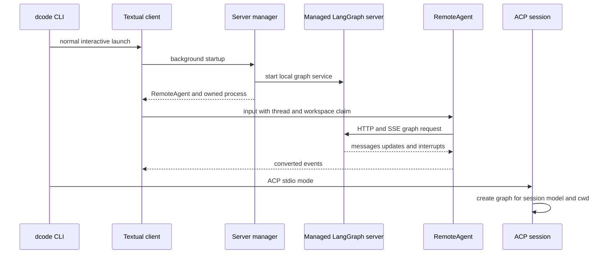
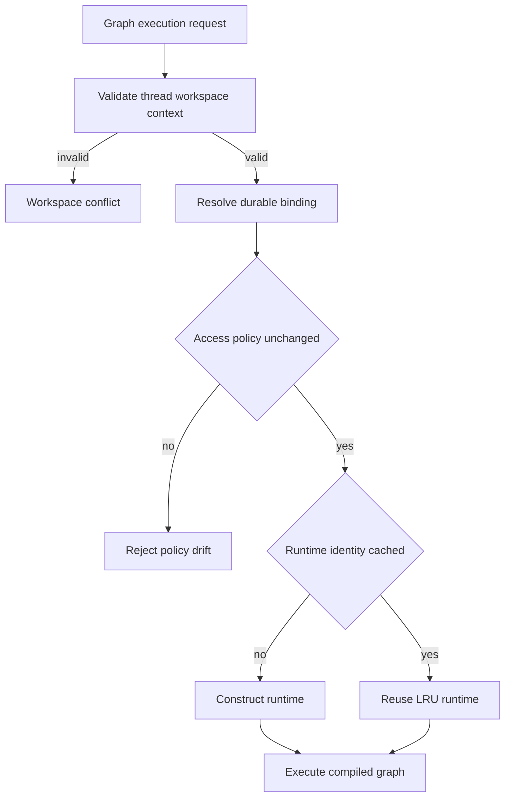

# dcode Client and Agent Server

`deepagents-code` (`dcode`) is a reference terminal coding-agent product: it packages the `deepagents` SDK harness with a terminal experience, persistence, tools, skills, and optional sandboxed execution. Its ordinary architecture is intentionally split: the **Textual client** owns rendering, input, approvals, and lifecycle of a local child process; the **managed local server** owns graph execution, model access, tools, memory, skills, backend, and checkpointing. ACP is not a third client of that server—it is a direct, in-process graph path.

```mermaid
sequenceDiagram
    participant CLI as dcode CLI
    participant TUI as Textual client
    participant Launch as Server manager
    participant Server as Managed LangGraph server
    participant Remote as RemoteAgent
    participant ACP as ACP session
    CLI->>TUI: normal interactive launch
    TUI->>Launch: background startup
    Launch->>Server: start local graph service
    Launch-->>TUI: RemoteAgent and owned process
    TUI->>Remote: input with thread and workspace claim
    Remote->>Server: HTTP and SSE graph request
    Server-->>Remote: messages updates and interrupts
    Remote-->>TUI: converted events
    CLI->>ACP: ACP stdio mode
    ACP->>ACP: create graph for session model and cwd
```

*The top path is the client-to-managed-server protocol; the ACP path constructs and streams its graph in the ACP process instead.*

## Entrypoints and startup ownership

`python -m deepagents_code` obtains the package's lazy `cli_main` attribute, avoiding import of `main.py` and its startup machinery until the command actually runs. Normal interactive and headless runs use `start_server_and_get_agent`: it resolves and exports `ServerConfig`, scaffolds a temporary LangGraph project with a SQLite checkpointer module, starts `langgraph dev`, waits until the `agent` graph is ready, and returns a workspace-bound `RemoteAgent`. A failed or cancelled startup before handoff stops the process; callers that own a completed handoff must perform the eventual cleanup.

`run_textual_app` makes startup a UI boundary rather than a blocking CLI boundary. With `server_kwargs` but no agent, it paints the connection state then starts the managed server in a background worker. The worker may concurrently preload MCP metadata, but metadata failure is non-fatal; it assigns the successful process before posting `ServerReady`, so app-level cleanup can reap it if the user exits during the handoff. Raw resume intent is also resolved asynchronously, and `TextualAppError` preserves the app's final thread ID for correct outer teardown reporting.

`RemoteAgent` wraps LangGraph `RemoteGraph` for HTTP and SSE. It adds the cached, per-thread workspace descriptor to each streamed request, requires a `config.configurable.thread_id`, converts serialized messages and interrupts into client objects, and forwards the remaining events. State retrieval is deliberately separate from cost reconciliation: missing or empty thread state is no state, while unexpected state errors remain errors.

ACP preserves a different boundary. Its session builder receives the ACP session model and cwd, builds a `ProjectContext`, and calls `create_cli_agent` directly per session, so it bypasses the managed-server workspace-runtime cache. Its Auto adapter writes trusted approval state and prompt metadata to the store before streaming. Do not make ACP depend on server-only caches or assume all graph construction has an HTTP client in front of it.

## Binding a thread to a workspace

The server is authoritative for execution identity. It validates every request against a durable, per-thread workspace binding instead of trusting the client’s desired cwd. A valid request must carry the thread and workspace context, agree with the stored binding and configuration fingerprint when supplied, and still resolve to the same workspace. Missing or malformed context, an unbound thread, unsupported binding schema, a mismatched fingerprint, or changed identity becomes `WorkspaceConflictError` rather than silently moving the thread.

```mermaid
flowchart TD
    Request["Graph execution request"] --> Check["Validate thread workspace context"]
    Check -->|"invalid"| Reject["Workspace conflict"]
    Check -->|"valid"| Bound["Resolve durable binding"]
    Bound --> Policy{"Access policy unchanged"}
    Policy -->|"no"| Conflict["Reject policy drift"]
    Policy -->|"yes"| Cached{"Runtime identity cached"}
    Cached -->|"yes"| Reuse["Reuse LRU runtime"]
    Cached -->|"no"| Build["Construct runtime"]
    Build --> Run["Execute compiled graph"]
    Reuse --> Run
```

*Binding validation precedes runtime-cache selection, so a thread cannot acquire a different workspace or privilege set through a cache miss.*

The cache key includes workspace identity and the complete runtime fingerprint, is LRU-bounded, and serializes concurrent construction. Runtime-only changes—such as a model, model parameters, or prompt—therefore select a fresh graph without discarding the thread’s checkpoints. Access-policy changes are treated differently: the server re-resolves configuration on each request and rejects altered trust, tool, sandbox, or approval policy rather than rebuilding under new privileges. A configured sandbox is reserved to one workspace per server process.

For a workspace outside the project used at launch, `ServerConfig.resolve_workspace` drops launch-project MCP configuration, sandbox setup, and extension paths, then resolves extension trust for the target project. Conflict diagnostics are intentionally narrow: a bounded policy allowlist is compared and reported, while paths, model specs and parameters, prompts, environment values, and credentials are excluded from snapshots and diagnostics. See [Configuration layering](/openwiki/concepts/config-layering.md) for precedence and [MCP](/openwiki/integrations/mcp.md) for integration trust.

## Graph-construction seam

`create_cli_agent` is the composition seam shared by the managed server and ACP. It returns a compiled graph plus its `CompositeBackend`; callers supply the authoritative project context, model and policy inputs rather than rebuilding those choices in the UI. It composes configurable-model selection, retries, resume and cost state, goals, ask-user behavior, memory, skills, local or sandbox backend, compaction, approval middleware, hooks, optional interpreter, rubric support, subagents, and extensions. An explicit filesystem-tool allowlist is installed both on the main agent and synchronous subagents so delegating through `task` cannot bypass it.

The server builds built-in tools, conditionally adds workspace-bound web search, and loads MCP tools with the project context and trust policy before calling that seam. MCP discovery uses throwaway sessions; real sessions are opened lazily by the process-wide manager when a tool is invoked. Only MCP tools explicitly classified read-only are made available as criteria or grading context.

### Model, profile, and reasoning settings

Executable graph construction enforces `models.allowed` for the main model, Auto classifier, rubric model, and declared subagent models before resolving provider-backed strings. dcode resolves recognized provider models through its factory with SDK retries disabled, so dcode’s retry middleware owns the budget; absent credentials defer a subagent’s resolution rather than aborting startup before that subagent runs. `profile_overrides` travel with construction to retain session profile behavior for later side work.

The Textual client resolves supported reasoning efforts for the selected model/profile, restores a stored per-model effort only when no explicit model parameter already wins, and applies a selected effort as a session model-parameter override. The graph’s configurable-model middleware then uses those request parameters. Reasoning effort is not merely a display setting: providers whose request shape makes it relevant include it in prompt-cache identity. See [Profiles and models](/openwiki/concepts/profiles-models.md) for profile and provider details.

### MCP deadline semantics

`mcp.tool_timeout` is a manifest-backed scalar: managed configuration takes precedence over environment, then user `config.toml`, then the 120-second default. Invalid, non-finite, or out-of-range values fall through to a lower-precedence source; accepted values are bounded from 1 to 900 seconds. The same resolver powers runtime and config introspection.

When MCP tools are present, `create_cli_agent` installs `MCPToolMiddleware` inside the server hooks wrapper, including for subagents. It removes empty strings from optional string-like MCP arguments, applies `asyncio.wait_for` to MCP calls, and returns an error `ToolMessage` identifying server, tool, and deadline on timeout. The message explicitly warns that the server-side operation may continue and a retry may duplicate work. Tool exceptions are preserved, cancellation propagates, and recognized expired-auth failures are translated into actionable re-authentication instructions.

## Hooks cross a validated projection boundary

Hooks use typed domain objects rather than exposing live graph objects over the command boundary. A `HookInvocation` combines a strict context—thread, cwd, approval mode, optional prompt ID, effort, agent identity, and transcript revision—with one discriminated lifecycle event. Supported events include session start/end, prompt submission, permission and notification, pre/post tool use and failure, compaction, stop, and subagent start/stop. Post-tool results are JSON-projected before they can cross a LangGraph interrupt boundary.

`HookEnvelopeAdapter` projects each domain invocation through `project_hook_input` and validates the event-specific compatible wire model before serializing compact JSON for handler stdin. Projection supplies session ID, materialized transcript path, cwd, permission-mode mapping, optional effort and agent identity; `SubagentStop` additionally requires a materialized agent transcript. Unsupported notification types and unsupported domain events fail rather than emitting an ambiguous payload. Handler results return through reduction as typed, event-specific decisions—such as permission effects, injected context, feedback, or stop-loop control—rather than as unstructured UI commands.

## Cost presentation is server-authoritative

The compiled graph’s cost middleware owns the durable cumulative thread cost and prices main-model, subagent, offload, and Auto-classifier work. The Textual app writes its base cost only from checkpoint totals or streamed absolute totals; it never persists its own estimate. During a turn it may add a request-keyed **provisional** stream delta so the status bar remains responsive, then clears or settles that display-only amount when an authoritative server total arrives. Stale totals for a no-longer-active thread are ignored, and a warning modal is shown once when the authoritative total crosses the configured threshold.

On restore and end-of-turn reconciliation, `RemoteAgent.aget_session_cost` combines graph-checkpoint accounting with a best-effort fetch of separately persisted side-question cost. If side accounting is unavailable, the graph total remains usable; if the graph checkpoint is not settled, callers preserve provisional main-task spend. This is why state lookup and cost lookup must remain separate. See [Cost and sessions](/openwiki/operations/cost-and-sessions.md) for operator-facing interpretation.

## Focused test boundaries and change guidance

The high-value tests protect seams where an apparently local change could violate a cross-process or security contract:

- Agent tests assert Auto approval is not installed with a sandbox and that MCP tools install the deadline middleware; broader agent coverage protects policy checks, approval state, backend construction, subagent restrictions, and cost middleware ordering.
- Manifest tests verify MCP deadline precedence, bounded fallback, and agreement between the runtime resolver and `dcode config` reporting. Middleware tests verify timeout text, pass-through behavior, preserved `ToolException`, re-auth translation, and propagated cancellation.
- Hook engine tests project every supported event, confirm effort and permission-mode projection, and reject unknown notifications.
- Textual tests cover deferred startup, asynchronous resume and thread ordering, recovery and teardown; the app code keeps server acquisition and cleanup ownership explicit.
- Server and remote-client tests cover runtime caching and policy conflicts, workspace-specific tool selection, streamed payload conversion, trace forwarding, and independent state/cost behavior.

When changing this area, first classify the boundary: presentation belongs in the Textual client; durable workspace policy and graph construction belong in the managed server; ACP must keep working without that server. Classify configuration fields too: privileges and resource access require policy-drift validation, while graph-only inputs must enter runtime identity. Preserve the managed-server startup cleanup rule, the direct ACP construction path, and the distinction between provisional UI display and durable server accounting. See [Testing guide](/openwiki/testing/testing-guide.md) for test execution and [Run a dcode session](/openwiki/workflows/run-dcode-session.md) for normal session flow.
