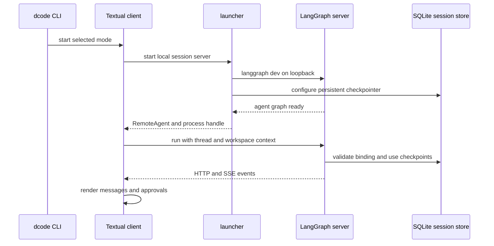
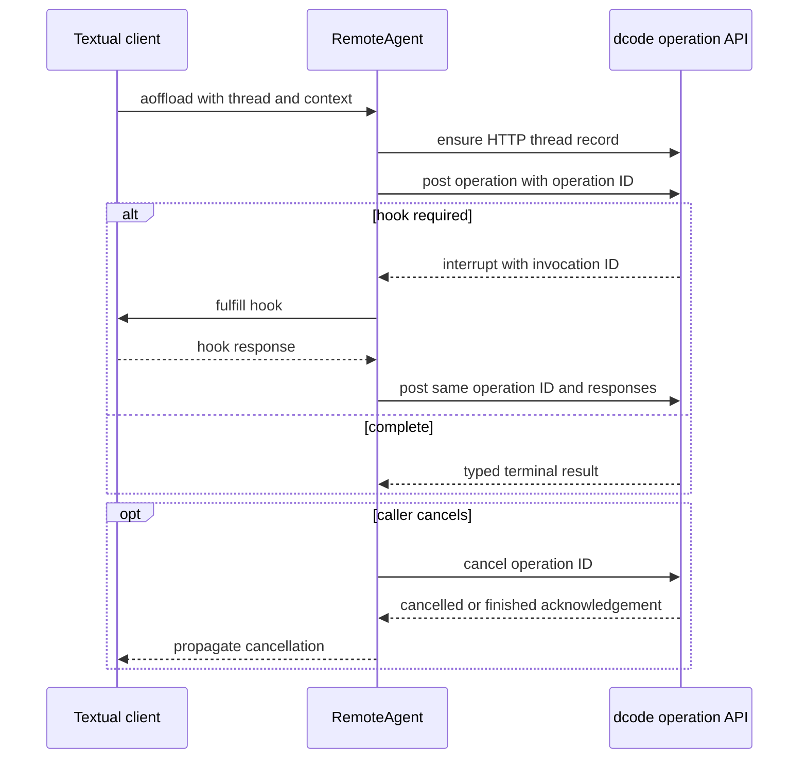

# Deep Agents Code Architecture

`deepagents-code` (`dcode`) is a prebuilt terminal coding agent and reference implementation of the `deepagents` SDK harness. It packages a terminal experience with persistence, tools, skills, approvals, and optional sandbox execution. Its central boundary is intentional: the client presents and collects interaction; the server owns agent execution and durable graph state.

## Entrypoints and configuration

Both `dcode` and `deepagents-code` console scripts call the lazily exported `deepagents_code:cli_main`, avoiding main-startup imports when consumers import package submodules. `cli_main` fast-paths version output, omits Textual dependency checks in ACP mode, installs POSIX termination handlers for cleanup, and applies managed-configuration gating before dispatching invocation modes.

Configuration is resolved, with provenance and provider health retained, in this order: managed policy, CLI, retained reload values, environment, user configuration, then typed defaults. The parent and child do not independently reinterpret server options: they share `ServerConfig`, which the launcher serializes into `DEEPAGENTS_CODE_SERVER_*` environment variables for the graph process. See [Configuration layering](/openwiki/concepts/config-layering.md).

A security-relevant configuration seam is model environment resolution: a present `DEEPAGENTS_CODE_<NAME>` environment variable overrides the canonical `<NAME>` variable even when its value is empty, which intentionally suppresses the canonical value. Project dotenv loading is deliberately constrained: startup strips `PYTHONPATH` from the server interpreter environment and passes an inherited value only through a private carrier for approval-gated shell subprocesses, preventing an untrusted import path from influencing server startup.

## Client/server authority and startup

A normal session has two processes:

- The **Textual client** owns terminal input/output, interactive or headless presentation, approvals, local selectors, and provisional display state.
- The **LangGraph server** owns graph construction and execution, model/provider creation, tools, memory, skills, MCP sessions, backend/sandbox integration, and checkpoint writes.
- `RemoteAgent` is a transport adapter, not a graph-state authority. It wraps `RemoteGraph` for HTTP/SSE streaming and state operations, converts server message dictionaries into LangChain objects for the Textual adapter, and retains workspace descriptors only as client transport state.

```mermaid
sequenceDiagram
    participant CLI as dcode CLI
    participant UI as Textual client
    participant Launch as launcher
    participant Server as LangGraph server
    participant Store as SQLite session store
    CLI->>UI: start selected mode
    UI->>Launch: start local session server
    Launch->>Server: langgraph dev on loopback
    Launch->>Store: configure persistent checkpointer
    Server-->>Launch: agent graph ready
    Launch-->>UI: RemoteAgent and process handle
    UI->>Server: run with thread and workspace context
    Server->>Store: validate binding and use checkpoints
    Server-->>UI: HTTP and SSE events
    UI->>UI: render messages and approvals
```

*The normal local path gives the client presentation authority while the server validates workspace execution and SQLite preserves graph state.*

The local launcher creates a temporary LangGraph project, including a persistent SQLite checkpointer, starts `langgraph dev` on loopback with an ephemeral port by default, waits for graph `agent`, and returns a workspace-configured `RemoteAgent`. It stops the child when startup fails or cancellation occurs before handoff. Structured startup markers can reconstruct only allowlisted missing-credential or missing-provider-package errors; other early exits become a `RuntimeError` with a bounded log tail.

On background startup success, `on_deep_agents_app_server_ready` refreshes the mounted status bar from runtime model state. A missing status bar or model identity is warned about; absent identity clears provider, model, and effort rather than leaving a failed attempt's stale text.

## Workspace and persistence boundaries

Every graph execution requires a thread ID and workspace context. The server validates that context against the durable thread binding before it selects a workspace runtime; client workspace caches and transport headers are not proof of authority. Local client ownership additionally fences mutations with the active reservation token.

The binding distinguishes policy identity from runtime identity. A change in trust, tools, sandbox, approvals, project-sensitive MCP/setup/extension policy is refused; a change confined to full runtime identity such as model, parameters, or prompt rebuilds the runtime without discarding checkpoint history. Server runtimes form an LRU cache of at most 32 entries keyed by workspace and runtime fingerprint. A process-wide sandbox is claimed by its first workspace, and incompatible LangSmith tracing/redaction settings likewise prevent sharing that server process.

The default durable store is `sessions.db` in the state directory. Checkpoints and writes remain server-owned graph state, while thread names, workspace bindings, side-question accounting, and offloaded history are related but separate domains. The metadata-listing index is a best-effort performance optimization: failure may make listing slower but must not change listing correctness. See [State persistence](/openwiki/concepts/state-persistence.md).

A name is a printable single-line string of at most 50 characters. It is durably upserted in a dedicated SQLite table and mirrored into newest checkpoint metadata for compatibility, without changing conversation messages. The app guards against stale asynchronous name reads replacing the active name and refreshes open thread selectors and thread-reference completion after a successful rename.

`/threads -r [ID]` uses an explicit target when supplied, otherwise the previous thread. Local cross-agent resume takes a separate restart path; a remote session cannot switch its remote server and instructs the user to relaunch instead. Thread-reference completion is not resume: it searches cached local metadata and inserts only `@@(thread:<id>)`.

## Remote operations, cancellation, and accounting

`RemoteAgent` delegates stream negotiation, SSE routing, namespace parsing, and remote state to `RemoteGraph`; it converts streamed messages and interrupt payloads only at the client boundary. It first ensures an HTTP-side thread record for mutations because a development server can retain checkpoint data across restart while its live thread registry has no record.

For a conflicting state update, the client lists pending/running remote runs, concurrently requests interruption, waits up to ten seconds per run, and retries once. If the SDK private client seam is unavailable or all run listings fail, it logs the degraded recovery and lets the original conflict remain meaningful rather than asserting recovery succeeded. Pending-work abandonment closes only trailing unanswered tool calls and verifies that pending graph work has cleared.

`/offload` and `/handoff` are server-owned auxiliary operations. The remote client creates one operation ID, ensures the thread before the first POST, includes workspace and local ownership context, and reuses the ID as it fulfills server-requested hook invocations. It validates terminal result shape, caps hook fulfillment at 32 rounds, and uses a distinct handoff route so an older server cannot silently compact a source thread when asked to hand off.

```mermaid
sequenceDiagram
    participant UI as Textual client
    participant Remote as RemoteAgent
    participant Server as dcode operation API
    UI->>Remote: aoffload with thread and context
    Remote->>Server: ensure HTTP thread record
    Remote->>Server: post operation with operation ID
    alt hook required
        Server-->>Remote: interrupt with invocation ID
        Remote->>UI: fulfill hook
        UI-->>Remote: hook response
        Remote->>Server: post same operation ID and responses
    else complete
        Server-->>Remote: typed terminal result
    end
    opt caller cancels
        Remote->>Server: cancel operation ID
        Server-->>Remote: cancelled or finished acknowledgement
        Remote-->>UI: propagate cancellation
    end
```

*Offload remains an operation owned by the server; the client transports hooks and does not release cancellation until the server reports a terminal outcome.*

Cancellation of an in-flight offload waits, even through repeated caller cancellation, for the server acknowledgement (`cancelled` or `finished`) with a ten-second bound. A missing built-in route produces an actionable error for custom or older graph servers. On the server, stable operation IDs span hook rounds, conflicts are rejected before commit, writes are restricted to permitted offload state channels, and cancellation waits for a terminal operation result.

Cost ownership follows the same division. `RemoteAgent` reconciles checkpoint cost with best-effort separately persisted side-question cost and labels the result cached when graph state is unsettled. The Textual footer accepts server checkpoint/stream totals as authoritative only for the active thread, may display request-keyed provisional stream cost until settlement, drops inactive-thread totals, and warns once on an authoritative threshold crossing. See [Cost and sessions](/openwiki/operations/cost-and-sessions.md).

## Tool-free auxiliary model calls and thread naming

Auxiliary calls must not inherit executable capabilities from the main agent request. `_tool_free` deep-copies provider options while removing `tools`, `tool_choice`, legacy functions/function-call fields, parallel tool calls, and MCP-server configuration, including inside `model_kwargs` and `extra_body`. It copies the model with those request defaults isolated while retaining shared provider HTTP clients; bound runnable settings are flattened so request overrides still win.

The server's side-question path uses the latest resolved model/instructions when available, otherwise checkpointed or workspace defaults, restores read-only memory/skill instructions, and invokes a tool-free chat model with `tools=[]`, no callbacks, and no checkpoint writes. This preserves answer relevance without granting a supposedly auxiliary call agent tools or conversation mutation authority.

Thread-title generation is a similarly isolated client-side auxiliary call. It sends only bounded human/AI conversation text (excluding hidden, control, and shell messages), asks for a short safe title, uses a ten-second generation timeout, tool-free settings, and callbacks disabled. Cancellation waits for model initialization to finish because model creation can mutate process-wide provider settings. The app schedules automatic naming only after the first completed response when enabled and a title is absent; it binds the task to the thread, snapshots inherited model parameters, serializes environment mutation, attributes the call through `answer_with_cost`, and refreshes side cost afterwards. Manual generation offers a proposal rather than silently replacing the name.

## Textual, terminal, and selector compatibility

`app.py` imports `_textual_patches` for side effect before an `App` exists. The patches are independent best-effort adaptations of private Textual internals: an ASCII border policy, legacy Alt and kitty lock-key/extended-key normalization, word/block selection and Shift-click extension, detached-widget hit filtering, and diff-gutter selection masking. Each patch guards its own private import or assignment, logs a warning when it cannot apply, and leaves stock behavior for that individual feature. This confines Textual-version risk to presentation rather than graph/checkpoint authority; `test_textual_patches.py` exercises parser behavior, ASCII borders, selections, and the detached-Markdown race.

UI selectors are presentation seams, not storage or runtime authority. Persistent chrome may use stable IDs such as `#status-bar`, `#welcome-banner`, `#chat`, `#messages`, and `#input-area`; code that can run while a modal is topmost or a widget is detaching handles `NoMatches` and screen-stack races rather than assuming a selector remains mounted. Selector screens own their own filter/focus state: a late thread-name proposal must not steal input from a thread selector or nested authentication modal.

Terminal tab titles are cosmetic and independently failure-tolerant. `TerminalTitle` validates `[terminal].tab_title` (only plain `{app_name}`, `{thread_name}`, `{cwd}`, and `{branch}` fields), falls back to `{app_name} - {thread_name}`, removes control/non-printable characters, and bounds output to 512 characters. It pushes the terminal title stack only on an available TTY and when terminal escapes are enabled, updates only when rendered state changes, and pops only after a successful push; terminals without XTWINOPS title-stack support can retain the last title after exit. The app constructs it from effective configuration and refreshes it on thread/name/cwd changes.

## Commands, model APIs, and change guide

The static slash-command registry is the source of truth for command metadata; queue-bypass sets and completion entries derive from it, and experimental commands remain out of completion unless experimental mode is enabled. Completion ranks static/dynamic entries, shows friendly labels while inserting canonical names, and preserves a full namespaced `/skill:` command even if the popup label is shortened.

The server exposes launch metadata plus workspace-fenced model catalog/resolution APIs. They resolve models in the workspace environment without committing a selection or running inference, and map conflict, validation, and unavailable-resource failures to 409, 422, and 503. This keeps provider imports and credentials on the server side while allowing the UI to preview choices.

When changing this area:

1. Preserve client presentation versus server execution/checkpoint authority.
2. Treat a workspace policy mismatch as a refusal, not as a cache-miss rebuild.
3. Preserve child-process cleanup and remote cancellation acknowledgement on every early-exit path.
4. Keep auxiliary model calls tool-free, callback-free where required, and correctly charged to their owning thread.
5. Treat Textual private APIs and widget selectors as compatibility boundaries; test absent/detached UI as well as happy paths.

Focused coverage includes `test_app.py` for server-ready status behavior, `test_remote_client.py` for workspace transport, offload protocol and cancellation, `test_textual_patches.py` for compatibility patches, and `test_thread_naming_app.py` for naming, focus, deferred UI, and stale-task races. See [Testing guide](/openwiki/testing/testing-guide.md) and [Run a dcode session](/openwiki/workflows/run-dcode-session.md) for operational guidance.
