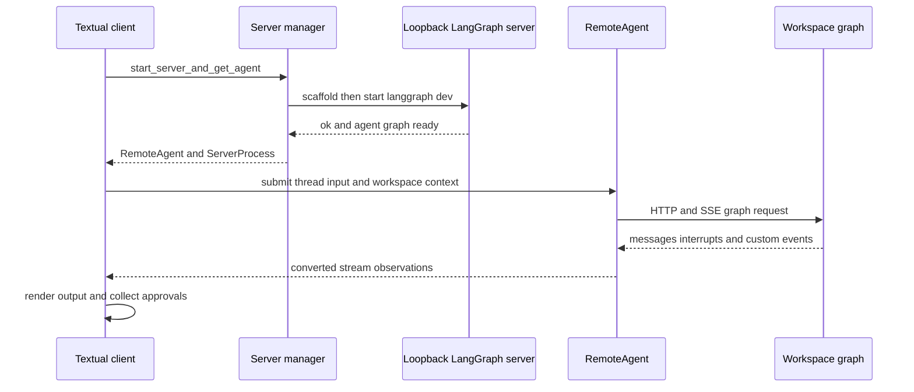
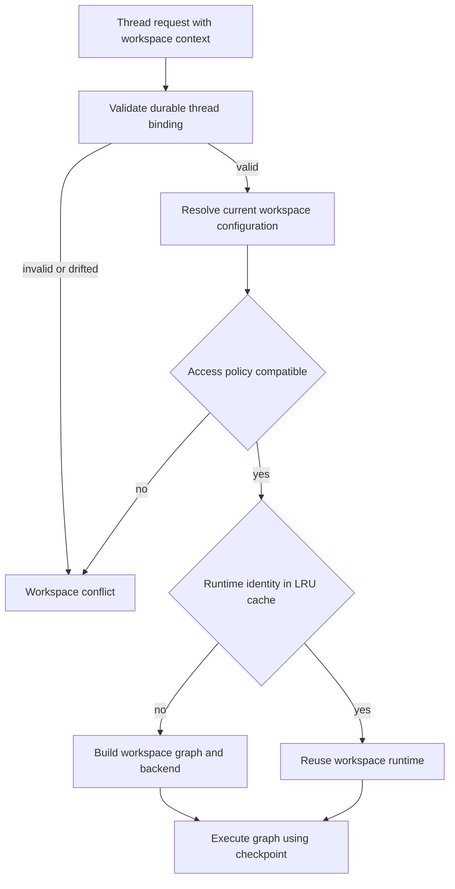

# dcode Client and Agent Server

`deepagents-code` (`dcode`) is a prebuilt terminal coding agent and reference implementation built on the `deepagents` SDK. It combines the SDK harness with terminal interaction, persistence, tools, skills, and optional sandboxed execution. Its normal architecture is deliberately split: the **Textual client** owns terminal input, approvals, and presentation; the **agent server** owns graph execution and the model, tools, memory, skills, backend, and checkpoints.

## Process and request boundary

The normal client creates a temporary server project, generates `langgraph.json`, a SQLite checkpointer module, and a minimal `pyproject.toml`, then starts `langgraph dev`. It binds only to `127.0.0.1` on an ephemeral port by default, waits first for `/ok` and then for the `agent` graph, and returns a `RemoteAgent` plus the owned `ServerProcess`. The generated configuration names `deepagents_code.server_graph:make_graph`; for that built-in graph it also registers the dcode HTTP application, including `/offload`. A custom graph reference does not receive that operation application.

```mermaid
sequenceDiagram
    participant Client as Textual client
    participant Manager as Server manager
    participant Process as Loopback LangGraph server
    participant Remote as RemoteAgent
    participant Graph as Workspace graph
    Client->>Manager: start_server_and_get_agent
    Manager->>Process: scaffold then start langgraph dev
    Process-->>Manager: ok and agent graph ready
    Manager-->>Client: RemoteAgent and ServerProcess
    Client->>Remote: submit thread input and workspace context
    Remote->>Graph: HTTP and SSE graph request
    Graph-->>Remote: messages interrupts and custom events
    Remote-->>Client: converted stream observations
    Client->>Client: render output and collect approvals
```

*The loopback process executes the graph; Textual consumes its observations and owns terminal interaction.*

`RemoteAgent` lazily creates a LangGraph `RemoteGraph`. It uses that transport for HTTP and SSE, normalizes thread IDs, converts streamed message objects and interrupts for the Textual adapter, and keeps graph-state access distinct from accounting reconciliation. It also remembers workspace descriptors per thread, so every thread-scoped server request carries the workspace the server bound for that thread.

### Startup and recovery

`ServerConfig` is the configuration handoff schema: the client resolves CLI arguments, writes `DEEPAGENTS_CODE_SERVER_*` variables through `to_env()`, and the graph process reconstructs it with `from_env()`. The launch manager validates an explicit MCP configuration before spawning, captures the launch project context, and attaches the initial workspace claim to the returned remote client. If startup, graph readiness, or remote-client creation fails or is cancelled before handoff, its `finally` path stops the owned process; this includes `CancelledError` and avoids an orphan process.

The server runtime factory is a startup barrier. It checks managed configuration, builds once under a lock, and on failure writes a traceback plus a single-line startup marker. Known missing-credentials and missing-provider-package errors additionally carry an allowlisted JSON payload. While polling, the parent detects early process exit, preserves a bounded log tail, and reconstructs only those validated typed recovery errors; unknown or malformed output remains a `RuntimeError`. This lets the UI offer provider/credential recovery without deserializing arbitrary exception state.

When a background startup posts `ServerReady`, the app replaces its agent and process references, clears connection/reconnect and transient failure state, refreshes MCP state, and only then sequences resume history, startup work, and queued input. It also re-syncs the mounted status bar from `runtime_state`. This is required after a failed startup followed by a model/provider retry because mounting occurred only once. Missing status bar or model identity is warned about; missing identity clears the displayed provider, model, and effort rather than retaining stale text.

## Server execution and workspace fencing

The graph factory requires both a thread ID and workspace context for an execution request. It asks `require_thread_workspace` to validate the durable binding and then chooses the runtime for that binding. Thus neither a client stream event nor a client-proposed workspace can select an arbitrary working directory or silently change the thread's access policy.

```mermaid
flowchart TD
    Request["Thread request with workspace context"] --> Fence["Validate durable thread binding"]
    Fence -->|"invalid or drifted"| Refuse["Workspace conflict"]
    Fence -->|"valid"| Resolve["Resolve current workspace configuration"]
    Resolve --> Policy{"Access policy compatible"}
    Policy -->|"no"| Refuse
    Policy -->|"yes"| Cached{"Runtime identity in LRU cache"}
    Cached -->|"yes"| Reuse["Reuse workspace runtime"]
    Cached -->|"no"| Build["Build workspace graph and backend"]
    Build --> Execute["Execute graph using checkpoint"]
    Reuse --> Execute
```

*Binding and runtime selection are server-side; checkpoint storage remains separate from client display state.*

A workspace runtime contains the compiled agent, its `CompositeBackend`, its server-owned offload operation, MCP metadata, model metadata, and the immutable environment used for model work. The cache is an LRU of at most 32 entries, keyed by workspace identity and the full runtime fingerprint. Consequently, a model, model-parameter, prompt, or other runtime-only change rebuilds the runtime while retaining the durable binding and its checkpoint history.

Before both a cache hit and a build, the server resolves the current workspace configuration and checks policy compatibility. Changes to approval, tool, sandbox, or trust policy reject the request rather than changing privileges mid-thread. Project policy drift and revoked project-extension trust fail closed. For a different workspace, launch-project MCP configuration, sandbox setup, and extension paths are not inherited; session policy such as filesystem-tool allowance remains. Diagnostic snapshots deliberately report only allowlisted policy fields, excluding paths, model parameters, prompts, environment values, and credentials.

A configured sandbox is process-wide: the first workspace that builds or is used for launch readiness reserves it, and another workspace is refused even if the first build failed. Likewise, LangSmith tracing settings are process-lifetime state, so a workspace whose tracing/redaction settings differ cannot share the server. These are reasons to use a separate server rather than attempting a client-side switch.

During construction, the server captures an immutable workspace environment, resolves the model, assembles built-in and MCP tools, and creates the CLI agent and backend. MCP discovery uses throwaway sessions; actual shared sessions are opened lazily on the server loop. Only built-in tools and MCP tools explicitly marked read-only are provided to criteria and rubric contexts. The resulting cached runtime is shared by graph execution and offload so an archived conversation is handled by the same backend and compaction policy as the agent.

## Model APIs and extensions

Model discovery and validation run where provider credentials and workspace environment exist: the server. `GET /dcode/model` returns cached startup metadata without binding a thread. `POST /dcode/threads/{thread_id}/model` and `POST /dcode/threads/{thread_id}/models` first validate the thread workspace, then resolve metadata or catalog entries in that bound environment. They validate request shape and purpose (`main` or `auxiliary`), return conflicts as 409, malformed/model configuration as 422, and unavailable server resources as 503. Resolving a proposed model does not commit a model switch or run inference.

Hooks are a server integration boundary, not a widget protocol. Graph and custom-operation hook events are projected into validated wire payloads; client-side hook execution supplies responses where required. This keeps server policy and graph lifecycle authoritative while allowing local workflow integration.

`/offload` is also server-owned. The route reads and hydrates the checkpoint itself, refuses active/interrupted/conflicting threads, and writes only permitted offload state channels. If a hook interrupts it, the client answers and submits another round with the same operation ID; the server re-executes from the start and replays prior hook responses, rather than keeping a suspended coroutine. The cancellation route cancels the tracked operation and waits for a terminal outcome. In particular, offload does not let the client write graph messages or turn a local UI action into a checkpoint mutation.

## Stream projection and Textual state

The server remains the owner of graph state and durable checkpoints. The Textual adapter projects remote stream data into messages, approvals, model-attempt state, and callbacks. For example, the graph emits absolute `session_cost` custom events after charged steps because its private cost channel is not part of the state stream; the adapter validates and forwards the total to the app.

The app's footer is intentionally presentation state. It accepts named totals only for the active thread, stores the authoritative `_session_cost_usd` and optional breakdown, and clears request-keyed provisional stream estimates when an authoritative graph total arrives. Its displayed value can temporarily be the authoritative total plus unsettled provisional estimates; it is not a checkpoint and must not be used as historical accounting. A separately settled side-question update may preserve the provisional main-task estimate. Thread activation resets local usage from checkpoint-derived data and establishes whether a per-thread warning has already been satisfied.

A positive `warnings.session_cost_threshold_usd` opens its modal once per thread only when an authoritative total is strictly greater than the threshold. The acknowledgement is UI-only: it does not change the session or cancel running work. The cost breakdown view likewise consumes authoritative complete thread detail, not the provisional footer amount.

## Ownership guide and tests

Keep these responsibilities distinct when changing the system:

| Concern | Owner |
| --- | --- |
| Terminal input, approvals, widgets, queued input, provisional display and status text | Textual client |
| Agent graph, model invocation, tools, hooks, offload execution and runtime selection | Loopback agent server |
| Durable thread workspace binding and LangGraph checkpoint state | Server-side persistence/checkpointer |
| Session-cost source of truth and complete breakdown | Server graph/checkpoint and side-cost endpoint |

Focused tests cover this boundary at the seams. `test_server_manager.py` exercises scaffolding, launch configuration, cleanup, and initial workspace claims. `test_server_graph.py` verifies cache identity, policy/trust/tracing rejection, sandbox reservation, cross-workspace construction, and model-only runtime rebuilding. `test_model_metadata.py` checks workspace-bound model APIs. `test_remote_client.py` checks workspace propagation, ownership fencing, protocol conversion, and remote calls. `test_app.py` covers deferred startup, `ServerReady` ordering/status refresh, queued work, thread filtering, and cost display behavior. See also [Source map](/openwiki/architecture/source-map.md), [Configuration layering](/openwiki/concepts/config-layering.md), [Profiles and models](/openwiki/concepts/profiles-models.md), [State persistence](/openwiki/concepts/state-persistence.md), [Cost and sessions](/openwiki/operations/cost-and-sessions.md), [Testing guide](/openwiki/testing/testing-guide.md), and [Run a dcode session](/openwiki/workflows/run-dcode-session.md).
