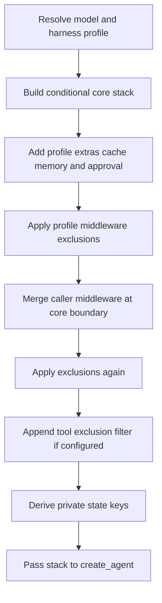

# Middleware Stack and Ordering

`create_deep_agent()` is a harness assembler, not a separate agent runtime. It resolves the model and applicable `HarnessProfile`, constructs ordered `AgentMiddleware`, and passes the final main stack to LangChain's `create_agent()`, which owns the model/tool loop. The passed-through graph options include the system prompt, tools, response format, schemas, checkpointing, store, debugging, name, and cache. See [SDK construction and execution](/openwiki/architecture/sdk-construction-execution.md) for the runtime boundary.

Middleware is the request-time extension boundary. A `wrap_model_call()` hook intercepts every LLM request before it is sent, so it can change the effective system prompt, history, tool list, or typed cross-turn state. In contrast, a callable in `tools=` runs only if the model selects it; it cannot prepare a model request. Caller tools are additive to built-ins. Use middleware for per-request behavior, prompt/tool injection, or state; use an ordinary tool for a self-contained operation. See [middleware catalog](/openwiki/concepts/middleware-catalog.md).

## Main-agent assembly

Membership is conditional on inputs and the resolved profile. `skills`, subagent forms, memory, filesystem permissions, interrupt configuration, profile extras, installed provider integrations, and profile exclusions all affect the result. The flow shows the ordering and the two points where profile policy constrains caller customization.

Diagram: main-stack assembly, including the ordering-dependent exclusion and caller-insertion stages.

### Core, tail, and final filter

The **core band** is assembled in this order:

1. `SkillsMiddleware`, when `skills` is supplied.
2. `FilesystemMiddleware`.
3. `SubAgentMiddleware`, when synchronous inline subagents exist—normally because the general-purpose subagent is added.
4. Deep Agents summarization middleware.
5. `PatchToolCallsMiddleware`.
6. `AsyncSubAgentMiddleware`, when remote async specs exist.

`PatchToolCallsMiddleware.before_agent()` repairs persisted dangling valid or invalid tool calls before an agent run: for each unanswered call ID it inserts an error `ToolMessage`, preserving a coherent message history after cancellation, interruption, or malformed/truncated arguments.

The **tail band** appends materialized `HarnessProfile.extra_middleware`, provider prompt-caching middleware, `MemoryMiddleware` when configured, and `HumanInTheLoopMiddleware` when the resolved interrupt mapping is non-empty. Cache middleware is before memory deliberately: profile extras run before caching, and memory's system-prompt mutations occur after the Anthropic cache prefix. Anthropic caching is always installed with unsupported models ignored. Bedrock and Fireworks variants are added only when their integration packages can be imported, and also ignore unsupported models.

The first profile-exclusion pass runs after the tail is assembled. Caller `middleware=` is then merged, exclusions run again, and `_ToolExclusionMiddleware` is appended only when the profile has `excluded_tools`. Being last matters: it sees the near-final request after tool-producing middleware and caller model wrappers, so excluded names cannot be restored by a caller wrapper.

The assembler also combines an explicit `state_schema` with middleware-contributed schemas, derives private state-field names, and assigns them to `SubAgentMiddleware`. This determines what ordinary synchronous delegation may carry across its state boundary.

### Context management and overflow recovery

The default summarization component reconstructs effective messages from prior summary events, then can truncate large old tool arguments before deciding whether to summarize. It summarizes when its threshold is met or the calculated input is over budget; even below threshold, a recognized provider context-overflow error triggers the same recovery path.

Before summarizing, it offloads the compacted history to the backend. The summary event records the cutoff, replacement summary message, and backend file path, while the private session ID is retained for subsequent turns. If history offload fails, summarization still proceeds but emits a warning that older messages are unrecoverable. Large trailing tool results can also be replaced with backend-backed references to make a request fit.

Recovery is deliberately bounded. After compaction it verifies the complete request against the input budget, including prompt, tools, and output allowance; irreducible input raises `ContextOverflowError` without sending it. A recognized overflow gets at most one smaller retry, and a second overflow raises rather than repeatedly resending. The synchronous and asynchronous wrappers implement the same control flow. See [context management](/openwiki/concepts/context-management.md).

## Caller middleware and profile exclusions

Caller middleware is merged by `.name`, rather than blindly appended:

- A caller entry whose name remains in the base stack replaces that slot in place, retaining its position.
- A new name is inserted after the last surviving core member, ahead of profile extras, prompt caching, memory, and approval middleware.
- The first exclusion pass occurs before merging; the second removes an attempt to reintroduce an excluded name or exact class.

This gives callers a controlled way to replace a built-in behavior. For example, a caller can supply a `FilesystemMiddleware` with the same name and a narrower `tools=[...]` set to remove a filesystem tool entirely; `tools=` alone cannot do that. Custom middleware that uses a new name is intentionally not copied into the general-purpose subagent merely because it was installed on the main agent.

A `HarnessProfile` can subtract entries with `excluded_middleware`, subject to safety and coverage checks:

- `FilesystemMiddleware` and `SubAgentMiddleware` are protected scaffolding. Excluding either by class or name raises `ValueError`, rather than silently breaking built-in filesystem/permission behavior or the synchronous `task` handler.
- Class entries use exact `type`, not `isinstance`; excluding a base class does not remove a caller subclass. String entries match `AgentMiddleware.name` exactly, permitting a public alias such as `SummarizationMiddleware` to target an implementation class with a different `__name__`.
- A string exclusion that matches multiple distinct classes in one stack is ambiguous and raises `ValueError`. Every permitted entry must match somewhere; unmatched entries raise after assembly, catching typos and stale profiles.

For a main profile, match sets accumulate across the main-agent and auto-added general-purpose stacks, then coverage is checked once both have been filtered. Thus an exclusion may legitimately apply to only one of those stacks. A declarative subagent that resolves another profile performs its own validation, filtering, and coverage check.

### Tool visibility is not authorization

`excluded_tools` adds final `_ToolExclusionMiddleware`, which removes named tools from model requests and returns an error instead of executing an excluded name at the tool-call boundary. This maintains consistency between advertised and executable tools, but is explicitly not a security surface.

Filesystem permissions are enforced by `FilesystemMiddleware` at calls to its built-in tools, not by the backend. Direct backend use therefore bypasses these middleware-level permission rules. Permission rules and approval behavior are covered in [permissions and human-in-the-loop](/openwiki/concepts/permissions-hitl.md).

## Separate subagent paths

Subagent form is determined during assembly: a spec with `graph_id` becomes an `AsyncSubAgent` handled by `AsyncSubAgentMiddleware`; one with `runnable` is a `CompiledSubAgent`; otherwise it is a declarative `SubAgent`. These forms have different construction and inheritance boundaries.

### Declarative subagents

Every declarative spec resolves its own model and harness profile and builds an independent stack. An isolated child orders `FilesystemMiddleware`, summarization, `PatchToolCallsMiddleware`, then its declared skills; a fork instead puts inherited top-level skills before filesystem. Both then add profile extras and caching, apply exclusions before and after spec middleware, validate coverage, and append the final tool filter. A fork also mirrors top-level memory when configured.

A fork merges parent caller middleware with spec middleware by name, with the spec entry winning on a collision; that lets its stack rebuild parent prompt-producing behavior without duplicate middleware names. An isolated child does not receive top-level caller middleware merely by being a child.

A spec inherits top-level tools, permissions, and `interrupt_on` only when it omits each field. Its own permissions replace, rather than extend, parent rules. After those values are resolved, a non-empty interrupt mapping adds `HumanInTheLoopMiddleware` while compiling the declarative graph. Supplied compiled runnables and remote graphs own their own schemas and approval configuration.

The default mode is `isolated`: the child receives a `HumanMessage` containing the delegated task rather than the parent's conversation. `handoff` is accepted as a legacy alias for isolated behavior. Experimental `fork` instead receives the parent's effective compacted history plus a task preamble, and rebuilds the parent prompt with an optional child addendum. A declarative fork cannot specify independent skills; it retains eligible private state channels, while a forked compiled runnable has private keys stripped because its schema is opaque. A forked child is refused if it calls `task`, preventing recursive delegation. See [subagents and skills](/openwiki/concepts/subagents-skills.md).

### General-purpose, compiled, and async agents

Unless the active profile disables it or an inline synchronous spec already uses its name, the harness adds `general-purpose`. Its own stack contains filesystem, summarization, patching, optional skills, profile extras, caching, exclusion passes, and a final tool filter. It inherits only caller middleware that overrides one of its original default slots—not arbitrary main-agent-only middleware.

A `CompiledSubAgent` runnable is used as supplied. It does not inherit the parent state schema or top-level approval rules, and must return a state with `messages`. The parent returns a `ToolMessage` containing a JSON-serialized structured response when present, otherwise the last non-empty AI text, and merges eligible non-private state updates.

An `AsyncSubAgent` runs through Agent Protocol as a background task. `AsyncSubAgentMiddleware` returns and tracks task IDs in middleware state instead of blocking the parent `task` call; graph schema and approval behavior belong to the remote graph.

## Safe changes and focused tests

Ordering changes alter what the model sees and what tools can execute. Test assembled stacks, not only middleware constructors. Graph tests cover replacement versus insertion, both exclusion passes, protected-scaffolding and ambiguous-name failures, coverage across main and general-purpose stacks, and subagent stack assembly. Tool-exclusion tests compile an agent and verify that a scripted call to an excluded tool errors without reaching the backend while an allowed call still runs.

For context management, exercise sync and async paths with threshold and provider-overflow triggers. The recovery tests assert that an oversized tail is reduced before sending, only one smaller retry follows an overflow, repeated overflow raises, and known irreducible prompt/tool/output overhead never reaches the server. Separately test dangling valid and invalid tool-call repair, and the declarative, compiled, async, isolated, and fork paths—especially private-state treatment, fork prompt/history construction, recursive-delegation refusal, and the structured-response fallback.
