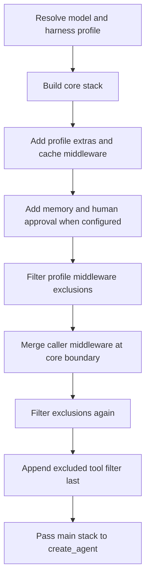

# Middleware Stack

`create_deep_agent()` is an opinionated harness assembler, not a new agent runtime. It resolves the model and applicable `HarnessProfile`, builds ordered `AgentMiddleware` lists, and gives the main list, tools, prompt, schemas, persistence objects, and execution options to LangChain's `create_agent()`. LangChain builds the model/tool loop on LangGraph. For the broader construction/runtime split, see [SDK construction and execution](/openwiki/architecture/sdk-construction-execution.md).

Middleware is the extension boundary for behavior that must participate in an LLM request. An `AgentMiddleware` can use `wrap_model_call()` on every request to change the effective tools, system prompt, message history, or typed graph state. A callable in `tools=` instead runs only after the model elects to call it. Caller tools are additive to the built-in suite; use a profile's `excluded_tools` to hide a tool from the model, or replace `FilesystemMiddleware` when the filesystem suite itself must change.

## Main-agent assembly

The construction order below is significant. Optional members are omitted when their condition is not met.

Diagram: main-stack construction, including the two middleware-exclusion passes before the final tool filter.

### Exact order

1. **Core stack**
   1. `SkillsMiddleware` when `skills` is supplied.
   2. `FilesystemMiddleware`.
   3. `SubAgentMiddleware` when synchronous inline subagents exist. The automatically added `general-purpose` subagent normally makes this true.
   4. Model/backend-specific summarization middleware.
   5. `PatchToolCallsMiddleware`.
   6. `AsyncSubAgentMiddleware` when `AsyncSubAgent` specs are supplied.
2. **Tail before caller merge**
   1. materialized `HarnessProfile.extra_middleware`;
   2. `AnthropicPromptCachingMiddleware`, followed by optional Bedrock and Fireworks caching middleware when their integration packages are available;
   3. `MemoryMiddleware` when `memory` is supplied;
   4. `HumanInTheLoopMiddleware` when permissions generate interrupt rules or `interrupt_on` supplies rules. For the same tool, an explicit `interrupt_on` entry wins over a generated filesystem-permission entry.
3. Filter `HarnessProfile.excluded_middleware` from the assembled list.
4. Merge caller `middleware=` at the core/tail boundary, then filter exclusions **again**. The second pass prevents callers from restoring an excluded class or name.
5. If the profile has `excluded_tools`, append `_ToolExclusionMiddleware` **after everything else**.

Prompt caching is installed even for unsupported models: Anthropic caching is always appended with `unsupported_model_behavior="ignore"`; Bedrock and Fireworks variants are appended only when their packages can be imported and use the same behavior. An installed cache middleware can therefore be inert for the request model. Profile extras precede caching, while memory follows it so memory's system-prompt updates do not invalidate the Anthropic cache prefix.

The final main stack also defines the state boundary for synchronous delegation. `create_deep_agent()` combines an explicit `state_schema` with state schemas contributed by middleware, identifies private fields, and gives those keys to `SubAgentMiddleware` so ordinary subagent dispatch does not expose them.

## Caller placement and replacement semantics

Caller middleware is not simply appended. The core names are captured before profile/tail members are added.

- If a caller entry's `.name` still exists in the working stack, it replaces that entry in place, preserving its position. This is the supported way to replace a default slot without changing relative order.
- Otherwise, new caller entries are inserted immediately after the last surviving core member and before profile extras, caching, memory, and approval middleware.
- Replacement is assessed after the first exclusion pass. An excluded slot is no longer present to replace; a caller entry with that name becomes a new core-boundary entry, and the second pass removes it if its name or exact class is excluded.

This positioning lets request-shaping application middleware run after core capability providers but before tail middleware reacts to the nearly final prompt and tool surface. See [middleware catalog](/openwiki/concepts/middleware-catalog.md) for individual responsibilities.

## Exclusion and tool-surface invariants

A `HarnessProfile` can subtract middleware and model-visible tools. These are deliberately different controls.

- `FilesystemMiddleware` and `SubAgentMiddleware` are protected scaffolding. The former backs the built-in file tools and filesystem permission enforcement; the latter backs the synchronous `task` handler. Excluding either by class or name raises `ValueError` rather than yielding a silently degraded agent.
- Middleware exclusions use exact identity semantics: class entries match `type(middleware) is entry`, not `isinstance`; string entries match `AgentMiddleware.name` exactly. A base-class exclusion consequently does not remove a caller subclass. A public name can target an implementation class whose `.name` differs from `__name__`.
- A string exclusion matching more than one distinct concrete class in one stack raises `ValueError`; use a class-form exclusion to disambiguate. Every legitimate exclusion must match somewhere. For the main profile, matching is accumulated across the main and auto-added general-purpose stacks and checked after both are filtered; a subagent resolving another profile is checked independently.
- `_ToolExclusionMiddleware` filters names from each model request **and** rejects an attempted excluded tool call at the tool-call boundary. It is a consistency/visibility control, not a substitute for authorization; filesystem permissions enforce built-in filesystem access. Because the filter is final, middleware that injects tools and caller `wrap_model_call()` code cannot restore an excluded name.

The practical distinction matters: a missing tool usually points to stack assembly, a profile exclusion, or backend capability; a visible file tool that later fails can instead be a permission decision. See [permissions and human-in-the-loop](/openwiki/concepts/permissions-hitl.md).

## Separate subagent construction paths

Determine the subagent form before diagnosing delegated behavior. At assembly time, a spec with `graph_id` goes to `AsyncSubAgentMiddleware`; a spec with `runnable` is a `CompiledSubAgent`; every other spec is a declarative `SubAgent` assembled by Deep Agents. Main-agent middleware therefore does not retrofit a supplied runnable or a remote graph.

### Declarative `SubAgent`: isolated by default

The current `SubAgent` contract calls the default mode **`isolated`**: the child receives the delegated task as its message input rather than the parent's conversation. `mode="handoff"` is accepted only as a legacy alias for isolated behavior; it is not a separate current mode and does not fork context. `mode="fork"` is the experimental opt-in that continues the parent's conversation.

Each declarative spec resolves its own model and harness profile, then gets an independent stack:

1. `FilesystemMiddleware`, summarization middleware, and `PatchToolCallsMiddleware`;
2. `SkillsMiddleware` from the spec's `skills` in isolated mode;
3. subagent-profile extras and provider cache middleware;
4. an exclusion filter, spec middleware merged at the subagent core boundary, a second exclusion filter, coverage verification, and finally `_ToolExclusionMiddleware` when that profile excludes tools.

A declarative subagent inherits top-level tools, permissions, and `interrupt_on` only when its spec omits the corresponding field. Its own permissions replace rather than extend parent rules. Compilation appends `HumanInTheLoopMiddleware` when the resolved interrupt configuration is non-empty. The parent `state_schema` is forwarded to declarative compilation; compiled and remote forms own compatible schemas themselves.

### Forks: context-preserving, not an additional default

A declarative fork mirrors top-level skills when configured and appends `MemoryMiddleware` after caching when top-level memory is configured; it cannot define independent `skills`. Its prompt is the effective parent prompt plus any subagent prompt addendum. Top-level caller middleware is also inherited for a fork and merged with spec middleware by name, with a same-name spec member winning.

At invocation, a declarative fork receives the parent's effective conversation plus a task preamble and inherits parent state except specifically excluded fork keys. This includes private channels so its matching graph shape can rebuild parent prompt-producing behavior. A compiled fork is more restricted because its runnable is opaque: it receives the forked history but strips private state. Both forms prevent recursive delegation: a forked child that calls `task` receives a refusal instead of launching another child.

### Auto-added general-purpose subagent

Unless the caller supplies a synchronous subagent named `general-purpose` or the profile disables it, the harness inserts this synchronous subagent. Its independent initial stack is filesystem, summarization, patch tool calls, optional top-level skills, profile extras, and caching; it is filtered, receives only caller middleware that overrides one of its own original default slots, is filtered again, and then receives final tool exclusion. Arbitrary main-only caller middleware is not inherited.

The general-purpose spec uses the main model and caller tools, carries main permissions and resolved interrupt configuration, and can receive a profile-specific description or prompt. Disabling it removes the `task` tool only if no other synchronous subagent exists; async subagents remain independent.

### Async and compiled subagents

`CompiledSubAgent` supplies an already-built runnable, so Deep Agents does not assemble its internal middleware, apply top-level interrupt rules, or propagate the parent schema. The runnable must return state with `messages`; when it completes, the parent receives a `ToolMessage` containing a structured response serialized as JSON when present, otherwise the last non-empty AI message text. Other returned state is merged except excluded and private fields.

`AsyncSubAgent` is managed by `AsyncSubAgentMiddleware` as a remote/background Agent Protocol task. It returns a task ID and keeps task records in middleware state rather than blocking the parent task call. Configure schema and approval behavior in the remote graph. See [subagents and skills](/openwiki/concepts/subagents-skills.md) and [state and persistence](/openwiki/concepts/state-persistence.md).

## Safe-change checks

Focused tests in `libs/deepagents/tests/unit_tests/test_graph.py` and `libs/deepagents/tests/unit_tests/test_subagents.py` cover construction wiring, filtering, and dispatch. When changing this assembly path, assert observable invariants rather than only constructor calls:

- exact main and general-purpose ordering, caller replacement position, and new-caller placement before the tail;
- both exclusion passes and final tool filtering, including protected-scaffolding, exact-type, alias, collision, and unmatched-coverage failures;
- isolated default behavior and legacy `handoff` equivalence, fork-only inheritance/skill restrictions, and recursive-delegation refusal;
- declarative inheritance versus compiled/remote ownership boundaries; and
- private-state isolation for ordinary children, plus the intentionally different declarative-fork boundary.
