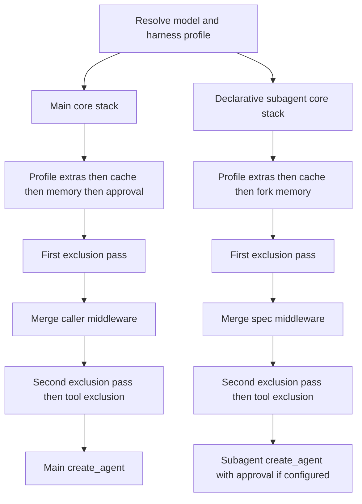

# Deep Agents Middleware Stack

`create_deep_agent()` is a harness assembler, not a separate agent runtime. It resolves the model and applicable `HarnessProfile`, constructs ordered `AgentMiddleware`, and passes the final main stack to LangChain's `create_agent()`, which owns the model/tool loop. The passed-through graph options include the system prompt, tools, response format, schemas, checkpointing, store, debugging, name, and cache. See [SDK construction and execution](/openwiki/architecture/sdk-construction-execution.md) for that runtime boundary.

Middleware is the request-time extension boundary. A `wrap_model_call()` hook intercepts every LLM request before it is sent, so it can change the effective system prompt, history, tool list, or typed cross-turn state. A callable in `tools=`, by contrast, runs only if the model selects it and cannot prepare a model request. Caller tools are additive to built-ins. Use middleware for per-request behavior, prompt/tool injection, or state; use an ordinary tool for a self-contained operation. See [middleware catalog](/openwiki/concepts/middleware-catalog.md).

## Assembly at a glance

Membership is conditional on inputs and the resolved profile. `skills`, synchronous and async subagent forms, memory, filesystem permissions, interrupts, profile extras, installed provider integrations, and exclusions all affect the result. The flow shows the verified ordering and distinguishes the main stack from the independently built declarative-subagent stack.

Diagram: verified assembly paths; main-only components include subagent dispatch, async dispatch, top-level memory, and main approval placement.

## Main-agent ordering

The main **core band** is assembled in this order:

1. `SkillsMiddleware`, when `skills` is supplied.
2. `FilesystemMiddleware`.
3. `SubAgentMiddleware`, when synchronous inline subagents exist—normally because the general-purpose subagent is added.
4. Deep Agents summarization middleware.
5. `PatchToolCallsMiddleware`.
6. `AsyncSubAgentMiddleware`, when remote async specs exist.

`PatchToolCallsMiddleware` runs before an agent begins. If history contains an `AIMessage` tool or invalid-tool call with an ID but no corresponding `ToolMessage`, it replaces the message list with an equivalent list containing a synthetic error `ToolMessage` immediately after the unanswered call. Completed calls and empty history are left alone. This repairs an interrupted, cancelled, or malformed historical tool interaction before the next model loop.

The **tail band** then appends materialized `HarnessProfile.extra_middleware`, provider prompt-caching middleware, `MemoryMiddleware` when configured, and `HumanInTheLoopMiddleware` when the resolved interrupt mapping is non-empty. The interrupt mapping merges filesystem permission-derived approvals with `interrupt_on`; an explicit user entry wins for the same tool name.

Cache middleware is before memory deliberately: profile extras precede caching, and memory's system-prompt mutations occur after the Anthropic cache prefix. Anthropic caching is always installed with unsupported models ignored. Bedrock and Fireworks variants are appended only when their integration packages can be imported; unrelated import failures still propagate, while unavailable optional integrations simply contribute no middleware.

The first profile-exclusion pass runs after the tail is assembled. Caller `middleware=` is then merged, exclusions run again, and `_ToolExclusionMiddleware` is appended only when the profile has `excluded_tools`. Thus an exclusion may remove an approval middleware, but a configured final tool filter cannot be removed or bypassed through `excluded_middleware`: it is added after filtering.

The assembler also combines an explicit `state_schema` with state schemas contributed by the final middleware list, derives private state-field names, and assigns them to every surviving `SubAgentMiddleware`. This makes a replacement task middleware observe the same private-state boundary as the default one.

### Context-management role

The default summarization component is not merely a prompt addition. It reconstructs effective messages from prior summary events, can truncate large old tool arguments, and compacts history when thresholds are crossed or a recognized context overflow occurs. It offloads history before summarizing, stores the summary event and session ID in private state, and may make one smaller request retry. If even the reduced request cannot fit the input budget, it raises `ContextOverflowError`; if offloading fails, it warns that older messages are unrecoverable. See [context management](/openwiki/concepts/context-management.md).

## Caller middleware and profile exclusions

Caller middleware is merged by `.name`, rather than blindly appended:

- A caller entry whose name remains in the base stack replaces that slot in place, retaining its position.
- A new name is inserted after the last surviving core member, ahead of profile extras, prompt caching, memory, and approval middleware.
- The first exclusion pass occurs before merging; the second removes an attempt to reintroduce an excluded name or exact class.

This gives callers a controlled way to replace a built-in behavior. For example, a caller can supply a `FilesystemMiddleware` with the same name and a narrower `tools=[...]` set to remove a filesystem tool entirely; `tools=` alone cannot do that. Custom middleware with a new name is intentionally not copied into the general-purpose subagent merely because it was installed on the main agent.

A `HarnessProfile` can subtract entries with `excluded_middleware`, subject to safety and coverage checks:

- `FilesystemMiddleware` and `SubAgentMiddleware` are protected scaffolding. Excluding either by class or name raises `ValueError`, rather than silently breaking built-in filesystem/permission behavior or the synchronous `task` handler.
- Class entries use exact `type`, not `isinstance`; excluding a base class does not remove a caller subclass. String entries match `AgentMiddleware.name` exactly, permitting a public alias such as `SummarizationMiddleware` to target an implementation class with a different `__name__`.
- A string exclusion that matches multiple distinct classes in one stack is ambiguous and raises `ValueError`. Every permitted entry must match somewhere; unmatched entries raise after assembly, catching typos and stale profiles.

For a main profile, match sets accumulate across the main-agent and auto-added general-purpose stacks, then coverage is checked once both have been filtered. Thus an exclusion may legitimately apply to only one of those stacks. A declarative subagent that resolves another profile performs its own validation, filtering, and coverage check.

### Tool visibility is not authorization

`excluded_tools` adds final `_ToolExclusionMiddleware`, which removes named tools from model requests and returns an error instead of executing an excluded name at the tool-call boundary. This maintains consistency between advertised and executable tools, but is explicitly not a security surface.

Filesystem permissions are enforced by `FilesystemMiddleware` at calls to its built-in tools, not by the backend. Direct backend use therefore bypasses these middleware-level permission rules. Permission rules and approval behavior are covered in [permissions and human-in-the-loop](/openwiki/concepts/permissions-hitl.md).

## Separate subagent paths

Subagent form is determined during assembly: a spec with `graph_id` becomes an `AsyncSubAgent` handled by `AsyncSubAgentMiddleware`; one with `runnable` is a `CompiledSubAgent`; otherwise it is a declarative `SubAgent`. These forms have different construction and inheritance boundaries.

### Declarative subagents

Every declarative spec resolves its own model and harness profile and builds an independent stack: `FilesystemMiddleware`, summarization, and `PatchToolCallsMiddleware`; isolated-spec skills or forked-parent skills; profile extras; prompt caching; two exclusion passes around spec middleware; coverage validation; then the final tool filter. A fork also mirrors top-level memory when configured. Unlike the main graph, approval is appended by `create_sub_agent()` after this prepared stack when the resolved interrupt configuration is non-empty.

A spec inherits top-level tools, permissions, and `interrupt_on` only when it omits each field. Its own permissions replace, rather than extend, parent rules. The resolved permission-derived approvals and explicit interrupts are merged before compilation, and an explicit interrupt entry wins on a colliding tool name. The parent `state_schema` is supplied to declarative compilation; supplied compiled runnables and remote graphs own their own schemas and approval configuration.

The default mode is `isolated`: the child receives a `HumanMessage` containing the delegated task rather than the parent's conversation. `handoff` is accepted as a legacy alias for isolated behavior. Experimental `fork` instead receives the parent's effective compacted history plus a task preamble, and rebuilds the parent prompt with an optional child addendum. A declarative fork cannot specify independent skills; it retains eligible private state channels, while a forked compiled runnable has private keys stripped because its schema is opaque. A forked child is refused if it calls `task`, preventing recursive delegation. See [subagents and skills](/openwiki/concepts/subagents-skills.md).

### General-purpose, compiled, and async agents

Unless the active profile disables it or an inline synchronous spec already uses its name, the harness adds `general-purpose`. Its own stack contains filesystem, summarization, patching, optional skills, profile extras, caching, exclusion passes, and a final tool filter. It inherits only caller middleware that overrides one of its original default slots—not arbitrary main-agent-only middleware.

A `CompiledSubAgent` runnable is used as supplied. It does not inherit the parent state schema or top-level approval rules, and must return a state with `messages`. The parent returns a `ToolMessage` containing a JSON-serialized structured response when present, otherwise the last non-empty AI text, and merges eligible non-private state updates.

An `AsyncSubAgent` runs through Agent Protocol as a background task. `AsyncSubAgentMiddleware` returns and tracks task IDs in middleware state instead of blocking the parent `task` call; graph schema and approval behavior belong to the remote graph.

## Safe changes and focused tests

Ordering changes alter what the model sees and what tools can execute. Test assembled stacks, not only middleware constructors. Focus tests on replacement versus insertion, both exclusion passes, final request/tool-call filtering, protected-scaffolding and ambiguous-name failures, and coverage across main and general-purpose stacks. Test the separate declarative, compiled, async, isolated, and fork paths—especially private-state treatment, fork prompt/history construction, recursive-delegation refusal, and the structured-response fallback. Test history repair with answered, dangling, and invalid tool calls as well as normal empty history; the repair must preserve ordering and insert an error result only for unanswered call IDs.
