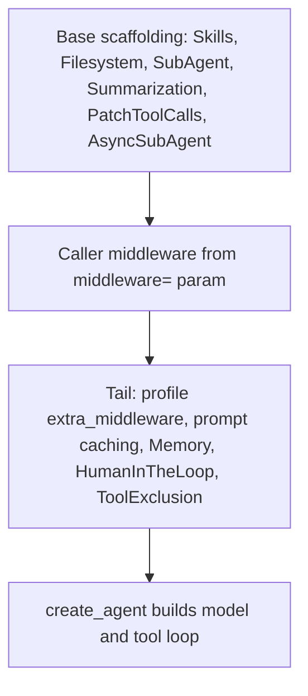

# Middleware Stack

Deep Agents is an opinionated harness built on top of LangChain's
`create_agent()`. It does not introduce a new runtime; instead
[`create_deep_agent()`](repo://libs/deepagents/deepagents/graph.py) assembles an
ordered list of `AgentMiddleware` and hands it to `create_agent()`, which builds
the model/tool loop. Almost everything the harness adds — filesystem tools,
subagent delegation, summarization, prompt caching, memory injection, human
approval — is delivered as middleware in that stack. This page explains how the
stack is composed and why its ordering is deliberate.

## Middleware vs. a plain `tools=` callable

The distinction between middleware and a plain tool is the central reason the
harness is built the way it is. A callable passed through `tools=` is only
invoked *after* the model chooses to call it; it cannot see or change the
request before the model call. Middleware subclasses `AgentMiddleware` and
overrides hooks such as `wrap_model_call()`, which intercepts *every* LLM
request before it is sent. That lets middleware rewrite the tool list, inject
system-prompt context, transform message history, and maintain typed cross-turn
state — none of which a plain tool can do.

Concretely, middleware can filter tools dynamically (for example,
`FilesystemMiddleware` removing the `execute` tool when the resolved backend
cannot run shells), inject prompt context on every call (`MemoryMiddleware`,
`SkillsMiddleware`), transform history (`SummarizationMiddleware`), and persist
typed state across turns. Caller-supplied `tools=` are additive: they are merged
into the final tool set but never remove a built-in. See
[tools & filesystem](repo://openwiki/concepts/tools-filesystem.md) for how the
visible tool surface is ultimately resolved.

## The three-band model

The assembled stack is best understood as three bands, in order:

1. **Base scaffolding** — the capabilities every deep agent is expected to have.
2. **Caller middleware** — application-specific middleware spliced into the
   middle without rebuilding the harness.
3. **Profile / tail middleware** — behavior that must run *after* the prompt and
   tool surface are otherwise final: harness-profile extras, tool exclusion,
   provider prompt caching, memory injection, and human approval.

Diagram: the three bands the harness assembles before delegating to `create_agent()`.

The exact default ordering lives in code and in the `middleware` parameter
documentation on `create_deep_agent()`; treat that parameter as the source of
truth rather than memorizing an ordering here. The base scaffolding is appended
first, then caller middleware, then the tail
([main-agent assembly](repo://libs/deepagents/deepagents/graph.py#L815-L892)).

### Why the tail depends on the final prompt and tool surface

Tail members are ordered late on purpose because they react to the request as it
will actually be sent. Provider prompt-caching middleware
(`AnthropicPromptCachingMiddleware`, and optionally Bedrock/Fireworks when their
integration packages are installed) is appended after the harness-profile extras
so that per-turn changes do not repeatedly invalidate the cache prefix; in
particular `MemoryMiddleware` is placed *after* prompt caching because it mutates
the system prompt, and putting it earlier would invalidate the Anthropic cache
prefix ([tail ordering rationale](repo://libs/deepagents/deepagents/graph.py#L855-L869)).
Prompt-caching middleware is unconditional but no-ops for models it does not
apply to ([append_prompt_caching_middleware](repo://libs/deepagents/deepagents/middleware/_prompt_caching.py#L41-L49)),
so it is a good example of middleware that may be installed but never
fire for a given model — see [runtime behavior](repo://openwiki/runtime-behavior.md)
for reasoning about installed-but-inert middleware.

Tool exclusion is appended *last* so excluded tool names are stripped after every
tool-injecting middleware — including any caller `wrap_model_call` — has run, and
cannot be restored ([tool exclusion runs last](repo://libs/deepagents/deepagents/graph.py#L889-L892)).

## How caller middleware is spliced in

Caller middleware passed via the `middleware=` parameter is merged by name, not
simply appended. If a caller middleware's `.name` matches a member already in the
base stack, it *replaces* that member in place, preserving stack position;
otherwise it is inserted after the last "core" member so it precedes the
profile/prompt-caching/memory tail
([_apply_custom_middleware](repo://libs/deepagents/deepagents/graph.py#L201-L235)).
The core-name set is captured before the tail is appended, which is what makes
this "insert ahead of the tail" behavior deterministic
([core names captured](repo://libs/deepagents/deepagents/graph.py#L852-L854)).

## Required scaffolding cannot be removed

Two middleware classes are treated as protected scaffolding —
`FilesystemMiddleware` (which backs every built-in file tool and enforces
`permissions`) and `SubAgentMiddleware` (which backs the `task` tool handler).
Removing either silently breaks core features, so they are registered as required
and cannot be excluded ([_REQUIRED_MIDDLEWARE](repo://libs/deepagents/deepagents/graph.py#L238-L265)).

## Profile-driven exclusions

Beyond user middleware, an active `HarnessProfile` can subtract middleware from
the assembled stack via `excluded_middleware`. This machinery lives in
[`_excluded_middleware.py`](repo://libs/deepagents/deepagents/_excluded_middleware.py)
and runs in three phases:

- **Validation** rejects any exclusion that targets required scaffolding, before
  any stack is filtered ([_validate_excluded_middleware_config](repo://libs/deepagents/deepagents/_excluded_middleware.py#L23-L64)).
- **Filtering** drops matching members. Class entries match on *exact type* (not
  `isinstance`), so a caller's subclass survives when the profile excludes the
  base class; string entries match `AgentMiddleware.name` exactly, which lets a
  public alias such as `"SummarizationMiddleware"` drop an implementation class
  whose `.name` differs from its `__name__`
  ([_apply_excluded_middleware](repo://libs/deepagents/deepagents/_excluded_middleware.py#L90-L165)).
- **Coverage verification** raises `ValueError` if any exclusion entry matched
  nothing across all the stacks the profile applies to, catching typos and stale
  profiles ([_verify_excluded_middleware_coverage](repo://libs/deepagents/deepagents/_excluded_middleware.py#L168-L199)).

A string exclusion that matches more than one distinct class within a single
stack is also rejected, forcing the caller to disambiguate with a class-form
exclusion ([name-collision guard](repo://libs/deepagents/deepagents/_excluded_middleware.py#L67-L87)).

Because a profile-level entry only has to match *somewhere*, exclusion is applied
per stack while matches are accumulated into shared sets, and coverage is checked
once after every stack (main agent plus general-purpose subagent) has been
filtered ([accumulated matches](repo://libs/deepagents/deepagents/graph.py#L614-L619),
[coverage after all stacks](repo://libs/deepagents/deepagents/graph.py#L898-L908)).

## Subagents have their own stacks

A behavior observed only during delegated work usually comes from a *different*
middleware stack than the main agent's. Each declarative `SubAgent` gets its own
independently assembled stack — filesystem, summarization, patch-tool-calls, its
own skills, its own harness-profile extras (resolved for that subagent's model),
prompt caching, exclusion filtering, its own spec-level middleware, and tool
exclusion — built from the subagent's own resolved profile
([subagent stack assembly](repo://libs/deepagents/deepagents/graph.py#L664-L742)).
The auto-added general-purpose subagent is assembled the same way and only
inherits caller middleware that overrides one of its default slots, not
main-agent-specific middleware
([GP subagent stack](repo://libs/deepagents/deepagents/graph.py#L749-L793)).

Subagents come in several forms — declarative `SubAgent`, pre-compiled
`CompiledSubAgent`, and background `AsyncSubAgent` routed to
`AsyncSubAgentMiddleware` — and each carries its own configuration
([subagent routing](repo://libs/deepagents/deepagents/graph.py#L644-L653)). When
debugging delegated behavior, first determine which subagent type handled the
task before changing main-agent middleware; changing the main stack will not
affect a compiled or async subagent. See the
[middleware catalog](repo://openwiki/concepts/middleware-catalog.md) for the
individual middleware and
[SDK construction & execution](repo://openwiki/architecture/sdk-construction-execution.md)
for how the assembled graph is invoked.
