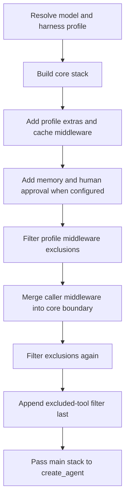

# Middleware Stack

`create_deep_agent()` is a harness assembler, not a new agent runtime. It resolves the model and applicable `HarnessProfile`, constructs ordered `AgentMiddleware` lists, and passes the main list, tools, prompt, schemas, persistence objects, and execution options to LangChain's `create_agent()`. LangChain builds the model/tool loop on LangGraph.

Middleware is consequently the extension boundary for behavior that must participate in an LLM request. An `AgentMiddleware` can use hooks such as `wrap_model_call()` on every request to alter the effective tools, system prompt, message history, or typed graph state. A callable in `tools=` instead runs only after the model elects to call it. Caller tools are additive to the built-in suite; use a profile's `excluded_tools` to hide a tool from the model, or replace `FilesystemMiddleware` when the filesystem suite itself must change.

## Main-agent assembly

The order below is the construction order. Optional entries are omitted when their condition is not met.

Diagram: main-stack construction and the two exclusion-filtering passes before the final tool filter.

### Exact order

1. **Core stack**
   1. `SkillsMiddleware` when `skills` is supplied.
   2. `FilesystemMiddleware`.
   3. `SubAgentMiddleware` when there are synchronous inline subagents. The default `general-purpose` subagent normally makes this true.
   4. the model/backend-specific summarization middleware.
   5. `PatchToolCallsMiddleware`.
   6. `AsyncSubAgentMiddleware` when `AsyncSubAgent` specs are supplied.
2. **Tail before caller merge**
   1. materialized `HarnessProfile.extra_middleware`;
   2. `AnthropicPromptCachingMiddleware`, followed by optional Bedrock and Fireworks caching middleware when their integration packages are installed;
   3. `MemoryMiddleware` when `memory` is supplied;
   4. `HumanInTheLoopMiddleware` when either permissions generate interrupt rules or `interrupt_on` supplies rules. For the same tool, an explicit `interrupt_on` entry wins over the generated filesystem-permission entry.
3. Filter `HarnessProfile.excluded_middleware` from this assembled list.
4. Merge caller `middleware=` at the core/tail boundary, then filter exclusions **again**. The second pass prevents caller middleware from restoring an excluded class or name.
5. If the profile has `excluded_tools`, append `_ToolExclusionMiddleware` **after everything else**. It filters both caller tools and tools injected by middleware after caller `wrap_model_call()` has run, so an excluded name cannot be restored later.

Prompt caching is installed even for unsupported models: Anthropic caching uses `unsupported_model_behavior="ignore"`; Bedrock and Fireworks counterparts are appended only if their packages import successfully and use the same behavior. Thus installed caching middleware can be inert for the request model. Profile extras precede caching, while memory follows it: memory's system-prompt changes then do not invalidate the Anthropic cache prefix.

The final main stack also contributes state schemas. `create_deep_agent()` collects its explicit `state_schema` plus each middleware state schema, identifies private state keys, and gives those keys to `SubAgentMiddleware` so they are not exposed when it dispatches work.

## Caller placement and replacement semantics

Caller middleware is not simply appended. The core middleware names are captured before profile/tail entries are added.

- If a caller entry's `.name` still exists in the working stack, it replaces that entry in place. This is the supported way to replace a default slot without changing its relative position.
- Otherwise, all new caller entries are inserted immediately after the last surviving core entry and before profile extras, prompt caching, memory, and approval middleware.
- Replacement uses the current list after the first exclusion pass. An excluded slot is no longer present to replace; a caller entry with that name is inserted at the core boundary and the second exclusion pass removes it if the profile excludes that name or its exact class.

This positioning is important for request-shaping extensions: caller middleware can run after core capability providers but before the tail that reacts to the nearly final prompt and tool surface. See [middleware catalog](/openwiki/concepts/middleware-catalog.md) for the responsibilities of individual members.

## Profile exclusion invariants

A `HarnessProfile` controls runtime shaping after model construction, including extras, middleware exclusions, tool visibility, and the default subagent. Its `excluded_middleware` is a subtractive policy with deliberate failure behavior:

- `FilesystemMiddleware` and `SubAgentMiddleware` are protected scaffolding. The former backs built-in filesystem tools and filesystem permission enforcement; the latter backs synchronous `task` dispatch. Class- or name-form exclusion of either raises `ValueError` rather than constructing a degraded agent.
- Class-form entries match `type(middleware) is entry`, not `isinstance`. Excluding a base class therefore does not remove a caller subclass.
- String-form entries match `.name` exactly, including a public alias such as `"SummarizationMiddleware"` for the internal summarization implementation. A plain string beginning with `_` is rejected by profile configuration; on-disk `HarnessProfileConfig` supports strings, while runtime `HarnessProfile` can also receive classes.
- If one string matches more than one distinct middleware class within one stack, filtering raises `ValueError`; use a class entry to disambiguate. Filtering otherwise preserves the relative order of retained entries.
- Every exclusion must match. For the main profile, matches are accumulated across the main and auto-added general-purpose stacks and verified once after both are filtered. Thus an entry may target only one of those stacks, but a typo or stale entry that matches neither raises `ValueError`.

A declarative subagent may resolve a different profile from its own model. Its profile is validated, filtered, and coverage-checked independently; it is not part of the main profile's shared main/general-purpose coverage set.

## Separate subagent construction paths

Determine the subagent form before diagnosing delegated behavior. `create_deep_agent()` routes a spec with `graph_id` to `AsyncSubAgentMiddleware`; a spec with `runnable` is a `CompiledSubAgent` used as supplied through the synchronous task mechanism; every other spec is a declarative `SubAgent` that Deep Agents assembles and later compiles. Therefore, changing main-agent middleware does not retrofit a precompiled runnable or a remote async graph.

### Declarative `SubAgent`

Each declarative spec resolves its own model and harness profile, then gets an independent stack:

1. `FilesystemMiddleware`, summarization middleware, and `PatchToolCallsMiddleware`;
2. `SkillsMiddleware` from the spec's `skills` for the default isolated (`handoff`) mode;
3. the subagent profile's materialized extras and provider cache middleware; a `fork` instead mirrors parent skills when top-level `skills` is configured and, when top-level `memory` is configured, adds `MemoryMiddleware` after caching;
4. an exclusion filter, spec middleware merged at the subagent core boundary, a second exclusion filter, coverage verification, and finally `_ToolExclusionMiddleware` when that subagent profile excludes tools.

A normal declarative subagent inherits top-level tools unless its spec supplies `tools`, and inherits permissions and `interrupt_on` unless it overrides them. Its own permissions replace inherited permissions rather than extending them. When `create_sub_agent()` compiles the processed spec, it appends `HumanInTheLoopMiddleware` if the resolved interrupt configuration is non-empty. The parent `state_schema` is forwarded to declarative compilation; compiled and remote subagents are responsible for compatible schemas themselves.

`mode="fork"` is experimental. It continues the parent conversation and rebuilds the parent prompt context rather than beginning with only the delegated task. It cannot specify its own skills; its prompt addendum is appended to the inherited prompt. For a fork, top-level caller middleware is also inherited and combined with spec middleware by name, with the spec's same-name entry winning.

### Auto-added general-purpose subagent

Unless a caller supplies a synchronous subagent named `general-purpose` or the profile disables it, the harness inserts this synchronous subagent. Its initial stack is deliberately separate and ordered as filesystem, summarization, patch tool calls, optional top-level skills, profile extras, and caching. It is filtered, receives only caller middleware whose name overrides one of its original default slots, is filtered again, and then gets final tool exclusion. Arbitrary main-only caller middleware is not inherited.

The general-purpose spec uses the main model and caller tools, carries the main permissions and resolved interrupt configuration, and can have its description or prompt changed by `GeneralPurposeSubagentProfile`. Disabling it removes the `task` tool only when no other synchronous subagent exists; async subagents remain independent.

### Async and compiled subagents

`CompiledSubAgent` supplies an already-built runnable, so Deep Agents does not assemble its internal middleware, apply top-level interrupt rules, or propagate the parent schema into it. `AsyncSubAgent` is a remote Agent Protocol task managed by `AsyncSubAgentMiddleware`; it returns a task ID rather than blocking and tracks task records in its middleware state. It likewise owns approval and schema behavior at the remote graph. See [subagents & skills](/openwiki/concepts/subagents-skills.md) for delegation semantics and [permissions & HITL](/openwiki/concepts/permissions-hitl.md) for approval policy.

## Safe-change checks

When changing this assembly code, test the observable invariants rather than only constructor calls: assert the exact main and general-purpose ordering; assert that a caller replacement stays in its slot and a new caller entry lands before the tail; assert both exclusion passes remove profile-excluded caller middleware; and assert tool exclusion is after caller middleware. Cover required-scaffolding rejection, exact-type and name alias behavior, collision and unmatched-exclusion failures, and shared main/general-purpose coverage. For subagents, cover a differently profiled declarative model, default versus fork skill behavior, general-purpose inheritance restrictions, and the fact that compiled and async forms bypass declarative assembly. The focused construction and exclusion tests live in `libs/deepagents/tests/unit_tests/test_graph.py`.
