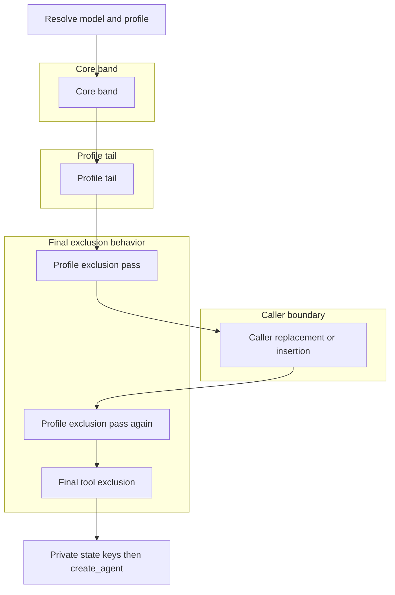

# Middleware Stack and Extension Boundaries

`create_deep_agent()` is a harness assembler rather than another agent runtime. It resolves a model and its applicable `HarnessProfile`, builds an ordered list of `AgentMiddleware`, and passes it to LangChain's `create_agent()`, which owns the model/tool loop. The harness forwards system prompt, tools, response format, schemas, checkpointing, store, debugging, name, and cache. See [SDK construction and execution](/openwiki/architecture/sdk-construction-execution.md).

Middleware is the request-time extension boundary. Its `wrap_model_call()` hook runs before every LLM request and can alter the effective prompt, history, tools, or typed cross-turn state. A callable passed through `tools=` instead runs only after the model selects it; it cannot prepare a request. Caller tools are additive to built-ins. Use middleware for request transformation, dynamic tool/prompt injection, or state; use a plain tool for a self-contained operation. See [middleware catalog](/openwiki/concepts/middleware-catalog.md).

## Main-agent assembly and ordering

Membership is conditional: skills, synchronous or async subagents, memory, permissions, interrupts, profile extras, installed provider packages, and profile exclusions determine which optional entries appear. The diagram separates the core stack, profile tail, caller splice, and final exclusion behavior.

Diagram: the source-defined assembly sequence; profile filtering surrounds the caller splice and tool exclusion is final.

The **core band** is assembled in this order:

1. `SkillsMiddleware`, when `skills` is supplied.
2. `FilesystemMiddleware`.
3. `SubAgentMiddleware`, when synchronous inline subagents exist—normally because the default general-purpose subagent is enabled.
4. Deep Agents summarization middleware.
5. `PatchToolCallsMiddleware`.
6. `AsyncSubAgentMiddleware`, when remote async specs exist.

The **profile tail** then appends materialized `HarnessProfile.extra_middleware`, provider prompt-caching middleware, `MemoryMiddleware` when configured, and `HumanInTheLoopMiddleware` when the resolved interrupt mapping is non-empty. Cache middleware precedes memory deliberately: profile extras run before caching, while memory mutations of the system prompt occur after the Anthropic cache prefix.

`append_prompt_caching_middleware()` always adds Anthropic caching with unsupported models configured to ignore. It adds Bedrock and Fireworks caching only when the respective integration package is available; their unsupported models also no-op. A missing optional integration is tolerated, but an unrelated import failure is re-raised.

The first profile-exclusion pass runs after the tail, caller `middleware=` is merged, and the second pass removes any attempted reintroduction. `_ToolExclusionMiddleware` is appended only when `excluded_tools` is set. As the last stack member, it filters the near-final request after tool-producing middleware and caller model wrappers, so an excluded name cannot be restored.

Finally, the assembler combines an explicit `state_schema` and every middleware-provided schema, derives private field names, and applies them to every surviving `SubAgentMiddleware` instance. This preserves the private-state boundary even if a caller has replaced the default task middleware.

### Skills and context lifecycle

`SkillsMiddleware` uses backend APIs rather than direct filesystem access. Before an agent run, it loads metadata if `skills_metadata` is absent or `None`; a present list, including an empty one in a checkpointed session, skips loading, while setting `None` requests a reload. Sources are processed in order and later definitions of the same skill name win. The middleware injects the resulting skill index and bounded, explicitly untrusted load diagnostics into each model request; its metadata is omitted from output and load errors are private state. See [subagents and skills](/openwiki/concepts/subagents-skills.md).

The default summarization component truncates configured large older tool arguments and compacts history at its thresholds or after a recognized `ContextOverflowError`. It persists evicted history to the backend before summarization, records the summary event and session ID in private state, and makes at most one reduced retry. An irreducible request raises `ContextOverflowError`; if history offload fails, summarization proceeds but warns that older messages are unrecoverable. See [context management](/openwiki/concepts/context-management.md).

## Caller middleware and profile exclusions

Caller middleware merges by `.name`, rather than simply appending:

- A name still present in the base stack replaces that slot in place, preserving its position.
- A new name is inserted after the last surviving core member, ahead of profile extras, prompt caching, memory, and approval middleware.
- The first exclusion happens before the merge and the second after it.

This is the controlled replacement seam. For example, a same-named `FilesystemMiddleware` with a narrower `tools=[...]` set can remove a filesystem tool entirely; `tools=` cannot. Avoid assuming a new main-only middleware reaches delegated agents.

`HarnessProfile.excluded_middleware` subtracts members subject to validation and coverage:

- `FilesystemMiddleware` and `SubAgentMiddleware` are protected scaffolding. Excluding either by class or name raises `ValueError`; they back built-in filesystem/permission behavior and the synchronous `task` handler.
- Class entries compare exact `type`, not `isinstance`, so a caller subclass survives a base-class exclusion. String entries compare `AgentMiddleware.name` exactly, supporting public aliases such as `SummarizationMiddleware`.
- A string matching multiple concrete classes in one stack is ambiguous and raises `ValueError`. Every allowed exclusion must match somewhere or final coverage validation raises, catching typos and stale profiles.

For the main profile, match sets accumulate across the main and auto-added general-purpose stacks and are verified once both are filtered. An exclusion may therefore target only one of them. A declarative subagent resolving its own profile validates, filters, and verifies its own stack independently.

### Tool visibility is not authorization

`excluded_tools` causes `_ToolExclusionMiddleware` to remove named tools from model requests and reject calls to those names at the tool-call boundary. This keeps advertised and executable tools consistent, but the implementation explicitly says it is not a security surface.

Filesystem permissions are enforced by `FilesystemMiddleware` at built-in filesystem tool calls, not in the backend. Direct backend use therefore bypasses these middleware-level rules. See [permissions and human-in-the-loop](/openwiki/concepts/permissions-hitl.md).

## Delegated-agent stacks and state boundaries

Assembly routes subagent forms by their spec: `graph_id` creates an `AsyncSubAgent` managed by `AsyncSubAgentMiddleware`; `runnable` creates a `CompiledSubAgent`; other specs are declarative `SubAgent` instances. Their inheritance and execution boundaries differ.

### Declarative subagents

Each declarative spec resolves its own model/profile and independently assembles: `FilesystemMiddleware`, summarization, `PatchToolCallsMiddleware`, isolated-spec skills or forked-parent skills, profile extras, prompt caching, optional forked memory, two exclusion passes around spec middleware, coverage validation, and final tool exclusion. A subagent's profile extras do not leak from the parent merely because the parent uses a different profile.

A spec inherits top-level tools, permissions, and `interrupt_on` only when it omits the respective field. Its own permissions replace parent rules. After resolution, a non-empty interrupt mapping results in `HumanInTheLoopMiddleware` when the raw declarative graph is compiled; permission-derived interrupt settings are merged with explicit settings, where the explicit per-tool entry wins.

The default mode is `isolated`: it receives a `HumanMessage` containing the delegated task. `handoff` remains a legacy alias for isolated behavior. Experimental `fork` receives the parent’s effective compacted history and a task preamble, rebuilding the parent prompt with an optional child addendum. Forked declarative agents retain non-excluded parent state, including private channels; forked compiled runnables strip private state because their schema is opaque. A fork cannot define independent skills, and a forked child that calls `task` is refused to prevent recursive delegation.

### General-purpose, compiled, and async agents

Unless its profile disables it or an inline synchronous spec uses its name, the harness adds `general-purpose`. Its own stack has filesystem, summarization, patching, optional skills, profile extras, caching, two profile-exclusion passes, and final tool exclusion. It inherits only caller middleware that overrides an original general-purpose slot, not arbitrary main-only middleware.

A `CompiledSubAgent` runnable is used as supplied and does not inherit parent schema or approval rules. Its result must contain `messages`; the parent returns a `ToolMessage` with JSON-serialized `structured_response` when present, otherwise the last non-empty AI text, and merges eligible non-private state updates.

An `AsyncSubAgent` runs on an Agent Protocol server as a background task. Its middleware returns a task ID immediately and stores task records in the `async_tasks` state channel, while the remote graph owns its schema, tools, and approval behavior.

## Safe customization and focused tests

Ordering changes can alter prompt content, cache behavior, visible tools, and execution. Test the assembled stacks and request/tool-call behavior, not just constructors. The focused graph tests cover prompt-cache wiring, caller replacement versus insertion, final tool exclusion, state-key transfer, profile filtering and coverage, general-purpose inheritance, and declarative stack isolation. Middleware tests prove that `FilesystemMiddleware` exposes filesystem tools and `SubAgentMiddleware` exposes `task`; subagent tests should also cover isolated and fork state/history behavior, recursion refusal, and structured-response fallback.
