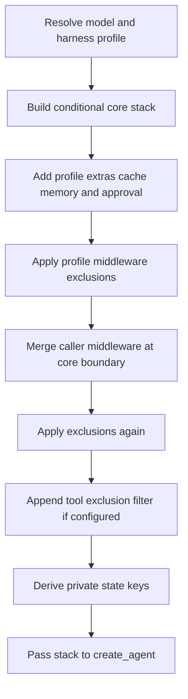

# Middleware Stack & Composition

`create_deep_agent()` is a harness assembler, not a separate agent runtime. It resolves a model and its applicable `HarnessProfile`, assembles ordered `AgentMiddleware`, then passes the main list and agent options to LangChain's `create_agent()`, which owns the model/tool loop. See [SDK construction and execution](/openwiki/architecture/sdk-construction-execution.md) for that boundary.

Middleware is the request-time extension point. A `wrap_model_call()` hook runs before every model request, so it can shape the effective prompt, message history, tools, and typed cross-turn state. A callable passed in `tools=` is invoked only after the model chooses it; it cannot prepare a request. Caller tools extend, rather than remove, built-ins. See [middleware catalog](/openwiki/concepts/middleware-catalog.md).

## Main-agent composition

There is no single static stack: `skills`, synchronous or async subagents, memory, permissions, interrupt configuration, provider packages, and the resolved profile all affect membership. The following is the verified construction flow; optional members are omitted when their condition is not met.

Diagram: profile- and caller-dependent main-stack assembly; the final tool filter follows both middleware exclusion passes.

### Ordering bands

The **core** is built in this order: `SkillsMiddleware` when `skills` is supplied; `FilesystemMiddleware`; `SubAgentMiddleware` when inline subagents exist (normally because the general-purpose subagent is added); summarization middleware; `PatchToolCallsMiddleware`; and `AsyncSubAgentMiddleware` when async specs exist.

The **tail** then adds materialized `HarnessProfile.extra_middleware`, provider prompt-caching middleware, `MemoryMiddleware` when configured, and `HumanInTheLoopMiddleware` when resolved interrupt rules are non-empty. Prompt caching is intentionally installed before memory: profile extras precede caching, while memory's prompt changes occur after its Anthropic cache prefix. Anthropic caching is always added with unsupported models ignored; Bedrock and Fireworks variants are added only when their integration packages import successfully, and can likewise be inert for the current model.

After the first exclusion filter, caller `middleware=` is merged, exclusions are applied again, and `_ToolExclusionMiddleware` is appended if the profile defines `excluded_tools`. Thus, “last” is a meaningful invariant: it sees the near-final model request after tool-producing middleware and caller request wrappers.

The final stack also establishes the synchronous-delegation state boundary. The assembler combines an explicit `state_schema` with middleware schemas, derives private fields, and supplies those fields to `SubAgentMiddleware` for ordinary subagent dispatch.

## Caller customization and exclusions

Caller middleware is merged by `.name`, not blindly appended:

- If its name is still present, it replaces that slot in place and preserves the slot's relative position.
- Otherwise it is inserted after the last surviving core member, before profile extras, caching, memory, and approval tail members.
- The first exclusion pass happens before replacement. The second removes a caller member that tries to restore an excluded name or exact class.

A profile may subtract middleware through `excluded_middleware`, but cannot exclude required `FilesystemMiddleware` or `SubAgentMiddleware`; construction raises `ValueError` instead of silently losing file/permission support or the synchronous `task` handler. Class exclusions use exact `type`, while strings match `AgentMiddleware.name` exactly. Consequently, excluding a base class does not remove a caller subclass, and a public name can exclude an implementation whose class name differs. A string that matches multiple concrete classes in one stack is ambiguous and raises `ValueError`; each legitimate entry must match somewhere.

For the main profile, matches accumulate over the main and auto-added general-purpose stacks and are validated after both are filtered. A declarative subagent that resolves a different profile validates its own stack separately. This allows a shared-profile exclusion that applies only to one of the two main-profile stacks without accepting a typo.

### Tool surface is not authorization

`excluded_tools` causes final `_ToolExclusionMiddleware` to remove named tools from model requests and reject calls with those names at the tool-call boundary. It keeps execution consistent with advertised visibility, but is explicitly not a security control. File access is enforced by filesystem permissions; direct backend use is outside that middleware-level permission boundary. For security and approvals, see [permissions and human-in-the-loop](/openwiki/concepts/permissions-hitl.md) and [filesystem tools](/openwiki/concepts/tools-filesystem.md).

## Distinct subagent stacks

Subagent form is selected during assembly: a spec with `graph_id` becomes an `AsyncSubAgent` handled by `AsyncSubAgentMiddleware`; one with `runnable` is a `CompiledSubAgent`; all other specs are declarative `SubAgent` instances. Therefore main-agent middleware does not retrofit a supplied runnable or remote graph.

### Declarative subagents

Each declarative spec resolves its own model and harness profile and receives an independently assembled stack: `FilesystemMiddleware`, summarization, and `PatchToolCallsMiddleware`; isolated-mode spec skills or forked parent skills; profile extras; caching; two exclusion passes around spec middleware; coverage validation; and the final tool-exclusion filter. A fork also mirrors top-level memory when configured.

A declarative subagent inherits top-level tools, permissions, and `interrupt_on` only when its spec omits the relevant field. Its own permissions replace the parent rules rather than extending them. Resolved interrupt rules add `HumanInTheLoopMiddleware` during declarative compilation. Its compilation receives the parent `state_schema`; compiled and remote subagents own their schema and approval configuration.

The default mode is `isolated`, in which the child receives the delegated task rather than parent conversation. `handoff` remains a legacy alias for isolated behavior. Experimental `fork` continues the parent's effective history: the child's prompt is the parent prompt plus any addendum, and a declarative fork cannot define independent skills. On invocation it gets a task preamble and inherited state excluding fork-specific keys; declarative forks retain private channels, whereas compiled forks strip them because their runnable is opaque. A forked child calling `task` is refused to prevent recursive delegation.

### General-purpose, compiled, and async paths

Unless disabled by the active profile or replaced by a same-named synchronous spec, the harness adds `general-purpose`. It has its own filesystem, summarization, patch, optional skills, profile-extra, and caching stack, with exclusion passes and a final tool filter. It inherits only caller middleware that overrides one of its original default slots; arbitrary main-only caller middleware is not copied.

A `CompiledSubAgent` is used as supplied. It does not inherit parent state schema or top-level interrupt rules; it must return a state containing `messages`. Its result becomes a `ToolMessage`, using JSON for a structured response or the last non-empty AI text otherwise, while non-private eligible state is merged back.

An `AsyncSubAgent` runs through Agent Protocol as a background task. `AsyncSubAgentMiddleware` returns and tracks task IDs in middleware state rather than blocking the parent `task` call; configure its graph schema and approval behavior remotely.

## Change and test guidance

Ordering changes alter prompt and tool behavior, so test assembled stacks rather than only constructors. The focused tests cover main/profile/caller exclusion wiring including exact-type preservation, isolated and legacy-handoff behavior, fork prompt and memory inheritance, cache-compatible tool ordering, and recursive-delegation refusal. When changing this area, also verify the two exclusion passes, final model/tool-call filtering, protected scaffolding failures, general-purpose inheritance limits, and the different private-state treatment of ordinary, declarative-fork, and compiled-fork dispatch.
