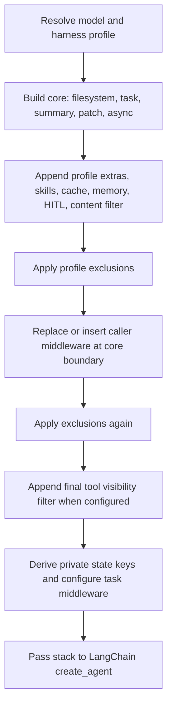

# Middleware Stack and Ordering

`create_deep_agent()` is an assembler, not a separate agent runtime: it resolves a model and `HarnessProfile`, builds middleware stacks, and passes the main stack to LangChain `create_agent()`, which provides the model/tool loop. Middleware is the request-time extension boundary. Its `wrap_model_call()` hook runs before every model request and can change the prompt, messages, visible tools, or typed cross-turn state; a callable supplied through `tools=` runs only after the model selects it. Caller tools are additive to built-ins. See [SDK construction and execution](/openwiki/architecture/sdk-construction-execution.md) and [middleware catalog](/openwiki/concepts/middleware-catalog.md).

## Main-agent assembly

The exact stack is conditional: synchronous and async subagents, `skills`, `memory`, permissions, interrupts, profile extras, optional provider integrations, and exclusions determine membership. The order below is list order; middleware wrapping means later request wrappers can see a request transformed by earlier wrappers according to LangChain's composition.

```mermaid
flowchart TD
    Resolve["Resolve model and harness profile"] --> Core["Build core: filesystem, task, summary, patch, async"]
    Core --> Tail["Append profile extras, skills, cache, memory, HITL, content filter"]
    Tail --> FilterOne["Apply profile exclusions"]
    FilterOne --> Merge["Replace or insert caller middleware at core boundary"]
    Merge --> FilterTwo["Apply exclusions again"]
    FilterTwo --> Visibility["Append final tool visibility filter when configured"]
    Visibility --> State["Derive private state keys and configure task middleware"]
    State --> Runtime["Pass stack to LangChain create_agent"]
```

Diagram: main-stack construction; the final filter controls advertised/executable tool consistency, not authorization.

### Exact order and purpose

The **core** is assembled as:

1. `FilesystemMiddleware`.
2. `SubAgentMiddleware` if there are inline synchronous declarative or compiled subagents (normally the auto-added `general-purpose` subagent supplies one).
3. Deep Agents summarization middleware.
4. `PatchToolCallsMiddleware`.
5. `AsyncSubAgentMiddleware` if remote async specs exist.

The **tail** then appends, in order:

1. materialized `HarnessProfile.extra_middleware`;
2. `SkillsMiddleware` when `skills` is supplied;
3. Anthropic prompt caching, then optional Bedrock and Fireworks prompt-caching middleware;
4. `MemoryMiddleware` when `memory` is supplied;
5. `HumanInTheLoopMiddleware` when resolved interrupts are non-empty; and
6. `UnsupportedContentMiddleware`.

This placement is intentional. New caller middleware is inserted after the surviving core, therefore before profile extras, skills, caching, memory, approvals, and content filtering. Skills is deliberately after caller and profile middleware: its tool disclosure sees the compacted conversation and the model actually selected after routing/fallback behavior, while caller middleware cannot edit the freshly generated skills prompt section. Prompt caching precedes memory so memory's system-prompt update does not invalidate the Anthropic cache prefix. Anthropic caching is always present and ignores unsupported models; Bedrock and Fireworks variants are added only if their integration package imports, and also ignore unsupported models.

Profile exclusions are applied to the assembled stack, caller middleware is merged, and exclusions are applied again. If `excluded_tools` is configured, `_ToolExclusionMiddleware` is appended *after* those passes. Finally, the assembler combines explicit and middleware-contributed state schemas, derives private fields, and assigns them to `SubAgentMiddleware` for task dispatch.

### Caller replacement and profile subtraction

Caller middleware merges by `.name` rather than blindly appending:

- If its name is still in the base stack, it replaces that slot in place.
- A new name is inserted after the last core entry; it is not copied into the general-purpose subagent merely because it appears on the main agent.
- The second exclusion pass removes an excluded class or name that a caller attempted to restore.

`HarnessProfile.excluded_middleware` is validated before filtering. `FilesystemMiddleware` and `SubAgentMiddleware` are protected scaffolding because they respectively provide built-in file/permission behavior and the synchronous `task` handler; excluding them raises `ValueError`. Class exclusions use exact `type`, whereas string exclusions compare `AgentMiddleware.name`. A string that matches distinct classes in one stack is ambiguous and raises. Every permitted exclusion must match: main-profile matches accumulate across the main and auto-added general-purpose stacks and are checked once; a declarative subagent validates and checks its own profile separately.

### Tool visibility is not authorization

`_ToolExclusionMiddleware` removes excluded names from the model request and rejects a tool call using one of those names. Because it is appended last, tool-injecting middleware or caller `wrap_model_call()` cannot restore the name after its filtering pass. This is advertised-tool/execution consistency, explicitly **not** a security boundary.

Permissions are different: `FilesystemMiddleware` enforces filesystem permission rules at its built-in tool calls. The backend itself does not enforce those rules, so direct backend use bypasses this middleware policy. `HumanInTheLoopMiddleware` is an approval mechanism for configured calls, not a tool-visibility feature. See [permissions and human-in-the-loop](/openwiki/concepts/permissions-hitl.md).

### Compatibility and context tail behavior

`UnsupportedContentMiddleware` runs on outgoing model requests, not stored thread history. It examines only `HumanMessage` and `ToolMessage` content and substitutes a text notice for explicitly unsupported image, audio, video, or represented inline-file blocks. The original block remains in the thread, so a later compatible model can receive it. Missing model-profile fields count as supported; only explicit `False` rejects a modeled capability. It is placed late so it uses the effective `request.model` after model-switching middleware. Its hook inputs are omitted from traces by default.

The default summarization middleware truncates large old tool arguments, compacts history at configured limits or after `ContextOverflowError`, and offloads evicted history to the backend. It records its summary event and session ID in private state; if offload fails, it warns that old messages cannot be recovered. See [context management](/openwiki/concepts/context-management.md).

## Subagent stacks and boundaries

Assembly routes a spec with `graph_id` to `AsyncSubAgentMiddleware`, a spec with `runnable` to `CompiledSubAgent`, and every other spec to a declarative `SubAgent`. These are distinct integration boundaries, not variants of one inherited stack.

### Declarative and general-purpose agents

Each declarative spec resolves its own model/profile. Before compilation, its stack is: `FilesystemMiddleware`, summarization, `PatchToolCallsMiddleware`, materialized profile extras, skills (the spec's skills for isolated mode, or the parent's skills for a fork), prompt caching, and—only for a fork with configured parent memory—`MemoryMiddleware`. It applies exclusions, merges spec middleware (and parent caller middleware for a fork), applies exclusions again, verifies coverage, then appends the optional final tool-exclusion filter. `create_sub_agent()` then appends HITL for a non-empty resolved interrupt configuration and appends `UnsupportedContentMiddleware` unless an identically named middleware is already present.

A declarative spec inherits top-level `tools`, permissions, and `interrupt_on` only when that key is omitted. Its own permissions replace parent rules. Filesystem `interrupt` permissions contribute approval configuration; explicit `interrupt_on` wins on the same tool name. A declarative graph receives the parent `state_schema`; compiled and remote forms do not.

The auto-added `general-purpose` subagent uses its own filesystem/summary/patch/profile/skills/cache stack, the same two profile filters, and final tool filter; compilation adds HITL and unsupported-content behavior. It inherits only caller middleware whose name overrides one of its original slots, never arbitrary main-only additions. It is omitted when the profile disables it or an inline spec already uses its name.

### Isolated, forked, compiled, and async execution

Declarative subagents are isolated by default and receive only a `HumanMessage` containing the delegated task. `handoff` remains a legacy alias for isolated. Experimental `fork` receives the parent's effective compacted history plus a task preamble and rebuilds the parent prompt with an optional child addendum. Declarative forks retain non-excluded parent state, including eligible private channels; compiled forks strip private fields because the runnable's schema is opaque. Forked children retain a guarded `task` tool but receive a refusal if they invoke it, preventing recursive delegation.

A supplied `CompiledSubAgent` runnable is used as supplied and must return state containing `messages`. The parent serializes a structured response when present, otherwise returns the last non-empty AI text in a `ToolMessage`, and merges eligible non-private state updates. An `AsyncSubAgent` instead launches a remote Agent Protocol background run: its middleware returns and persists a task ID and tracks task state, while schema, approval, and content policy belong to the remote graph.

## Change and test guidance

Ordering changes alter both model-visible request data and tool behavior. Test assembled stacks—not just constructors—for replacement versus insertion, both exclusion passes, final visibility filtering at model and tool-call boundaries, protected-scaffolding/ambiguous-name/coverage failures, and shared main/general-purpose coverage. Test declarative isolated and fork paths separately from supplied compiled and remote async paths, including private-state treatment, fork history/prompt reconstruction, recursion refusal, and compiled-result fallback. For compatibility filtering, exercise sync and async calls, a request-model switch, explicit versus missing capability fields, and both human and tool messages.

For implementation guidance across the user-facing features, see [subagents and skills](/openwiki/concepts/subagents-skills.md) and [build a Deep Agent](/openwiki/workflows/build-a-deep-agent.md).
