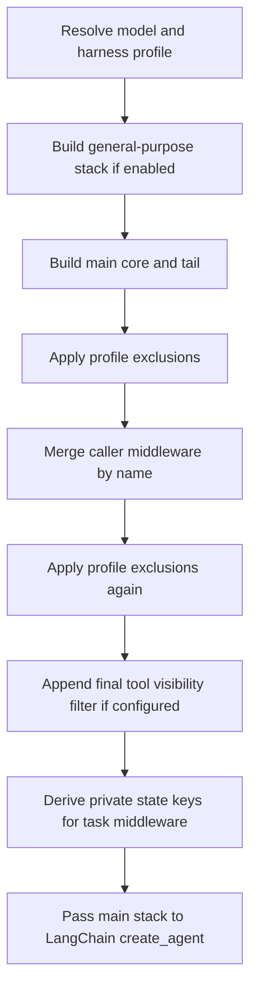

# Middleware Stack and Ordering

`create_deep_agent()` is an assembler rather than a separate runtime. It resolves the model and its `HarnessProfile`, constructs the main and applicable synchronous-subagent stacks, then passes the main stack to LangChain `create_agent()`, which owns the model/tool loop. See [SDK construction and execution](/openwiki/architecture/sdk-construction-execution.md) and [middleware catalog](/openwiki/concepts/middleware-catalog.md).

Middleware is the request-time extension boundary: `wrap_model_call()` intercepts every model request, so it can transform messages and prompt context, dynamically filter tools, and maintain typed state across turns. In contrast, a callable in `tools=` runs only after the model chooses it; it cannot modify the current model request. `tools=` augments rather than removes built-ins.

## Main-agent assembly

The following is **list order**, with conditional entries omitted. Actual wrapper nesting is provided by LangChain; when changing an order, validate the request and tool-call consequences rather than relying only on constructor order.

```mermaid
flowchart TD
    Resolve["Resolve model and harness profile"] --> BuildGP["Build general-purpose stack if enabled"]
    BuildGP --> BuildMain["Build main core and tail"]
    BuildMain --> FirstFilter["Apply profile exclusions"]
    FirstFilter --> Merge["Merge caller middleware by name"]
    Merge --> SecondFilter["Apply profile exclusions again"]
    SecondFilter --> ToolFilter["Append final tool visibility filter if configured"]
    ToolFilter --> State["Derive private state keys for task middleware"]
    State --> Runtime["Pass main stack to LangChain create_agent"]
```

Diagram: construction order for the main agent. The general-purpose stack is built first so a profile exclusion may match in either stack; it does not make its middleware part of the main stack.

### Core and tail

The main **core**, in order, is:

1. `FilesystemMiddleware`.
2. `SubAgentMiddleware` when an inline declarative or compiled subagent exists. The automatic `general-purpose` subagent normally makes this true.
3. Deep Agents summarization middleware.
4. `PatchToolCallsMiddleware`.
5. `AsyncSubAgentMiddleware` when remote async specs exist.

The main **tail** follows in this order:

1. freshly materialized `HarnessProfile.extra_middleware`;
2. `SkillsMiddleware` when skills are resolved;
3. Anthropic prompt caching, followed by Bedrock and Fireworks caching when those optional integrations can be imported;
4. `MemoryMiddleware` when `memory` is supplied;
5. `HumanInTheLoopMiddleware` when the resolved interrupt mapping is non-empty; and
6. `UnsupportedContentMiddleware`.

Anthropic caching is always appended with unsupported models ignored. The optional Bedrock and Fireworks middleware likewise ignores unsupported models; a missing provider package merely omits that provider middleware, while an unrelated import error propagates. Caching precedes memory because memory changes the system prompt and should not invalidate the Anthropic cache prefix.

Skills deliberately sits after profile extras and caller-added middleware, yet before caching. Thus its disclosure sees compacted history and the effective routed model; ordinary caller middleware does not see the newly generated skills prompt section. A caller entry named `SkillsMiddleware` is still a replacement for that slot.

### Assembly passes and caller replacement

After building the tail, the main assembler performs: **first profile-exclusion pass → caller merge → second profile-exclusion pass → final tool-exclusion append**. It then gathers the explicit and middleware state schemas and gives all derived private fields to every surviving `SubAgentMiddleware` instance for task dispatch.

Caller merge is name-based:

- An entry whose `.name` is present in the current base list replaces that entry in place.
- A new name is inserted immediately after the surviving core entries—before profile extras, skills, caching, memory, approval, and compatibility filtering.
- Multiple novel entries retain their caller order; where caller entries share a name, the last replacement selected by the merge is used.

The second exclusion pass matters: a profile can remove a caller attempt to reintroduce an excluded name or class. By contrast, an excluded default that has already disappeared before merge cannot be revived as an in-place replacement; a same-named caller entry is novel and is removed by the second pass.

## Profile exclusions and required scaffolding

`HarnessProfile.excluded_middleware` is a subtraction policy, not a reorder operation. Validation rejects protected `FilesystemMiddleware` and `SubAgentMiddleware`: the former backs built-in file tools and filesystem permissions; the latter backs the synchronous `task` handler. This fails with `ValueError` instead of compiling an agent with silently broken core behavior.

Class-form exclusions match **exact** `type`, not `isinstance`, so a caller subclass survives an exclusion of its base class. String-form exclusions match `AgentMiddleware.name` exactly, which supports public aliases such as `SummarizationMiddleware` even when the implementation class has a different Python name. A string matching more than one concrete class within one stack is ambiguous and raises `ValueError`; use a class exclusion to disambiguate.

Every allowed exclusion must have coverage. The main profile accumulates matches across both the general-purpose and main stacks and verifies once after both have been filtered, so an entry need only exist in one of those stacks. A declarative subagent resolves and validates its own profile, filters its own stack twice, and verifies its own coverage. Unknown or stale class/name entries therefore fail rather than silently doing nothing.

## General-purpose and declarative subagent stacks

A spec with `graph_id` becomes an `AsyncSubAgent` handled by `AsyncSubAgentMiddleware`; a spec with `runnable` is a supplied `CompiledSubAgent`; other specs are declarative `SubAgent` definitions. Only declarative and compiled forms participate in the parent `SubAgentMiddleware`/`task` tool.

### Automatic general-purpose stack

Unless disabled by the active profile or replaced by an inline spec named `general-purpose`, the assembler creates one automatic declarative subagent. Its pre-compilation stack is:

1. `FilesystemMiddleware`, summarization, `PatchToolCallsMiddleware`;
2. separately materialized profile extras;
3. optional skills;
4. prompt-caching middleware;
5. first exclusion pass;
6. only caller middleware whose name was an original general-purpose slot;
7. second exclusion pass; and
8. final `_ToolExclusionMiddleware` when the profile excludes tools.

It does **not** inherit arbitrary main-only additions. For example, a caller override of the general-purpose summarization slot propagates, while a novel main `TodoListMiddleware` does not. Profile extras are independently materialized for each stack, so factory output is not shared. The later `create_sub_agent()` compilation step appends resolved HITL and `UnsupportedContentMiddleware`.

### Declarative stack and fork variation

Each declarative spec resolves its own model and profile. Its pre-compilation base is `FilesystemMiddleware`, summarization, and `PatchToolCallsMiddleware`; it then adds that subagent profile's extras, its skills (or the parent skills for a fork), and prompt caching. A fork with configured parent memory also adds `MemoryMiddleware` after caching. The stack then uses the same first-filter, name-based merge, second-filter, coverage-check, and final tool-filter sequence as the main stack.

An isolated declarative subagent receives only a `HumanMessage` carrying the delegated task. It inherits top-level tools, permissions, and `interrupt_on` only when its own field is absent; own permissions replace rather than extend parent permissions. `create_sub_agent()` appends HITL when the resolved mapping is non-empty and appends `UnsupportedContentMiddleware` unless that name is already present. Declarative graphs receive the parent's `state_schema`.

`fork` is experimental and continues the parent's compacted effective history plus a task preamble; `handoff` is a legacy alias for isolated behavior. A fork cannot define independent `skills`. At assembly, the parent's `middleware=` entries are combined with the fork spec's entries, with spec entries winning duplicate names, and merged before the fork tail. This lets the fork rebuild prompt-producing behavior against inherited state while preserving its own model/profile stack. A declarative fork keeps non-excluded parent state, including eligible private channels; a compiled fork strips private fields because its runnable schema is opaque. Forked task calls are refused to prevent recursive delegation.

Supplied compiled runnables are used as supplied and do not inherit the parent state schema, approval middleware, or content policy. They must return `messages`; the parent emits a `ToolMessage` containing JSON for a structured response or the last non-empty AI text otherwise, and merges eligible non-private state updates. Remote async subagents instead start Agent Protocol background work, return a task ID, and persist task state in `AsyncSubAgentMiddleware`; their graph owns its own schema and policy.

## Visibility filtering, permissions, and approval are separate

`_ToolExclusionMiddleware`, appended last, removes named tools from model requests and rejects calls using those names at the tool-call boundary. Its late placement ensures tool-injecting middleware and caller `wrap_model_call()` code cannot restore a hidden name. It keeps the offered and executable surfaces consistent, but is explicitly **not** a security boundary.

Filesystem permissions are authorization policy: `FilesystemMiddleware` evaluates them at built-in filesystem tool calls, and direct backend use bypasses that middleware policy. `HumanInTheLoopMiddleware` is yet another mechanism: it pauses configured calls for review. Filesystem `interrupt` permissions contribute interrupt settings, while explicit `interrupt_on` entries win for the same tool. See [permissions and human-in-the-loop](/openwiki/concepts/permissions-hitl.md).

`UnsupportedContentMiddleware` is compatibility filtering, not either tool policy. It runs late against the effective request model, replaces explicitly unsupported blocks only in outgoing `HumanMessage` and `ToolMessage` copies, and leaves original thread content intact for a later compatible model.

## Focused regression surface

The graph tests inspect assembled stacks, not merely constructors. They pin same-name replacement versus novel insertion, the skills slot immediately before Anthropic caching, general-purpose override-only inheritance, declarative-stack isolation, fork inheritance before skills, the two exclusion passes, protected/ambiguous/unmatched exclusion failures, and final tool filtering for main and declarative stacks. Preserve these tests when changing ordering: moving a member can alter prompt cache behavior, model-visible tools, state handoff, or which profile policy wins.

For user-facing patterns, see [subagents and skills](/openwiki/concepts/subagents-skills.md) and [build a Deep Agent](/openwiki/workflows/build-a-deep-agent.md).
