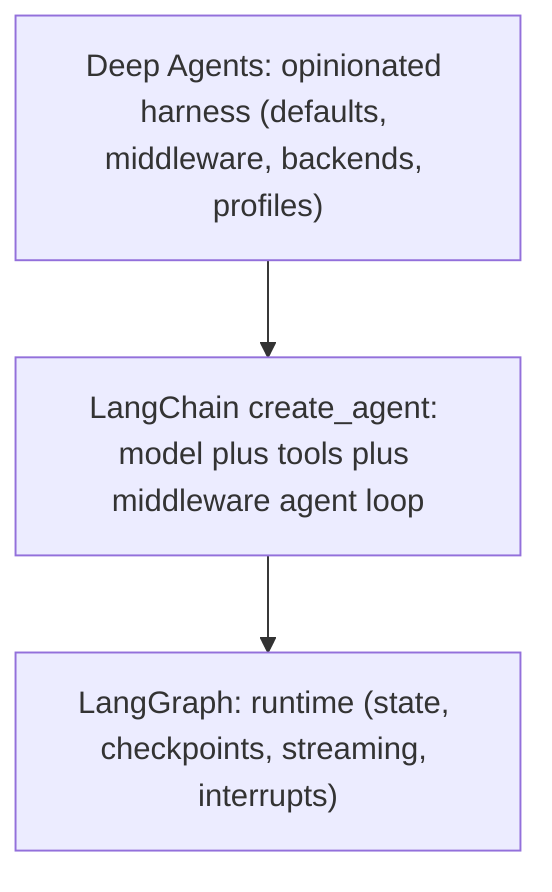

# Architecture Overview

Deep Agents is an opinionated agent harness that sits on top of two lower layers rather than replacing them. Understanding the three-layer stack — and which layer owns which behavior — is the fastest way to find where to look before changing something. This page maps the layers and the monorepo packages; deeper mechanics live on the linked pages.

- **Middleware assembly and ordering:** [middleware-stack.md](./middleware-stack.md)
- **Construction vs. execution phases of `create_deep_agent()`:** [sdk-construction-execution.md](./sdk-construction-execution.md)
- **File-to-responsibility index:** [source-map.md](./source-map.md)
- **Where files, memory, and shell live:** [../concepts/backends.md](../concepts/backends.md)
- **Observed shape of an actual run:** [../runtime-behavior.md](../runtime-behavior.md)

## The three layers

Deep Agents does not introduce a new runtime. It packages the pieces that most long-running agents need on top of LangChain's agent abstraction, which in turn runs on the LangGraph runtime.

Layer stack and dependency direction: each layer depends on the one below it; arrows point from dependent to dependency.

Starting from the bottom:

- **LangGraph** is the runtime. It runs the agent as a graph of steps that read and update shared state, carries that state between steps, exposes streaming to observe a run, saves checkpoints, and pauses or resumes runs through interrupts. This layer owns durable execution: state, checkpoints, streaming, and interrupts.
- **LangChain `create_agent()`** is the agent abstraction on top of LangGraph. Callers describe an agent as a model, tools, and middleware; LangChain builds the loop that calls the model, executes tools, and repeats until the model finishes. This layer owns the agent loop shape.
- **Deep Agents** is an opinionated harness *on top of* `create_agent()`. `create_deep_agent()` assembles the default middleware stack and configures backends, subagents, skills, memory, and profiles. This layer owns the harness defaults — it does not own the runtime or the loop.

The choice between the layers is about how much harness you want, not about a different runtime: use Deep Agents for the full harness, `create_agent()` for a lighter one, and drop to LangGraph when the loop itself isn't the right shape. The layers compose — any LangGraph `CompiledStateGraph` can be passed in as a Deep Agents sub-agent.

## Where each layer owns behavior

Before changing a behavior, decide which layer owns it:

- **State persistence, checkpoints, streaming, interrupts, resumability** → LangGraph. Deep Agents extends LangChain's `AgentState` with `DeepAgentState`, whose `messages` field uses a `DeltaChannel` reducer so checkpoint growth stays linear rather than quadratic on long threads.
- **The model/tool/repeat loop and the middleware extension points** → LangChain `create_agent()`.
- **Which tools the model sees, prompt injection, summarization, filesystem/memory/skills/subagents, provider tuning** → Deep Agents middleware, backends, and profiles.

If a tool is *missing*, look at middleware assembly and profile exclusions. If a tool is *visible but fails*, look at backend capability and permission enforcement.

## `create_deep_agent()` is the assembly point

`create_deep_agent()` is where the layers are wired together. It resolves the model and any harness profile, resolves the backend, assembles the main-agent middleware stack (filesystem, subagents, summarization, skills, memory, tool exclusion, and human-in-the-loop), builds the default general-purpose subagent, composes the final system prompt, and then delegates to LangChain's `create_agent(...)` to produce the runnable graph.

After building the graph it calls `.with_config(...)` to attach Deep Agents metadata (`ls_integration`, `lc_versions`, agent name) and a large `recursion_limit` (9,999) so long multi-step runs are not cut off by LangGraph's default recursion budget.

## Monorepo packages and responsibilities

The repository is a monorepo under `libs/`, with each package independently versioned. The packages map to distinct responsibilities:

| Package | Responsibility |
| --- | --- |
| `deepagents` | Core SDK — `create_deep_agent`, middleware, and pluggable backends for building your own deep agents. |
| `code` | Pre-built product on the SDK — the `dcode` terminal coding agent (TUI, remote sandboxes, memory, skills, headless mode). |
| `acp` | Editor protocol — Agent Client Protocol integration for running a Deep Agent inside editors like Zed. |
| `evals` | Benchmarking — evaluation suite and Harbor integration for measuring agent behavior. |
| `talon` | Local host — experimental runtime host for long-running agents (channel adapters, cron schedulers). |
| `partners` | Sandbox providers — provider integrations (Daytona, Modal, Runloop, Vercel, QuickJS). |

The dependency direction runs the same way as the layer stack: `code`, `acp`, `evals`, and `talon` are consumers built on the `deepagents` SDK, while `partners` supplies backend sandbox implementations the SDK's backends can route to.

## Where to look first

Most Deep Agents-specific code lives in three places inside the SDK package `libs/deepagents/deepagents/`:

- **Agent construction, middleware ordering, prompt assembly:** `graph.py` (`create_deep_agent()`).
- **Tool visibility, prompt injection, request-time behavior:** `middleware/`.
- **Filesystem persistence, shell support, route behavior:** `backends/`.
- **Provider- or model-specific harness changes:** `profiles/`.

The reliable trace is: start from a public argument on `create_deep_agent()`, follow it to the middleware or backend it installs, then follow how that component participates during execution. For the full construction and execution walkthrough see [sdk-construction-execution.md](./sdk-construction-execution.md); for the exact stack ordering see [middleware-stack.md](./middleware-stack.md); for observed run shape see [../runtime-behavior.md](../runtime-behavior.md).
