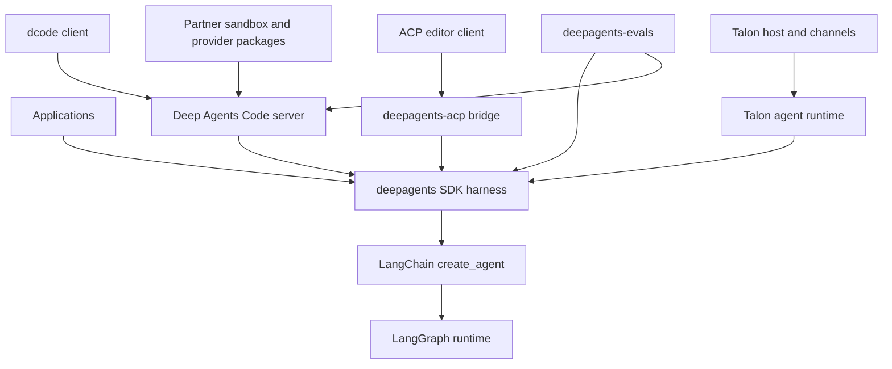
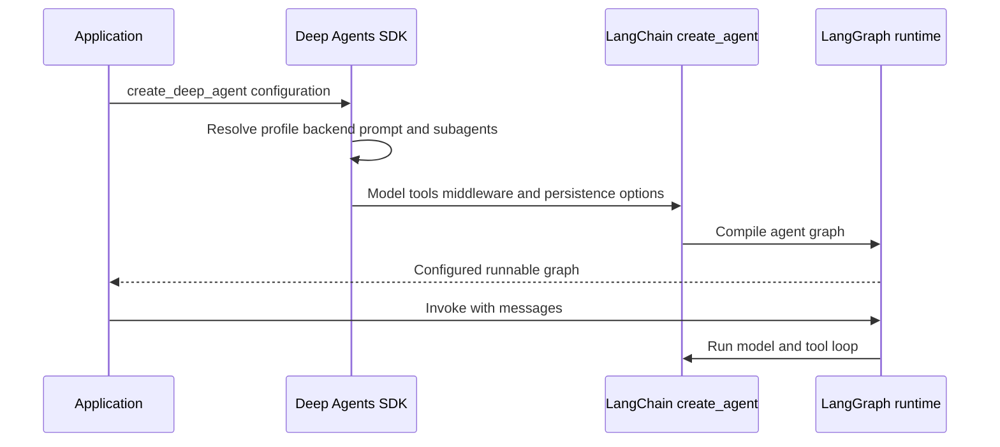

# Repository Architecture Overview

Deep Agents is an opinionated agent harness, not a replacement runtime. Locate a change first in its owning layer: the reusable SDK harness, the Code product, an ACP protocol boundary, the Talon host, evaluation infrastructure, or a provider-specific partner package.

- **SDK construction and execution:** [sdk-construction-execution.md](./sdk-construction-execution.md)
- **Responsibility-by-file index:** [source-map.md](./source-map.md)
- **Coding product details:** [code-agent.md](./code-agent.md)
- **Talon host:** [Talon](../integrations/talon.md)
- **Local setup and commands:** [development](../operations/development.md)

## Components, ownership, and runtime dependencies

This component diagram distinguishes package ownership from the shared agent runtime dependency direction.

The runtime stack has three owners:

- **LangGraph** provides durable graph execution: state between steps, checkpoints, streaming, and interrupt-based pause/resume.
- **LangChain `create_agent()`** provides the agent abstraction: model, tools, middleware, and the model/tool/repeat loop built on LangGraph.
- **Deep Agents** provides the batteries-included harness above `create_agent()`: default middleware, pluggable backends, profiles, subagents, skills, and memory configuration. It does not introduce another runtime.

The dependency direction is **Deep Agents → LangChain `create_agent()` → LangGraph**. Use the SDK for the complete harness, bare `create_agent()` for a lighter loop, and LangGraph when the loop itself must be custom. The boundary remains composable: a LangGraph `CompiledStateGraph` can be a Deep Agents subagent.

## SDK: construction, state, and enforcement boundaries

The reusable `deepagents` package exports `create_deep_agent`, `DeepAgentState`, common filesystem, memory, rubric, and subagent middleware types, plus harness and provider profile registration APIs. `create_deep_agent()` in `libs/deepagents/deepagents/graph.py` is the assembly boundary.

At construction it resolves the model and harness profile, applies profile tool-description overrides, selects `StateBackend()` when no backend is supplied, builds a default general-purpose subagent unless disabled or replaced, and composes caller and profile prompt text. It builds the middleware stack and delegates the model, tools, schemas, checkpointer, store, debug, name, and cache to LangChain `create_agent(...)`. The returned graph receives Deep Agents metadata and a recursion limit of 9,999.

This sequence separates SDK assembly from the LangGraph-driven execution of the resulting graph.

### Middleware and tool failures

The main stack combines optional skills, filesystem and subagent support, summarization, patch-tool-call repair, optional asynchronous subagents, profile middleware, prompt caching, optional memory, tool exclusion, and optional human-in-the-loop middleware. Declarative subagents receive separately built stacks; compiled and remote subagents retain independently configured behavior.

Tool visibility is not authorization. A missing tool normally means middleware assembly or a profile tool exclusion is responsible; a visible tool that fails normally implicates backend capability or filesystem permission enforcement. Profile exclusion validation rejects exclusions of protected middleware, private names, ambiguous class matches, and exclusions that match no assembled stack entry, rather than allowing a silently partial harness.

`DeepAgentState` extends LangChain `AgentState` with a `DeltaChannel` reducer for `messages`, keeping checkpoint growth linear rather than quadratic on long threads. Custom schemas should subclass it to preserve that reducer. Such schemas are forwarded to declarative subagents, while compiled and remote subagents keep their own schemas. LangGraph owns graph state and checkpoints; the selected backend separately determines where files, memory, and shell execution live.

## Packages and product boundaries

`libs/` is a monorepo with independently versioned packages. Product, evaluation, and host packages consume the SDK rather than the SDK consuming them.

| Package | Ownership boundary and entry point |
| --- | --- |
| `deepagents` | Core builder SDK. Reusable harness behavior belongs in `middleware/`, storage and execution routing in `backends/`, provider/model tuning in `profiles/`, and assembly in `graph.py`. |
| `code` / `deepagents-code` | Pre-built terminal coding product. Both `dcode` and `deepagents-code` run `deepagents_code:cli_main`; the package owns the Textual UI, headless mode, product persistence, skills, remote sandbox choices, and terminal policy. |
| `acp` / `deepagents-acp` | Agent Client Protocol bridge for editors such as Zed. It accepts a compiled graph or a session-context graph factory; `dcode --acp` offers the Code product as a ready-made ACP server. |
| `evals` / `deepagents-evals` | Behavioral evaluation suite and Harbor integration. It consumes both the SDK and Code product and is outside the runtime request path. |
| `talon` / `deepagents-talon` | Experimental local host for long-running agents, channel adapters, and cron schedules. Its command is `deepagents-talon`, and it consumes both the SDK and Code product. |
| `partners/` | Provider and sandbox integrations for Daytona, Modal, Runloop, Vercel, and QuickJS, keeping provider-specific execution concerns out of the SDK. |

### Deep Agents Code

Code is a reference product built on the SDK, split into a terminal client and an agent server in separate processes. The client owns presentation, input, and approval collection; the server owns the coding graph and streams its events back. Interactive and headless modes use that same runtime boundary.

`create_cli_agent()` is the Code assembly point: it builds an SDK agent with a composite backend, `CLIContextSchema`, CLI middleware, interrupt policy, checkpoint/store, subagents, and a sanitized assistant name. Registered extensions replace same-named tools and middleware before construction, then add extension runtime middleware. This keeps terminal-product policy in `code` while retaining the SDK graph constructor.

### ACP session boundary

`AgentServerACP` translates ACP traffic to a supplied compiled Deep Agents graph. Its optional `session/load` support requires a durable LangGraph checkpointer: after restart it restores the graph thread, checks the original working directory, and replays conversation updates to the ACP client. An in-memory checkpointer is appropriate for tests but not restart persistence.

### Talon lifecycle and security boundary

Talon owns process lifecycle around an SDK graph, not a different runtime. `DeepAgentRuntime.start()` resolves subagents, loads an approval snapshot, and builds its graph. `invoke()` refuses work before startup; it refreshes tools, rebuilds the graph if approvals changed, establishes request-scoped approval, authorization, history, cron, graph, and background-result context, and resets those contexts in a `finally` block. `stop()` cancels background work before releasing the graph and closing the checkpointer; if a worker cannot stop, it deliberately leaves resources open rather than closing persistence under an active writer.

Talon is alpha software without production-grade human-approval policy, channel administrator controls, sandbox execution isolation, or multi-tenant boundaries. Treat channel users as having direct access to the operator's agent, credentials, MCP tools, and local host resources.

### Evaluation boundary

The evaluation suite runs agents against real LLMs, captures tool calls, file mutations, and final responses, and scores correctness and efficiency. Harbor integration runs sandboxed benchmarks such as Terminal Bench 2.0. Use it for changes that affect an assembled agent trajectory, rather than only construction-time behavior.

## Releases and safe change path

Release Please manages each released package independently. The current manifest versions are `deepagents` **0.7.15**, `deepagents-acp` **0.0.11**, `deepagents-code` **0.1.71**, `deepagents-talon` **0.0.8**, `langchain-daytona` **0.0.8**, `langchain-modal` **0.0.6**, `langchain-runloop` **0.0.7**, `langchain-vercel-sandbox` **0.0.2**, and `langchain-quickjs` **0.3.7**. The release configuration uses Python releases, separate draft pull requests, component-bearing `==` tags, per-package changelogs and version files, and excludes package test paths from release analysis. `evals` is a package but is not a Release Please release target in that configuration.

For SDK work, trace the public `create_deep_agent()` argument into `middleware/`, `backends/`, or `profiles/`; preserve middleware order and the `DeepAgentState` reducer. Keep presentation and terminal policy in Code, ACP protocol and session semantics in ACP, host lifecycle and schedules in Talon, and benchmark definitions and scoring in evals. SDK pytest excludes benchmark-marked tests by default and turns unexpected warnings into errors; focused graph tests cover construction and compiled-graph metadata wiring. Add package-local integration coverage for ACP session recovery, Talon lifecycle, or end-to-end trajectories when changing those boundaries.
