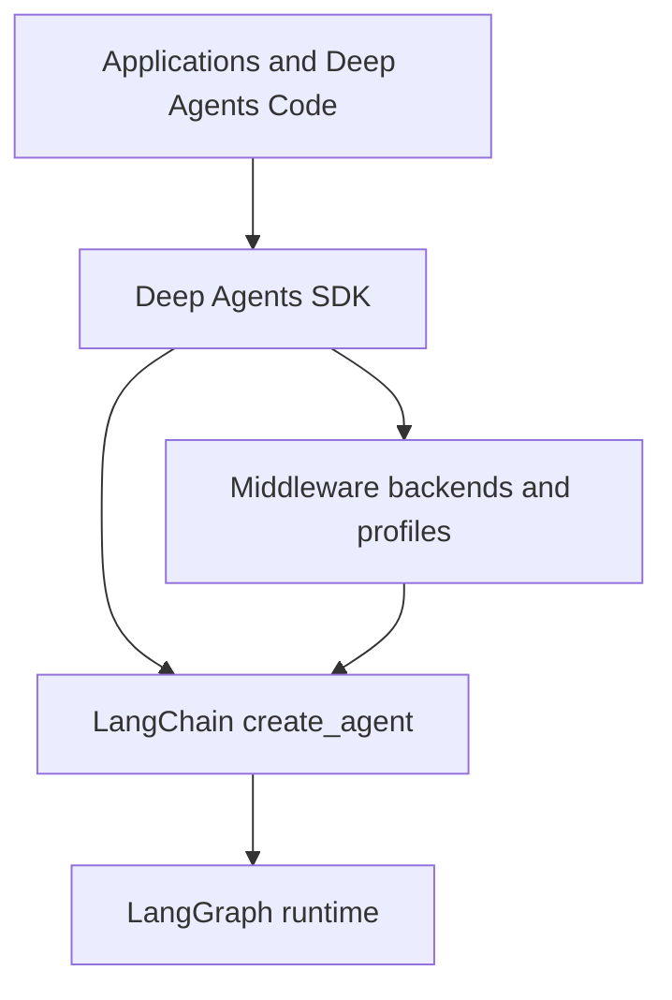

# Architecture Overview

Deep Agents is an opinionated agent harness, not a replacement runtime. Start a change by locating the behavior in the three-layer stack, then trace the relevant `create_deep_agent()` argument into the middleware, backend, or profile that implements it.

- **Middleware ordering and extension points:** [middleware-stack.md](./middleware-stack.md)
- **Construction versus run-time behavior:** [sdk-construction-execution.md](./sdk-construction-execution.md)
- **Responsibility-by-file index:** [source-map.md](./source-map.md)
- **Filesystem, memory, and shell placement:** [backends.md](../concepts/backends.md)

## Layers and dependency direction

The SDK delegates agent construction to `create_agent`; the resulting agent runs on LangGraph, while Deep Agents supplies the harness behavior around that loop.

- **LangGraph** owns durable graph execution: state carried between steps, checkpoints, streaming, and interrupt-based pause/resume.
- **LangChain `create_agent()`** owns the general agent abstraction: model, tools, middleware, and the model/tool/repeat loop it builds on LangGraph.
- **Deep Agents** owns the batteries-included policy above that abstraction: default middleware, backends, profiles, subagents, skills, and memory configuration. It does not introduce a different runtime.

The dependency direction is therefore **Deep Agents → LangChain `create_agent()` → LangGraph**. Use Deep Agents for the full harness, bare `create_agent()` when its lighter loop is sufficient, and LangGraph directly when the agent loop itself must be a custom graph. The boundary is composable: a LangGraph `CompiledStateGraph` can be a Deep Agents subagent.

## Ownership guide

| Symptom or intended change | Owner and first place to inspect |
| --- | --- |
| Checkpointing, streamed events, graph interrupts, pause/resume | LangGraph integration and the graph configuration passed through the SDK |
| Fundamental model/tool/repeat-loop behavior | LangChain `create_agent()` and its middleware contract |
| Default tool surface, prompt fragments, context compaction, delegation, or approval policy | Deep Agents middleware and `graph.py` assembly |
| File persistence, shell availability, route selection, or access enforcement | Deep Agents backends and filesystem permissions |
| Provider- or model-specific prompt/tool/middleware adjustments | Deep Agents harness profiles |

A missing tool and a failing visible tool are different classes of issue. A missing tool points to middleware assembly or profile exclusions; a visible tool that fails points to backend capability or filesystem permission enforcement. Do not treat tool visibility as authorization.

## Construction is the SDK integration boundary

`create_deep_agent()` in `libs/deepagents/deepagents/graph.py` is the public assembly point. It resolves a supplied model (or the deprecated default), chooses a matching harness profile, validates profile exclusions, rewrites caller tool descriptions, and supplies `StateBackend()` when no backend is given. It composes the final system prompt from the caller prompt and profile prompt.

It then processes declarative, compiled, and remote subagents; adds the general-purpose subagent unless a profile disables it or the caller supplied a replacement; builds the main middleware stack; and calls LangChain `create_agent(...)`. The returned compiled graph is configured with `ls_integration`, `lc_versions`, and `lc_agent_name` metadata plus `recursion_limit` 9,999.

The main stack has conditional and ordered behavior, not just a bag of tools: skills appear only when configured; filesystem and subagent middleware establish core capabilities; summarization and patching follow; asynchronous subagent support is optional; profile middleware and prompt caching form a tail; memory and human-in-the-loop support are conditional. Profile exclusions are applied after assembly and, for excluded tools, the tool-exclusion middleware is appended last so later custom middleware cannot restore excluded names. Declarative subagents build separate stacks; compiled and remote subagents keep their own already-configured graph behavior.

### State, persistence, and safety invariants

`DeepAgentState` extends LangChain `AgentState` with a `DeltaChannel` message reducer. The reducer is deliberately retained by requiring a custom `state_schema` to subclass `DeepAgentState`; middleware schemas are merged into the graph schema. Declarative subagents receive that custom schema, but already-compiled and remote subagents do not—compile or configure those independently if they require the same state fields.

A checkpointer and store are passed through to LangChain construction. This separates LangGraph graph-state/checkpoint persistence from Deep Agents backend persistence for files and memory. A `StoreBackend` requires a store. Profile exclusion validation is also a construction-time guard: excluding protected scaffolding, using private names, ambiguous classes, or matching no assembled middleware raises `ValueError` rather than silently producing a partial harness.

## Monorepo ownership boundaries

`libs/` is an independently versioned-package monorepo. The package manifests show the dependency relationships rather than implying that every directory is a runtime layer:

| Package | Role and dependency boundary |
| --- | --- |
| `deepagents` | Core SDK. It depends on LangChain and exposes the harness construction, middleware, and pluggable backends. |
| `code` (`deepagents-code`) | Terminal coding product built on `deepagents`; it also integrates ACP and LangGraph client/runtime components. Its `dcode` command provides the TUI/headless product surface. |
| `acp` (`deepagents-acp`) | Agent Client Protocol integration that depends on `deepagents`, including use from editors such as Zed and the `dcode` ACP server. |
| `evals` (`deepagents-evals`) | Evaluation and Harbor integration. It depends on both the SDK and Deep Agents Code, so change benchmark/product integration here rather than in the core harness. |
| `talon` (`deepagents-talon`) | Experimental local host for long-running channels and schedules. It depends on the SDK and Code. |
| `partners/` | Provider/sandbox integration area containing Daytona, Modal, Runloop, Vercel, and QuickJS integrations. |

Thus, a reusable harness behavior belongs in `deepagents`; terminal interaction belongs in `code`; editor-protocol behavior belongs in `acp`; benchmarking belongs in `evals`; and channel/scheduling hosting belongs in `talon`. Package dependencies make `code`, `evals`, and `talon` consumers of the SDK—not reverse dependencies.

## Practical change and test path

Most SDK changes start in `libs/deepagents/deepagents/graph.py`, then move into `middleware/`, `backends/`, or `profiles/` according to the ownership guide. Preserve ordering when adding middleware: custom middleware is spliced relative to the captured core stack, and exclusions are re-applied afterward. For state changes, preserve the `DeepAgentState` message reducer and decide whether the field should be private middleware state or shared graph state.

Use focused tests before a broader suite: `tests/unit_tests/test_graph.py` covers construction, profiles, state-schema forwarding, and compiled-graph metadata; middleware tests cover exclusion and stack behavior; backend and permission tests cover filesystem and shell semantics; integration tests exercise real backend, filesystem, human-in-the-loop, and subagent boundaries. The SDK test configuration runs non-benchmark tests by default and treats unexpected warnings as errors.
