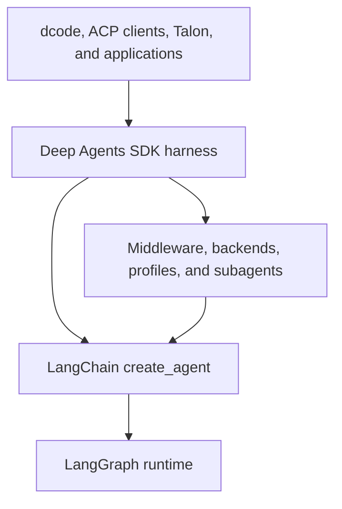
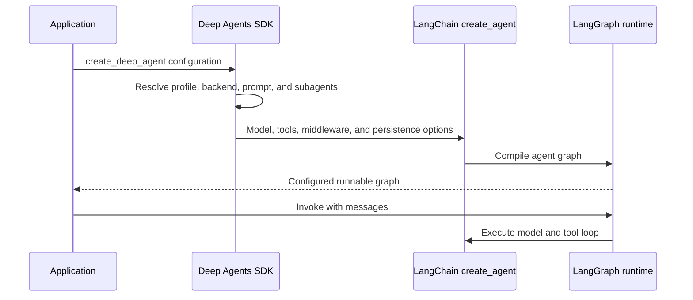
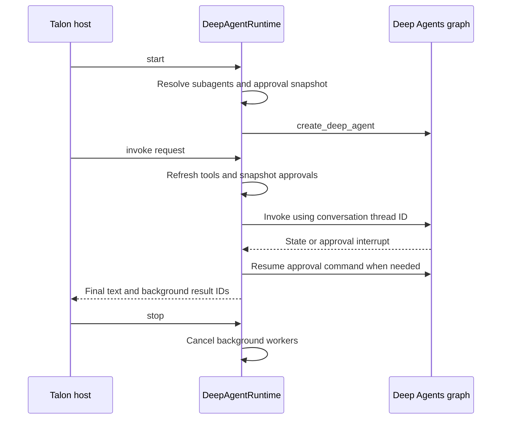

# Monorepo Architecture Overview

Deep Agents is an opinionated agent harness, not a replacement runtime. Start a change by locating its behavior in the SDK stack, then trace the relevant `create_deep_agent()` argument into middleware, a backend, a profile, or the product package that owns the user-facing behavior.

- **Middleware ordering and extension points:** [middleware-stack.md](./middleware-stack.md)
- **SDK construction and execution:** [sdk-construction-execution.md](./sdk-construction-execution.md)
- **Responsibility-by-file index:** [source-map.md](./source-map.md)
- **Coding product details:** [code-agent.md](./code-agent.md)
- **Protocol and host integrations:** [ACP](../integrations/acp.md) and [Talon](../integrations/talon.md)

## Runtime layers and ownership

The diagram shows the runtime dependency direction and the SDK harness extension boundary.

The stack has three distinct owners:

- **LangGraph** provides durable graph execution: state between steps, checkpoints, streaming, and interrupt-based pause/resume.
- **LangChain `create_agent()`** provides the agent abstraction: model, tools, middleware, and the model/tool/repeat loop built on LangGraph.
- **Deep Agents** provides the batteries-included harness above `create_agent()`: default middleware, pluggable backends, profiles, subagents, skills, and memory configuration. It does not introduce another runtime.

The dependency direction is **Deep Agents → LangChain `create_agent()` → LangGraph**. Use Deep Agents for the complete harness, bare `create_agent()` for a lighter loop, and LangGraph when the loop itself must be a custom graph. The boundary remains composable: a LangGraph `CompiledStateGraph` can be supplied as a Deep Agents subagent.

## SDK public surface and graph assembly

The reusable `deepagents` package exports `create_deep_agent`, `DeepAgentState`, common filesystem, memory, rubric, and subagent middleware types, plus harness and provider profile registration APIs. `create_deep_agent()` in `libs/deepagents/deepagents/graph.py` is the assembly boundary.

At construction it resolves the model and applicable harness profile, rewrites applicable tool descriptions, selects `StateBackend()` when no backend is supplied, composes caller and profile prompt text, assembles middleware, and adds a default general-purpose subagent unless the profile disables it or the caller supplied that name. It delegates the model, tools, middleware, response format, schemas, checkpointer, store, debug, name, and cache to LangChain `create_agent(...)`. The returned runnable carries Deep Agents metadata and a recursion limit of 9,999.

The sequence separates SDK assembly from LangGraph-driven execution after invocation.

### Middleware, state, and failure boundaries

The main-agent stack consists of skills when configured, filesystem and subagent support, summarization, patch-tool-calls, optional asynchronous subagents, profile middleware, prompt caching, optional memory, and human-in-the-loop support. Profile tool exclusion is appended last after custom middleware. Declarative subagents receive separately built stacks; compiled and remote subagents retain independently configured behavior.

Tool visibility is not authorization. A missing tool normally indicates middleware assembly or a profile tool exclusion. A visible tool that fails normally points to backend capability or filesystem permission enforcement. Profile exclusion validation fails closed: protected middleware, private names, ambiguous class matches, and exclusions that match no assembled middleware are rejected rather than silently producing a partial harness.

`DeepAgentState` extends LangChain `AgentState` with a `DeltaChannel` reducer for `messages`, keeping checkpoint growth linear rather than quadratic on long threads. A custom state schema is expected to subclass it. The schema is merged with middleware state and forwarded to declarative subagents, whereas already compiled and remote subagents keep their own schemas. LangGraph owns graph-state checkpoints; the selected Deep Agents backend separately decides where files, memory, and shell execution live.

## Package map and dependency direction

`libs/` is a monorepo of independently versioned packages. The release manifest tracks separate versions for the SDK, ACP, Code, Talon, and the listed provider/sandbox partners. Product, evaluation, and host packages consume the SDK rather than the SDK depending on them.

| Package | Public entry point and ownership boundary |
| --- | --- |
| `deepagents` | Core SDK for builders: `create_deep_agent`, middleware, and pluggable backends. Harness behavior belongs in graph construction, middleware, backends, and profiles. |
| `code` (`deepagents-code`) | Deep Agents Code is the pre-built terminal coding agent. The `dcode` and `deepagents-code` commands invoke `deepagents_code:cli_main`; the package owns the Textual TUI, headless workflow, remote sandboxes, memory, skills, and coding-product configuration. |
| `acp` (`deepagents-acp`) | Agent Client Protocol bridge for a supplied compiled graph or graph factory in ACP clients such as Zed. It depends on `deepagents`. |
| `evals` (`deepagents-evals`) | End-to-end behavioral evaluation suite and Harbor integration. It consumes both `deepagents` and `deepagents-code`, rather than being in the runtime path. |
| `talon` (`deepagents-talon`) | Experimental local host for long-running agents, channel adapters, and cron schedules. It consumes `deepagents` and `deepagents-code`; its CLI entry point is `deepagents-talon`. |
| `partners/` | Separately versioned provider and sandbox integrations: Daytona, Modal, Runloop, Vercel, and QuickJS. |

### dcode and ACP boundaries

`create_cli_agent()` is the Code package's product assembly point. It builds an SDK agent with a composite backend, `CLIContextSchema`, CLI middleware, interrupt policy, checkpoint/store, subagents, and a sanitized assistant name. Registered extensions are resolved before construction; an extension with the same name replaces the corresponding tool or middleware before the extension runtime middleware is appended.

`AgentServerACP` translates between ACP and a compiled Deep Agents graph. It accepts either that graph or a factory scoped to ACP session context. Session loading needs a durable LangGraph checkpointer: on load, it restores the graph thread, verifies the original working directory, and replays conversation updates to the client. An in-memory checkpointer cannot provide restart persistence.

## Talon lifecycle, reloads, and operations

Talon owns the host-process lifecycle around an SDK graph, not a new agent runtime. Its package is alpha/experimental and targets Python 3.12 or later. A `DeepAgentRuntime` constructor validates positive recursion and retry limits, chooses a local-shell backend and an in-memory LangGraph checkpointer unless supplied, but deliberately does **not** construct the graph. `start()` resolves subagents, loads the fixed approval snapshot, then creates the graph.

The lifecycle shows graph construction at startup, per-request execution and approval resumption, and shutdown ordering.

For every invocation, Talon refreshes dynamic tools, serializes graph replacement under a tool lock, and rebuilds the graph if the approval configuration changed. It captures the selected graph in request-local context so a running turn retains its graph while subsequent turns can use reloaded capabilities. It then establishes request-local approval, history scope/session, cron origin, authorization handler, message handler, and pending-background-result contexts; all are reset in `finally`. The graph uses `conversation_id` as the LangGraph `thread_id`, so the configured checkpointer carries a conversation across turns.

Talon applies operational recovery around the SDK graph: retryable failures are retried up to `max_retries` with capped exponential backoff, cancellations propagate immediately, and an empty final response receives up to `max_continuations` continuation nudges before a forced-summary request. Tool approval interrupts are converted into `Command(resume=...)` responses; more than 50 approval rounds fails the invocation. Runtime tool or subagent reloads build a replacement graph before publishing it, so invalid reloads leave the prior graph usable; saved subagent changes take effect on the next turn and running work retains its original capabilities.

`stop()` cancels background workers before clearing the graph and closing a closeable checkpointer. If workers outlive the cancellation wait, it raises and intentionally leaves graph/checkpointer resources open rather than close resources beneath active writes. `recover_interrupted()` requires a started graph with async state APIs, repairs pending tool-call messages, and appends an interruption marker at the latest checkpoint.

Talon supports channel adapters, a persistent cron scheduler, MCP tool loading, optional tracing, and persistent conversation history when configured. Its default workspace is the current directory, configurable with `DEEPAGENTS_TALON_WORKSPACE`; per-invocation recursion defaults to 500 and `DEEPAGENTS_TALON_RECURSION_LIMIT` tunes it. Treat its security warning as a deployment constraint: Talon lacks production-grade approval policy, channel administrator controls, sandbox execution isolation, and multi-tenant boundaries, so channel users effectively have access to the operator's agent, credentials, MCP tools, and local host resources.

## Evaluation and safe change path

The evaluation suite runs agents against real LLMs, captures tool calls, file mutations, and final responses, then scores correctness and efficiency. Its Harbor integration runs sandboxed benchmarks such as Terminal Bench 2.0. Use it for changes that affect an assembled agent trajectory, not just construction.

Most SDK changes start in `libs/deepagents/deepagents/graph.py`, then move into `middleware/`, `backends/`, or `profiles/` according to the behavior being changed. Preserve middleware ordering and the `DeepAgentState` reducer. Keep terminal interaction and product wiring in `code`, ACP protocol/session semantics in `acp`, host lifecycle and scheduling in `talon`, and benchmark definitions/scoring in `evals`.

Use focused tests before a broad suite. SDK pytest excludes benchmark-marked tests by default and promotes unexpected warnings to errors; focused graph tests verify compiled-graph metadata wiring. For Talon changes, target `libs/talon/tests/test_runtime.py` plus the focused approval, background, reload, or configuration tests matching the lifecycle boundary changed.
