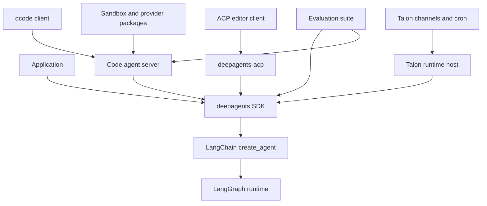
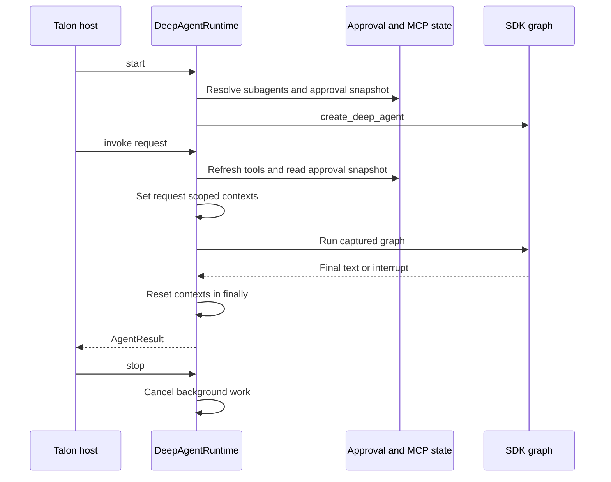

# Repository Architecture Overview

Deep Agents is the reusable harness in this monorepo, not the owner of every agent-facing concern. A safe change begins by locating the owning boundary: reusable graph construction in the SDK; terminal experience and product policy in Code; editor protocol translation in ACP; or long-running channel, approval, MCP, scheduling, and local-delegation operations in Talon.

- [SDK construction and execution](./sdk-construction-execution.md)
- [Responsibility-by-file map](./source-map.md)
- [Deep Agents Code](./code-agent.md)
- [Talon host](../integrations/talon.md)
- [MCP integration](../integrations/mcp.md)
- [Permissions and HITL](../concepts/permissions-hitl.md)
- [Subagents and skills](../concepts/subagents-skills.md)

## Stack and package ownership

This diagram shows dependency direction, not a transfer of product responsibilities into the SDK.

Deep Agents is a three-layer stack: LangGraph is the runtime (state, checkpoints, streaming, interrupts), LangChain `create_agent` is the agent abstraction that builds the model-plus-tools-plus-middleware loop on top of LangGraph, and Deep Agents is an opinionated harness on top of `create_agent`. The SDK owns harness defaults and composition; LangGraph still owns graph execution and checkpoint state.

`libs/` is a monorepo with independently versioned packages. `deepagents` is the core SDK exposing `create_deep_agent`, middleware, and pluggable backends. Product and host packages consume it rather than becoming dependencies of it:

| Package | Boundary |
| --- | --- |
| `deepagents` | Reusable graph assembly, middleware, backend routing, profiles, skills, memory, filesystem tools, and SDK subagent machinery. |
| `deepagents-code` | Terminal coding product: UI, client/server process boundary, product configuration and persistence, approval UX, extensions, and sandbox selection. |
| `deepagents-acp` | ACP adapter between an editor client and a compiled graph or session-aware graph factory. |
| `deepagents-talon` | Experimental local host: channel adapters, cron, local persistence, MCP lifecycle, channel-mediated approval, and its own local/background delegation layer. |
| `deepagents-evals` | Behavioral and benchmark evaluation outside the request-serving path. |
| `partners/` | Daytona, Modal, Runloop, Vercel, and QuickJS integrations, keeping provider-specific execution concerns out of the SDK. |

## SDK assembly is a reusable seam

`create_deep_agent()` is the assembly point that resolves the model and harness profile, resolves the backend, assembles the main-agent middleware stack, builds the default general-purpose subagent, composes the final system prompt, and delegates to LangChain's `create_agent(...)` to produce the runnable graph. It is therefore the place to change a reusable harness capability, not the place to put channel routing, editor session policy, terminal presentation, or a host's operator workflow.

`DeepAgentState` extends LangChain's `AgentState` with a `DeltaChannel` reducer so checkpoint growth stays linear (O(N)) rather than quadratic (O(N^2)) on long threads. Custom state schemas that need the SDK message behavior should preserve that reducer. Backends remain a separate concern: they determine where files, memory, and shell execution occur, while LangGraph checkpoints retain graph state.

Tool visibility is not authorization. Middleware/profile composition determines what the model sees; backend capabilities and tool-level filesystem permissions determine whether a call can operate; `interrupt_on` routes selected calls through LangGraph interruption. The detailed enforcement model belongs in [Permissions and HITL](../concepts/permissions-hitl.md), rather than in a consumer host.

## Consumer composition boundaries

### Deep Agents Code: product server behind a terminal client

Deep Agents Code separates a terminal client from an agent server in separate processes: the client owns presentation and input while the server owns the coding graph, and both interactive and headless operation use that runtime boundary. The server is a consumer of the SDK, so terminal approvals, product configuration, local context, extension loading, and sandbox choices remain Code responsibilities.

Deep Agents Code's `create_cli_agent()` is the product assembly point: it builds an SDK agent with a composite backend, CLI context schema, CLI middleware, interrupt policy, checkpoint/store, subagents, and a sanitized assistant name; registered extensions replace same-named tools and middleware before construction.

### ACP: editor protocol and session boundary

`deepagents-acp` depends on `deepagents` and Agent Client Protocol, and `AgentServerACP` accepts either a compiled graph or a factory that builds a graph from ACP session context. The factory form is the correct seam when working directory, selected mode/model, or session-specific setup must affect graph construction.

ACP retains protocol-owned session state such as session IDs, working directories, selected options, plans, cancellation state, and supplied MCP server descriptors. If `load_sessions=True`, it advertises `session/load`; recovery reads the graph checkpoint, verifies that it is an ACP session and that its original working directory matches, restores options, and replays it. A durable checkpointer is therefore required for restart-safe loading; a `MemorySaver` is suitable for the included test-style agent but not server restart persistence.

### Talon: host lifecycle around an SDK graph

Talon's CLI (`deepagents-talon`) constructs the host boundary. With a configured model, it loads MCP tools, opens its SQLite checkpointer/history resources, and creates `DeepAgentRuntime`; without one it uses `EchoAgentRuntime` for bootstrap behavior. Channel flags attach WhatsApp, Telegram, and Discord adapters; a persistent cron scheduler is attached only when channels provide a delivery route. Talon is experimental and its local shell environment filtering is not sandbox isolation.

This lifecycle distinguishes Talon's operational state from the SDK graph it composes.

Talon's `DeepAgentRuntime` resolves subagents and constructs its SDK graph at start; each invoke establishes request-scoped authorization, history, cron, graph, and background-result context, then resets it in a `finally` block, while stop cancels background work before releasing the graph and checkpointer resources. It refuses invocation before startup, refreshes runtime tools, and rebuilds the graph when the approval snapshot changes. If background cancellation fails, it leaves graph/checkpointer resources open rather than risk closing persistence while a worker is writing.

MCP tools arrive through Talon's `MCPToolProvider`, not through a change to SDK ownership. Reload/refresh builds a replacement graph under the runtime lock; failed refresh leaves the prior graph usable. Likewise, a saved Talon subagent edit does not alter a running turn: `reload_subagent_configuration()` validates and builds a replacement graph for subsequent turns.

Talon composes additional behavior around standard SDK delegation. It replaces the SDK `SubAgentMiddleware` with `TaskTools` so a caller can attach an explicit, validated set of current catalog tools to a named local subagent for one task. Local roles compile as fresh-context `create_agent` graphs with only their configured or selected tools, Talon MCP middleware, and any applicable approval middleware. `fork` is rejected, opaque compiled/remote roles report unknown tools, and duplicate attachment names fail rather than choosing arbitrarily. Background work is Talon-managed and its results are fed back to an owning conversation; this lifecycle is distinct from the SDK's remote asynchronous-subagent mechanism.

Talon approval policy is also host-owned. It loads a snapshot into graph `interrupt_on` configuration and captures that snapshot for an invocation; channel/cron/background handling supplies or denies decisions around resulting interrupts. A policy edit takes effect only after graph rebuild for a later invocation, not as authority inherited by an already-running task. See [Permissions and HITL](../concepts/permissions-hitl.md) for the enforcement and identity constraints.

## Evaluation and releases

The evaluation suite runs agents against real LLMs, captures tool calls, file mutations, and final responses, and scores correctness and efficiency; its Harbor integration runs sandboxed benchmarks such as Terminal Bench 2.0. Use it for changes that alter assembled-agent trajectories, alongside focused package tests for the boundary changed.

The release manifest currently records `deepagents` 0.7.15, `deepagents-acp` 0.0.12, `deepagents-code` 0.1.71, `deepagents-talon` 0.0.8, and the Daytona 0.0.8, Modal 0.0.6, Runloop 0.0.7, Vercel 0.0.2, and QuickJS 0.3.7 partner packages. Release Please is configured for separate draft pull requests and independent Python package releases with package-specific version files and changelogs; it uses component-bearing tags separated by `==` and excludes package test paths from release analysis.

## Safe change guide

1. **SDK behavior:** trace the public `create_deep_agent()` input into middleware, profiles, or backends. Preserve middleware order and the `DeepAgentState` message reducer.
2. **Code behavior:** keep terminal UI, client/server streaming, product approvals, extensions, and sandbox choice in `libs/code`.
3. **ACP behavior:** keep protocol conversion, session semantics, replay, and editor-facing configuration in `libs/acp`; do not make the SDK retain editor sessions.
4. **Talon behavior:** keep channels, cron delivery, local MCP configuration/reload, operator approval, and local/background subagent lifecycle in `libs/talon`. Test graph replacement and running-work semantics whenever changing these seams.
5. **Provider behavior:** put sandbox/provider mechanics in the appropriate partner package rather than coupling them to the generic harness.

Focused coverage should follow ownership: SDK graph tests for reusable assembly; Code client/server tests for product flow; ACP tests for session and protocol replay; and Talon runtime/subagent tests for startup, context cleanup, approval snapshots, graph replacement, fresh-agent tool attachment, and cancellation safety.
