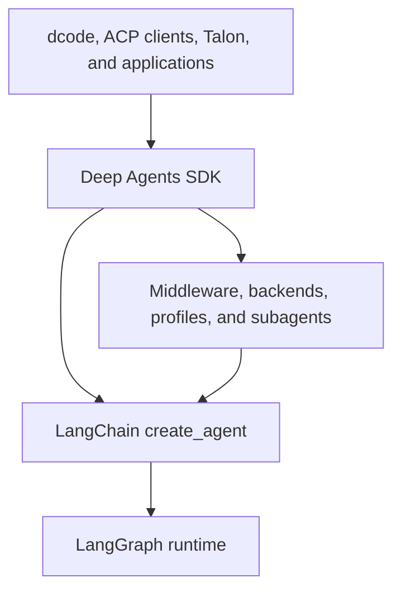
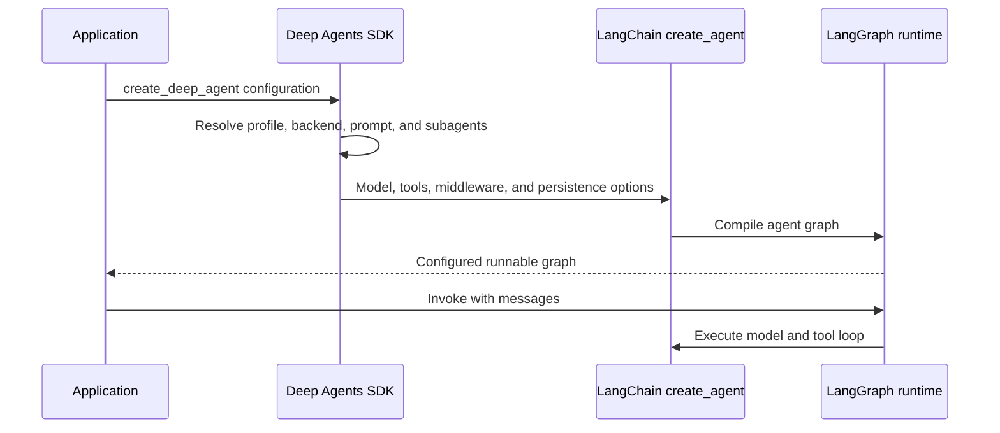

# Monorepo Architecture Overview

Deep Agents is an opinionated agent harness, not a replacement runtime. Start a change by locating its behavior in the SDK stack, then trace the relevant `create_deep_agent()` argument into middleware, a backend, a profile, or the product package that owns the user-facing behavior.

- **Middleware ordering and extension points:** [middleware-stack.md](./middleware-stack.md)
- **SDK construction and execution:** [sdk-construction-execution.md](./sdk-construction-execution.md)
- **Responsibility-by-file index:** [source-map.md](./source-map.md)
- **Coding product details:** [code-agent.md](./code-agent.md)
- **Protocol and host integrations:** [ACP](../integrations/acp.md) and [Talon](../integrations/talon.md)
- **Local setup and commands:** [development](../operations/development.md)

## Runtime layers and ownership

The diagram shows the runtime dependency direction and the SDK's harness extension boundary.

The stack has three distinct owners:

- **LangGraph** provides durable graph execution: state between steps, checkpoints, streaming, and interrupt-based pause/resume.
- **LangChain `create_agent()`** provides the agent abstraction: model, tools, middleware, and the model/tool/repeat loop built on LangGraph.
- **Deep Agents** provides the batteries-included harness above `create_agent()`: default middleware, pluggable backends, profiles, subagents, skills, and memory configuration. It does not introduce another runtime.

The dependency direction is **Deep Agents → LangChain `create_agent()` → LangGraph**. Use Deep Agents for the complete harness, bare `create_agent()` for a lighter loop, and LangGraph when the loop itself must be a custom graph. The boundary remains composable: a LangGraph `CompiledStateGraph` can be supplied as a Deep Agents subagent.

## SDK public surface and construction boundary

The reusable `deepagents` package publicly exports `create_deep_agent`, `DeepAgentState`, common filesystem, memory, rubric, and subagent middleware types, plus harness and provider profile registration APIs. `create_deep_agent()` in `libs/deepagents/deepagents/graph.py` is the principal assembly point.

At construction, it resolves the model and applicable harness profile, rewrites applicable tool descriptions, chooses `StateBackend()` when no backend is supplied, builds the default general-purpose subagent when appropriate, and composes caller and profile prompt text. It then delegates the model, tools, assembled middleware, schemas, checkpointer, store, debug, name, and cache to LangChain `create_agent(...)`. The returned runnable is configured with Deep Agents metadata and a recursion limit of 9,999.

The sequence separates SDK assembly from LangGraph-driven execution after invocation.

### Middleware, state, and failure boundaries

The main-agent stack is assembled in `graph.py`: filesystem and subagent support, summarization, patch-tool-calls, optional asynchronous subagents, profile middleware, prompt caching, optional memory, tool exclusion, and human-in-the-loop support. Skills are included when configured. Declarative subagents get separately built middleware stacks; compiled and remote subagents retain independently configured behavior.

Tool visibility is not authorization. A missing tool normally indicates middleware assembly or a profile tool exclusion. A visible tool that fails normally points to backend capability or filesystem permission enforcement. Profile exclusion validation fails closed: protected middleware, private names, ambiguous class matches, and exclusions that match no assembled middleware are rejected rather than silently producing a partial harness.

`DeepAgentState` extends LangChain `AgentState` with a `DeltaChannel` reducer for `messages`, keeping checkpoint growth linear rather than quadratic on long threads. A custom state schema is expected to subclass it. The schema is merged with middleware state and forwarded to declarative subagents, whereas already compiled and remote subagents keep their own schemas. LangGraph owns graph-state checkpoints; the selected Deep Agents backend separately decides where files, memory, and shell execution live.

## Package map and dependency direction

`libs/` is a monorepo of independently versioned packages. The release manifest tracks released package versions separately, including the SDK, ACP, Code, Talon, and each sandbox/provider partner. Package manifests make the dependency direction explicit: product, evaluation, and host packages consume the SDK rather than the SDK depending on them.

| Package | Public entry point and ownership boundary |
| --- | --- |
| `deepagents` | Core SDK for builders. Its main public entry point is `create_deep_agent`; reusable harness work belongs in its middleware, backends, profiles, and graph construction. |
| `code` (`deepagents-code`) | Deep Agents Code, a pre-built terminal coding agent. The `dcode` and `deepagents-code` console scripts both invoke `deepagents_code:cli_main`. It supplies the Textual TUI, headless workflow, remote sandbox choices, memory, skills, and coding-product configuration. |
| `acp` (`deepagents-acp`) | Agent Client Protocol bridge for running a supplied compiled Deep Agent graph, or a graph factory, in ACP clients such as Zed. It depends on `deepagents`; `dcode --acp` is the Code product's ready-made ACP server mode. |
| `evals` (`deepagents-evals`) | End-to-end behavioral evaluation suite and Harbor integration. It depends on both `deepagents` and `deepagents-code`, making it a consumer that evaluates product and SDK behavior rather than part of the runtime path. |
| `talon` (`deepagents-talon`) | Experimental local host for long-running agents, channel adapters, and cron schedules. It consumes both `deepagents` and `deepagents-code`; its CLI entry point is `deepagents-talon`. |
| `partners/` | Separately versioned provider and sandbox integrations: Daytona, Modal, Runloop, Vercel, and QuickJS. These keep provider-specific execution concerns out of the core SDK. |

### dcode product assembly

`create_cli_agent()` is the Code package's product assembly point. It builds an SDK agent with a composite backend, `CLIContextSchema`, CLI middleware, interrupt policy, checkpoint/store, subagents, and a sanitized assistant name. Registered extensions are resolved before construction; an extension with the same name replaces the corresponding tool or middleware, then an extension runtime middleware is appended. This keeps terminal-product policy in `code` while reusing the SDK graph constructor. If configured, Code replaces the SDK graph's default recursion limit on the copied graph with its effective product setting.

### ACP session boundary

`AgentServerACP` translates between ACP and a compiled Deep Agents graph. It accepts either a graph or a factory scoped to ACP session context. Its optional session-loading capability needs a LangGraph checkpointer that survives process restarts: on load it restores the graph thread, verifies the original working directory, and replays conversation updates to the ACP client. An in-memory checkpointer is useful for tests but cannot provide restart persistence.

### Talon lifecycle and security boundary

Talon owns the process lifecycle around an SDK graph, not a different agent runtime. `DeepAgentRuntime.start()` resolves subagents, loads the approval snapshot, and constructs its SDK graph. `invoke()` requires that graph to be started; it refreshes runtime tools, rebuilds the graph when the approval snapshot changed, establishes request-scoped approval, authorization, message, history, cron, graph, and background-result contexts, and resets them in a `finally` block. A tool-refresh error is logged and leaves the previous graph usable.

`stop()` first waits for background-subagent cancellation. Only after successful cancellation does it clear the graph and close a closeable checkpointer; if cancellation times out, it raises and deliberately leaves resources open rather than close a checkpointer that a surviving worker could still be writing. This ordering is a lifecycle invariant for host shutdown.

Talon is alpha software and does not provide production-grade human approval policy, channel administrator controls, sandbox execution isolation, or multi-tenant boundaries. Treat a channel user as having direct access to the operator's agent, credentials, MCP tools, and local-host resources. This is a deployment constraint, not an SDK permission guarantee.

### Evaluation boundary

The evaluation suite runs agents against real LLMs, captures tool calls, file mutations, and final responses, then scores correctness and efficiency. Its Harbor integration runs sandboxed benchmarks such as Terminal Bench 2.0. Use it to validate behavior changes that matter across the assembled agent trajectory rather than only construction-time unit behavior.

## Safe change and test path

Most SDK changes begin in `libs/deepagents/deepagents/graph.py`, then move into `middleware/`, `backends/`, or `profiles/` according to the behavior being changed. Preserve middleware order and the `DeepAgentState` reducer when extending the harness. Keep terminal interaction and product wiring in `code`, ACP protocol and session semantics in `acp`, channel lifecycle and scheduling in `talon`, and benchmark definitions and scoring in `evals`.

Use focused tests before a broad suite. SDK pytest defaults exclude benchmark-marked tests and treat unexpected warnings as errors; focused graph tests cover construction and compiled-graph metadata wiring. For an integration boundary, run or add package-local coverage for ACP session behavior, Talon runtime lifecycle, or the affected end-to-end evaluation trajectory.
