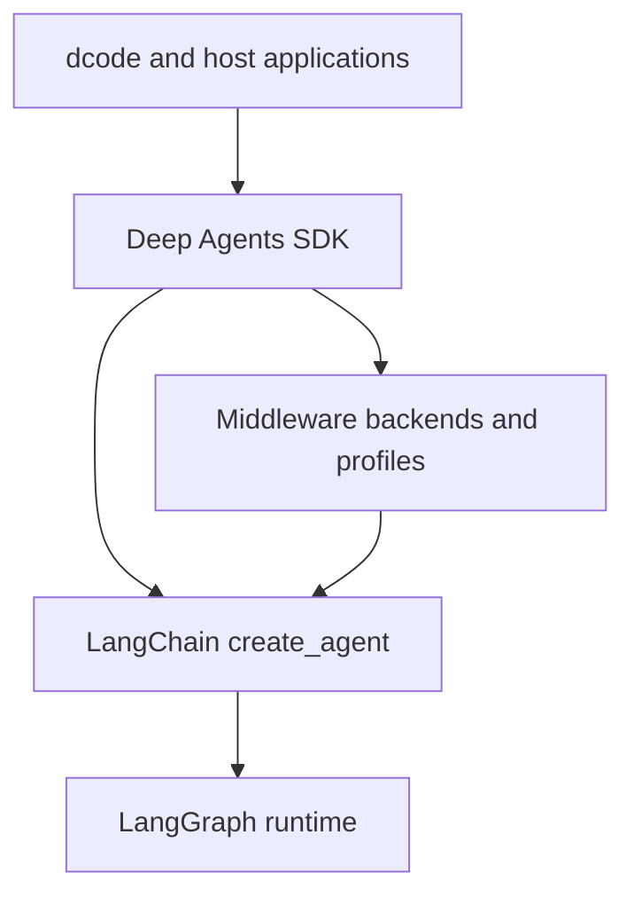
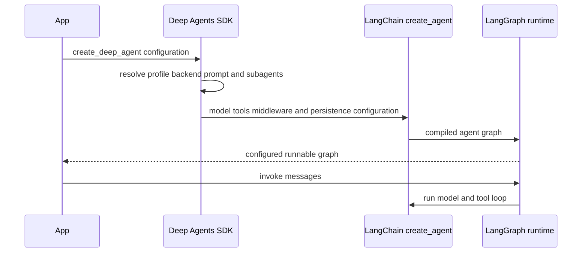

# Architecture Overview

Deep Agents is an opinionated agent harness, not a replacement runtime. Start a change by locating the behavior in the three-layer stack, then trace the relevant `create_deep_agent()` argument into the middleware, backend, profile, or consuming product that implements it.

- **Middleware ordering and extension points:** [middleware-stack.md](./middleware-stack.md)
- **Construction versus execution:** [sdk-construction-execution.md](./sdk-construction-execution.md)
- **Responsibility-by-file index:** [source-map.md](./source-map.md)
- **Coding product details:** [code-agent.md](./code-agent.md)
- **Protocol and host integrations:** [ACP](../integrations/acp.md) and [Talon](../integrations/talon.md)

## Layers and dependency direction

The SDK supplies harness behavior around an agent loop that LangChain constructs and LangGraph executes.

- **LangGraph** owns durable graph execution: state carried between steps, checkpoints, streaming, and interrupt-based pause/resume.
- **LangChain `create_agent()`** owns the general agent abstraction: model, tools, middleware, and the model/tool/repeat loop it builds on LangGraph.
- **Deep Agents** owns the batteries-included policy above that abstraction: default middleware, backends, profiles, subagents, skills, and memory configuration. It does not introduce a different runtime.

The dependency direction is **Deep Agents → LangChain `create_agent()` → LangGraph**. Use Deep Agents for the full harness, bare `create_agent()` for a lighter agent loop, and LangGraph directly when the loop itself must be a custom graph. The boundary is composable: a LangGraph `CompiledStateGraph` can be a Deep Agents subagent.

## SDK construction, execution, and safeguards

`create_deep_agent()` in `libs/deepagents/deepagents/graph.py` is the SDK integration boundary. At construction it resolves the model and harness profile, rewrites applicable tool descriptions, selects `StateBackend()` by default, composes the caller and profile prompts, processes subagents, and delegates the assembled model, tools, middleware, schemas, checkpointer, store, debug, name, and cache to LangChain `create_agent(...)`. The returned graph carries Deep Agents metadata and a recursion limit of 9,999.

This is the construction-to-execution boundary: the SDK builds configuration, while LangGraph drives an invoked graph.

The main middleware stack is ordered. It conditionally adds skills, then filesystem and subagent support, summarization and tool-call patching, optional async subagents, profile middleware, prompt caching, optional memory, and human approval. Custom middleware is spliced relative to the captured core stack; profile exclusions are reapplied afterward. If a profile excludes tools, tool exclusion is appended last so later custom middleware cannot restore them. Declarative subagents receive separately built stacks, while compiled and remote subagents retain their independently configured behavior.

Tool visibility is not authorization. A missing tool normally points to middleware assembly or profile tool exclusions. A visible tool that fails points to the selected backend's capabilities or filesystem permission enforcement. Filesystem permissions apply to the built-in filesystem tools rather than direct backend use; an interrupt-mode rule installs human-in-the-loop middleware and pauses before configured calls.

`DeepAgentState` extends LangChain `AgentState` with a `DeltaChannel` reducer for `messages`, keeping checkpoint growth linear rather than quadratic for long threads. Custom state schemas must subclass it to retain that reducer. Such a schema is merged with middleware schema and forwarded to declarative subagents, but compiled and remote subagents must be independently compiled/configured with any state they need. Checkpoint and graph-state persistence belong to LangGraph; the Deep Agents backend independently determines where files, memory, and shell execution live.

Construction rejects unsafe or ineffective profile exclusions: protected scaffolding, private names, ambiguous class matches, and entries matching no assembled middleware raise `ValueError`. This makes profile configuration fail closed instead of silently yielding a partial harness.

## Product and integration layers

`libs/` is an independently versioned-package monorepo. The following boundaries distinguish reusable harness behavior from the applications and adapters that consume it.

| Package | Architectural role |
| --- | --- |
| `deepagents` | Core SDK: `create_deep_agent`, middleware, and pluggable backends. Reusable harness changes belong here. |
| `code` (`deepagents-code`) | Deep Agents Code, the terminal coding application exposed as `dcode`, with a Textual TUI, remote sandboxes, memory, skills, and headless mode. Its `create_cli_agent()` product entrypoint constructs an SDK agent with the CLI context schema, composite backend, CLI middleware, interrupt policy, subagents, checkpoint/store, and sanitized assistant name. Extensions can replace same-named tools and middleware before the graph is created. |
| `acp` (`deepagents-acp`) | Agent Client Protocol adapter for serving a Python Deep Agent in ACP editors such as Zed. `AgentServerACP` runs a supplied agent; with a durable LangGraph checkpointer and `load_sessions=True`, it can reload the thread after a process restart, verify the original working directory, and replay conversation updates. `dcode --acp` exposes the prebuilt coding agent over stdio. |
| `evals` (`deepagents-evals`) | End-to-end behavioral evaluation suite. It runs real-LLM agents, records tool calls, file mutations, and final responses, then evaluates correctness and efficiency; Harbor integration runs sandboxed benchmarks such as Terminal Bench 2.0. |
| `talon` (`deepagents-talon`) | Experimental local, single-event-loop host for long-running agents, channel adapters, and cron schedules. It is alpha software and explicitly lacks production-grade approval, administrator, sandbox-isolation, and multi-tenant controls. |
| `partners/` | Provider and sandbox integration area: Daytona, Modal, Runloop, Vercel, and QuickJS. |

`deepagents-code` consumes `deepagents`; both `deepagents-evals` and `deepagents-talon` consume the SDK and Code. Dependencies flow toward the SDK, not from the SDK into product packages.

### Talon lifecycle and operational boundary

Talon wraps, rather than replaces, the SDK graph. `DeepAgentRuntime.start()` resolves subagents and builds a `create_deep_agent()` graph. Its default backend is local shell execution and its default checkpointer is in memory, so callers that need durable history must supply the host's persistent checkpoint/archive setup. For each request, `invoke()` requires a started graph, refreshes runtime tools, establishes request-scoped authorization, history, cron, graph, and background-result context, then invokes until it obtains text; it always resets those contexts and acknowledges completed background results. `stop()` cancels background subagents before dropping the graph and closing a closeable checkpointer.

Talon can rebuild the graph when MCP tools or subagent configuration is reloaded; failed MCP refreshes leave the previous graph usable and mark saved changes inactive. Its README documents persistent channel history and cron state, but its security warning is material: channel access should be treated as direct access to the operator's agent, credentials, MCP tools, and local host resources while Talon remains experimental.

## Practical change and test path

Most SDK changes start in `libs/deepagents/deepagents/graph.py`, then move into `middleware/`, `backends/`, or `profiles/` according to the behavior being changed. Preserve middleware order and the `DeepAgentState` reducer when extending the harness. Product-specific terminal workflow belongs in `code`; ACP protocol/session semantics in `acp`; channel lifecycle, scheduling, and host persistence in `talon`; benchmark definitions and scoring in `evals`.

Use focused tests before a broad suite. `libs/deepagents/tests/unit_tests/test_graph.py` covers graph construction and compiled-graph metadata, along with profile and state behavior elsewhere in that module. The SDK pytest defaults exclude benchmark-marked tests and treat unexpected warnings as errors. For integration boundaries, add or run the package-local tests that exercise ACP session handling, Talon runtime lifecycle/reload behavior, or the end-to-end evaluation trajectory affected by the change.
