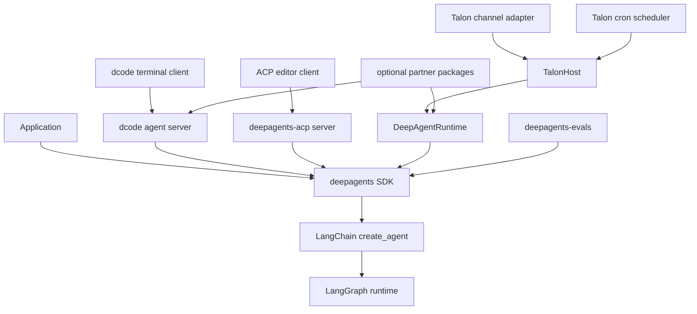
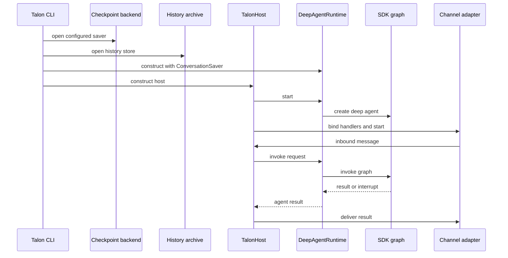

# Architecture Overview

This monorepo is a set of independently versioned packages rather than one deployable service. The reusable `deepagents` package assembles agent graphs; dcode, ACP, and Talon are different consumers and hosts of those graphs; evals measure behavior; and partner packages supply optional provider integrations. Choose the package whose boundary matches the product being built rather than adding product transport or UI policy to the SDK.

- [SDK construction and execution](./sdk-construction-execution.md)
- [Code agent](./code-agent.md)
- [Runtime behavior](./runtime-behavior.md)
- [ACP integration](../integrations/acp.md)
- [Talon integration](../integrations/talon.md)
- [Source map](./source-map.md)

## Runtime layers and dependency direction

Deep Agents is not another graph runtime. LangGraph provides stateful graph execution, checkpoints, streaming, and interrupts. LangChain's `create_agent` builds the model-plus-tools-plus-middleware agent loop on that runtime. The Deep Agents SDK is the opinionated layer that configures that loop with a backend, middleware, subagents, skills, memory, profiles, and tool policy.

```mermaid
flowchart TD
  App["Application"] --> SDK["deepagents SDK"]
  DcodeClient["dcode terminal client"] --> DcodeServer["dcode agent server"]
  DcodeServer --> SDK
  Editor["ACP editor client"] --> ACP["deepagents-acp server"]
  ACP --> SDK
  Channel["Talon channel adapter"] --> Host["TalonHost"]
  Scheduler["Talon cron scheduler"] --> Host
  Host --> Runtime["DeepAgentRuntime"]
  Runtime --> SDK
  SDK --> LangChain["LangChain create_agent"]
  LangChain --> LangGraph["LangGraph runtime"]
  Evals["deepagents-evals"] --> SDK
  Partners["optional partner packages"] --> DcodeServer
  Partners --> Runtime
```
This shows runtime consumption: product hosts and adapters use the SDK, while LangChain and LangGraph sit below the SDK.

`create_deep_agent()` is the SDK assembly point. It resolves the model and applicable harness profile, chooses a backend (the default is `StateBackend`), prepares the final system prompt, processes supplied subagents, adds the default general-purpose subagent unless disabled or overridden, and builds the middleware stack before delegating to `langchain.agents.create_agent(...)`. The returned compiled graph is the runnable artifact supplied to applications and hosts.

The assembly API deliberately exposes the control points that products need: tools, backend, middleware, subagents, skills, memory, filesystem permissions, interrupt policy, state/context schemas, checkpointer, store, cache, and graph name. Deep Agents keeps required filesystem and synchronous-subagent scaffolding from being excluded by a harness profile: excluding those components is a configuration error rather than a silently degraded graph.

## Responsibilities and state ownership

| Boundary | Owns | Does not own |
| --- | --- | --- |
| `deepagents` SDK | Graph assembly, Deep Agents middleware, backends, profiles, SDK subagents, and tool-facing policy. | Terminal presentation, editor protocol sessions, channel connections, or schedule delivery. |
| LangGraph | Runtime graph state, streaming, checkpointing, and interrupt/resume behavior. | Product-specific transports and durable host lifecycle. |
| dcode | Terminal product, client/server transport, coding configuration, and product extensions. | The generic SDK harness. |
| `deepagents-acp` | Agent Client Protocol translation and ACP session behavior around a graph. | A terminal UI or channel-host policy. |
| Talon | A local process host, channel adapters, invocation coordination, cron scheduling, and its durable collaborators. | A production multi-tenant containment boundary. |
| `deepagents-evals` | Behavioral measurement and benchmarks. | Live request serving. |
| `partners` | Optional external-provider integrations. | A mandatory core runtime layer. |

The persistence distinction is important when embedding the SDK. A graph checkpointer is passed through `create_deep_agent()` to LangChain/LangGraph and is responsible for graph state across runs. A Deep Agents backend separately governs file, memory, and execution capabilities. A host may add its own durable data: for example, Talon has an archive and a cron-job store in addition to its LangGraph checkpointer. Do not assume that selecting a product host automatically gives every SDK graph durable state, or that a graph checkpointer contains host delivery records.

## Product and protocol boundaries

### dcode: reference coding-agent product

`deepagents-code` is a reference terminal coding-agent product on the SDK. Its terminal client and agent server are separate processes: the client owns presentation, input, and approval interaction; the server owns graph execution and streams events to the client. Headless mode uses the same agent-server runtime, so behavior should not fork simply because the UI is absent.

dcode configuration is layered across user, project, session, and runtime scopes. Its shared resolver uses a process-wide generation; an in-app write or `/reload` advances that generation, parse failures retain the last usable tier, and ordinary file edits are not watched. This makes reload an explicit lifecycle operation and avoids a partially written configuration changing only some readers.

### ACP: editor-facing graph bridge

`AgentServerACP` accepts either a compiled graph or a graph factory that receives `AgentSessionContext` with the working directory, mode, and optional model. It translates ACP sessions and streamed graph activity without making ACP a new agent runtime. When `load_sessions` is enabled, the server advertises that capability and verifies both persisted ACP session metadata and the original working directory before replaying a session.

Dcode provides an ACP specialization that wraps each session graph. On stream it injects trusted Auto-mode approval state and associates prompt metadata with the final user message; this is dcode policy layered above the generic ACP bridge.

### Evaluations and optional integrations

`deepagents-evals` runs agents against real LLMs, records the complete trajectory—including tool calls, file mutations, and final response—and scores correctness and efficiency. Its Harbor integration runs sandboxed benchmarks such as Terminal Bench 2.0. It is a measurement boundary, not a serving component.

The `partners` group contains integrations for Daytona, Modal, Runloop, Vercel, and QuickJS. They are selected by consumers such as a product or host; they are not required for a core SDK graph to run.

## Talon: local long-running host

Talon is an experimental alpha local runtime host. It owns a single process event loop for channel adapters, an `AgentRuntime`, and an optional cron scheduler. It is not designed as production containment, enterprise policy enforcement, or a multi-tenant security boundary; channel access must therefore be treated as access to the configured agent and its host-side capabilities. Its optional sandbox changes where shell and file tools execute, but does not sandbox MCP tools.

```mermaid
sequenceDiagram
  participant Cli as Talon CLI
  participant Checkpoints as Checkpoint backend
  participant Archive as History archive
  participant Host as TalonHost
  participant Runtime as DeepAgentRuntime
  participant Graph as SDK graph
  participant Channel as Channel adapter
  Cli->>Checkpoints: open configured saver
  Cli->>Archive: open history store
  Cli->>Runtime: construct with ConversationSaver
  Cli->>Host: construct host
  Host->>Runtime: start
  Runtime->>Graph: create deep agent
  Host->>Channel: bind handlers and start
  Channel->>Host: inbound message
  Host->>Runtime: invoke request
  Runtime->>Graph: invoke graph
  Graph-->>Runtime: result or interrupt
  Runtime-->>Host: agent result
  Host->>Channel: deliver result
```
This sequence separates CLI-owned durable-resource setup, host-owned transport and delivery, and runtime-owned graph creation and invocation.

### Lifecycle and invocation boundary

The Talon CLI creates the assistant-scoped cron store, ensures and cleans its local home, and selects adapters from flags/environment. Without a configured model it uses `EchoAgentRuntime`; with a model it opens an optional sandbox, loads MCP tools, opens the checkpointer and history archive together, wraps them in `ConversationSaver`, and constructs `DeepAgentRuntime`. A `PersistentCronScheduler` is attached only when channels exist and delegates scheduled execution and delivery back through `TalonHost`.

`TalonHost` starts the agent runtime before channels and scheduler. A partial start is unwound in reverse order; shutdown cancels work before stopping channels, scheduler, and runtime, while isolating stop failures. Channel adapters implement a transport contract for lifecycle, inbound message registration, text/media delivery, edits, typing, and connection status; reaction handling is an optional capability.

At runtime start, `DeepAgentRuntime` resolves subagents, captures an approval snapshot, and builds its SDK graph. Its composition adds Talon-specific tools and middleware—including model selection, progress messages, `TaskTools`, and background-subagent behavior—before calling `create_deep_agent()`. Each invocation refuses to run before start, refreshes tools, rebuilds the graph if the approval snapshot changed, binds request-scoped authorization, history, selected model, cron, background-result, and message context, then resets those bindings in `finally`. This prevents state for one channel or scheduled turn from leaking into another.

Stopping the runtime first cancels background work. If cancellation fails, it intentionally leaves the graph/checkpointer resources open rather than close a saver while a worker might still be writing. Talon also serializes work per conversation and cancels a currently active turn when a replacement message arrives; callers should regard a cancellation timeout as a degraded conversation requiring restart rather than a safe opportunity for concurrent work.

### Durable state and extension points

Talon selects checkpoint persistence by URI. Built-in `sqlite`/`file`, PostgreSQL, and MongoDB schemes are resolved before trusted `deepagents_talon.checkpoint_backends` entry points. Factory setup and cleanup belong to the backend, while Talon turns unexpected opening failures into a configuration error without exposing URI credentials. Use separate remote-database isolation for separate assistants: remote checkpoint thread IDs are not automatically assistant-namespaced.

Talon's host-level state has a distinct purpose from checkpoints. The model-backed CLI combines the checkpointer and history archive in `ConversationSaver`; the archive supports conversation-history behavior, while the checkpointer carries graph execution state. The assistant-scoped cron store retains scheduled-job data independently. This separation is why a persistence or lifecycle change must identify which owner is being modified rather than treating all durable data as one database.

## Change guidance

- Change generic agent composition in `deepagents`, starting at `create_deep_agent()`, and keep product transport/UI behavior out of the SDK.
- Change dcode presentation and configuration semantics at its client/server boundary; retain the shared server path for headless operation.
- Change ACP session or content translation in `deepagents-acp`; preserve session identity checks when modifying load/replay behavior.
- Change Talon transport, turn coordination, delivery, and scheduling in `TalonHost`; change SDK graph composition and request-scoped context in `DeepAgentRuntime`.
- Treat Talon checkpoint drivers and partner entry points as trusted operator-installed extension boundaries. Preserve setup/cleanup ownership and credential-safe errors.
- Use `libs/talon/tests/test_host.py` for host lifecycle and cancellation behavior, Talon runtime tests for graph/context behavior, and package-specific tests when changing their boundary.
