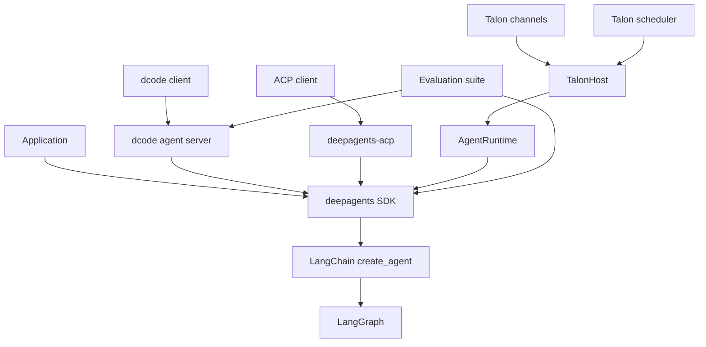
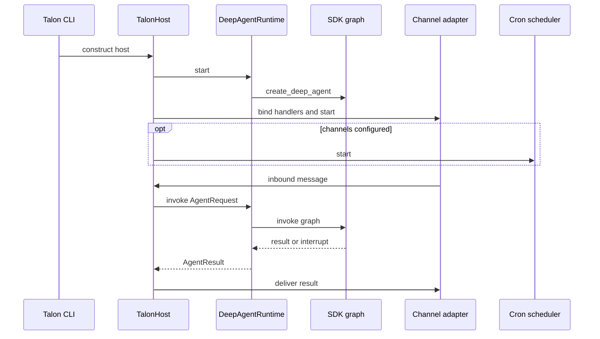

# Repository Runtime Architecture

The repository separates a reusable agent harness from the products and adapters that run it. Deep Agents owns reusable graph construction; dcode owns the terminal coding-agent product; ACP translates graph execution to the Agent Client Protocol; Talon is a long-running local channel host; and evals execute behavioral assessments rather than serving requests.

- [Code agent architecture](./code-agent.md)
- [Runtime behavior](./runtime-behavior.md)
- [SDK construction and execution](./sdk-construction-execution.md)
- [State persistence](../concepts/state-persistence.md)
- [Talon integration](../integrations/talon.md)
- [Run a dcode session](../workflows/run-dcode-session.md)

## Ownership and dependency direction

```mermaid
flowchart TD
  App["Application"] --> SDK["deepagents SDK"]
  Client["dcode client"] --> CodeServer["dcode agent server"]
  CodeServer --> SDK
  Editor["ACP client"] --> ACP["deepagents-acp"]
  ACP --> SDK
  Channels["Talon channels"] --> Host["TalonHost"]
  Scheduler["Talon scheduler"] --> Host
  Host --> Runtime["AgentRuntime"]
  Runtime --> SDK
  Evals["Evaluation suite"] --> SDK
  Evals --> CodeServer
  SDK --> LangChain["LangChain create_agent"]
  LangChain --> LangGraph["LangGraph"]
```
This is the dependency direction and ownership boundary: product and transport policy consume the SDK instead of becoming SDK runtime modes.

Deep Agents is a three-layer stack: LangGraph is the runtime for state, checkpoints, streaming, and interrupts; LangChain's `create_agent` is the model/tool/middleware agent abstraction on that runtime; and Deep Agents is the opinionated harness above it. `create_deep_agent()` is its assembly seam: it resolves model and harness profile, backend, main middleware, default general-purpose subagent, and final system prompt before calling LangChain's `create_agent(...)`.

| Component | Owns | Boundary |
| --- | --- | --- |
| `deepagents` | Reusable graph assembly, middleware, backend routing, profiles, skills, memory, filesystem tools, and SDK subagent machinery. | Does not own a terminal UI, editor protocol, channel process, or cron delivery. |
| `deepagents-code` / dcode | Terminal experience, client/server protocol, coding-agent product configuration, persistence, extensions, MCP integration, and sandbox selection. | Uses the SDK rather than redefining the generic harness. |
| `deepagents-acp` | ACP session and protocol translation around a compiled graph or session-aware graph factory. | Does not own dcode product policy or a channel host. |
| `deepagents-talon` | Local host lifecycle, channel adapters, schedules, local persistence, and channel-mediated interaction policy. | Is not a reusable SDK execution mode or a multi-tenant security boundary. |
| `deepagents-evals` | Real-model behavioral evaluation and benchmark integrations. | Does not participate in request serving. |

## dcode, ACP, and evals

`deepagents-code` is a reference terminal coding-agent product built on the SDK. Its terminal client and agent server are separate processes: the client owns presentation, input, and approvals, while the server owns graph execution and streams events back. Interactive and headless operation use the same server runtime; the interface differs. Its layered configuration spans user, project, session, and runtime scopes, with an explicit reload model rather than automatic file watching.

ACP is the editor-facing adapter boundary. `AgentServerACP` accepts either a compiled graph or a factory receiving `AgentSessionContext` with working directory, mode, and optional model. dcode specializes that server for Auto mode by wrapping a per-session graph to inject trusted approval-mode and prompt metadata into graph streaming. ACP therefore translates session and content semantics; it is not the coding-agent product runtime itself.

The eval suite runs an agent against real LLMs, retains the trajectory—including tool calls, file mutations, and final response—and scores correctness and efficiency. Its Harbor integration runs sandboxed benchmarks such as Terminal Bench 2.0. This workload validates SDK and product behavior but is separate from their live runtimes.

## Talon: local long-running host

Talon is an experimental alpha local runtime host. One process event loop owns channel adapters, an agent runtime, and an optional cron scheduler. It is not production containment or a multi-tenant security boundary: channel access must be treated as access to the operator's agent, credentials, configured MCP tools, and local resources. Sandboxing is opt-in and does not cover MCP tools.

The key split is intentional:

- **`TalonHost`** owns lifecycle, transport binding, conversation serialization, commands, result delivery, and scheduler coordination.
- **`AgentRuntime`** is the host-facing contract for start, stop, invoke, and interruption recovery. Optional runtime protocols add capabilities such as background-result processing, history delivery, model selection, MCP reload, and context diagnostics.
- **`DeepAgentRuntime`** implements that contract by constructing and invoking an SDK graph. **`EchoAgentRuntime`** supports bootstrapping without a configured model.
- **Channel adapters** convert provider events to `ChannelMessage` and optional reactions, and implement lifecycle, send/edit/media, typing, and status operations. Built-in adapters cover WhatsApp, Telegram, Discord, and Slack.

```mermaid
sequenceDiagram
  participant CLI as Talon CLI
  participant Host as TalonHost
  participant Runtime as DeepAgentRuntime
  participant Graph as SDK graph
  participant Channel as Channel adapter
  participant Scheduler as Cron scheduler
  CLI->>Host: construct host
  Host->>Runtime: start
  Runtime->>Graph: create_deep_agent
  Host->>Channel: bind handlers and start
  opt channels configured
    Host->>Scheduler: start
  end
  Channel->>Host: inbound message
  Host->>Runtime: invoke AgentRequest
  Runtime->>Graph: invoke graph
  Graph-->>Runtime: result or interrupt
  Runtime-->>Host: AgentResult
  Host->>Channel: deliver result
```
This sequence shows the division of responsibility: transports and delivery remain in the host, while the runtime owns SDK graph construction and execution.

### Startup and persistence

The `deepagents-talon` CLI loads `TalonConfig`, creates an assistant-scoped `CronJobStore`, ensures the assistant home, cleans sensitive state, and chooses channels from flags or enablement environment variables. No configured model selects `EchoAgentRuntime`; otherwise the CLI opens the configured sandbox, loads MCP tools, and constructs `DeepAgentRuntime` with Talon MCP middleware, the assistant directory, cron store, and the sandbox backend when present.

On the model-backed path, the CLI opens an `AsyncSqliteSaver` and history archive, then gives the runtime a `ConversationSaver` wrapper. A caller-supplied checkpointer is used directly. Checkpoints and the archive have different responsibilities: graph checkpoints preserve execution state, whereas the wrapper archives delivered final replies and enables scoped history clearing. The CLI installs `PersistentCronScheduler` only when channels are configured and gives it host callbacks for execution and delivery.

### Runtime graph lifecycle and replacement

At `DeepAgentRuntime.start()`, Talon resolves subagents, creates/reads the approval-policy snapshot, and constructs the SDK graph. Its graph adds Talon tools, approval tools, MCP/runtime tools, and—when configured—archive and cron tools. It uses `TaskTools` in place of the SDK subagent middleware, adds `BackgroundSubagents`, and may add summarization middleware; it then calls `create_deep_agent()` with the resolved model, backend, prompt, skills, memory, checkpointer, middleware, and approval interrupt policy.

`invoke()` refuses to run before startup. For each turn it refreshes runtime tools when configured, captures the active graph and immutable approval snapshot under a lock, then establishes request-scoped context for the selected model, approvals, background results, cron origin/scheduled status, authorization, progress messages, graph selection, and history. Those context bindings are reset in `finally`. A policy snapshot change rebuilds the graph before the new turn. MCP refresh and subagent reload build and validate a replacement under the same lock; failures keep the old graph active, while successful replacements apply to later turns.

Stopping cancels background workers before clearing the graph and closing a closable checkpointer. If cancellation cannot complete, the runtime raises and intentionally leaves graph/checkpointer resources open: closing persistence while a worker might still write is less safe than leaking the resources.

### Channel turns, delivery, and shutdown

`TalonHost.start()` starts the agent runtime before it binds and starts channels, then starts the optional scheduler. A partial start is unwound in reverse order. `stop()` cancels active work before stopping channels in reverse order, the scheduler, and the runtime; component stop failures are isolated so remaining cleanup runs.

The host serializes work by provider-qualified conversation. A later inbound message cancels and replaces an active turn; it tries to append an interruption marker after the latest committed checkpoint before starting the replacement. If cancellation or recovery exceeds the 30-second bound, the conversation is blocked and later messages receive a restart-required response rather than running concurrently. The host captures the selected model at turn creation, so a later `/model` change cannot alter an in-flight turn.

The host sends final replies through the adapter and records them in persistent history only after successful delivery. It also runs an optional background-result dispatcher: completed worker output triggers a later owner turn when the conversation is idle, and failed delivery attempts are retried with backoff. `/context-doctor` is capability-gated: the host limits it to ten seconds and emits non-disclosing unavailable/failure text; `DeepAgentRuntime` requires a started graph and delegates the report to `ContextDoctor`.

### Delegation, approval, and cron execution

Talon adapts rather than changes SDK-wide delegation. `TaskTools` lets a task add only unique names from the current parent tool catalog to a named local subagent; the local subagent is compiled fresh, does not inherit parent history, and rejects `fork` mode. On ordinary turns, `BackgroundSubagents` detaches `task` and `start_async_task` work into in-memory jobs owned by the conversation. Workers use their own thread IDs, cannot delegate again, clear inherited authorization handling, and expose completed results for a later owner turn.

A cron request marks the runtime's scheduled-turn context. Delegation is then inline: task results return in the same turn, no job or delivery turn is created, and nested delegation remains forbidden. Inline delegation is separately semaphore-limited and queues, and its shorter timeout becomes an error tool result. The host additionally bounds each scheduled run and repairs the job thread after timeout.

Approval policy is Talon-local and snapshot-based. An approval batch requires unique interrupt IDs, presents one decision for all protected actions, and resumes every interrupt ID; co-batched MCP elicitation is cancelled. Cron and background-delivery runs are auto-rejected because no interactive approval path exists. For interactive turns, the host exposes a pending approval request only to the originating channel and accepts an approve/reject response only from the sender who started that run; a validated reaction on the approval prompt can resolve the same request.

`CronJobStore` persists assistant jobs in a versioned JSON envelope containing prompt, parsed schedule, repeat/run state, and channel/conversation/message origin. `PersistentCronScheduler` removes finished jobs, claims each due job by advancing it before invocation, records success or failure, suppresses `[SILENT]` output, and changes a previously successful run record to error when delivery fails. A failed tick is logged and retried on the normal interval, leaving due jobs eligible for a subsequent scan.

## Operations and safe changes

Keep host transport policy out of the SDK and keep graph-specific construction in the runtime. Changes to lifecycle, cancellation, approval, or scheduler ordering should exercise `libs/talon/tests/test_host.py`; graph construction, reload, persistence, and interruption recovery should exercise `libs/talon/tests/test_runtime.py`; background and approval semantics have focused unit coverage under `libs/talon/tests/unit_tests/`. Changes to `create_deep_agent()` need SDK graph coverage, and protocol changes need ACP and dcode integration coverage.
