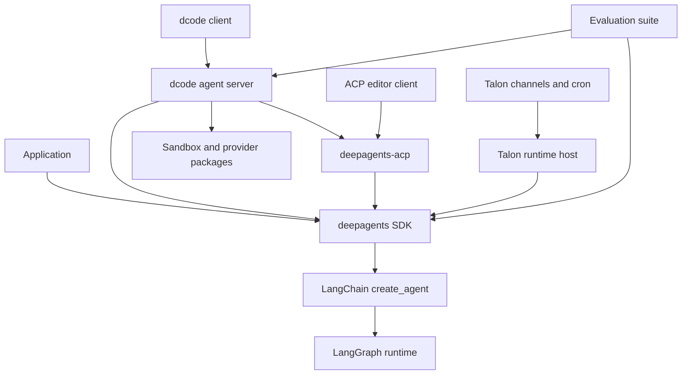
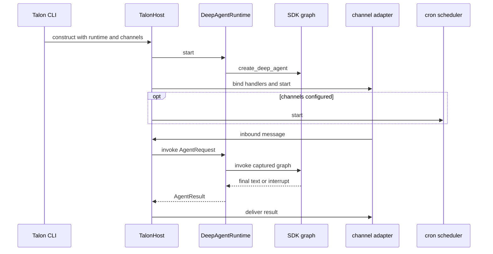

# System Architecture Overview

Deep Agents is the reusable harness in this monorepo; it does not own every agent-facing concern. Reusable graph construction belongs to the SDK, terminal product policy belongs to dcode, editor-protocol translation belongs to ACP, and Talon owns the local process that connects durable agent work to channels and schedules.

- [Runtime behavior](./runtime-behavior.md)
- [Responsibility-by-file map](./source-map.md)
- [Talon integration](../integrations/talon.md)
- [Talon channel admission](../concepts/talon-channel-admission.md)
- [State persistence](../concepts/state-persistence.md)
- [Talon scheduling](../concepts/talon-scheduling.md)

## Stack, ownership, and dependency direction

```mermaid
flowchart TD
  App["Application"] --> SDK["deepagents SDK"]
  CodeClient["dcode client"] --> CodeServer["dcode agent server"]
  CodeServer --> SDK
  CodeServer --> ACP["deepagents-acp"]
  CodeServer --> Partners["Sandbox and provider packages"]
  Editor["ACP editor client"] --> ACP
  ACP --> SDK
  Channels["Talon channels and cron"] --> Talon["Talon runtime host"]
  Talon --> SDK
  Evals["Evaluation suite"] --> SDK
  Evals --> CodeServer
  SDK --> LangChain["LangChain create_agent"]
  LangChain --> LangGraph["LangGraph runtime"]
```
This is package dependency direction: consumers depend on the SDK, while product, protocol, and host policies remain outside it.

Deep Agents is a three-layer stack: LangGraph owns graph state, checkpoints, streaming, and interrupts; LangChain's `create_agent` builds the model/tool/middleware loop on LangGraph; and Deep Agents supplies an opinionated harness on top. `libs/` is an independently versioned monorepo. The core `deepagents` package exposes `create_deep_agent`, middleware, and pluggable backends.

| Package | Owns | Does not own |
| --- | --- | --- |
| `deepagents` | Reusable graph assembly, middleware, backend routing, profiles, skills, memory, filesystem tools, and SDK subagent machinery. | Terminal UI, editor-session policy, channels, cron delivery, or a host process. |
| `deepagents-code` / `dcode` | Terminal product UI, client/server execution, product configuration and persistence, extensions, MCP product integration, and sandbox selection. | The generic harness or sandbox-provider implementation. |
| `deepagents-acp` | Agent Client Protocol conversion and ACP session semantics around a graph. | dcode product policy or a channel host. |
| `deepagents-talon` | Experimental local host lifecycle, channel adapters, schedules, local persistence, channel-mediated approvals, and local/background delegation. | A reusable SDK execution mode, security boundary, or SDK-wide approval policy. |
| `deepagents-evals` | Evaluation and benchmark execution outside request serving. | Product runtime behavior. |
| `partners/` | Daytona, Modal, Runloop, Vercel, and QuickJS integrations. | Generic harness behavior or product presentation. |

## Reusable SDK and consumer assemblies

`create_deep_agent()` is the SDK assembly seam. It resolves the model and harness profile, backend, main-agent middleware, default general-purpose subagent, and final system prompt, then delegates to LangChain's `create_agent(...)` to return the runnable graph. `DeepAgentState` extends LangChain's `AgentState` with a `DeltaChannel` message reducer, keeping checkpoint growth linear rather than quadratic on long threads.

`FilesystemMiddleware` is reusable SDK infrastructure: it supplies filesystem tools through a `BackendProtocol`, exposes `execute` only for sandbox-capable backends, defaults to `StateBackend`, and rejects a filesystem-tool allowlist that omits `read_file`. Tool visibility is distinct from authorization: profiles and middleware choose what the model sees, while backend capabilities and permissions decide whether an operation proceeds.

dcode is a product server rather than the SDK. Its terminal client and agent server are separate processes; the client owns presentation/input and the server owns the coding graph for both interactive and headless usage. `create_cli_agent()` assembles its composite backend, CLI context and middleware, interrupt policy, checkpoint/store, subagents, sanitized assistant name, and extensions before creating the SDK agent. Extensions replace same-named tools and middleware before construction.

ACP is an adapter boundary. `AgentServerACP` accepts a compiled graph or a factory built from ACP session context. dcode's ACP entrypoint creates a factory that passes session model and working directory to `create_cli_agent()`, supplies a checkpointer, and enables durable session loading; Auto mode adds trusted approval state, prompt metadata, and CLI context before streaming. Durable ACP loading verifies ACP metadata and working-directory identity before restoring options and replaying a session.

## Talon: experimental local host around an SDK graph

Talon is alpha/experimental and subject to change or removal. It is a local single-event-loop process host, not a production containment or multi-tenant security boundary. Channel access should be treated as access to the operator's agent, credentials, configured MCP tools, and local host resources; sandboxing is opt-in and does not cover MCP tools.

The split is deliberate:

- **`TalonHost`** owns process lifecycle, channel binding, conversation serialization, commands, delivery, channel approval prompts, and optional scheduler coordination.
- **`AgentRuntime`** is the small host-facing contract: start, stop, invoke, and interruption recovery. Optional protocols add model selection, MCP reload, background-result processing, delivered-reply indexing, history reset, and read-only context diagnostics.
- **`DeepAgentRuntime`** implements that contract by building and invoking an SDK graph. `EchoAgentRuntime` permits lifecycle/channel bootstrap without a model.
- **Channel adapters** translate provider events into `ChannelMessage`/optional reactions and provide sending, media, editing, typing, and status surfaces. The built-in adapters are WhatsApp, Telegram, Discord, and Slack.

```mermaid
sequenceDiagram
  participant CLI as Talon CLI
  participant Host as TalonHost
  participant Runtime as DeepAgentRuntime
  participant Graph as SDK graph
  participant Channel as channel adapter
  participant Scheduler as cron scheduler
  CLI->>Host: construct with runtime and channels
  Host->>Runtime: start
  Runtime->>Graph: create_deep_agent
  Host->>Channel: bind handlers and start
  opt channels configured
    Host->>Scheduler: start
  end
  Channel->>Host: inbound message
  Host->>Runtime: invoke AgentRequest
  Runtime->>Graph: invoke captured graph
  Graph-->>Runtime: final text or interrupt
  Runtime-->>Host: AgentResult
  Host->>Channel: deliver result
```
This shows the bootstrap/runtime boundary: the host owns transports and delivery; the runtime owns SDK graph construction and invocation. The scheduler uses host callbacks rather than becoming a channel adapter.

### CLI bootstrap and durable collaborators

The `deepagents-talon` console script enters `deepagents_talon.__main__:main`. It loads `TalonConfig`, creates an assistant-scoped `CronJobStore`, ensures the home directory, cleans sensitive state, and selects adapters from command flags or enablement environment variables. With no configured model it starts `EchoAgentRuntime`; with a model it opens the configured sandbox if any, loads MCP tools, and creates `DeepAgentRuntime` with Talon MCP middleware, assistant material, cron store, and optional sandbox backend.

A supplied checkpointer is used as-is. Otherwise the model-backed path initializes an `AsyncSqliteSaver`, opens the history archive, and passes a `ConversationSaver` wrapper to the runtime. The wrapper is the boundary that permits acknowledged final replies to be archived and supports scoped history deletion; plain graph checkpoints and archive persistence are related but distinct. The CLI only attaches `PersistentCronScheduler` when channels exist, wiring its run and delivery callbacks to the host.

Talon's project metadata identifies it as `deepagents-talon` `0.0.8`, alpha status, Python 3.12+, and a consumer of `deepagents`, `deepagents-code`, LangChain, and LangGraph. The release manifest versions packages independently.

### Runtime graph lifecycle

On `start`, `DeepAgentRuntime` resolves configured local/remote subagents, ensures the assistant approval snapshot, and creates its graph. Construction adds Talon tools (including clock, progress messaging, optional archive and cron tools), approval tools, MCP/runtime tools, and local tool attachments; it replaces the SDK subagent middleware with `TaskTools`, adds `BackgroundSubagents`, and adds summarization middleware when context size is configured. It then calls `create_deep_agent()` with the selected model/backend, prompt, skills, memory, subagents, middleware, approval interrupt map, and checkpointer.

For each invocation, the runtime refreshes tools when configured, locks while capturing/rebuilding the graph and approval snapshot, then establishes request-scoped approval-operator, pending-background, cron-origin, scheduled-turn, authorization, progress-message, graph, history, and selected-model context. It resets those contexts in `finally`. It refuses invocation before startup. A changed approval snapshot rebuilds the graph for the new turn; MCP refresh and subagent reload validate/build a replacement under the same lock, retaining the prior active graph if reload fails and applying successful replacement graphs only to later turns.

Stopping first cancels background workers. If cancellation fails, the runtime raises and deliberately leaves its graph/checkpointer resources open rather than race a still-writing worker with a closed persistence resource.

### Host lifecycle, channels, and turn invariants

`TalonHost` starts the runtime before binding/starting channels and then the optional scheduler. A partial start unwinds in reverse order. Shutdown cancels in-flight work before stopping channels, scheduler, and runtime; individual stop failures are isolated so other components still stop.

The host serializes a provider-qualified conversation. A new message cancels and replaces an active turn; cancellation recovery records an interruption marker after the latest committed graph checkpoint. If cancellation does not finish within the configured 30 seconds, the conversation is blocked and later messages receive a restart-required response rather than creating concurrent work. A selected model is captured when the turn starts so a later `/model` change cannot affect it.

The host binds optional reaction callbacks as well as message callbacks. It owns channel-specific formatting/retry/delivery behavior and only records a final reply in persistent history after successful delivery. Optional `/context-doctor` support is structural: the host only uses it when the runtime implements `ContextDoctorRuntime`, bounds it to ten seconds, and returns non-disclosing unavailable/failure text. `DeepAgentRuntime` delegates it to `ContextDoctor`, which reads the active checkpoint without a model call and reports bounded estimates rather than prompt/conversation contents.

### Delegation, approvals, and scheduling

Talon-specific delegation does not redefine SDK-wide subagents. `TaskTools` supplies named local subagents with only unique tool names selected from the current parent catalog; they begin without inherited parent history and reject fork mode. For ordinary turns, `BackgroundSubagents` turns `task` and `start_async_task` into in-memory conversation-owned jobs. A worker gets a separate thread ID, cannot delegate again, clears inherited authorization handling, and leaves its completed result for a later host-triggered owner turn.

For a cron-triggered invocation, the runtime marks the scheduled context. Delegation then runs inline: it returns its result in the same cron turn, prevents nested delegation, and does not create a job or follow-up delivery turn. Inline cron delegation is separately semaphore-limited and queued, has a shorter timeout that becomes an error tool result, and the host applies a whole scheduled-run timeout and recovers that job thread after timeout.

Approval policy is Talon-local and snapshot-based. A turn captures an immutable policy snapshot. Approval interrupt batches require unique IDs, are presented as one decision for all protected actions, and resume with a payload for every interrupt ID while cancelling co-batched MCP elicitation. Cron and background-delivery invocations have no interactive path and are auto-rejected. The host sends a pending request to its originating channel and only the sender of the originating run can approve/reject it; a validated reaction on the approval prompt can resolve the same request.

`CronJobStore` persists an assistant's jobs in a versioned JSON envelope, including prompt, parsed schedule, repeat/run state, and origin channel/conversation/message. `PersistentCronScheduler` discards finished jobs, claims a due job by advancing it before agent invocation, records success/failure, suppresses `[SILENT]` delivery, and changes the recorded result to error when delivery fails. A failed ticker scan is logged and retried at the normal interval, leaving due work eligible for the next scan.

## Validation and safe changes

Focused Talon tests cover runtime lifecycle and graph replacement in `libs/talon/tests/test_runtime.py`, host ordering, routing, cancellation, approvals, and scheduled recovery in `libs/talon/tests/test_host.py`, and background/approval runtime behavior under `libs/talon/tests/unit_tests/`. Channel integrations have provider-specific host tests. Exercise the SDK graph tests when changing `create_deep_agent()` assembly; keep channel protocol and local host policy out of the reusable SDK.

The evaluation suite runs real-LLM agent evaluations, captures tool calls, file mutations, and final responses, and scores correctness/efficiency; its Harbor integration runs sandboxed benchmarks such as Terminal Bench 2.0. Release Please creates separate draft pull requests and independently releases Python packages using package version files and changelogs, component-bearing tags separated by `==`, and excludes package test paths from release analysis.
