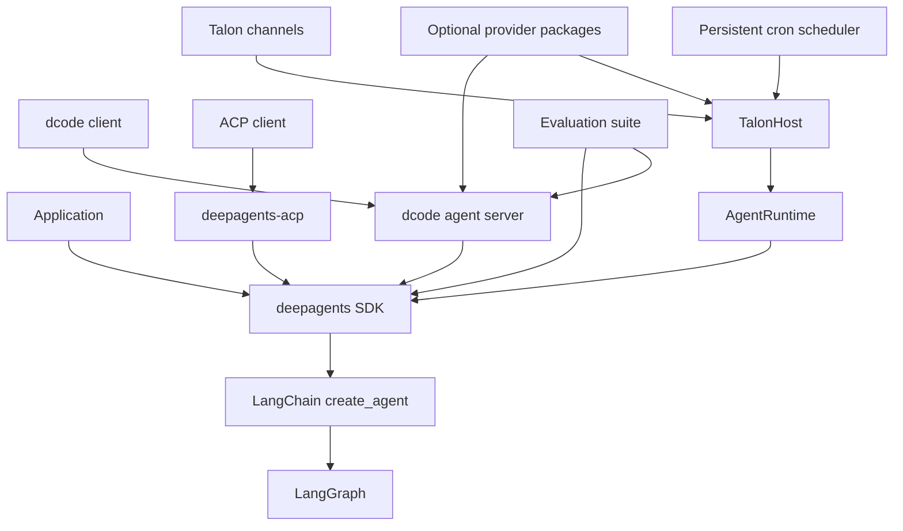
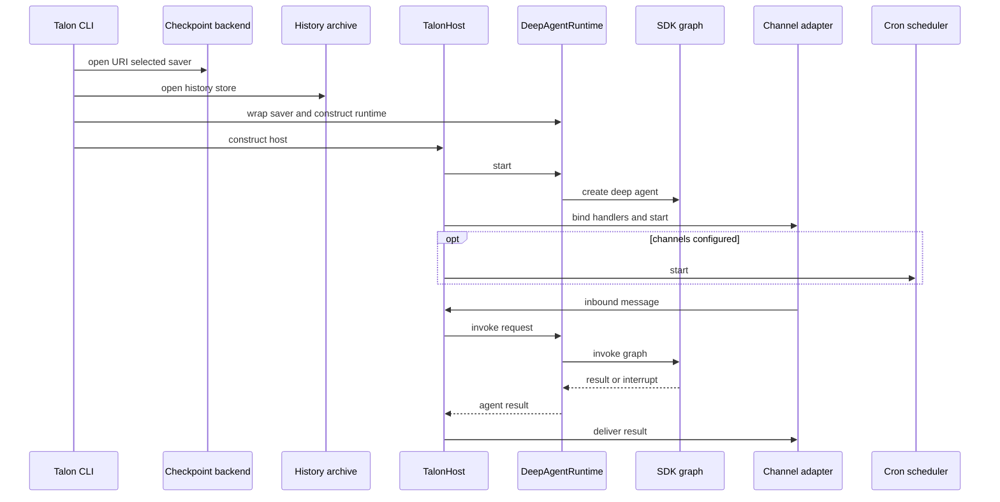

# System Architecture Overview

This monorepo separates a reusable agent harness from the products and adapters that consume it. The SDK builds graphs; dcode provides a coding-agent product; ACP exposes graphs to editor clients; Talon hosts long-lived channel agents; partner packages add optional providers; and evals measure behavior. They are independently versioned packages, not modes of a single server.

- [Runtime behavior](./runtime-behavior.md)
- [Source map](./source-map.md)
- [State persistence](../concepts/state-persistence.md)
- [Talon scheduling](../concepts/talon-scheduling.md)
- [Talon integration](../integrations/talon.md)

## Ownership and dependency direction

```mermaid
flowchart TD
  App["Application"] --> SDK["deepagents SDK"]
  Client["dcode client"] --> CodeServer["dcode agent server"]
  CodeServer --> SDK
  Editor["ACP client"] --> ACP["deepagents-acp"]
  ACP --> SDK
  Channels["Talon channels"] --> Host["TalonHost"]
  Scheduler["Persistent cron scheduler"] --> Host
  Host --> Runtime["AgentRuntime"]
  Runtime --> SDK
  Evals["Evaluation suite"] --> SDK
  Evals --> CodeServer
  Partners["Optional provider packages"] --> CodeServer
  Partners --> Host
  SDK --> LangChain["LangChain create_agent"]
  LangChain --> LangGraph["LangGraph"]
```
This shows consumption direction: products, protocol adapters, hosts, and optional integrations use the SDK rather than becoming SDK runtime modes.

Deep Agents is a three-layer stack. LangGraph owns runtime concerns such as state, checkpoints, streaming, and interrupts; LangChain's `create_agent` builds the model, tools, and middleware loop on that runtime; Deep Agents is an opinionated harness on top. `create_deep_agent()` is the SDK assembly point: it resolves the model and profile, backend, primary middleware, default general-purpose subagent, and system prompt, then calls LangChain's `create_agent(...)`.

| Component | Owns | Does not own |
| --- | --- | --- |
| `deepagents` | Reusable graph assembly, middleware, backends, profiles, skills, memory, filesystem tools, and SDK subagents. | A terminal UI, editor protocol, channel process, or scheduler delivery. |
| `deepagents-code` / dcode | Terminal product, client/server interaction, coding configuration, MCP integration, sandbox selection, and extensions. | The generic SDK harness. |
| `deepagents-acp` | Agent Client Protocol session and content translation around a graph or session-aware graph factory. | dcode product policy or a channel host. |
| `deepagents-talon` | Local host lifecycle, channel adapters, operator interaction, schedules, and local durable collaborators. | A multi-tenant security boundary or an SDK execution mode. |
| `partners` | Optional Daytona, Modal, Runloop, Vercel, and QuickJS integrations. | A required core runtime layer. |
| `deepagents-evals` | Real-model evaluations and benchmark integration. | Live request serving. |

## Products, adapter, and evaluation boundaries

**dcode** is a reference terminal coding-agent product on the SDK. Its terminal client owns presentation, input, and approvals; its separate agent-server process owns graph execution and event streaming. Headless operation uses that same server runtime. dcode resolves user, project, session, and runtime configuration through a generation-based resolver: writes or `/reload` change the generation, invalid tiers retain the last usable value, and the application does not watch configuration files.

**ACP** is an editor-facing protocol boundary. `AgentServerACP` accepts a compiled graph or a factory receiving session context including working directory, mode, and optional model. When `load_sessions` is enabled, it verifies checkpoint metadata and working-directory identity before replay. dcode's ACP specialization adds trusted Auto-mode approval and prompt metadata while streaming; ACP does not become the dcode product runtime.

**Partners and evals** remain outside the serving path. Provider integrations are selected by consumers. The evaluation suite drives agents against real LLMs, captures tool calls, file mutations, and final responses, scores correctness and efficiency, and includes Harbor-backed sandboxed benchmarks such as Terminal Bench 2.0.

## Talon at the 0.0.9 boundary

Talon `0.0.9` is an alpha, experimental local runtime host. It owns one process event loop for channel adapters, an `AgentRuntime`, and—when channels exist—a persistent cron scheduler. It is not intended as production containment, enterprise policy enforcement, or multi-tenant isolation. Channel access should be treated as access to the operator's configured agent, credentials, MCP tools, and host resources; an opt-in sandbox changes the execution backend but does not sandbox MCP tools.

The 0.0.9 release boundary includes Slack Socket Mode support, sender pairing for Discord, Telegram, and Slack, per-chat `/model` selection, cron expressions and `until` expiry, inline scheduled delegation, optional sandbox execution, batched approvals, and `/context-doctor`. These capabilities are host and Talon-runtime policy, not changes to the generic SDK abstraction.

- **`TalonHost`** owns process lifecycle, channel binding, conversation serialization, commands, delivery, and coordination with the scheduler.
- **`AgentRuntime`** is the host-facing start/stop/invoke/recovery contract. Optional capability protocols add history delivery, background work, MCP reload, model selection, and diagnostics.
- **`DeepAgentRuntime`** builds and invokes the SDK graph. **`EchoAgentRuntime`** allows channel and host wiring to start when no model is configured.
- **Channel adapters** normalize provider events to `ChannelMessage` and, where supported, reactions; their base contract includes lifecycle, text/media send, edit, typing, and status. Built-in adapters cover WhatsApp, Telegram, Discord, and Slack.

```mermaid
sequenceDiagram
  participant Cli as Talon CLI
  participant Checkpoints as Checkpoint backend
  participant Archive as History archive
  participant Host as TalonHost
  participant Runtime as DeepAgentRuntime
  participant Graph as SDK graph
  participant Channel as Channel adapter
  participant Scheduler as Cron scheduler
  Cli->>Checkpoints: open URI selected saver
  Cli->>Archive: open history store
  Cli->>Runtime: wrap saver and construct runtime
  Cli->>Host: construct host
  Host->>Runtime: start
  Runtime->>Graph: create deep agent
  Host->>Channel: bind handlers and start
  opt channels configured
    Host->>Scheduler: start
  end
  Channel->>Host: inbound message
  Host->>Runtime: invoke request
  Runtime->>Graph: invoke graph
  Graph-->>Runtime: result or interrupt
  Runtime-->>Host: agent result
  Host->>Channel: deliver result
```
This sequence distinguishes CLI-owned durable resource lifetimes, host-owned transports and delivery, and runtime-owned graph construction and execution.

### Bootstrap, persistence, and extension points

The `deepagents-talon` CLI first creates the assistant-scoped `CronJobStore`, ensures the assistant home, cleans sensitive state, and selects channel adapters from flags or environment. Without a model it constructs `EchoAgentRuntime`. With a model it opens the configured sandbox if any, loads MCP tools, and creates `DeepAgentRuntime` with Talon MCP middleware, the assistant manifest directory, cron store, and sandbox backend when present.

On the model-backed path the CLI opens a checkpointer and history archive together, then gives the runtime a `ConversationSaver` wrapper. This separates two persistence roles: LangGraph checkpoints retain graph execution state, while the archive records final replies only after successful channel delivery and supports scoped history operations.

`DEEPAGENTS_TALON_CHECKPOINT_URI` selects the checkpointer. With no URI, Talon uses its local SQLite checkpoint path; `sqlite:` and `file:` use the built-in SQLite saver, `postgres:`/`postgresql:` and `mongodb:`/`mongodb+srv:` load optional drivers, and a trusted installed package can register another URI scheme through the `deepagents_talon.checkpoint_backends` entry-point group. Built-in schemes win; unknown schemes or duplicate plugins fail startup. Backend factories own their setup and cleanup, while Talon wraps the resulting saver for conversation-history support. Remote checkpoint thread identifiers are not automatically assistant-namespaced, so operators must isolate assistants at the database or namespace level.

At `DeepAgentRuntime.start()`, Talon resolves subagents, ensures the tool-approval snapshot, and creates an SDK graph. The graph includes Talon tools such as clock, progress messages, cron, archive/history, approvals, and configured MCP tools. Talon replaces SDK subagent middleware with `TaskTools`, adds `BackgroundSubagents`, and may add summarization and model-selection middleware before calling `create_deep_agent()` with its backend, checkpointer, prompt, skills, memory, tools, middleware, and interrupt policy.

MCP refresh, explicit MCP reload, and subagent reload use replacement-graph semantics under a lock: build and validate the replacement first, retain the previous graph if it fails, and use a successful replacement for later turns. A changed approval snapshot likewise rebuilds the graph before execution.

### Turns, cancellation, and teardown

`DeepAgentRuntime.invoke()` refuses work before startup. For each turn it refreshes runtime tools, captures a graph and immutable approval snapshot under its tools lock, and installs request-scoped context for the selected model, approval operator, pending background results, cron origin, scheduled state, authorization, progress messages, graph selection, and history scope. It resets every binding in `finally`. This prevents channel, cron, or background context leaking into another invocation.

`TalonHost` serializes work by provider-qualified conversation. A new message cancels and replaces a live turn; after cancellation it tries to append an interruption marker after the latest committed checkpoint. If cancellation or recovery exceeds the configured 30-second bound, the host blocks that conversation until restart rather than allowing concurrent execution against its thread. A selected model is captured at the beginning of the turn, so a later `/model` change cannot alter an in-flight request.

Stopping a runtime cancels background workers before releasing graph/checkpointer resources. If cancellation fails, `DeepAgentRuntime` raises and deliberately keeps those resources open because a surviving worker might still be writing. At the process layer, `TalonHost.start()` starts the runtime before channels and scheduler, unwinds a partial start in reverse order, and shutdown cancels work before stopping channels, scheduler, and runtime while isolating stop failures.

## Channels, Slack, pairing, and approvals

Slack is a built-in channel adapter in 0.0.9. It uses Slack Socket Mode, so the host establishes an outbound connection instead of exposing an HTTP endpoint. Slack DM conversations use the channel ID; channel conversations use a channel-and-thread identifier. The adapter can route inbound messages and reactions to the host, while the host retains authorization and turn ownership.

Sender pairing is deliberately an admission mechanism rather than an operator delegation mechanism. For Discord, Telegram, and Slack it is disabled unless configured and is refused with open exposure. An unknown sender receives a short, sender-and-provider-bound code only through their direct message; an environment-configured operator approves it from an operator surface or with the CLI. Codes expire, are one-use, and are provider-scoped. The pairing store uses atomic locked updates and fails closed when it cannot be read. A paired sender is admitted wherever the bot can see them, but cannot run `/pair` or change approval policy. Pair only someone who should receive the same agent and host access as the operator.

Approval policy is Talon-local and snapshot-based. An interrupt batch must contain unique IDs, is presented as a single approve/reject decision for all protected actions, and resumes with a decision for every interrupt ID; a co-batched MCP elicitation is cancelled. Cron and background-delivery requests are auto-rejected because there is no interactive route. For an interactive request, the host presents the pending approval only on its originating channel and accepts a reply only from its starting sender; a validated reaction on the approval prompt may resolve the same request.

## Durable scheduled work and delegation

The CLI attaches `PersistentCronScheduler` only when channels are configured, wiring it to `TalonHost.run_scheduled_job` and channel result delivery. `CronJobStore` is assistant-scoped JSON storage with a versioned envelope. Each record retains the prompt, parsed schedule and repeat state, enablement, next and last run state, error/status, origin conversation/channel/message, and optional sender and history-chat metadata. Store mutations are serialized in-process and atomically written; one process must own a store file.

The scheduler runs at minute granularity. On each tick it removes finished jobs, finds due jobs, advances a job before invoking it, then records success or failure. It suppresses output marked `[SILENT]`; delivery failure overwrites an otherwise successful outcome with an error. Unexpected tick failures are logged and retried at the ordinary interval, leaving due jobs available to a later scan.

Schedules support interval, one-shot wall-clock, daily wall-clock, and cron-expression forms. Wall-clock and cron forms require an IANA timezone; `until` bounds recurring execution. The persisted parsed schedule—not reparsed human input—drives subsequent runs. Jobs carry an origin so execution can access the originating history scope and results can return to the appropriate channel or thread destination.

Ordinary `task` and `start_async_task` delegation detaches into in-memory, conversation-owned work. Workers use a different thread ID, cannot delegate again, clear inherited authorization handling, and expose completed results for a later owner turn. This state is intentionally lost on restart. In a cron turn, the runtime marks scheduled context, making both delegation tools run inline and return a result in the same turn; no background job or later delivery turn is created, and nested delegation remains prohibited. Inline work has a separate queueing semaphore and shorter timeout that becomes a tool error result; the host separately bounds a full scheduled run and repairs its job thread if that run times out.

## Operations and focused verification

Keep provider transport, admission, and delivery policy in channel adapters and `TalonHost`; keep graph construction, scoped state, and tool composition in `DeepAgentRuntime`; keep durable schedule format and advancement semantics in the cron store and scheduler. Changes to checkpoint URI support must preserve context-manager ownership, scheme validation, and safe error redaction. Changes to Slack or pairing should preserve the distinction between admitting a sender and giving them operator controls.

Key focused coverage includes `libs/talon/tests/test_host.py` for lifecycle, cancellation, approvals, scheduling, and delivery; runtime tests for graph construction and replacement; unit tests for background delegation and approval batches; and pairing/channel tests for admission behavior. The Talon README remains the operational source for environment configuration, channel credentials, sandbox selection, history backends, and schedule syntax.
