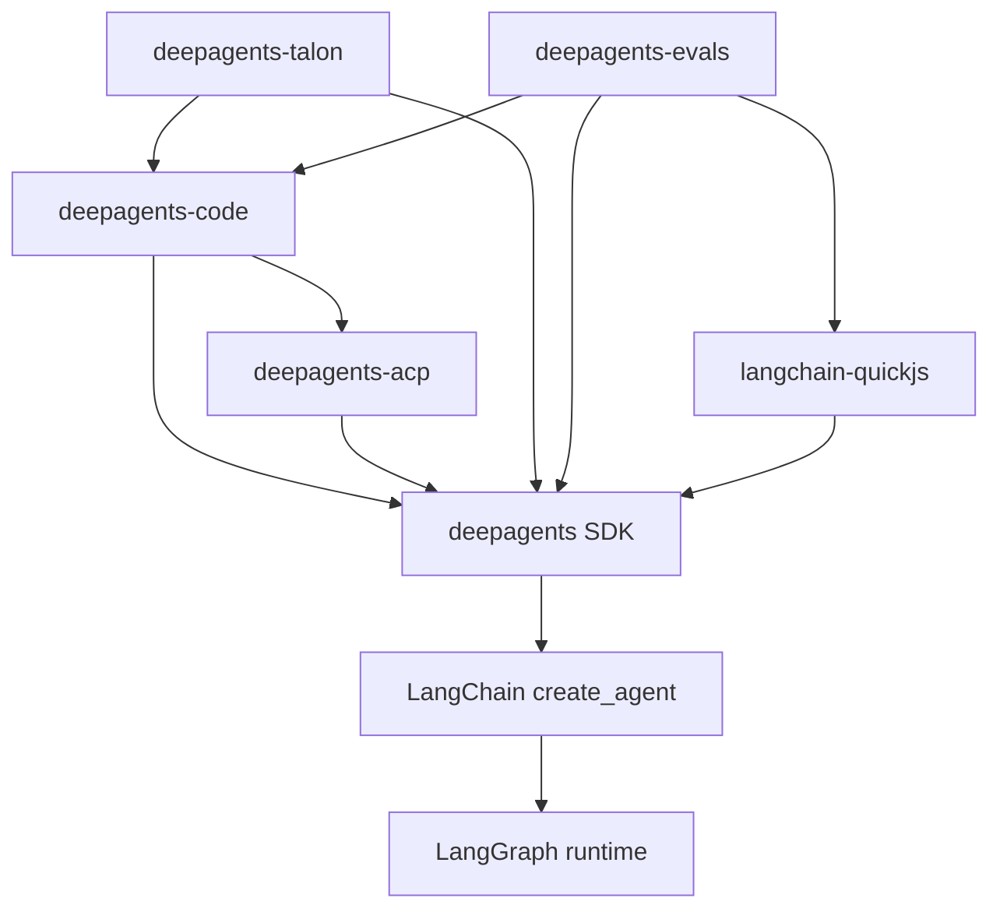
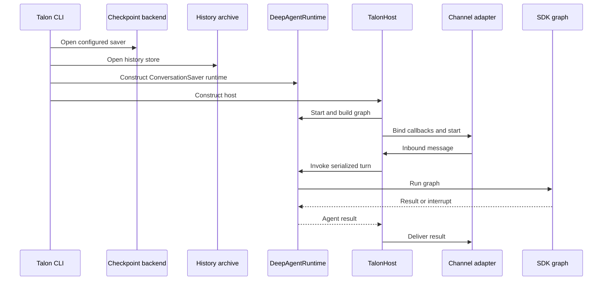

# Repository Architecture Overview

This repository is a monorepo of Python packages, not one deployable service. `deepagents` is the reusable graph-construction harness. Products and hosts consume its graph at distinct boundaries: dcode is the terminal product, ACP translates graphs for editor clients, Talon hosts graphs for long-running channels and schedules, and `deepagents-evals` measures behavior. The `partners` group supplies optional integrations rather than a mandatory runtime layer.

- [Code agent](./code-agent.md)
- [SDK construction and execution](./sdk-construction-execution.md)
- [Talon integration](../integrations/talon.md)
- [Development](../operations/development.md)

## Packages, release lines, and dependency direction

| Package | Current version and Python baseline | Role and release ownership |
| --- | --- | --- |
| `deepagents` | `0.7.23`; `>=3.11,<4.0` | Core SDK: `create_deep_agent`, middleware, and pluggable backends. Release Please manages this line. |
| `deepagents-acp` | `0.0.12`; `>=3.11` | Agent Client Protocol bridge for serving Deep Agents graphs to editor clients. Release Please manages this line. |
| `deepagents-code` (`dcode`) | `0.1.83`; `>=3.12,<4.0` | Reference terminal coding-agent product, including interactive and headless clients. Release Please manages this line. |
| `deepagents-talon` | `0.0.9`; `>=3.12` | Experimental local host for channels, agent turns, and cron scheduling. Release Please manages this line. |
| `deepagents-evals` | `0.0.1`; `>=3.12,<3.14` | End-to-end behavioral evaluation and Harbor benchmark suite. It has package metadata and a CLI, but is not a Release Please package in the current release configuration. |
| `langchain-quickjs` | `0.3.8`; `>=3.11,<4.0` | Optional JavaScript REPL middleware partner integration. Release Please manages this line. |

Release Please is configured for the SDK, ACP, dcode, Talon, and five partners: `langchain-daytona` `0.0.8`, `langchain-modal` `0.0.6`, `langchain-runloop` `0.0.7`, `langchain-vercel-sandbox` `0.0.2`, and `langchain-quickjs` `0.3.8`. Each configured package has a separate release pull request; the configuration deliberately skips GitHub releases and produces draft release pull requests. Do not infer that every directory under `libs/` is on that automated release line: notably, `libs/evals` is absent from both the manifest and configured package list.

Published dependency direction is toward the SDK: ACP depends on `deepagents`; dcode pins `deepagents==0.7.23` and accepts ACP `>=0.0.10,<1.0.0`; Talon depends on `deepagents>=0.7.0` and `deepagents-code>=0.1.71,<1.0.0`; and evals depends on the SDK, dcode, and QuickJS. QuickJS in turn depends on the 0.7.x SDK as well as LangChain and LangGraph. The partner group also includes Daytona, Modal, Runloop, and Vercel integrations. These are optional choices made by a consuming product or host, not dependencies required to construct every SDK graph.

During monorepo development, dcode resolves the SDK, ACP, and all five partners as editable local sources. Evals resolves the SDK and QuickJS as editable local sources and dcode from the adjacent source tree. Those source overrides are a development wiring mechanism, not published-package dependency pins.

```mermaid
flowchart TD
  Dcode["deepagents-code"] --> SDK["deepagents SDK"]
  Dcode --> ACP["deepagents-acp"]
  ACP --> SDK
  Talon["deepagents-talon"] --> SDK
  Talon --> Dcode
  Evals["deepagents-evals"] --> SDK
  Evals --> Dcode
  Evals --> QuickJS["langchain-quickjs"]
  QuickJS --> SDK
  SDK --> LangChain["LangChain create_agent"]
  LangChain --> LangGraph["LangGraph runtime"]
```
This shows the principal internal dependency direction: arrows point from a consumer to a package or layer it requires. It does not imply that products have no direct LangChain or LangGraph dependencies.

The SDK directly depends on bounded 1.x `langchain` and `langchain-core` ranges, plus Anthropic and Google model integrations, LangSmith, packaging, and matching utilities. AWS, QuickJS, and video support are extras rather than base dependencies. dcode, Talon, and evals intentionally carry their own product- and host-specific model, transport, sandbox, checkpoint, and evaluation dependencies.

## The runtime stack: LangGraph, LangChain, and the harness

Deep Agents is a three-layer stack. **LangGraph** is the execution runtime for graph state, checkpoints, streaming, and interrupts. **LangChain** supplies `create_agent()`, which creates the model, tools, and middleware agent loop on that runtime. **Deep Agents** is the opinionated harness above `create_agent()`: it supplies long-horizon defaults including filesystem backends, subagents, context management, skills, memory, profiles, and tool policy. Applications can pass a custom LangGraph `CompiledStateGraph` as a Deep Agents subagent when the standard loop is not the right orchestration shape.

`create_deep_agent()` is the SDK assembly point. It resolves the requested model and harness profile, resolves the backend, assembles the main-agent middleware stack, builds the default general-purpose subagent, composes the final system prompt, and delegates to LangChain's `create_agent(...)` to produce the runnable graph.

The construction API is the extension boundary for application-specific tools, backend, middleware, subagents, skills, memory, filesystem permissions, interrupts, schemas, checkpointer, store, cache, and graph name. Important invariants when extending it are:

- Profile exclusions cannot remove protected filesystem and synchronous-subagent scaffolding; invalid or unmatched exclusion configuration fails construction.
- Filesystem permissions are ordered, first-match rules on built-in filesystem tools—not a backend-wide authorization mechanism. A `deny` returns a permission error; an `interrupt` installs or extends human-in-the-loop approval behavior.
- A custom state schema must retain `DeepAgentState`, including its `DeltaChannel` messages reducer. Declarative subagents inherit the custom schema, whereas already compiled and remote async subagents must be built with compatible schemas themselves.

For construction flow and middleware order, see [SDK construction and execution](./sdk-construction-execution.md).

## Ownership and durable-state boundaries

| Boundary | Owns | Does not own |
| --- | --- | --- |
| SDK | Harness composition, middleware, backend routing, profile policy, and SDK subagents. | UI, editor transport, channel connections, or cron delivery. |
| LangGraph | Graph state, checkpoints, stream/interrupt execution semantics. | Product-specific transport and host lifecycle. |
| dcode | Terminal client/server product, terminal configuration, and coding-agent extensions. | Generic harness behavior. |
| ACP | Protocol/session translation around a graph. | Terminal presentation or channel policy. |
| Talon | Process lifecycle, channel adapters, turn coordination, schedules, and host-owned stores. | A production multi-tenant containment boundary. |
| Evals | Repeatable behavioral measurement and benchmark integration. | Live request serving. |

Do not treat persistence as one database. A LangGraph checkpointer is forwarded through SDK graph construction for execution state. A Deep Agents backend independently determines where files, memory, and shell execution occur. Talon adds a conversation archive and a cron-job store; its model-backed CLI opens the selected checkpointer and archive together and wraps them in `ConversationSaver`. Therefore, a checkpoint alone does not constitute channel delivery history, and a durable host does not make every backend capability durable.

## Product, protocol, and evaluation boundaries

### dcode and ACP

`deepagents-code` is a reference terminal coding-agent product, not a replacement SDK. Its terminal client and agent server run in separate processes: the client owns presentation, input, and approval interaction, while the server owns graph execution and streams events back. Headless mode uses that same server runtime. Its configuration is resolved across user, project, session, and runtime scopes in a process-wide generation. An in-app write or `/reload` advances the generation; a parse failure retains the previous usable tier; ordinary file changes are deliberately not watched.

`AgentServerACP` is the ACP bridge. It accepts either a compiled graph or a graph factory given `AgentSessionContext` containing working directory, mode, and optional model. With `load_sessions=True`, it advertises session loading; before replaying a session it verifies persisted metadata and working-directory identity. Dcode's ACP specialization adds dcode-specific policy by wrapping each session graph to supply trusted Auto-mode approval and prompt metadata while streaming. Keep protocol translation in ACP and terminal policy in dcode.

### Evaluations and partners

`deepagents-evals` runs agents against real LLMs, captures tool calls, file mutations, and final responses, and scores correctness and efficiency. Harbor integration runs sandboxed benchmarks such as Terminal Bench 2.0. This is a quality-measurement boundary, not an online serving component.

Partner packages supply external execution or middleware capabilities. In particular, `langchain-quickjs` provides JavaScript REPL middleware and depends on the 0.7.x SDK, LangChain, and LangGraph. Select and configure a partner integration at the consuming product or host rather than making it a core SDK requirement.

## Talon: long-running local host

Talon is an experimental, alpha local runtime host. It runs channel adapters, one agent runtime, and optional cron scheduling in a single process event loop. It is not production containment, complete enterprise policy enforcement, or a multi-tenant security boundary. Channel access should be treated as access to the configured agent, credentials, MCP tools, and host resources. An opt-in sandbox relocates shell and filesystem tools, but MCP tools, web tools, and channel media handling remain on the host.

```mermaid
sequenceDiagram
  participant Cli as Talon CLI
  participant Checkpoints as Checkpoint backend
  participant Archive as History archive
  participant Runtime as DeepAgentRuntime
  participant Host as TalonHost
  participant Channel as Channel adapter
  participant Graph as SDK graph
  Cli->>Checkpoints: Open configured saver
  Cli->>Archive: Open history store
  Cli->>Runtime: Construct ConversationSaver runtime
  Cli->>Host: Construct host
  Host->>Runtime: Start and build graph
  Host->>Channel: Bind callbacks and start
  Channel->>Host: Inbound message
  Host->>Runtime: Invoke serialized turn
  Runtime->>Graph: Run graph
  Graph-->>Runtime: Result or interrupt
  Runtime-->>Host: Agent result
  Host->>Channel: Deliver result
```
This sequence separates CLI-owned resource opening, host-owned transport and delivery, and runtime-owned graph construction and invocation.

### Construction, turns, and lifecycle safety

When no model is configured, the CLI selects `EchoAgentRuntime`, allowing lifecycle and channel wiring to be exercised without provider credentials. On the model-backed path it can open a sandbox, load MCP tools, and construct `DeepAgentRuntime` with Talon MCP middleware. `PersistentCronScheduler` is attached only if one or more channels are configured.

At `DeepAgentRuntime.start()`, Talon resolves subagents, reads a tool-approval snapshot, and creates its SDK graph. Its composition adds selected-model summarization, model selection, progress messaging, task tooling, background-subagent behavior, Talon tools, and caller middleware before it calls `create_deep_agent()`. On every invoke it rejects calls before startup, refreshes runtime tools, and rebuilds the graph if the approval snapshot changed. It establishes request-scoped authorization, history/archive, cron origin, selected model, progress messaging, graph, and background results, then resets those context bindings in `finally`; state from a channel or scheduled turn must not leak into another turn.

`TalonHost` serializes work per conversation and starts the agent runtime before channels and an optional scheduler. A partial start is unwound in reverse order. Shutdown first cancels work, then stops channels, scheduler, and runtime, while isolating an individual stop failure so later components are still stopped. If a replacement message cannot cancel active work within the timeout, the conversation is degraded and the user is told to restart rather than running concurrent work unsafely. `DeepAgentRuntime.stop()` cancels background workers before releasing its graph and checkpointer; if cancellation fails it intentionally leaves those resources open, avoiding a saver close while a worker might still write.

### Transport and storage extension points

A channel adapter supplies lifecycle operations, inbound-message registration, send/edit text, media delivery, typing, and connection status. Reactions and threaded conversation handling are optional protocol extensions. Built-in channel exports cover WhatsApp, Telegram, Discord, and Slack.

Talon selects its checkpointer from a URI. Built-in `sqlite`/`file`, PostgreSQL, and MongoDB schemes take precedence over a trusted installed `deepagents_talon.checkpoint_backends` entry point. A plugin receives the original URI and owns setup and cleanup; unexpected opening errors become credential-safe configuration errors. Use separate remote databases for separate assistants because remote checkpoint thread IDs are not automatically namespaced by assistant ID.

## Safe change and test starting points

- Put reusable graph composition changes in `deepagents`, starting with `create_deep_agent()`; do not pull UI, channel, or transport policy into the SDK.
- Put terminal client/server behavior and reload semantics in dcode; preserve the shared server path used by headless mode.
- Put ACP streaming and session replay changes in `deepagents-acp`; retain persisted-metadata and working-directory validation.
- Put Talon delivery, serialization, and scheduler changes in `TalonHost`; put graph composition and request-context handling in `DeepAgentRuntime`.
- Treat checkpoint backend entry points and partner integrations as trusted operator-installed extension boundaries. Preserve their ownership of cleanup and credential-safe failure behavior.
- For Talon lifecycle or cancellation work, begin with `libs/talon/tests/test_host.py`, then run runtime and package-specific tests covering the changed boundary. For SDK changes, trace the public `create_deep_agent()` argument to installed middleware or backend and exercise the corresponding `libs/deepagents/tests/` coverage.
