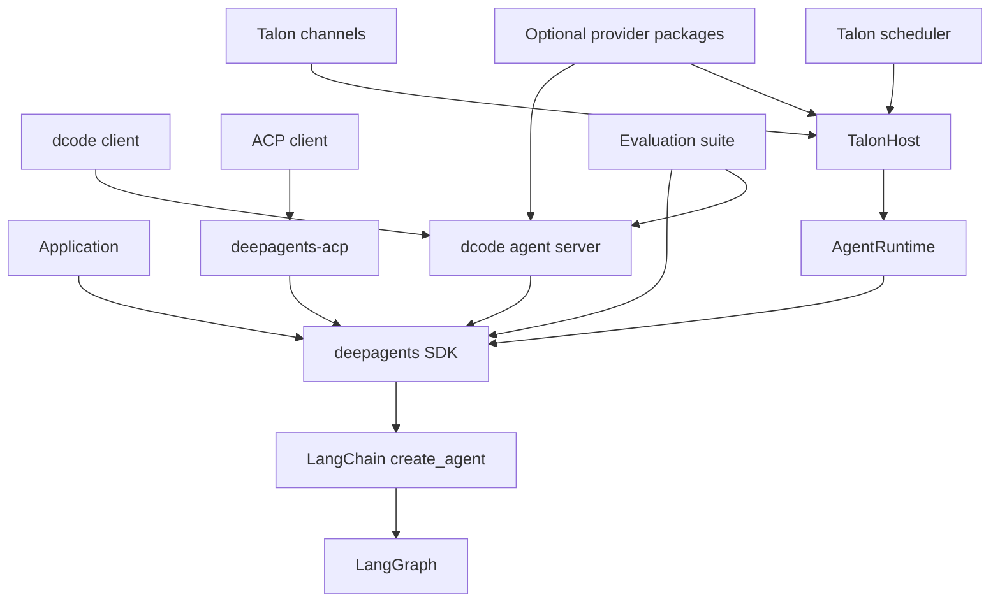
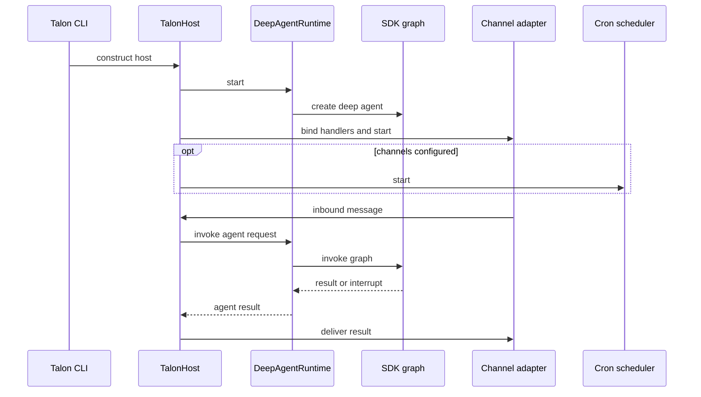

# Repository Runtime Architecture

The repository is a monorepo of independently versioned packages. It separates a reusable agent harness from products and adapters that run it: Deep Agents owns graph construction; dcode owns a terminal coding-agent product; ACP translates graph execution to the Agent Client Protocol; Talon is a long-running local channel host; partner packages add optional providers; and evals run behavioral assessments rather than serving requests.

- [Code agent architecture](./code-agent.md)
- [Runtime behavior](./runtime-behavior.md)
- [Source map](./source-map.md)
- [State persistence](../concepts/state-persistence.md)
- [Talon integration](../integrations/talon.md)

## Ownership and dependency direction

```mermaid
flowchart TD
  App["Application"] --> SDK["deepagents SDK"]
  Client["dcode client"] --> CodeServer["dcode agent server"]
  CodeServer --> SDK
  Editor["ACP client"] --> ACP["deepagents-acp"]
  ACP --> SDK
  Channels["Talon channels"] --> Host["TalonHost"]
  Scheduler["Talon scheduler"] --> Host
  Host --> Runtime["AgentRuntime"]
  Runtime --> SDK
  Evals["Evaluation suite"] --> SDK
  Evals --> CodeServer
  Partners["Optional provider packages"] --> CodeServer
  Partners --> Host
  SDK --> LangChain["LangChain create_agent"]
  LangChain --> LangGraph["LangGraph"]
```
This diagram shows dependency direction: products, protocol adapters, hosts, and optional provider integrations consume the SDK rather than becoming SDK runtime modes.

Deep Agents is a three-layer stack: LangGraph is the runtime for state, checkpoints, streaming, and interrupts; LangChain's `create_agent` is the model/tool/middleware agent abstraction on that runtime; and Deep Agents is the opinionated harness above it. `create_deep_agent()` is its assembly seam: it resolves model and harness profile, backend, main middleware, default general-purpose subagent, and final system prompt before calling LangChain's `create_agent(...)`.

| Component | Owns | Boundary |
| --- | --- | --- |
| `deepagents` | Reusable graph assembly, middleware, backend routing, profiles, skills, memory, filesystem tools, and SDK subagent machinery. | Does not own a terminal UI, editor protocol, channel process, or cron delivery. |
| `deepagents-code` / dcode | Terminal experience, client/server protocol, coding-agent product configuration, persistence, extensions, MCP integration, and sandbox selection. | Uses the SDK rather than redefining the generic harness. |
| `deepagents-acp` | ACP session and protocol translation around a compiled graph or session-aware graph factory. | Does not own dcode product policy or a channel host. |
| `deepagents-talon` | Local host lifecycle, channel adapters, schedules, local persistence, and channel-mediated interaction policy. | Is not a reusable SDK execution mode or a multi-tenant security boundary. |
| `partners` | Optional Daytona, Modal, Runloop, Vercel, and QuickJS provider integrations. | These are integrations selected by consumers, not required layers in the core request path. |
| `deepagents-evals` | Real-model behavioral evaluation and benchmark integrations. | Does not participate in request serving. |

## dcode, ACP, optional partners, and evals

`deepagents-code` is a reference terminal coding-agent product built on the SDK. Its terminal client and agent server are separate processes: the client owns presentation, input, and approvals, while the server owns graph execution and streams events back. Interactive and headless operation use the same server runtime; the interface differs. Its layered configuration spans user, project, session, and runtime scopes, with an explicit reload model rather than automatic file watching.

ACP is the editor-facing adapter boundary. `AgentServerACP` accepts either a compiled graph or a factory receiving `AgentSessionContext` with working directory, mode, and optional model. dcode specializes that server for Auto mode by wrapping a per-session graph to inject trusted approval-mode and prompt metadata into graph streaming. ACP therefore translates session and content semantics; it is not the coding-agent product runtime itself.

The `partners` directory contains optional provider integrations—Daytona, Modal, Runloop, Vercel, and QuickJS. They extend where a consumer can execute or integrate; they are not a dependency that every SDK graph, dcode session, ACP session, or Talon deployment must traverse. For example, Talon can select supported sandbox providers through the dcode sandbox integration, but an unset sandbox keeps execution local.

The eval suite runs an agent against real LLMs, retains the trajectory—including tool calls, file mutations, and final response—and scores correctness and efficiency. Its Harbor integration runs sandboxed benchmarks such as Terminal Bench 2.0. This workload validates SDK and product behavior but is separate from their live runtimes.

## Talon: local long-running host

> **Experimental security status:** Talon is alpha and subject to change or removal. It is **not** intended as production containment, enterprise hardening, or a multi-tenant security boundary. It does not yet provide complete HITL policy or channel-administrator controls. Treat channel access as access to the operator's agent, model credentials, configured MCP tools, and local host resources. Sandboxing is opt-in and does not cover MCP tools.

Talon owns one process event loop for channel adapters, an agent runtime, and an optional cron scheduler. The key split is intentional:

- **`TalonHost`** owns lifecycle, transport binding, conversation serialization, commands, result delivery, and scheduler coordination.
- **`AgentRuntime`** is the host-facing contract for start, stop, invoke, and interruption recovery. Optional runtime protocols add capabilities such as background-result processing, history delivery, model selection, MCP reload, and context diagnostics.
- **`DeepAgentRuntime`** implements that contract by constructing and invoking an SDK graph. **`EchoAgentRuntime`** supports bootstrapping without a configured model.
- **Channel adapters** convert provider events to `ChannelMessage` and optional reactions, and implement lifecycle, send/edit/media, typing, and status operations. Built-in adapters cover WhatsApp, Telegram, Discord, and Slack.

```mermaid
sequenceDiagram
  participant Cli as Talon CLI
  participant Host as TalonHost
  participant Runtime as DeepAgentRuntime
  participant Graph as SDK graph
  participant Channel as Channel adapter
  participant Scheduler as Cron scheduler
  Cli->>Host: construct host
  Host->>Runtime: start
  Runtime->>Graph: create deep agent
  Host->>Channel: bind handlers and start
  opt channels configured
    Host->>Scheduler: start
  end
  Channel->>Host: inbound message
  Host->>Runtime: invoke agent request
  Runtime->>Graph: invoke graph
  Graph-->>Runtime: result or interrupt
  Runtime-->>Host: agent result
  Host->>Channel: deliver result
```
This lifecycle sequence shows the division of responsibility: transports and delivery remain in the host, while the runtime owns SDK graph construction and execution.

### Startup, configuration, and persistence

The `deepagents-talon` CLI obtains `TalonConfig`, creates an assistant-scoped `CronJobStore`, ensures the assistant home, cleans sensitive state, and selects adapters from command flags or channel enablement environment variables. No configured model selects `EchoAgentRuntime`. With a model, the CLI opens the configured sandbox, loads MCP tools, and constructs `DeepAgentRuntime` with Talon MCP middleware, the assistant directory, cron store, and a sandbox backend when present.

On that model-backed path, the CLI opens an `AsyncSqliteSaver` and history archive, then supplies a `ConversationSaver` wrapper to the runtime. The runtime also accepts a caller-provided checkpointer. Checkpoints and the archive have distinct roles: graph checkpoints preserve execution state; the wrapper archives successfully delivered final replies and enables scoped history clearing. The CLI creates `PersistentCronScheduler` only when channels exist, wiring scheduled execution and result delivery through `TalonHost`.

### Runtime graph lifecycle and replacement

At `DeepAgentRuntime.start()`, Talon resolves subagents, ensures and snapshots the approval policy, then constructs its SDK graph. The graph adds Talon, approval, MCP/runtime, and—when configured—archive and cron tools. It uses `TaskTools` in place of SDK subagent middleware, adds `BackgroundSubagents`, and may add summarization middleware before calling `create_deep_agent()` with the resolved model, backend, prompt, skills, memory, checkpointer, middleware, and approval interrupt policy.

`invoke()` refuses work before startup. For each turn it refreshes runtime tools when configured, captures the selected graph and immutable approval snapshot under a lock, then establishes request-scoped model, approvals, background results, cron origin and scheduled status, authorization, progress-message, graph-selection, and history context. Those bindings are reset in `finally`. A changed approval snapshot rebuilds the graph before the new turn. MCP refresh and subagent reload construct and validate replacements under the same lock: failures leave the previous graph active; successful replacements apply to later turns.

Stopping first cancels background workers. If cancellation cannot complete, the runtime raises and intentionally leaves graph and checkpointer resources open rather than close persistence while a worker might still write.

### Channel turns, delivery, and shutdown

`TalonHost.start()` starts the agent runtime before binding and starting channels, then starts the optional scheduler. A partial start unwinds in reverse order. `stop()` cancels active work before stopping channels in reverse order, the scheduler, and the runtime; a component stop failure is isolated so remaining cleanup still runs.

The host serializes work by provider-qualified conversation. A new inbound message cancels and replaces an active turn, attempting to append an interruption marker after the latest committed checkpoint before starting the replacement. If cancellation or recovery exceeds the 30-second bound, the conversation is blocked and later messages receive a restart-required response rather than running concurrently. The selected model is captured at turn creation, so a later `/model` change cannot alter an in-flight turn.

The host sends final replies through the adapter and records them in persistent history only after successful delivery. When the runtime has background capability, a dispatcher starts a later owner turn for completed worker output after the conversation is idle; failed result-processing attempts are retried with backoff. `/context-doctor` is capability-gated, bounded to ten seconds, and returns non-disclosing unavailable or failure text. `DeepAgentRuntime` requires a started graph and delegates the report to `ContextDoctor`.

### Delegation, approvals, and scheduled work

Talon adapts rather than changes SDK-wide delegation. `TaskTools` lets a task add only unique names from the current parent tool catalog to a named local subagent. A local subagent is compiled fresh, does not inherit parent history, and rejects `fork` mode. On ordinary turns, `BackgroundSubagents` detaches `task` and `start_async_task` work into in-memory jobs owned by the conversation. Workers use their own thread IDs, cannot delegate again, clear inherited authorization handling, and expose completed results for a later owner turn.

A cron request marks the runtime's scheduled-turn context. Delegation is then inline: task results return in the same turn, no background job or later delivery turn is created, and nested delegation remains forbidden. Inline work is separately semaphore-limited and queues; its shorter timeout becomes an error tool result. The host additionally bounds every scheduled run and repairs its job thread after a timeout.

Approval policy is Talon-local and snapshot-based. An approval batch requires unique interrupt IDs, presents one decision for all protected actions, and resumes every interrupt ID; co-batched MCP elicitation is cancelled. Cron and background-delivery runs are auto-rejected because they have no interactive approval path. For interactive work, the host exposes the pending approval only to the originating channel and accepts an approve/reject response only from the sender who started that run; a validated reaction on the approval prompt can resolve that same request.

`CronJobStore` persists assistant jobs in a versioned JSON envelope containing prompt, parsed schedule, repeat and run state, and channel/conversation/message delivery origin. `PersistentCronScheduler` removes finished jobs, claims each due job by advancing it before invocation, records success or failure, suppresses `[SILENT]` output, and changes a successful run record to error when delivery fails. A failed scheduler tick is logged and retried on the normal interval, leaving due jobs eligible for a later scan.

## Operations and safe changes

Keep host transport and channel policy out of the SDK, and keep graph-specific construction in the runtime. Test host lifecycle, cancellation, approvals, scheduling, and delivery changes in `libs/talon/tests/test_host.py`; test graph construction, reload, persistence, and recovery in `libs/talon/tests/test_runtime.py`; focused background and approval semantics live under `libs/talon/tests/unit_tests/`. Changes to `create_deep_agent()` need SDK graph coverage; ACP protocol changes need ACP and dcode integration coverage.

For deployments, treat Talon's assistant home, MCP configuration, channel credentials, tool approval file, and selected sandbox as operator-controlled inputs. A sandbox changes the execution backend; it does not make an exposed channel or MCP tool safe for untrusted or multi-tenant use.
