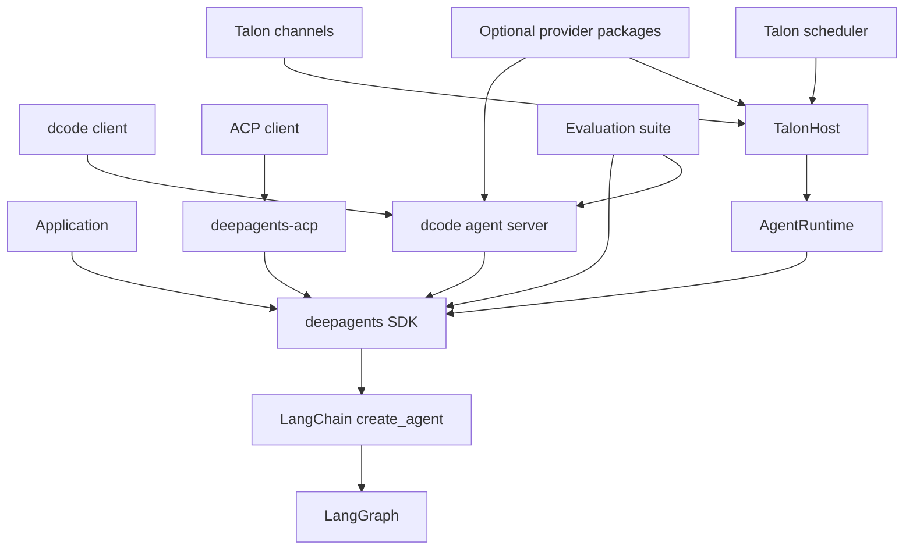
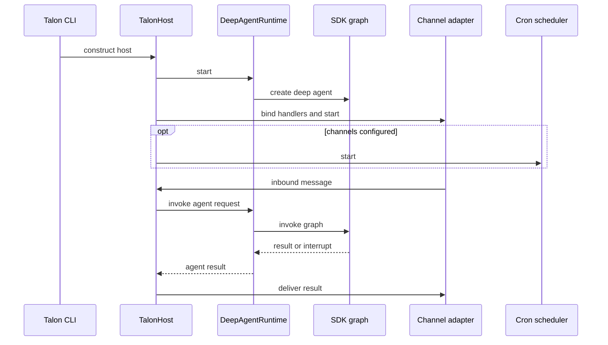

# System Architecture Overview

This monorepo separates a reusable agent harness from products and adapters that run it. Deep Agents owns graph construction; dcode owns a terminal coding-agent product; ACP translates graph execution to the Agent Client Protocol; Talon is a long-running local channel host; partner packages add optional providers; and evals assess behavior rather than serve requests.

- [Code agent architecture](./code-agent.md)
- [Middleware stack](./middleware-stack.md)
- [Runtime behavior](./runtime-behavior.md)
- [SDK construction and execution](./sdk-construction-execution.md)
- [Source map](./source-map.md)
- [Talon integration](../integrations/talon.md)

## Ownership and dependency direction

```mermaid
flowchart TD
  App["Application"] --> SDK["deepagents SDK"]
  Client["dcode client"] --> CodeServer["dcode agent server"]
  CodeServer --> SDK
  Editor["ACP client"] --> ACP["deepagents-acp"]
  ACP --> SDK
  Channels["Talon channels"] --> Host["TalonHost"]
  Scheduler["Talon scheduler"] --> Host
  Host --> Runtime["AgentRuntime"]
  Runtime --> SDK
  Evals["Evaluation suite"] --> SDK
  Evals --> CodeServer
  Partners["Optional provider packages"] --> CodeServer
  Partners --> Host
  SDK --> LangChain["LangChain create_agent"]
  LangChain --> LangGraph["LangGraph"]
```
This shows dependency direction: products, protocol adapters, hosts, and optional integrations consume the SDK rather than becoming SDK runtime modes.

Deep Agents is a three-layer stack: LangGraph supplies graph state, checkpoints, streaming, and interrupts; LangChain's `create_agent` builds the model, tool, and middleware loop on it; and Deep Agents is an opinionated harness on top. Its assembly seam is `create_deep_agent()`: it resolves the model and harness profile, backend, main-agent middleware, default general-purpose subagent, and final system prompt, then delegates to LangChain's `create_agent(...)`.

| Component | Owns | Boundary |
| --- | --- | --- |
| `deepagents` | Reusable graph assembly, middleware, backend routing, profiles, skills, memory, filesystem tools, and SDK subagent machinery. | Does not own a terminal UI, editor protocol, channel process, or cron delivery. |
| `deepagents-code` / dcode | Terminal experience, client/server protocol, coding-agent configuration, persistence, extensions, MCP integration, and sandbox selection. | Uses the SDK rather than redefining the generic harness. |
| `deepagents-acp` | ACP session and protocol translation around a compiled graph or session-aware graph factory. | Does not own dcode product policy or a channel host. |
| `deepagents-talon` | Local host lifecycle, channel adapters, schedules, local persistence, and channel-mediated interaction policy. | Is not an SDK execution mode or a multi-tenant security boundary. |
| `partners` | Optional Daytona, Modal, Runloop, Vercel, and QuickJS provider integrations. | These are integrations selected by consumers, not a required runtime layer. |
| `deepagents-evals` | Real-model behavioral evaluations and benchmark integrations. | Does not participate in request serving. |

## Products and protocol adapters

### dcode

`deepagents-code` is a reference terminal coding-agent product on the SDK. The terminal client and agent server run in separate processes: the client owns presentation, input, and approvals, while the server owns graph execution and streams events back. Interactive and headless operation use the same server runtime; only the interface changes.

dcode treats configuration as layered user, project, session, and runtime scope. Its shared resolver uses a process-wide configuration generation rather than file watching: an in-app write or `/reload` advances the generation, and a parse failure retains the last usable tier. Its principal extension boundaries are skills and subagents, tools and MCP, sandboxes, hooks and commands, and trusted Python extensions.

### ACP

ACP is the editor-facing adapter boundary. `AgentServerACP` accepts either a compiled graph or a factory receiving `AgentSessionContext` with working directory, mode, and optional model. It maintains ACP session state, creates per-session graphs from a factory, and can advertise durable session loading only when the graph's checkpointer survives restarts.

Dcode specializes that bridge for Auto mode. Its wrapper supplies trusted Auto approval state and prompt metadata to each session graph while it streams. ACP therefore translates editor session and content semantics; it is not the coding-agent product runtime itself.

### Partners and evaluations

The `partners` directory contains optional provider integrations—Daytona, Modal, Runloop, Vercel, and QuickJS. They extend where a consumer can execute or integrate; they are not dependencies every SDK graph, dcode session, ACP session, or Talon deployment crosses.

The evaluation suite runs agents against real LLMs, preserves the trajectory including tool calls, file mutations, and final responses, and scores correctness and efficiency. Its Harbor integration runs sandboxed benchmarks such as Terminal Bench 2.0. This validates SDK and product behavior but is outside live request handling.

## Talon: local single-loop host

> **Experimental security status:** Talon is an experimental alpha local runtime and may change or be removed. It is **not** for production or enterprise use, and is **not** a production containment or multi-tenant security boundary. It lacks complete HITL policy and channel-administrator controls. Treat channel access as access to the operator's agent, model credentials, configured MCP tools, and local-host resources. Sandboxing is opt-in and does not cover MCP tools.

Talon owns one process event loop for channel adapters, an agent runtime, and an optional cron scheduler. The split is deliberate:

- **`TalonHost`** owns lifecycle, transport binding, conversation serialization, commands, result delivery, and scheduler coordination.
- **`AgentRuntime`** is the host-facing contract for start, stop, invoke, and interrupted-turn recovery. Optional runtime protocols add background results, history delivery, model selection, MCP reload, and context diagnostics.
- **`DeepAgentRuntime`** implements the contract by constructing and invoking an SDK graph. **`EchoAgentRuntime`** permits host and channel bootstrapping without a configured model.
- **Channel adapters** turn provider events into `ChannelMessage` and optional reactions, and provide lifecycle, text/media send, edit, typing, and connection-status operations. Built-in adapters cover WhatsApp, Telegram, Discord, and Slack.

```mermaid
sequenceDiagram
  participant Cli as Talon CLI
  participant Host as TalonHost
  participant Runtime as DeepAgentRuntime
  participant Graph as SDK graph
  participant Channel as Channel adapter
  participant Scheduler as Cron scheduler
  Cli->>Host: construct host
  Host->>Runtime: start
  Runtime->>Graph: create deep agent
  Host->>Channel: bind handlers and start
  opt channels configured
    Host->>Scheduler: start
  end
  Channel->>Host: inbound message
  Host->>Runtime: invoke agent request
  Runtime->>Graph: invoke graph
  Graph-->>Runtime: result or interrupt
  Runtime-->>Host: agent result
  Host->>Channel: deliver result
```
This sequence shows that transports and delivery remain in the host while the runtime owns SDK graph construction and execution.

### Bootstrap, MCP, and durable collaborators

The `deepagents-talon` CLI creates an assistant-scoped `CronJobStore`, ensures the assistant home, cleans sensitive state, and selects channel adapters from command flags or channel environment settings. No configured model selects `EchoAgentRuntime`. With a model, the CLI opens any configured sandbox, loads MCP tools, and constructs `DeepAgentRuntime` with Talon MCP middleware, the assistant directory, cron store, and sandbox backend when present.

On that model-backed path, the CLI opens an `AsyncSqliteSaver` and history archive, then passes a `ConversationSaver` wrapper to the runtime. Checkpoints and archive serve distinct purposes: graph checkpoints preserve execution state, while the wrapper archives successfully delivered final replies and enables scoped history clearing. The CLI creates `PersistentCronScheduler` only when channels are configured, wiring job execution and result delivery through `TalonHost`.

At `DeepAgentRuntime.start()`, Talon resolves subagents, creates or reads the approval-policy snapshot, and constructs the SDK graph. It adds runtime tools such as clock, web, cron, archive, approval, and MCP-related tools as configured; it replaces SDK subagent middleware with `TaskTools`, adds `BackgroundSubagents`, and can add summarization middleware before calling `create_deep_agent()` with the resolved model, backend, prompt, skills, memory, checkpointer, middleware, and interrupt policy.

### Turn execution, graph replacement, and teardown

`invoke()` rejects work before startup. Each turn can refresh runtime tools, then under a lock captures the graph and immutable approval snapshot. It establishes request-scoped model selection, approvals, pending background results, cron origin and scheduled status, authorization, progress-message, graph selection, and history context; a `finally` block resets those bindings.

An approval-policy change rebuilds the graph before the next turn. MCP refresh and explicit MCP reload construct replacement graphs under the same lock: a failed replacement leaves the preceding graph active, while a successful replacement applies on subsequent work. Reloading subagents follows the same transactional replacement principle.

Stopping first cancels background workers. If cancellation fails, the runtime raises and deliberately leaves graph and checkpointer resources open: closing persistence while a worker may still write is less safe than leaking resources during shutdown.

### Host lifecycle, serialization, and delivery

`TalonHost.start()` starts the runtime before binding and starting channels, then starts the optional scheduler. A partial startup unwinds in reverse order. On shutdown, the host cancels work first, then stops channels in reverse order, scheduler, and runtime; it isolates individual stop failures so remaining cleanup still runs.

The host serializes work by provider-qualified conversation. A new inbound message cancels and replaces an active turn, attempting to append an interruption marker after the latest committed checkpoint before the replacement starts. If cancellation or recovery exceeds the configured 30-second bound, the conversation is blocked until restart rather than run concurrently. The selected model is captured as a turn starts, so later `/model` changes cannot affect an in-flight turn.

Final replies are recorded in persistent history only after successful channel delivery. If the runtime supports background results, the host starts a later owner turn for completed worker output after the conversation becomes idle; failed result processing is retried with backoff. `/context-doctor` is capability-gated, bounded to ten seconds, and returns non-disclosing unavailable or failure text. `DeepAgentRuntime` requires a started graph and delegates its report to `ContextDoctor`.

### Delegation, approvals, and scheduled work

`TaskTools` lets a task attach only unique names from the current parent tool catalog to a named local subagent. The local agent is compiled fresh, has no inherited parent history, and rejects `fork` mode. Ordinary `task` and `start_async_task` delegation is detached by `BackgroundSubagents` into in-memory jobs owned by the conversation. Workers use separate thread IDs, cannot delegate again, clear inherited authorization handling, and expose completed results for a later owner turn.

A cron invocation marks the runtime's scheduled-turn context. Delegation then runs inline: the result returns during the same turn, no background job or later delivery turn is created, and nested delegation remains prohibited. Inline work has a separate semaphore, queues rather than refuses, and has a shorter timeout that becomes an error tool result. The host independently bounds a scheduled run and repairs its job thread after a run timeout.

Approval policy is Talon-local and snapshot-based. An interrupt batch must have unique IDs, is presented as one decision for all protected actions, and resumes with a decision payload for every interrupt ID; co-batched MCP elicitation is cancelled. Cron and background-delivery invocations are automatically rejected because no interactive approval path exists. For an interactive turn, the host exposes the pending approval only on its originating channel and accepts approval or rejection only from the sender that started it; a validated reaction on the prompt can resolve the same request.

`CronJobStore` persists assistant jobs in a versioned JSON envelope containing prompt, parsed schedule, repeat and run state, and channel/conversation/message delivery origin. `PersistentCronScheduler` discards finished jobs, advances each claimed due job before invoking it, records success or failure, suppresses `[SILENT]` output, and changes a successful run record to error if delivery fails. A failed scheduler tick is logged and retried at the normal interval, leaving due jobs eligible for later scanning.

## Operations and safe changes

Keep channel transport and channel policy out of the SDK, and graph-specific construction in the Talon runtime. The main focused coverage is `libs/talon/tests/test_host.py` for lifecycle, cancellation, approvals, scheduling, and delivery; `libs/talon/tests/test_runtime.py` for graph construction, replacement, persistence, and recovery; and `libs/talon/tests/unit_tests/` for focused background and approval semantics. Changes to `create_deep_agent()` need SDK graph coverage; ACP protocol changes need ACP and dcode integration coverage.

Treat Talon's assistant home, MCP configuration, channel credentials, approval policy, and sandbox selection as operator-controlled inputs. A sandbox changes the execution backend; it does not make an exposed channel or MCP tool safe for untrusted or multi-tenant use.
