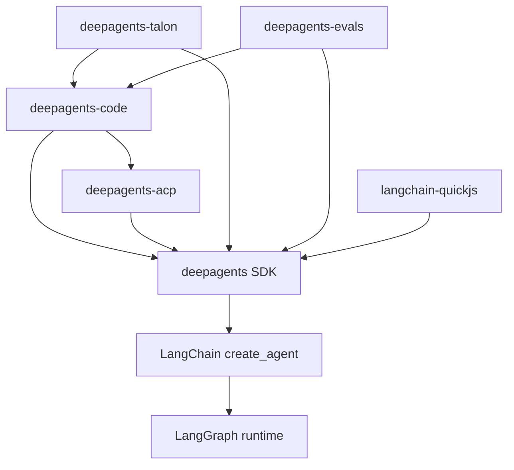
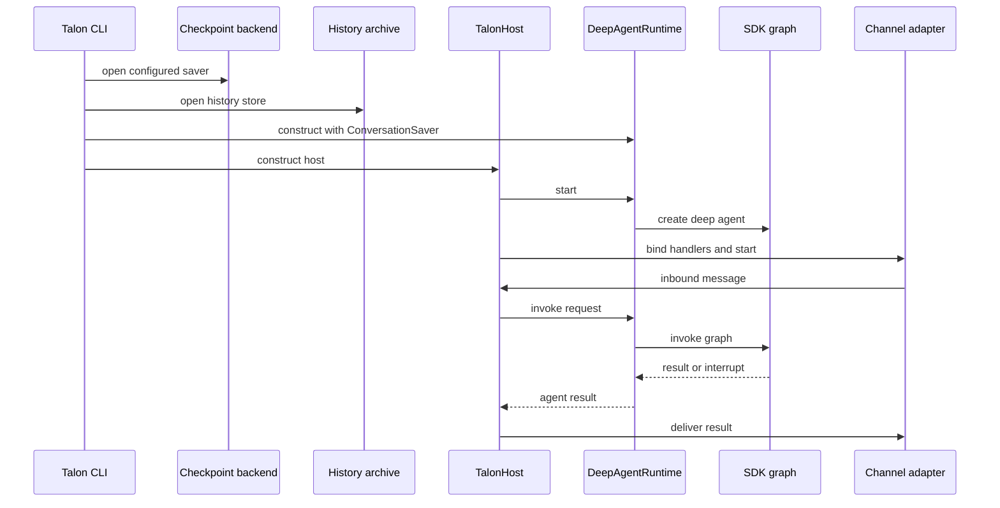

# Architecture Overview

This repository is a monorepo of independently versioned packages, not one deployable service. `deepagents` builds runnable agent graphs; dcode, ACP, and Talon consume or host those graphs through different product and protocol boundaries; `deepagents-evals` measures behavior; and `partners` supplies optional provider integrations. Put reusable graph composition in the SDK and keep product UI, transport, and host policy at their respective boundaries.

- [Code agent](./code-agent.md)
- [Source map](./source-map.md)
- [ACP integration](../integrations/acp.md)
- [Talon integration](../integrations/talon.md)
- [Development](../operations/development.md)
- [Quickstart](../quickstart.md)

## Package map and supported baselines

| Package | Current version and Python baseline | Role and manifest-backed direct dependencies |
| --- | --- | --- |
| `deepagents` | `0.7.22`; Python `>=3.11,<4.0` | Reusable harness exposing `create_deep_agent()`. It requires LangChain `>=1.4.3,<2.0.0`, LangChain Core `>=1.6.6,<2.0.0`, Anthropic and Google GenAI integrations, LangSmith, packaging, and wcmatch. AWS, QuickJS, and video support are extras. |
| `deepagents-acp` | `0.0.12`; Python `>=3.11` | Agent Client Protocol bridge. It directly requires `deepagents` (without a version bound), `agent-client-protocol>=0.10.1`, and `python-dotenv>=1.2.2`. |
| `deepagents-code` (`dcode`) | `0.1.81`; Python `>=3.12,<4.0` | Reference terminal product. It pins `deepagents==0.7.22`, requires `deepagents-acp>=0.0.10,<1.0.0`, and brings client/server, terminal UI, model-provider, MCP, sandbox, and QuickJS dependencies; most additional model and sandbox providers are extras. |
| `deepagents-talon` | `0.0.9`; Python `>=3.12` | Experimental local channel-and-scheduler host. It directly requires `deepagents>=0.7.0`, `deepagents-code>=0.1.71,<1.0.0`, and LangChain/LangGraph, channel, MCP, SQLite, and scheduler-facing dependencies. History, MongoDB, PostgreSQL, and media support are extras. |
| `deepagents-evals` | `0.0.1`; Python `>=3.12,<3.14` | End-to-end evaluation suite. It directly requires `deepagents>=0.6.12`, `deepagents-code>=0.1.27`, Harbor/LangSmith, model integrations, and sandbox runtimes. |
| `langchain-quickjs` | `0.3.8`; Python `>=3.11,<4.0` | Optional partner package providing JavaScript REPL middleware. It requires `deepagents>=0.7.0,<0.8.0` plus LangChain, LangGraph, `quickjs-rs`, and `bsdiff4`. |

The `partners` group contains Daytona, Modal, Runloop, Vercel, and QuickJS integrations. They are optional integrations selected by an embedding product or host, not a required layer beneath every SDK graph. In the development manifests, dcode maps all five partner packages to local editable sources; the evals package maps QuickJS that way as well.

## Runtime layers and dependency direction

Deep Agents is not another graph runtime. LangGraph owns stateful graph execution, checkpoints, streaming, and interrupts. LangChain's `create_agent()` builds the model-plus-tools-plus-middleware agent loop on LangGraph. The Deep Agents SDK is the opinionated harness above that loop: it configures backends, middleware, subagents, skills, memory, profiles, and tool policy.

```mermaid
flowchart TD
  Dcode["deepagents-code"] --> SDK["deepagents SDK"]
  Dcode --> ACP["deepagents-acp"]
  ACP --> SDK
  Talon["deepagents-talon"] --> SDK
  Talon --> Dcode
  Evals["deepagents-evals"] --> SDK
  Evals --> Dcode
  QuickJS["langchain-quickjs"] --> SDK
  SDK --> LangChain["LangChain create_agent"]
  LangChain --> LangGraph["LangGraph runtime"]
```
This shows the direct, internal package dependencies declared by the current manifests, plus the SDK's runtime layering. The arrows point from a consumer to what it requires. Dcode, Talon, and QuickJS also declare direct LangChain and/or LangGraph dependencies, so this is not a claim that every runtime dependency is mediated only by the SDK.

`create_deep_agent()` is the SDK assembly point. It resolves the model and harness profile, resolves the backend (defaulting to `StateBackend`), builds the main middleware stack, prepares caller and profile prompt content, processes supplied subagents, adds a default general-purpose subagent when applicable, then delegates to `langchain.agents.create_agent(...)`. The result is the compiled graph that applications and hosts invoke.

The API exposes the control points products need: tools, backend, middleware, subagents, skills, memory, filesystem permissions, interrupt policy, state/context schemas, checkpointer, store, cache, and graph name. Profile exclusions cannot silently remove required filesystem or synchronous-subagent scaffolding; invalid exclusions fail graph construction.

## Ownership and persistence boundaries

| Boundary | Owns | Does not own |
| --- | --- | --- |
| `deepagents` SDK | Graph assembly, Deep Agents middleware, backends, profiles, SDK subagents, and tool-facing policy. | Terminal presentation, editor protocol sessions, channel connections, or schedule delivery. |
| LangGraph | Runtime graph state, streaming, checkpoints, and interrupt/resume behavior. | Product-specific transports and durable host lifecycle. |
| dcode | Terminal UI, client/server transport, coding configuration, and product extensions. | The generic SDK harness. |
| `deepagents-acp` | ACP translation and ACP session behavior around a graph. | A terminal UI or channel-host policy. |
| Talon | Local process lifecycle, channels, invocation coordination, cron scheduling, and host-owned durable collaborators. | A production multi-tenant containment boundary. |
| `deepagents-evals` | Behavioral measurement and benchmarks. | Live request serving. |
| `partners` | Optional external-provider integrations. | A mandatory core runtime layer. |

Do not collapse all persistence into “the database.” A checkpointer is passed through graph construction for LangGraph state. A Deep Agents backend independently controls file, memory, and execution capabilities. Talon additionally owns a conversation archive and cron-job persistence. Consequently, a checkpoint does not imply host delivery history, and choosing a host does not make every backend capability durable.

## Product and protocol boundaries

### dcode: reference terminal product

`deepagents-code` is a reference terminal coding-agent product on the SDK. Its terminal client and agent server run in separate processes: the client owns presentation, input, and approval interaction; the server owns graph execution and streams events back. Headless mode uses the same server runtime, rather than a separate agent implementation.

Dcode configuration is layered across user, project, session, and runtime scopes through a process-wide generation. An in-app write or `/reload` advances it; a parsing failure preserves the last usable source tier; and normal file edits are not watched. Treat reload as an explicit lifecycle operation rather than expecting all readers to see a partly written file.

### ACP: editor-facing graph bridge

`AgentServerACP` accepts either a compiled graph or a factory supplied with `AgentSessionContext`—working directory, mode, and optional model. It translates ACP sessions and graph streaming; it does not introduce another agent runtime. With `load_sessions=True`, it advertises session loading and, before replaying one, verifies persisted ACP metadata and that the caller's working directory matches the session's original directory.

Dcode layers its own ACP specialization over that bridge. Each session graph is wrapped so streaming writes trusted Auto-mode approval state and attaches prompt metadata to the final user message. This is dcode policy, not generic ACP behavior.

### Evaluations and integrations

`deepagents-evals` runs agents against real LLMs, captures their complete trajectories—including tool calls, file mutations, and final responses—and scores correctness and efficiency. Harbor integration supports sandboxed benchmarks such as Terminal Bench 2.0. Evals is therefore a measurement boundary, not a live-serving component.

## Talon: local long-running host

Talon is an experimental alpha local runtime host with one process event loop for channel adapters, an agent runtime, and optional cron scheduling. It is not production containment, enterprise policy enforcement, or a multi-tenant security boundary. Channel access must be treated as access to the configured agent, model credentials, MCP tools, and host resources. An optional sandbox moves shell and file tools, but does not sandbox MCP tools.

```mermaid
sequenceDiagram
  participant Cli as Talon CLI
  participant Checkpoints as Checkpoint backend
  participant Archive as History archive
  participant Host as TalonHost
  participant Runtime as DeepAgentRuntime
  participant Graph as SDK graph
  participant Channel as Channel adapter
  Cli->>Checkpoints: open configured saver
  Cli->>Archive: open history store
  Cli->>Runtime: construct with ConversationSaver
  Cli->>Host: construct host
  Host->>Runtime: start
  Runtime->>Graph: create deep agent
  Host->>Channel: bind handlers and start
  Channel->>Host: inbound message
  Host->>Runtime: invoke request
  Runtime->>Graph: invoke graph
  Graph-->>Runtime: result or interrupt
  Runtime-->>Host: agent result
  Host->>Channel: deliver result
```
This sequence separates CLI-owned durable-resource setup, host-owned transport and delivery, and runtime-owned graph creation and invocation.

### Startup, turns, and shutdown

When no model is configured, the CLI uses `EchoAgentRuntime` for host-wiring and lifecycle operation. On the model-backed path it opens an optional sandbox, loads MCP tools, opens the checkpointer and history archive together, wraps them in `ConversationSaver`, and builds `DeepAgentRuntime` with Talon MCP middleware. It attaches `PersistentCronScheduler` only if at least one channel is configured.

`TalonHost` starts the agent before channels and its optional scheduler. A failed partial start unwinds scheduler, channels, and agent in reverse order. Shutdown cancels work before stopping channels, scheduler, and runtime, and logs rather than propagates individual component-stop failures so later components are still stopped. Channel adapters must supply lifecycle, inbound-message registration, text/media send, edit, typing, and connection-status operations; reactions are an optional extension. Built-in adapters cover WhatsApp, Telegram, Discord, and Slack.

At `DeepAgentRuntime.start()`, Talon resolves subagents, reads an approval snapshot, and constructs the SDK graph. Its graph composition adds Talon tooling and middleware such as model selection, progress messages, `TaskTools`, and background-subagent behavior before calling `create_deep_agent()`.

Each invoke rejects calls before startup, refreshes runtime tools, and rebuilds the graph if the approval snapshot changed. It establishes request-scoped authorization, history/archive, cron origin, selected-model, progress-message, graph, and background-result context and resets those bindings in `finally`; this prevents channel or scheduled-turn context from leaking into another turn. At stop, it cancels background work before releasing graph and checkpointer resources. If cancellation fails, it deliberately leaves resources open rather than close a saver while a worker may still write.

The host serializes turns per conversation and attempts to cancel active work before a replacement message proceeds. A cancellation timeout leaves the conversation degraded and tells the caller to restart rather than treating it as safe for concurrent work.

### Durable state and extension points

Talon chooses its checkpointer by URI. Built-in `sqlite`/`file`, PostgreSQL, and MongoDB schemes take precedence over trusted installed `deepagents_talon.checkpoint_backends` entry points. A plugin factory receives the original URI and owns setup and cleanup; unexpected opening errors become credential-safe configuration errors. Use separate remote databases for separate assistants because remote checkpoint thread IDs are not automatically assistant-namespaced.

The model-backed CLI combines the LangGraph checkpointer and separately owned history archive in `ConversationSaver`; the archive supports history behavior while the checkpointer carries execution state. Talon's cron store is another independent persistent owner. Preserve these separations when changing storage or teardown behavior.

## Change and test guidance

- Change generic agent composition in `deepagents`, beginning at `create_deep_agent()`; do not add product transport or UI policy there.
- Change terminal behavior and layered configuration at dcode's client/server boundary; retain the common agent-server path for headless operation.
- Change ACP session and stream translation in `deepagents-acp`; retain metadata and working-directory validation for replay.
- Change Talon delivery, turn coordination, and scheduling in `TalonHost`; change Talon graph composition and request-scoped context in `DeepAgentRuntime`.
- Treat Talon checkpoint entry points and partner integrations as trusted operator-installed extension boundaries. Preserve factory cleanup ownership and credential-safe failures.
- Start Talon lifecycle and cancellation changes with `libs/talon/tests/test_host.py`, then use the runtime and package-specific tests that exercise the modified boundary.
