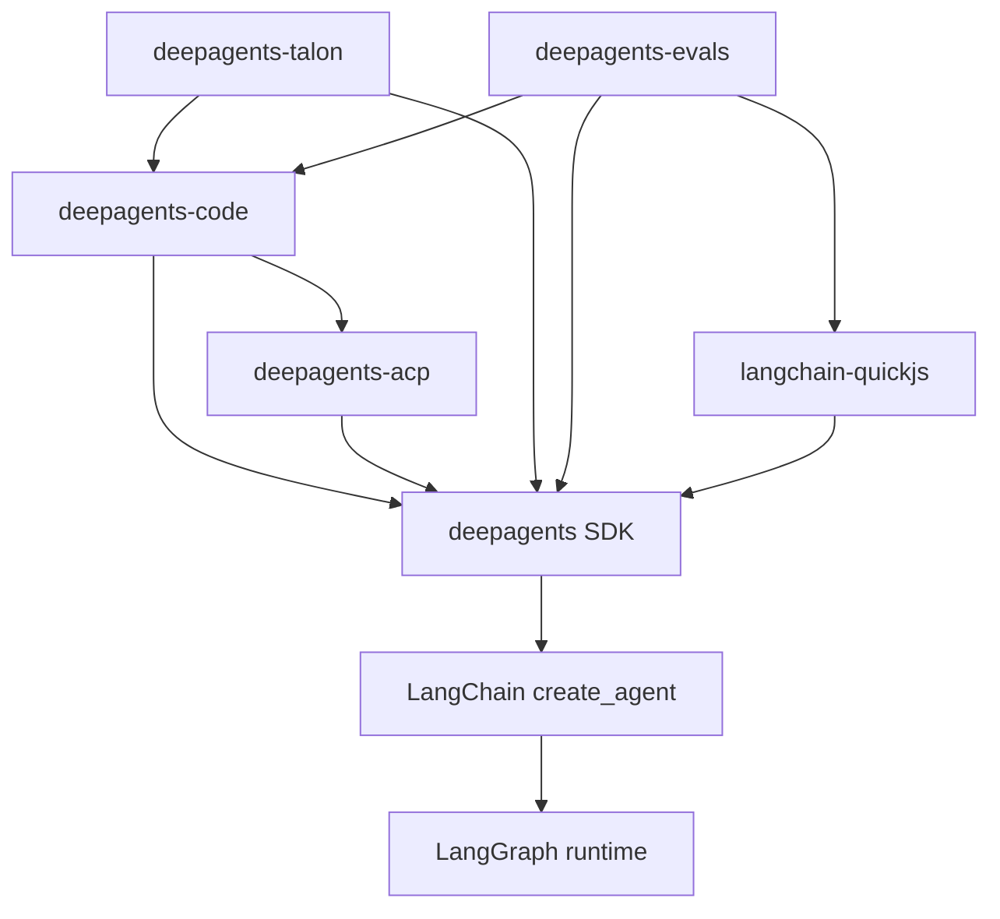
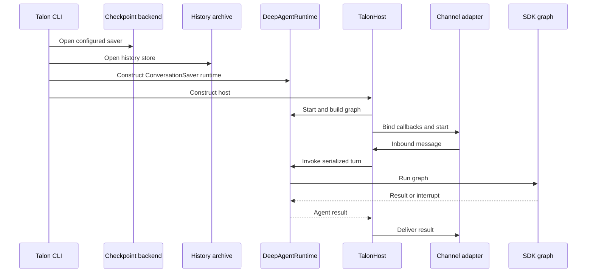

# Repository Architecture Overview

This repository is a monorepo of independently versioned Python packages, not one deployable service. `deepagents` is the reusable graph-construction harness. dcode is the terminal product, ACP translates graphs for editor clients, Talon hosts graphs for long-running channels and schedules, and `deepagents-evals` measures behavior. The partner group supplies optional integrations rather than a required runtime layer.

- [SDK construction and execution](./sdk-construction-execution.md)
- [Source map](./source-map.md)
- [ACP integration](../integrations/acp.md)
- [Talon integration](../integrations/talon.md)
- [Development](../operations/development.md)

## Packages, releases, and dependency direction

| Package | Current version and Python baseline | Architectural role |
| --- | --- | --- |
| `deepagents` | `0.7.24`; `>=3.11,<4.0` | Core SDK: `create_deep_agent`, middleware, and pluggable backends. |
| `deepagents-acp` | `0.0.13`; `>=3.11` | Agent Client Protocol bridge for serving graphs to editor clients. |
| `deepagents-code` (`dcode`) | `0.1.84`; `>=3.12,<4.0` | Reference terminal coding-agent product, including interactive and headless clients. |
| `deepagents-talon` | `0.0.9`; `>=3.12` | Experimental local host for channels, turns, and cron scheduling. |
| `deepagents-evals` | `0.0.1`; `>=3.12,<3.14` | End-to-end behavioral evaluation and Harbor benchmark suite. |
| `langchain-quickjs` | `0.3.8`; `>=3.11,<4.0` | Optional JavaScript REPL middleware partner integration. |

Release Please manages separate release lines for the SDK, ACP, dcode, Talon, and the five partner packages: Daytona, Modal, Runloop, Vercel, and QuickJS. The release manifest records `deepagents-acp` `0.0.13` and `deepagents-code` `0.1.84`; it does not include `deepagents-evals`. The configuration makes separate draft release pull requests and skips automated GitHub releases. Thus, package metadata or a directory under `libs/` does not by itself imply participation in the automated release line.

Published dependencies point toward the SDK: ACP depends on `deepagents`; dcode pins `deepagents==0.7.24` and has a local ACP source override; Talon requires `deepagents>=0.7.24` and `deepagents-code>=0.1.71,<1.0.0`; evals requires the SDK and dcode; and QuickJS requires the 0.7.x SDK plus LangChain and LangGraph. Partners are selected by a consuming product or host, rather than being necessary to create every SDK graph. In monorepo development, dcode resolves the SDK, ACP, and all five partner packages through editable local sources; evals likewise uses local source wiring for its SDK, dcode, and QuickJS dependencies.

```mermaid
flowchart TD
  Dcode["deepagents-code"] --> SDK["deepagents SDK"]
  Dcode --> ACP["deepagents-acp"]
  ACP --> SDK
  Talon["deepagents-talon"] --> SDK
  Talon --> Dcode
  Evals["deepagents-evals"] --> SDK
  Evals --> Dcode
  Evals --> QuickJS["langchain-quickjs"]
  QuickJS --> SDK
  SDK --> LangChain["LangChain create_agent"]
  LangChain --> LangGraph["LangGraph runtime"]
```
This shows the main internal dependency direction: an arrow points from a consumer to a package or layer it requires. It does not claim that these products have no direct LangChain or LangGraph dependencies.

The SDK itself has bounded 1.x `langchain` and `langchain-core` dependencies, together with Anthropic and Google model integrations, LangSmith, packaging, and matching utilities. AWS, QuickJS, and video are extras, not base dependencies. Product and host packages carry their own terminal, transport, sandbox, checkpoint, and evaluation dependencies.

## Runtime stack and ownership

Deep Agents is a three-layer stack:

- **LangGraph** owns graph execution: state, checkpoints, streaming, and interrupts.
- **LangChain `create_agent()`** creates the model-plus-tools-plus-middleware loop on that runtime.
- **Deep Agents** is an opinionated harness above `create_agent()`, supplying long-horizon defaults such as filesystem backends, subagents, context management, skills, memory, profiles, and tool policy.

`create_deep_agent()` is the SDK assembly point. It resolves the model and harness profile, selects a backend, builds the main-agent middleware stack and default general-purpose subagent, composes the final system prompt, and delegates to LangChain's `create_agent(...)` to produce a runnable graph. Its public arguments are the primary application extension boundary: callers can provide tools, middleware, subagents, skills, memory, filesystem permissions, interrupt settings, schemas, a checkpointer, store, cache, and graph name.

Several constraints matter when extending this boundary:

- A harness profile cannot exclude the protected `FilesystemMiddleware` or synchronous `SubAgentMiddleware`; invalid or unmatched middleware exclusions fail construction.
- Filesystem permissions are ordered first-match rules enforced only for built-in filesystem tools. `deny` returns a permission error and `interrupt` installs or extends approval behavior; this is not backend-wide authorization.
- A custom state schema must preserve `DeepAgentState` and its `DeltaChannel` messages reducer. Declarative subagents receive that schema, while compiled and remote async subagents need compatible schemas of their own.

For construction flow and middleware ordering, see [SDK construction and execution](./sdk-construction-execution.md).

| Boundary | Owns | Does not own |
| --- | --- | --- |
| SDK | Harness composition, middleware, backend routing, profile policy, and SDK subagents. | UI, editor transport, channel connections, or cron delivery. |
| LangGraph | Graph state, checkpoints, and stream/interrupt semantics. | Product-specific transport and host lifecycle. |
| dcode | Terminal client/server product and coding-agent extensions. | Generic harness behavior. |
| ACP | Protocol and session translation around a graph. | Terminal presentation or channel policy. |
| Talon | Process lifecycle, channel adapters, turn coordination, schedules, and host-owned stores. | Production multi-tenant containment. |
| Evals | Repeatable behavioral measurement and benchmark integration. | Live request serving. |

Persistence is intentionally split. A LangGraph checkpointer is passed through SDK graph construction for execution state; a Deep Agents backend independently decides file, memory, and execution capability placement. Talon adds a conversation archive and cron-job persistence. On Talon's model-backed CLI path, the checkpointer and archive open together and are wrapped in `ConversationSaver`, so checkpoint state alone is not channel delivery history.

## Product, protocol, and evaluation boundaries

### dcode and ACP

`deepagents-code` is a reference terminal coding-agent product on the SDK. Its terminal client and agent server run in separate processes: the client owns presentation, input, and approval interaction; the server owns graph execution and streams events back. Headless mode uses the same server runtime.

dcode configuration is layered across user, project, session, and runtime scopes through a process-wide generation. An in-app write or `/reload` advances that generation. A parse failure preserves the last usable tier, and the application deliberately does not watch configuration files for edits.

`AgentServerACP` accepts either a compiled graph or a graph factory given an `AgentSessionContext` containing working directory, mode, and optional model. With `load_sessions=True`, it advertises and implements session loading, verifying persisted checkpoint metadata and working-directory identity before replaying a session. Dcode's ACP specialization wraps each session graph to set trusted Auto-mode approval state and prompt metadata during streaming. Keep generic protocol translation in ACP and terminal policy in dcode.

### Evaluations and partners

`deepagents-evals` runs agents against real LLMs, captures tool calls, file mutations, and final responses, and scores correctness and efficiency. Harbor integration supports sandboxed benchmarks such as Terminal Bench 2.0. It is a quality-measurement boundary rather than an online serving component.

Partner packages add external execution or middleware capabilities. `langchain-quickjs`, for example, provides JavaScript REPL middleware and depends on Deep Agents 0.7.x, LangChain, and LangGraph. Configure such integrations at the consuming product or host boundary instead of making them mandatory SDK dependencies.

## Talon: long-running local host

Talon is an experimental alpha local runtime host. One process event loop coordinates channel adapters, an agent runtime, and optional cron scheduling. It is not a production containment or multi-tenant security boundary: channel access should be treated as access to configured agent capabilities, credentials, MCP tools, and host resources. Its opt-in sandbox relocates shell and filesystem tools, but MCP tools, web tools, and channel media handling stay on the host.

```mermaid
sequenceDiagram
  participant Cli as Talon CLI
  participant Checkpoints as Checkpoint backend
  participant Archive as History archive
  participant Runtime as DeepAgentRuntime
  participant Host as TalonHost
  participant Channel as Channel adapter
  participant Graph as SDK graph
  Cli->>Checkpoints: Open configured saver
  Cli->>Archive: Open history store
  Cli->>Runtime: Construct ConversationSaver runtime
  Cli->>Host: Construct host
  Host->>Runtime: Start and build graph
  Host->>Channel: Bind callbacks and start
  Channel->>Host: Inbound message
  Host->>Runtime: Invoke serialized turn
  Runtime->>Graph: Run graph
  Graph-->>Runtime: Result or interrupt
  Runtime-->>Host: Agent result
  Host->>Channel: Deliver result
```
This sequence separates CLI-owned resource opening, host-owned transport and delivery, and runtime-owned graph construction and invocation.

### Construction, turns, and lifecycle safety

If no model is configured, the CLI uses `EchoAgentRuntime`, which permits lifecycle and channel wiring without provider credentials. The model-backed path can open a sandbox, load MCP tools, and create `DeepAgentRuntime` with Talon MCP middleware. `PersistentCronScheduler` is attached only when at least one channel is configured.

At `DeepAgentRuntime.start()`, Talon resolves subagents, obtains a tool-approval snapshot, and creates its SDK graph. Its composition adds filesystem behavior, selected-model summarization and model selection, progress messages, task tooling, background-subagent behavior, Talon tools, and caller middleware before calling `create_deep_agent()`.

Each `invoke()` first rejects calls before startup, refreshes runtime tools, and rebuilds the graph if the approval snapshot changed. The turn binds request-scoped approvals, authorization, history/archive scope, cron origin, selected model, progress messaging, the invocation graph, and pending background results. It resets every binding in `finally`, preventing state from one channel or scheduled turn leaking into another. `stop()` cancels background workers before clearing the graph and closing the checkpointer; when cancellation fails, it intentionally leaves resources open so an active worker cannot write to a closed saver.

`TalonHost` starts the agent runtime before binding and starting channels, then starts an optional scheduler. A partial startup is unwound in reverse order. Shutdown cancels active work before stopping channels, scheduler, and runtime; failures in one component stop are isolated so later components are still stopped. Focused host tests cover normal lifecycle, partial channel startup, stop failures, message cancellation, authorization callback binding, and delivery behavior.

### Transport and storage extension points

A channel adapter carries provider-specific `ChannelMessage` values to the host and may provide reactions. The required adapter operations cover start/stop, inbound callback registration, text and media send, edit, typing, and connection status. Built-in exports cover WhatsApp, Telegram, Discord, and Slack.

Talon selects its checkpointer by URI. Built-in SQLite (`sqlite` and `file`), PostgreSQL, and MongoDB schemes are selected before a trusted `deepagents_talon.checkpoint_backends` entry-point plugin. The plugin receives the unchanged URI and owns setup and cleanup. Unexpected opening failures are converted to a credential-safe configuration error. Use separate remote databases for separate assistants: remote checkpoint thread IDs are not automatically namespaced by assistant ID.

## Safe change and test starting points

- Put reusable graph composition changes in `deepagents`, starting at `create_deep_agent()`; do not pull UI, channel, or transport policy into the SDK.
- Put terminal client/server behavior and reload semantics in dcode, preserving the common server path for headless execution.
- Put ACP streaming and session replay in `deepagents-acp`, retaining persisted-metadata and working-directory validation.
- Put Talon delivery, conversation serialization, and scheduler behavior in `TalonHost`; put graph composition, resource refresh, and request-context handling in `DeepAgentRuntime`.
- Treat checkpoint backend entry points and partner integrations as trusted operator-installed extension boundaries. Preserve their cleanup ownership and credential-safe failure behavior.
- For Talon lifecycle or cancellation changes, begin with `libs/talon/tests/test_host.py`, then run runtime and package-specific tests for the changed boundary.
